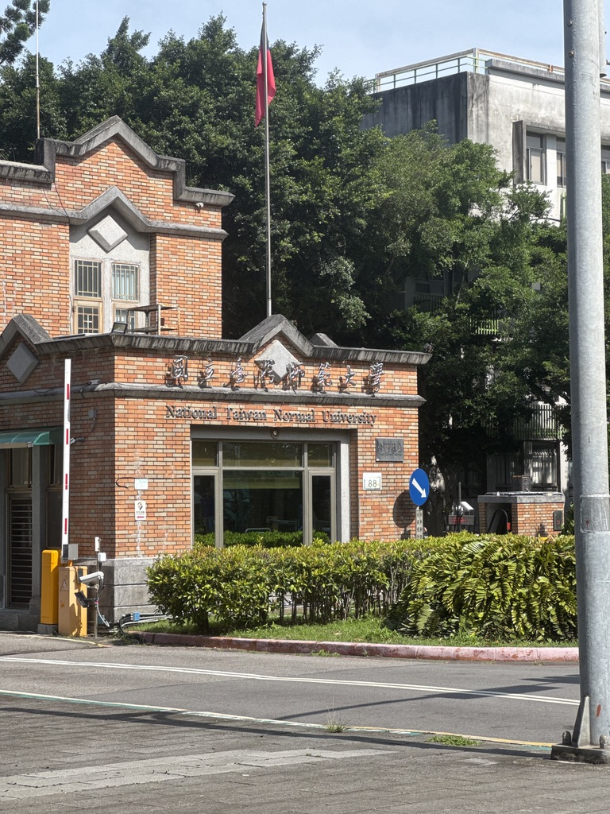
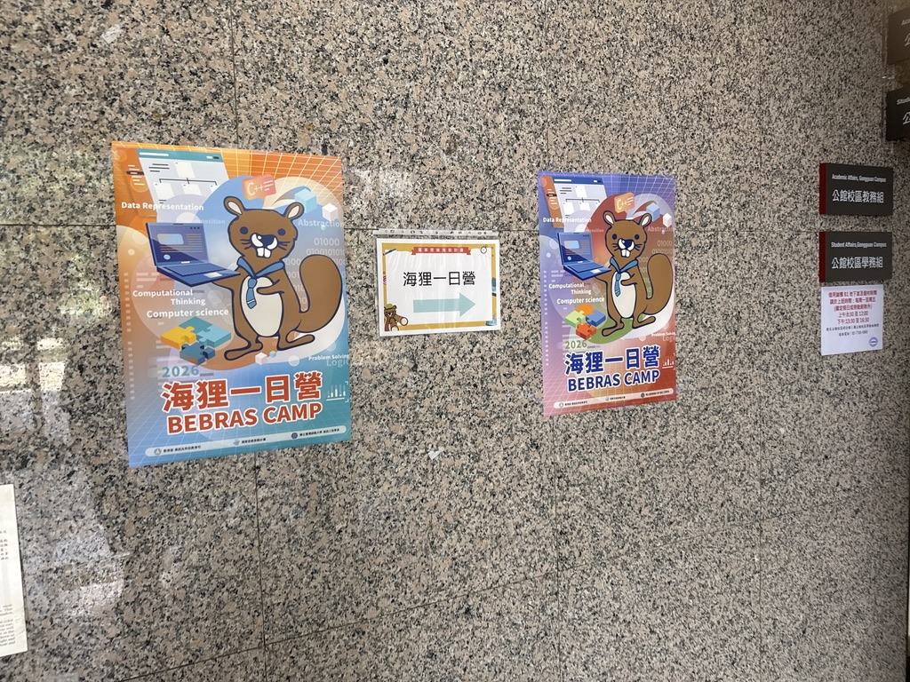
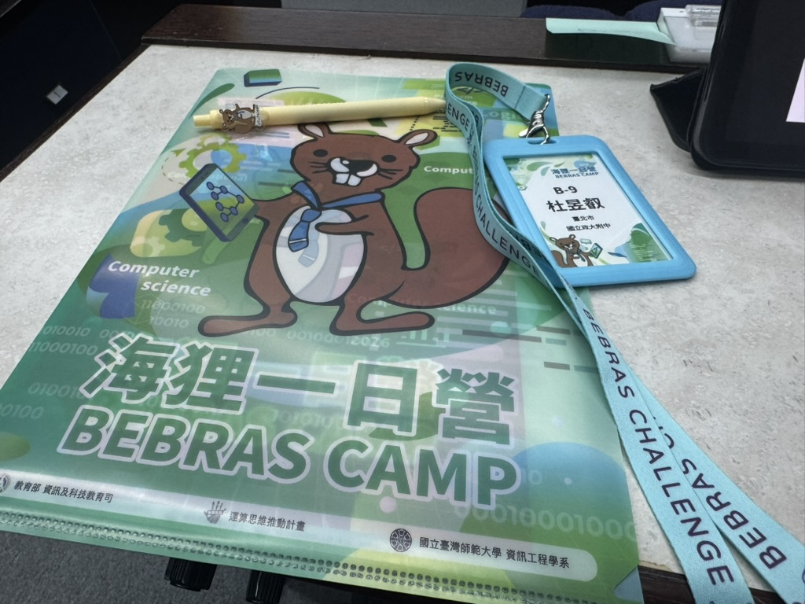
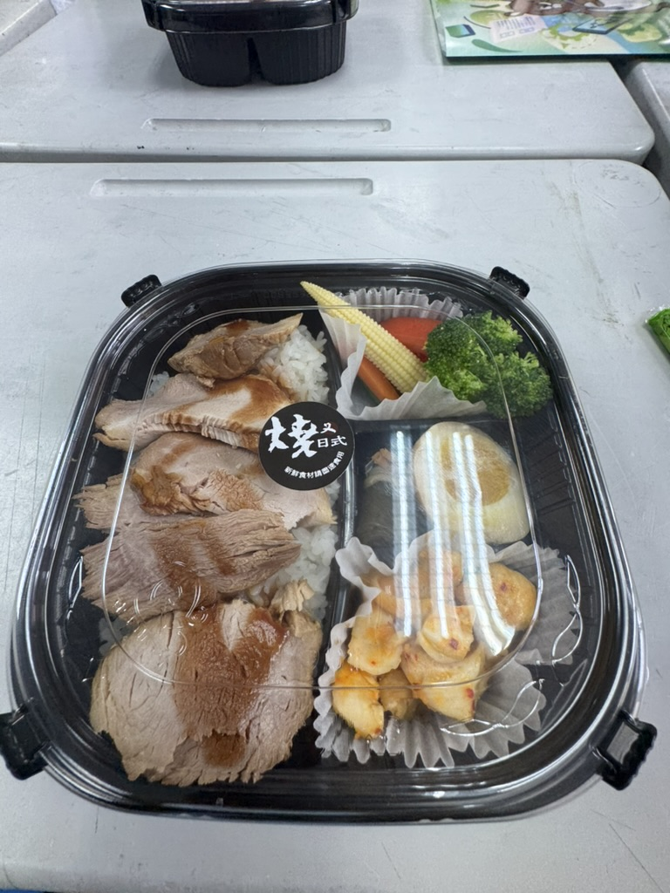
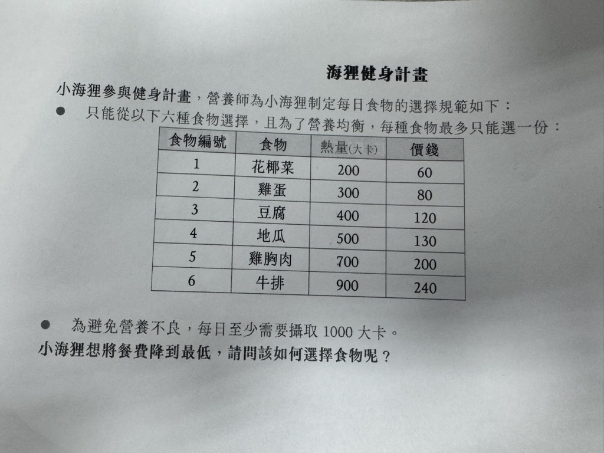
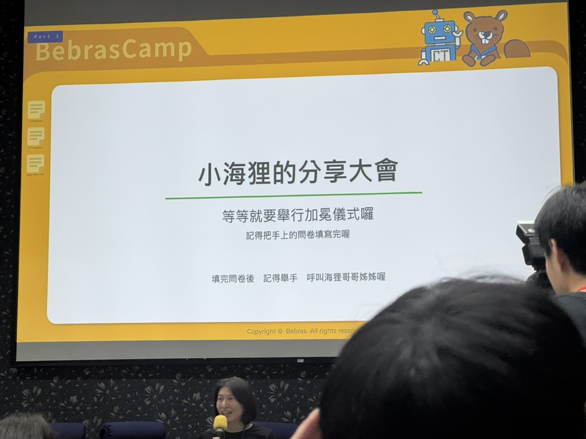
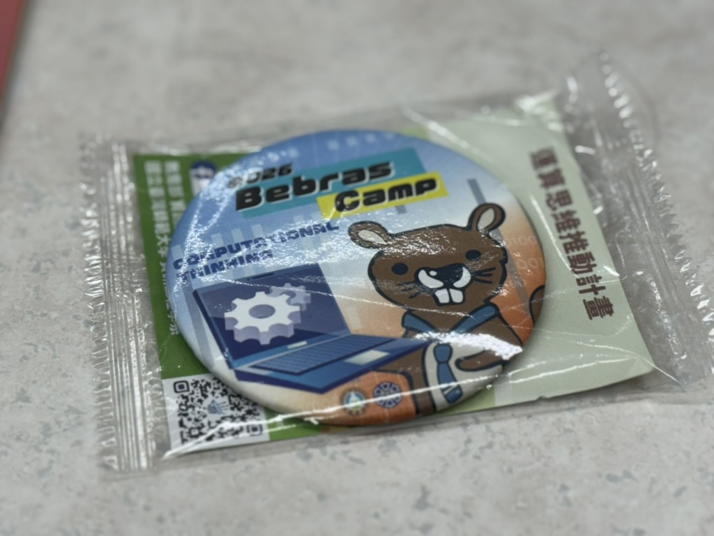
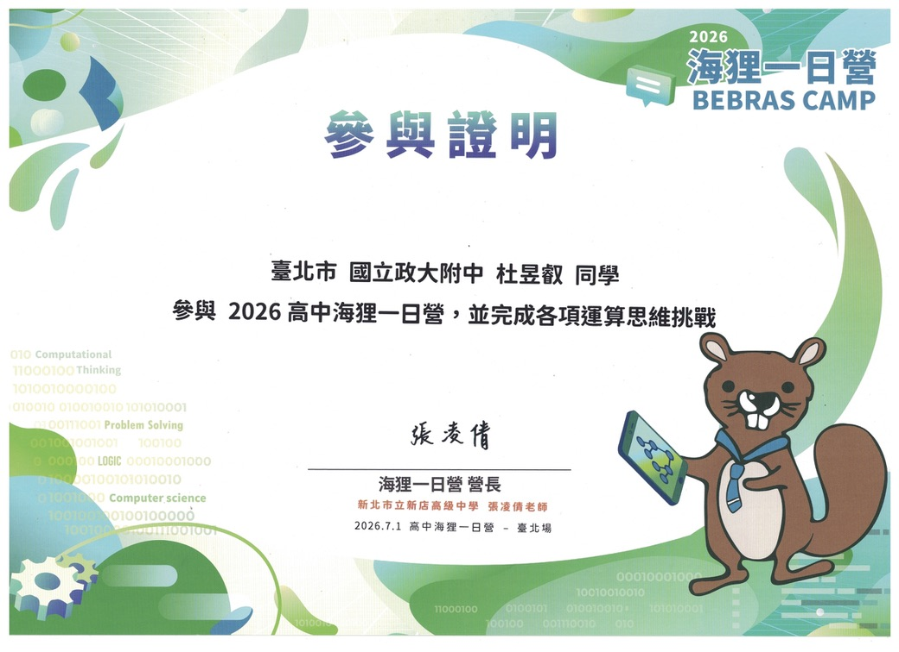

> 小海貍，看這裡！

這是我第一次去海貍營，為什麼會報名這個活動呢？有以下原因：
- 增加自己的資訊活動相關的經歷
- 因為要求是 Bebras PR.70 以上才能參加，想說去看看（？）
- 因為沒參加過，想說報名看看，順便看看會不會對下禮拜要考 APCS 的我有幫助。

那就來敘述一下發生了什麼事吧！

# 認識組員
 
這次海貍營的地點在台灣師範大學公館校區，這是老地方了，之前考APCS的時候有來過，但是因為我前一天太晚睡覺，所以今天去到時候大遲1到，遲到了30分鐘才到，別人都開始討論了我才加入討論。  
（對了，補充一下，到會堂時已經沒人了，都去小組討論，工作人員一開始把我從三樓帶到地下室，發現我的組員不在這裡，又把我帶回二樓，我才找到組員們。）

我被分到B-9組，這組共有五個人，兩個女生和三個男生。  
剛進去的時候，他們就開始在討論題目了，好像有什麼排列重組和路徑題（反正就很Bebras啦），啊我後面才跟著參與討論，幫忙畫海報，海報一開始我們還畫錯，我們以為要畫三題，結果其實只要畫一題就好了（下次要好好聽課喔:D）   
然後聽其他組分享的時候，我們組員抓到某一組的錯誤，就指出來了（？ 反正就是互相分享解法的概念（？  
# 實作時間
接下來是實作時間，我們要寫一個西瓜棋的程式，但由於是用類似 Scratch 的 App Inventor ，反正我自己研究了許久也沒研究個明白，要不是有其他組員幫忙，我們這組就交不出作業了:(  
這個比賽我們沒有拿名次，最後賭誰贏的時候，有一位組員和我們其他組員壓的不一樣，沒想到他中了，他也拿到了一個資料夾（看起來還蠻像去年沒用完的www）  
# 快樂的午餐？
午餐時間由於被上一堂耽誤了許久，12:30才離開會堂去吃飯，這個好像是叉燒？我不知道，反正還不錯，不會很難吃。  

吃完飯他們人還很好有給午休時間，午休了一下後我們就到隔壁教室繼續討論另外三個題目。一樣也是分享時間，我發現某一組的答案寫錯，是加法問題，他寫3+2+4+2=10，我就舉手提問說：「欸我現在才知道3+2+4+2會等於10欸，我一直以為等於11www」（超過分，要被公幹了www）   
然後他們就很莫名其妙地看著我們，痾對，就…很尷尬www  
# 又是實作時間...?
接下來也是類似實作時間，但這個是講 DP 演算法。我本身對 DP 不是很熟悉（不熟練），但聽完後的確有長進，學到一些東西（？  

在分享環節的時候，我聽了第一組的分享，我發現第一組有一個很小的錯誤，但由於時間關係老師沒有給我們提問機會，於是到我們分享時，我是主講，一共有1分30秒，我分享我們這組的解法，然後最後還有20秒時我就講完了，剩下時間我就說：我想講一下第10組有一個錯誤，在這裡有更好的解法但是他們卻沒寫上去。  
（真的要回不了家了啦www 仇恨值+999）從這刻我們組才真的正式活躍起來，要不然我們前面都超尷尬的感覺，都好像很不熟（？  
# 賦歸

最後，營隊結束了，我們回到了會堂，在那裏，我們把回饋表單填完後（我大多數都填簡單/收穫不多），他給我了一個徽章，然後公布今日的小組排名（我是現在才知道有這東西，有分數的），反正我們也沒得獎，就這樣吧，還有發參與證明+大合照。  

結束後，我們互換了通訊方式我們就各自回家了，也沒有額外的聊天講話（？  

# 心得
我覺得這個營隊很適合「國中生」參與（雖然規定是高中生才能參加），因為這裡面提到的概念在我看來覺得還蠻簡單的，高二高三感覺就有點輾壓的感覺，就是單純純邏輯思考而已，也不會很耗腦（？   
然後這個營隊我發現有一個特色是你可以是純新手來參加，就是你不一定要有基礎，因為他有簡單的帶你去思考要怎麼做，後面還有解說，反而是對這些思考過程有興趣的人可以參加。   
我覺得這個營隊還有一個樂趣就是和組員合作，享受嗆人的快感（沒  
好啦，還蠻感謝這次跟我同組的組員們！期待未來能再相遇！