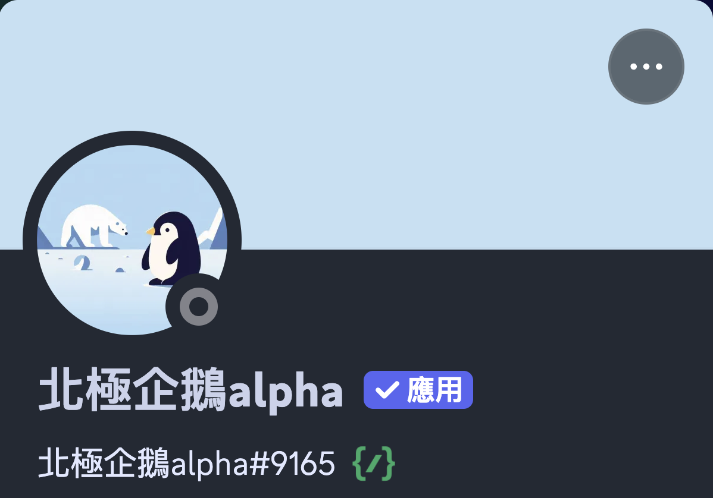
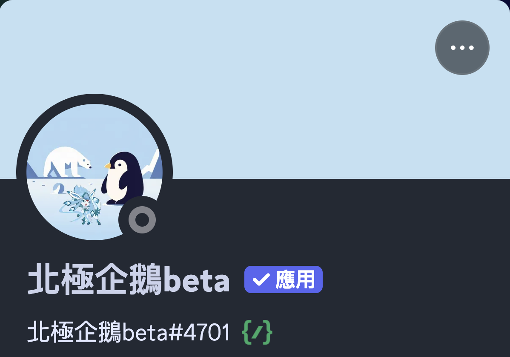
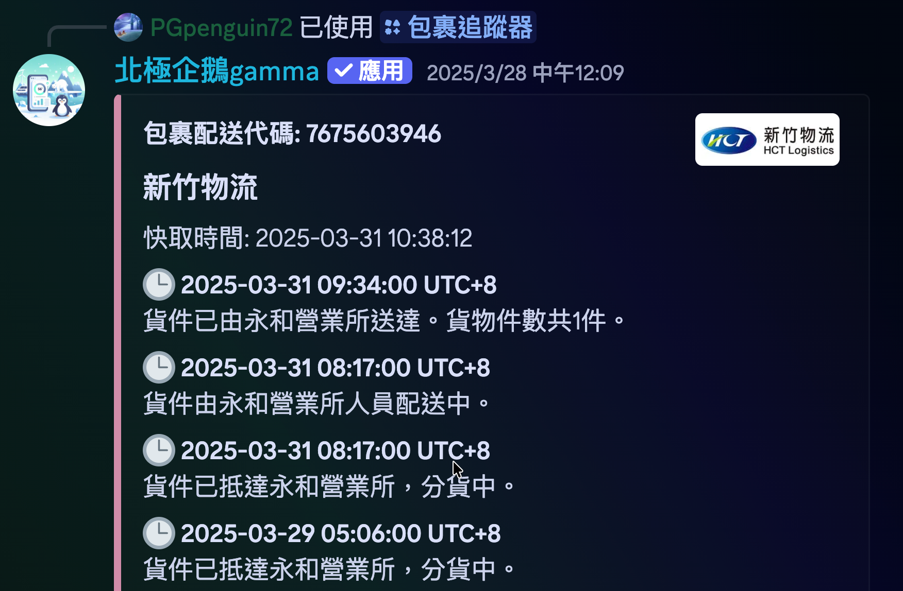
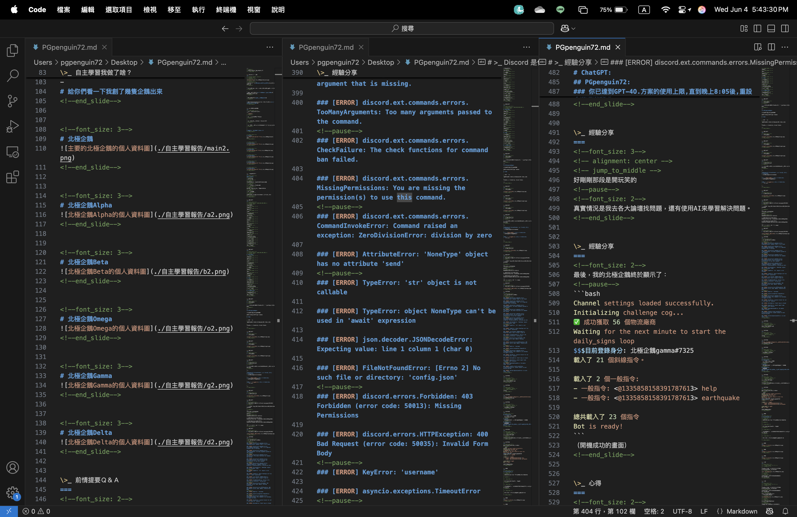
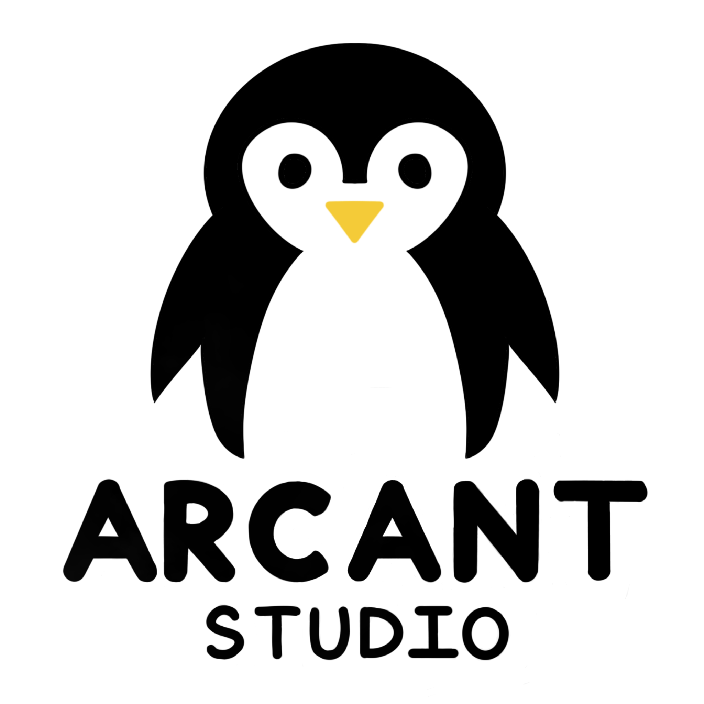

這是我在高一下進行的自主學習報告，是在全高一面前（也就是我的同學們面前）講講我在這段自主學習時期都做了些什麼。這篇的主題是：「從零開始製作一隻Discord Bot -- 北極企鵝」，內容涵蓋超豐富，有興趣的歡迎查看下面的所有資訊喔！

## YouTube 影片鏈結：

<iframe width="100%" height="468" src="https://www.youtube.com/embed/fN8ZWX3BiTY?si=u_FqXTPglyqg_SIL" title="YouTube video player" frameborder="0" allow="accelerometer; autoplay; clipboard-write; encrypted-media; gyroscope; picture-in-picture; web-share" referrerpolicy="strict-origin-when-cross-origin" allowfullscreen></iframe>

## 簡報資訊：

| 欄位     | 說明 |
|----------|------|
| 標題     | Discord Bot—一隻北極企鵝 |
| 內容     | 功能示意、程式畫面、錯誤紀錄等等|
| 簡報頁數  | 共 31 頁 |
| 來源     | [pg72.tw](https://pg72.tw/posts/sdlearning-11302/) |
| 作者     | PGpenguin72 |
| 簡報軟體  | [Presenterm](https://github.com/mfontanini/presenterm) |
| 檔案下載  | [MD](https://file.pg72.tw/share/Fe09FcaB) |

## 簡報軟體鏈結：
::github{repo="mfontanini/presenterm"}

## 簡報預覽（用網頁模擬）：

<section class="slide align-center middle center-all fs-3">
<!-- alignment: center -->
<!-- font_size: 3 -->

Discord Bot—一隻北極企鵝

author. 杜昱叡

<footer class="slide-footer">
  https://pg72.tw/
  自主學習簡報 @pg_penguin_72
  1 / 31
</footer></section>
<section class="slide fs-2">
<h2>我是誰？</h2>

<!-- font_size: 2 -->
<h2>杜昱叡</h2>
<ul>
<li>AHSNCCU10321 [#116學測生]</li>
<li>一隻神奇的PG企鵝(來自<em>台中市</em>)</li>
<li>喜歡 🎮 打音遊, 🎵 聽音樂, 🏸 打羽球, 💻 寫程式</li>
</ul>
<blockquote>

我的Instagram: @pg_penguin_72

</blockquote>

<footer class="slide-footer">
  https://pg72.tw/
  自主學習簡報 @pg_penguin_72
  2 / 31
</footer></section>
<section class="slide fs-2">
<h2>Discord 是什麼？</h2>

<!--font_size: 2-->
<blockquote>

Discord 是一個<strong>免費的語音文字通訊平台</strong>，廣泛應用於各種社群

</blockquote>
<ul>
<li>

以「伺服器」為社群單位建構而成，伺服器內可設多個頻道。

</li>
<li>

支援加入機器人，能<strong>播放音樂、查資訊、玩遊戲</strong>等
酷酷的功能，超實用！

</li>
<li>

操作介面簡潔，<strong>新手也能快速上手</strong>。

</li>
<li>

支援 Python、JavaScript 等語言開發機器人，是<strong>程式學習的絕佳實作場域</strong>。

</li>
</ul>

<!--newlines: 7-->

<footer class="slide-footer">
  https://pg72.tw/
  自主學習簡報 @pg_penguin_72
  3 / 31
</footer></section>
<section class="slide fs-2">
<h2>自主學習我做了啥？</h2>
<!-- font_size: 2 -->
<ul>
<li>製作一隻Discord機器人 ✅</li>
</ul>
<h3>製作動機</h3>

<footer class="slide-footer">
  https://pg72.tw/
  自主學習簡報 @pg_penguin_72
  4 / 31
</footer></section>
<section class="slide fs-2">
<h2>自主學習我做了啥？</h2>
<!-- font_size: 2 -->
<h3>特色介紹</h3>

<li>🌰. 屬於自己的免費勞動力！</li>
<li>🌰. 完全自學使用Python + Discord API</li>
<li>🌰. 5100多行代碼都是自己寫的！（複製複製貼上貼上:D）</li>
</ul>
<h1>給你們看一下我創了幾隻企鵝出來</h1>

<footer class="slide-footer">
  https://pg72.tw/
  自主學習簡報 @pg_penguin_72
  5 / 31
</footer></section>
<section class="slide fs-3">
<!--font_size: 3-->

<footer class="slide-footer">
  https://pg72.tw/
  自主學習簡報 @pg_penguin_72
  6 / 31
</footer></section>
<section class="slide fs-3">
<!--font_size: 3-->
<!--new_lines: 5-->

<footer class="slide-footer">
  https://pg72.tw/
  自主學習簡報 @pg_penguin_72
  7 / 31
</footer></section>
<section class="slide fs-2">
<h2>前情提要Ｑ＆Ａ</h2>
<!--font_size: 2-->
<h4>北極企鵝</h4>
<blockquote>

名字由來？

</blockquote>
<!-- new_line -->

北極沒有企鵝，所以才想說取北極企鵝（？

<!-- new_line -->
<blockquote>

為什麼有這麼多北極企鵝？

</blockquote>
<!-- new_line -->

不同時期，不同協助者而產生不同版本。

<!-- new_line -->
<blockquote>

有什麼特色？

</blockquote>
<!-- new_line -->

特色其實不多，他就是我自己寫的一隻機器人而已:D

<!-- new_line -->

<footer class="slide-footer">
  https://pg72.tw/
  自主學習簡報 @pg_penguin_72
  8 / 31
</footer></section>
<section class="slide fs-2">
<h2>功能介紹</h2>
<!--font_size: 2-->

/包裹追蹤器

/更新公告

<!-- new_lines: 2 -->

/服務條款

<!-- new_lines: 2 -->

/建議

<!-- new_lines: 2 -->

/真心話大冒險

/開發者選項

<!-- new_lines: 2 -->

/註冊生日

<!-- new_lines: 2 -->

/數數字

<!-- new_lines: 2 -->

/幫助

<!-- new_lines: 2 -->

/隱私權條款

/擲骰子

<!-- new_lines: 2 -->

/簽到

<!-- new_lines: 2 -->

/薯織大大專屬

<!-- new_lines: 2 -->

/地震通知設定

<!-- new_lines: 2 -->

/伺服器設定

/每日簽到訊息訂閱

<!-- new_lines: 2 -->

/設定歡迎消息

<!-- new_lines: 2 -->

/跨伺服器聊天

<!-- new_lines: 2 -->

/真心話大冒險出題

<!-- new_lines: 2 -->

/數位錢包憑證

<footer class="slide-footer">
  https://pg72.tw/
  自主學習簡報 @pg_penguin_72
  9 / 31
</footer></section>
<section class="slide fs-2">
<h2>功能介紹</h2>
<!--font_size: 2-->

<h1>/包裹追蹤器</h1>
<!-- new_lines: 2 -->

/更新公告

<!-- new_lines: 2 -->

/服務條款

<!-- new_lines: 2 -->

/建議

<!-- new_lines: 2 -->

/真心話大冒險

/開發者選項

<!-- new_lines: 2 -->

/註冊生日

<!-- new_lines: 2 -->

/數數字

<!-- new_lines: 2 -->

/幫助

<!-- new_lines: 2 -->

/隱私權條款

/擲骰子

<!-- new_lines: 2 -->
<h1>/簽到</h1>
<!-- new_lines: 2 -->

/薯織大大專屬指令

<!-- new_lines: 2 -->

/地震通知設定

<!-- new_lines: 2 -->

/伺服器設定

/每日簽到訊息訂閱

<!-- new_lines: 2 -->

/設定歡迎消息

<!-- new_lines: 2 -->
<h1>/跨伺服器聊天</h1>
<!-- new_lines: 2 -->

/真心話大冒險出題

<!-- new_lines: 2 -->

/數位錢包憑證

<footer class="slide-footer">
  https://pg72.tw/
  自主學習簡報 @pg_penguin_72
  10 / 31
</footer></section>
<section class="slide fs-2">

功能介紹

<ol class="list-tight">
<li>每日簽到功能</li>
</ol>
<ul class="list-tight">
<li>每天早上06:00時，北極企鵝會發一則訊息來提醒用戶簽到！</li>
</ul>

每日簽到訊息訂閱

該簽到了，你今天簽到了嗎？

趕快點選下方按鈕來簽到吧！！！

/簽到

每日一言：

你可以不成為我的助力，但絕不能成為我的阻力。

北極企鵝 || Created by. Arcant Studio

<footer class="slide-footer">
  https://pg72.tw/
  自主學習簡報 @pg_penguin_72
  11 / 31
</footer></section>
<section class="slide fs-2">

功能介紹

<!--font_size: 2-->
<ol>
<li>每日簽到功能</li>
</ol>

<footer class="slide-footer">
  https://pg72.tw/
  自主學習簡報 @pg_penguin_72
  12 / 31
</footer></section>
<section class="slide fs-2">
<h2>功能介紹</h2>
<!--font_size: 2-->
<ol>
<li>每日簽到功能</li>
</ol>

<footer class="slide-footer">
  https://pg72.tw/
  自主學習簡報 @pg_penguin_72
  13 / 31
</footer></section>
<section class="slide fs-2">
<h2>功能介紹</h2>
<!--font_size: 2-->
<ol>
<li>每日簽到功能</li>
</ol>

<footer class="slide-footer">
  https://pg72.tw/
  自主學習簡報 @pg_penguin_72
  14 / 31
</footer></section>
<section class="slide fs-2 chat-demo">

功能介紹

2. 跨伺服器文字聊天

<ul class="list-circle">
<li>每個伺服器都可以設定自己的串連code，也可以設定是否公開頻道。</li>
</ul>

PGpenguin72 [ArcantStudio | 極區工作室] |應用| — 凌晨12:08

好懶得做簡報啊啊啊啊！！！

波雞 [PG企鵝俱樂部] |應用| — 凌晨12:22

我知道你很懶，但你先別懶

地瓜 [一個神奇的小窩] |應用| — 凌晨12:22

加油多懶點

<footer class="slide-footer">
  https://pg72.tw/
  自主學習簡報 @pg_penguin_72
  15 / 31
</footer></section>
<section class="slide fs-2">

功能介紹

<!--font_size: 2-->
<ol start="2">
<li>跨伺服器文字聊天</li>
</ol>

<footer class="slide-footer">
  https://pg72.tw/
  自主學習簡報 @pg_penguin_72
  16 / 31
</footer></section>
<section class="slide fs-2 track-demo">

功能介紹

3. 包裹追蹤器(本功能實現由Track.tw官方提供API串接)

<ul class="list-circle">
<li>用戶可將包裹追蹤碼輸入，即可在Discord裏追蹤自己的包裹進度！</li>
</ul>

包裹追蹤碼：7675603946

新竹物流

快取時間：2025-03-31 10:38:12

🕒 2025-03-28 11:22:00 UTC+8 貨件已抵達鳳山營業所，貨件整理中。貨物件數共1件。

🕒 2025-03-28 11:22:00 UTC+8 貨件已抵達高雄港碼頭，貨物轉運中。貨物件數共1件。

|上一頁| |1/1頁| |下一頁| |刷新|

<footer class="slide-footer">
  https://pg72.tw/
  自主學習簡報 @pg_penguin_72
  17 / 31
</footer></section>
<section class="slide fs-2">
<h2>功能介紹</h2>
<!--font_size: 2-->
<ol start="3">
<li>包裹追蹤器(本功能實現由Track.tw官方提供API串接)</li>
</ol>

<footer class="slide-footer">
  https://pg72.tw/
  自主學習簡報 @pg_penguin_72
  18 / 31
</footer></section>
<section class="slide fs-2">
<h2>經驗分享</h2>
<!--font_size: 2-->
<blockquote>

有一次啟動我的機器人時：

</blockquote>
<!--font_size: 1-->
<h3>[ERROR] discord.ext.commands.errors.CommandNotFound: Command &quot;boom&quot; is not found</h3>
<h3>[ERROR] discord.ext.commands.errors.MissingRequiredArgument: 'user' is a required argument that is missing.</h3>
<h3>[ERROR] discord.ext.commands.errors.TooManyArguments: Too many arguments passed to the command.</h3>
<h3>[ERROR] discord.ext.commands.errors.CheckFailure: The check functions for command ban failed.</h3>
<h3>[ERROR] discord.ext.commands.errors.MissingPermissions: You are missing the permission(s) to use this command.</h3>
<h3>[ERROR] discord.ext.commands.errors.CommandInvokeError: Command raised an exception: ZeroDivisionError: division by zero</h3>
<h3>[ERROR] AttributeError: 'NoneType' object has no attribute 'send'</h3>
<h3>[ERROR] TypeError: 'str' object is not callable</h3>
<h3>[ERROR] TypeError: object NoneType can't be used in 'await' expression</h3>
<h3>[ERROR] json.decoder.JSONDecodeError: Expecting value: line 1 column 1 (char 0)</h3>
<h3>[ERROR] FileNotFoundError: [Errno 2] No such file or directory: 'config.json'</h3>
<h3>[ERROR] discord.errors.Forbidden: 403 Forbidden (error code: 50013): Missing Permissions</h3>
<h3>[ERROR] discord.errors.HTTPException: 400 Bad Request (error code: 50035): Invalid Form Body</h3>
<h3>[ERROR] KeyError: 'username'</h3>
<h3>[ERROR] asyncio.exceptions.TimeoutError</h3>
<h3>[ERROR] discord.ext.commands.errors.CommandOnCooldown: This command is on cooldown. Try again in 10.5s</h3>
<h3>[ERROR] ValueError: invalid literal for int() with base 10: 'nhentai'</h3>
<h3>[ERROR] RuntimeError: Event loop is closed</h3>
<h3>[ERROR] ImportError: cannot import name 'commands' from 'discord'</h3>
<h3>[ERROR] ModuleNotFoundError: No module named 'discord'</h3>
<h3>[ERROR] aiohttp.client_exceptions.ClientConnectorError: Cannot connect to host <a href="http://discord.com:443">discord.com:443</a></h3>
<h3>[ERROR] sqlite3.OperationalError: no such table: users</h3>

<footer class="slide-footer">
  https://pg72.tw/
  自主學習簡報 @pg_penguin_72
  19 / 31
</footer></section>
<section class="slide align-center middle fs-4">
<h2>經驗分享</h2>
<!--font_size: 4-->
<!-- alignment: center -->

還請問閣下該如何應對www

<footer class="slide-footer">
  https://pg72.tw/
  自主學習簡報 @pg_penguin_72
  20 / 31
</footer></section>
<section class="slide align-center middle fs-4">
<h2>經驗分享</h2>
<!--font_size: 4-->
<!-- alignment: center -->

說實話

<footer class="slide-footer">
  https://pg72.tw/
  自主學習簡報 @pg_penguin_72
  21 / 31
</footer></section>
<section class="slide ">
<h2>經驗分享</h2>

<footer class="slide-footer">
  https://pg72.tw/
  自主學習簡報 @pg_penguin_72
  22 / 31
</footer></section>
<section class="slide align-center middle fs-4">
<h2>經驗分享</h2>
<!--font_size: 4-->
<!-- alignment: center -->

所以我就開始問ChatGPT

<footer class="slide-footer">
  https://pg72.tw/
  自主學習簡報 @pg_penguin_72
  23 / 31
</footer></section>
<section class="slide fs-2">
<h2>經驗分享</h2>
<!--font_size: 2-->
<h2>PGpenguin72:</h2>

為什麼會出現這些錯誤？
（上傳了error.log）

<h1>ChatGPT:</h1>

可能你的腦袋有一些錯誤，需要幫你除錯一下嗎？

<h2>PGpenguin72:</h2>

？？？？

<h3>你已達到GPT-4O.方案的使用上限,直到晚上8:05後,重設才能繼續使用</h3>

<footer class="slide-footer">
  https://pg72.tw/
  自主學習簡報 @pg_penguin_72
  24 / 31
</footer></section>
<section class="slide align-center middle fs-3">
<h2>經驗分享</h2>
<!--font_size: 3-->
<!-- alignment: center -->

好剛剛那段是開玩笑的

<!--font_size: 2-->

真實情況是我去各大論壇找問題，還有使用AI來學習解決問題。

<footer class="slide-footer">
  https://pg72.tw/
  自主學習簡報 @pg_penguin_72
  25 / 31
</footer></section>
<section class="slide fs-2">
<h2>經驗分享</h2>
<!--font_size: 2-->

最後，我的北極企鵝終於顯示了：

<pre><code class="language-bash">Channel settings loaded successfully.
Initializing challenge cog...
✅ 成功獲取 56 個物流廠商
Waiting for the next minute to start the daily_signs loop
$$$目前登錄身分: 北極企鵝gamma#7325
載入了 21 個斜線指令。

載入了 2 個一般指令:
= 一般指令: &lt;@1335858158391787613&gt; help
= 一般指令: &lt;@1335858158391787613&gt; earthquake

總共載入了 23 個指令
Bot is ready!
</code></pre>

（開機成功的畫面）

<footer class="slide-footer">
  https://pg72.tw/
  自主學習簡報 @pg_penguin_72
  26 / 31
</footer></section>
<section class="slide fs-2">
<h2>心得</h2>
<!--font_size: 2-->
<h1>以上我想說的是：</h1>
<!-- new_line -->
<blockquote>

不要吝嗇於詢問，查資料，不懂就是要問要了解。

</blockquote>
<!-- new_line -->
<blockquote>

AI是工具，善用工具會增加效率。

</blockquote>
<!-- new_line -->
<blockquote>

嘗試各種東西增加自己知識儲備量，累積經驗，對自己未來有超多幫助！

</blockquote>
<!-- new_line -->
<blockquote>

學程式要多多實作，讓科技運用到生活之中。

</blockquote>

<footer class="slide-footer">
  https://pg72.tw/
  自主學習簡報 @pg_penguin_72
  27 / 31
</footer></section>
<section class="slide ">
<h2>心得</h2>

<footer class="slide-footer">
  https://pg72.tw/
  自主學習簡報 @pg_penguin_72
  28 / 31
</footer></section>
<section class="slide fs-2">
<h2>補充</h2>
<!--font_size: 2-->

北極企鵝是我的一個專案，我在今年創了
ArcantStudio（極區工作室）。

<!-- new_line -->

這間工作室是一群志同道合的人組成的，
目前沒有盈利。

<footer class="slide-footer">
  https://pg72.tw/
  自主學習簡報 @pg_penguin_72
  29 / 31
</footer></section>
<section class="slide fs-2">
<h2>補充</h2>
<!--font_size: 2-->

北極企鵝是我的一個專案，我在今年創了
ArcantStudio（極區工作室）。

<!-- new_line -->

這間工作室是一群志同道合的人組成的，
目前沒有盈利。

<!-- new_line -->

我們將於今年暑假開始製作
一款恐怖遊戲“溶蝕”。

<!-- new_line -->

希望明年暑假上架到Steam!

<!-- new_line -->

只要你對開發遊戲或這個專案有興趣，

<footer class="slide-footer">
  https://pg72.tw/
  自主學習簡報 @pg_penguin_72
  30 / 31
</footer></section>
<section class="slide fs-2">
<h2>補充</h2>
<!--font_size: 2-->

北極企鵝是我的一個專案，我在今年創了
ArcantStudio（極區工作室）。

<!-- new_line -->

這間工作室是一群志同道合的人組成的，
目前沒有盈利。

<!-- new_line -->

我們將於今年暑假開始製作
一款恐怖遊戲“溶蝕”。

<!-- new_line -->

希望明年暑假上架到Steam!

<!-- new_line -->

只要你對開發遊戲或這個專案有興趣，
歡迎可以掃描這個QRcode來加入我們喔！

<h1>&gt;謝謝大家聽我的分享！</h1>

<!--font_size: 3-->

<footer class="slide-footer">
  https://pg72.tw/
  自主學習簡報 @pg_penguin_72
  31 / 31
</footer></section>

