# 前言
我在今年 3 月第一次去 SITCON 2026，從那次參與後我覺得我像是真正接觸了資訊圈。

過了一陣子，手機的演算法和各種社群的 Discord 伺服器就開始推廣宣傳 SITCON Camp 2026 報名，我因為挺早就看到的，所以我詢問我的朋友和同學們要不要跟我一起去，這樣就可以組一個四人同行。不過我身邊的人看到這個價格就退縮了 :(
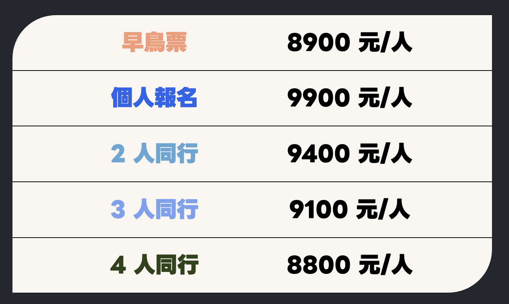

反正我報完名了，而且還是早鳥，然後我就開始等等等，等到了 SITCON Camp 的到來 :D

# 日記...?
## Day 0 (2026/07/07)
由於我明天還要去學校補考，和去 SITCON 營隊，我有一點點小壓力，所以我就去了解了一下 Denny 的一個十年前的 Workshop「會用電子郵件的人比較聰明」，這個給我了一點啟發，把我困擾多年的會漏收信問題解決了。話說為什麽沒有讀補考呢...? 別問我，我也不知道，反正我覺得應該可以過吧...?

## Day 1 (2026/07/08)
我早上起來收拾了一下東西後就出門去學校補考，我只有一科被當掉，就是物理，反正補考只有補一科，考完後我去教務處拿了三段考卷後就回家趕快二次收拾東西去交大 SITCON Camp。
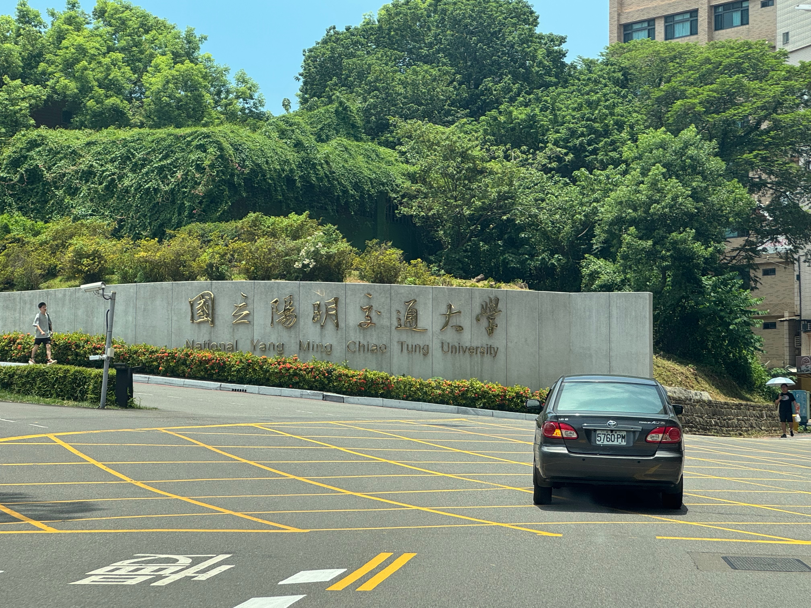
到了交大工程四館，我下車拿著行李打給行政組組長YA 請他下來接我，然後我放完行李到教室後就到大教室（之前 MyFirstCTF 的競賽教室）吃午餐了。
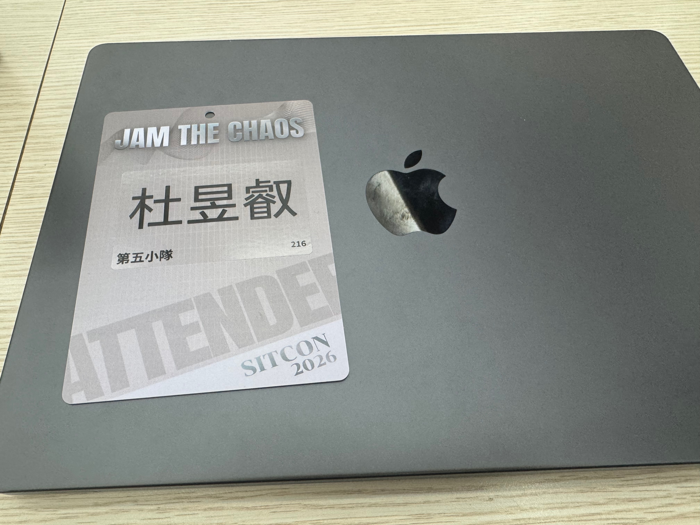
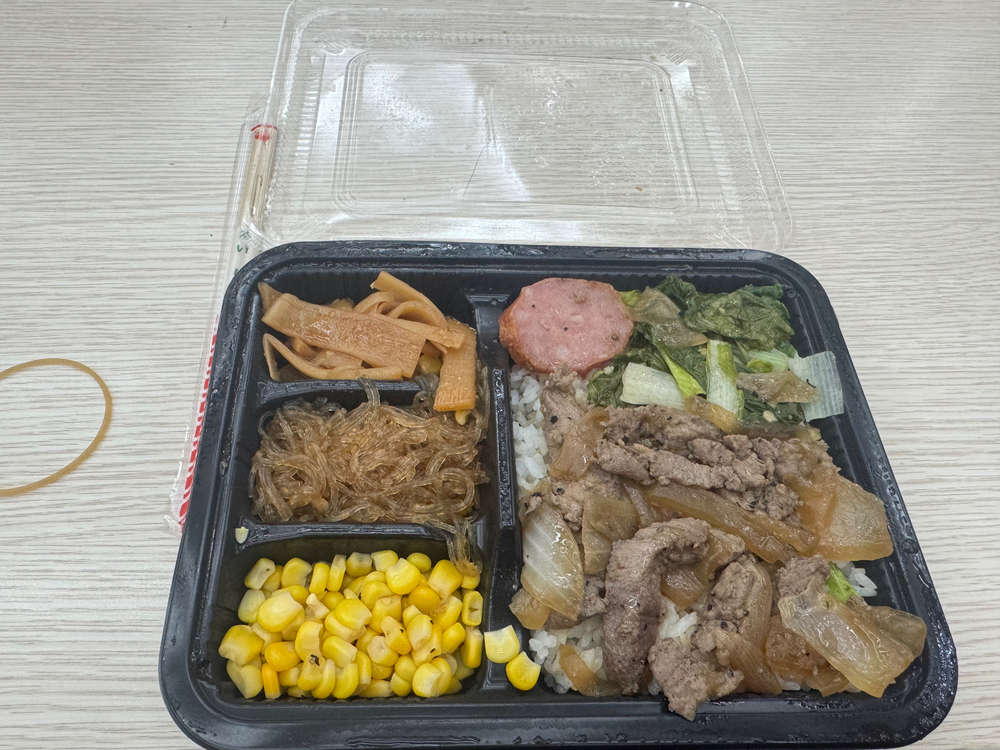
我旁邊坐著隊輔，他是成大不分系升大二，好像要進什麼教育資管（？ 反正他還蠻關心我的，吃完午餐後我們上了廣度課程，分成上下兩堂，為 3D建模 + AI焦慮 的樣子。3D建模實在是太硬了，整個都是論文，所以我睡著了== 課程筆記我放下面，請查看：

https://hackmd.io/@o7vNN_WUR-uIMDmpIH07vA/SknEPvimfe

https://hackmd.io/@o7vNN_WUR-uIMDmpIH07vA/SJu2KwsQGx

然後接下來就是闖關任務，我們一共闖了4關，分別是和封包有關的、指令關（就是一個人當機器人，其他組員當下指令的，然後要讓他拿到越多目標物）、Prompt Injection 和 模擬電腦運行（一人當 input，其他三人當 Ram ，要被寫字在背上（共五個偏旁），然後把字交給 CPU 去算他是什麼字，最後比手畫腳給output把文字傳出去），反正這幾個關卡心得我就懶得寫了，就放過我吧 :D
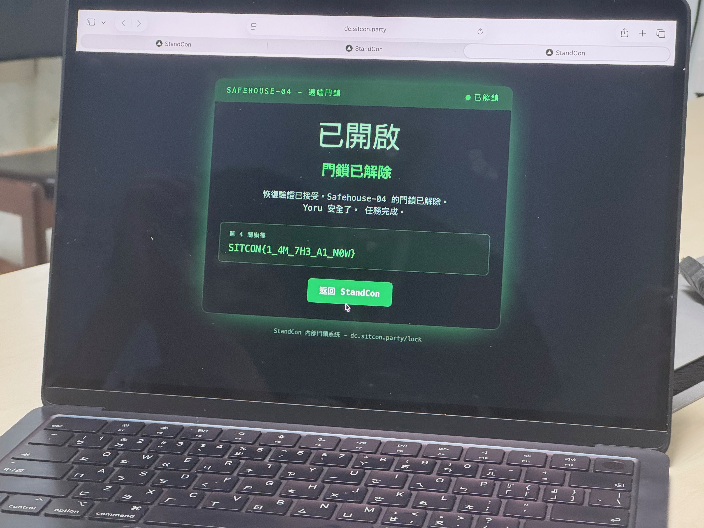
做完闖關後是晚餐時間，晚餐吃雞腿便當，吃完後我去找淳聊天，正式跟他面基（？ 
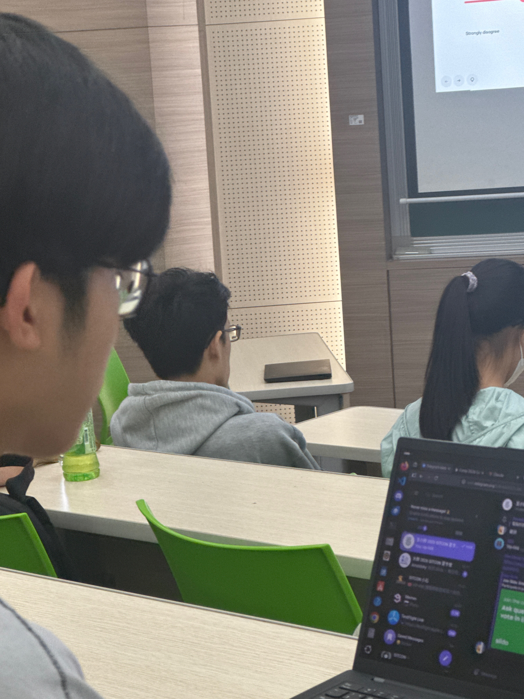
跟他聊了一陣子後我就會座位了，接下來是網路安全（讓你的 Agent 跟別人戰鬥吧），反正是 Yoru 大佬講的課，然後還是基本的網路，所以我幾乎都在發呆（？

以下是課程筆記：

https://hackmd.io/@o7vNN_WUR-uIMDmpIH07vA/S1CzIns7Mx

上完後我們進行了爐邊夜談，一共有五個主題，我放在下方：

https://hackmd.io/@SITCON/ryjWvelWMx

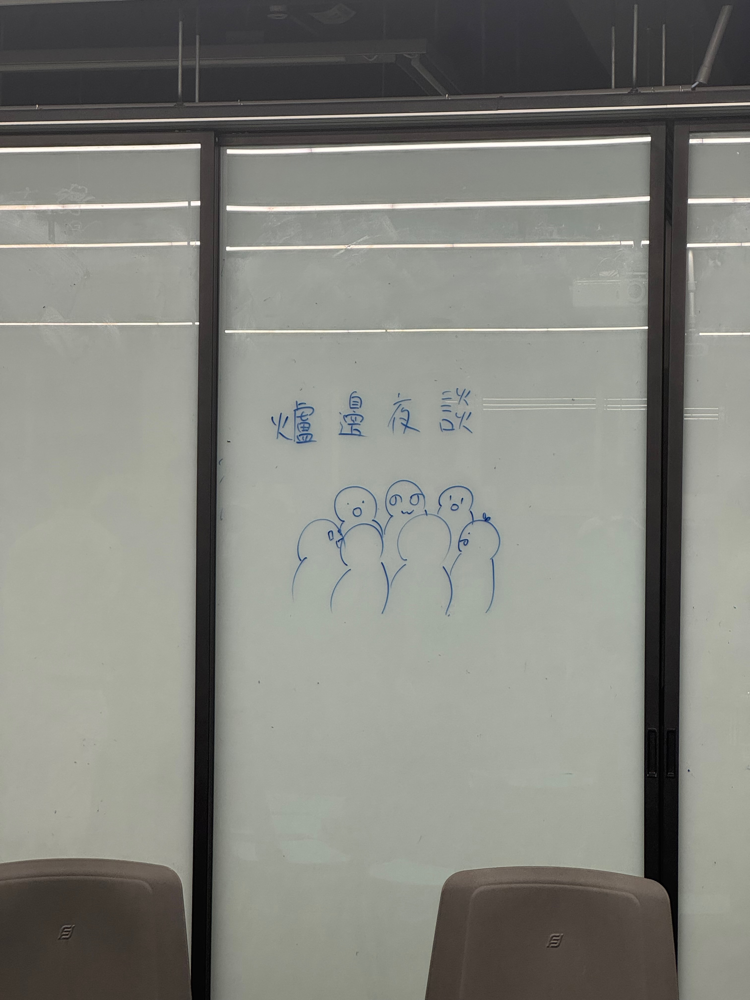
我選的是 Yoru 大佬的 vibe coding ，原因如下：
- 想要認識 Yoru 大佬
- 想要了解看看 Yoru 大佬對這個有什麼看法

反正就是一個小談，覺得還蠻有趣的，我還蠻喜歡這種討論方式，很像是圓桌會議的感覺！
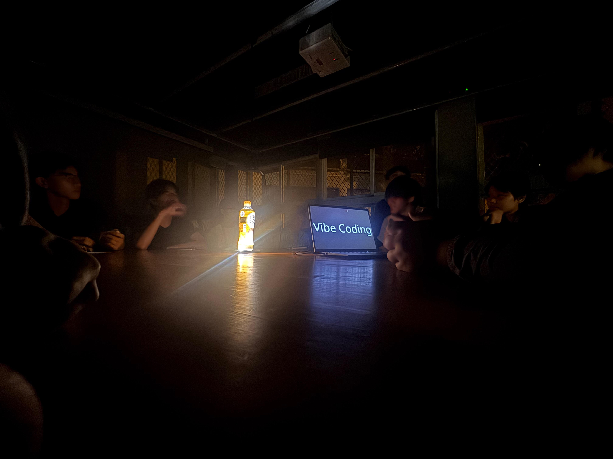
結束後我們就拿行李去宿舍，宿舍說實話有一點點髒，簡單打理過後我就去洗澡了，洗完澡跟旁邊的舍友借了吹風機，然後簡單跟他們聊天後，我就去玩異環了。
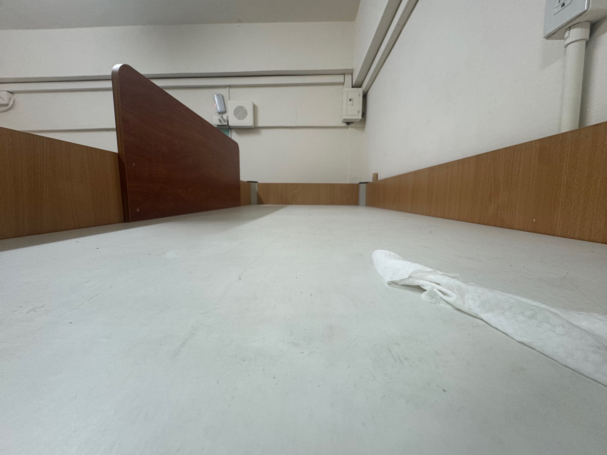
但沒想到，沒有網路！沒辦法更新🤦 我跑到201宿舍旁才勉強連得到 Eduroam 🤦 希望明天可以趕快架好AP。反正載好後我就回房間打完異環睡覺了👍
 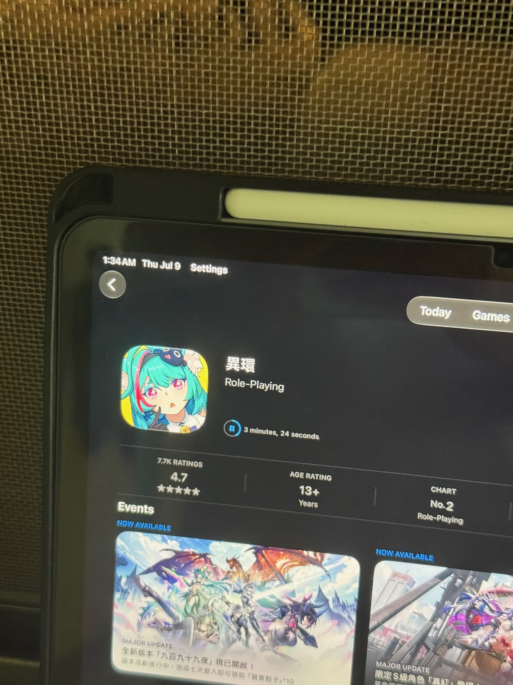
:::note
建議可以自己帶 AP，因為交大宿舍有網路孔，只要有自己 AP 和網路線，就可以快樂上網了！
:::
## Day 2 (2026/07/09)
今天是在 SITCON Camp 的第二天，早上我們被隊輔叫醒，然後吃了早餐，早餐吃蛋餅，不太好吃的蛋餅。
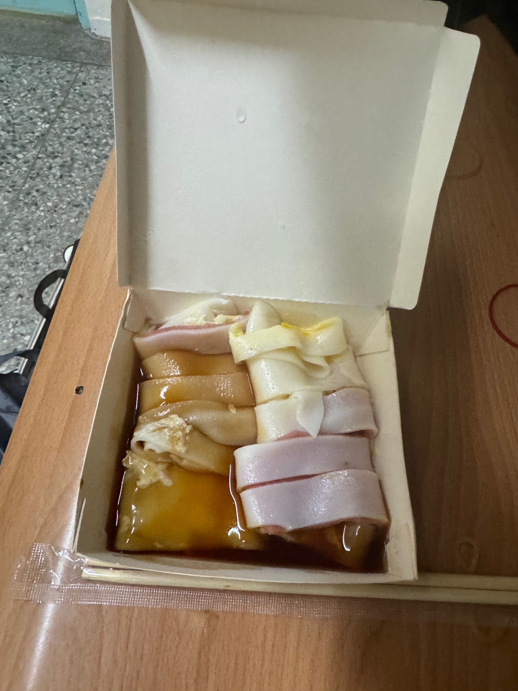
然後接下來我們去接下來我們去電腦教室上人工智能的課程，他主要是在教要怎麼使用 AI 進行 Vibe coding，然後還給了我們 10 隻 20 倍的 Codex Token 使用，超爽www

來說說總結學習到的心得，使用 AI Vibe coding 的時候，不是一昧的直接讓他寫檔案，而是要先寫開發文件，把想法用 AI 寫成開發文件後，再讓 AI 進行開發。

然後午餐吃了一個疑似飯卷的東西，但反正就很普通。
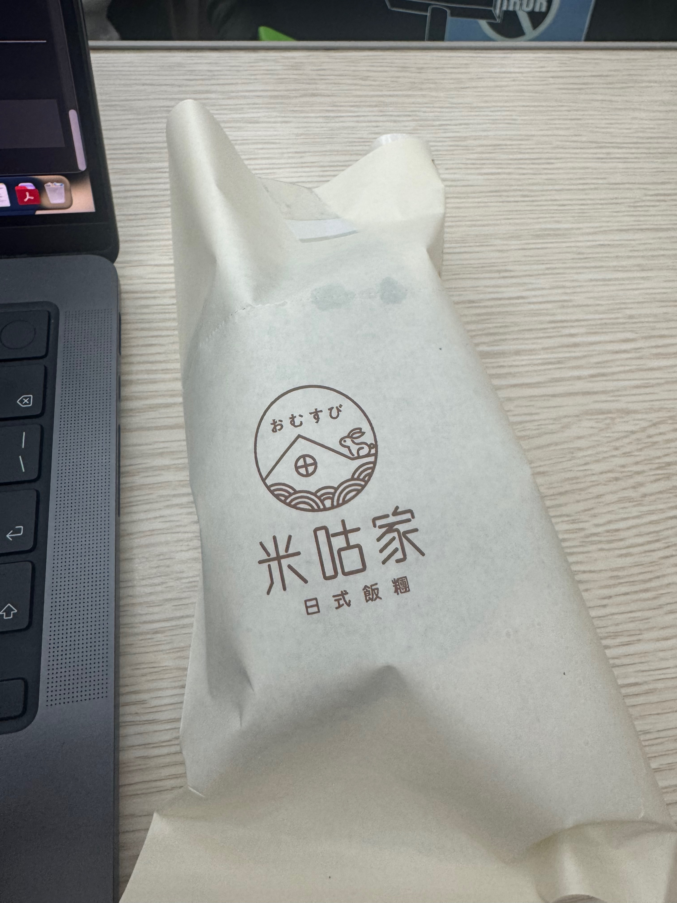
下午和晚上也是在上我說的 AI 的東東，反正就是花時間讓我們自己完成課程要求。這之間我使用AI把網站做出來了：https://sitcon-camp-2026.github.io/t5-m5-se-disaster/ 這是我搞的網站(? 反正很抽象www 我還有上台分享心得。

<iframe width="100%" height="468" src="https://www.youtube.com/embed/GPXdrYx2s-Q?si=LNTtFnlkyYwpOnh1" title="YouTube video player" frameborder="0" allow="accelerometer; autoplay; clipboard-write; encrypted-media; gyroscope; picture-in-picture; web-share" referrerpolicy="strict-origin-when-cross-origin" allowfullscreen></iframe>

課程時間其實我也沒很認真上課，甚至中途還有和隊友玩海龜湯，而且我又回去玩 Duolingo 了（心菱隊輔說要我去玩)，反正又回去繼續學日文了(?

再來是爐邊夜談的時候，這次我去聽了阿諾的「社群禁令」，我好喜歡阿諾的分享方式，他會激起我的好奇心，而且口條很好，我想學習他的說話藝術，還蠻羨慕的:D

他聊社群禁令聊說英國澳洲先後禁止了 16 歲以下的人使用社群媒體，但其實全世界本來就有一個12歲以下的禁令，社會反應卻沒有這麼大。而且你長成 16 歲也不會一夕之間突然變得比較聰明。反正就大概是在探討這個話題啦。

結束爐邊夜談後，我帶著我沒吃的仙草回到了宿舍，我和舍友們互相交換自己在爐邊夜談講的東西，然後我們宿舍的舍友就慢慢熟絡了起來。

我們聊了很多東西，然後還一起玩遊戲（災難公關）到凌晨三點（？ 喔對了，補充一點，Yuan 在我們宿舍架設了網路，所以終於有網路了！！！極度開心:D
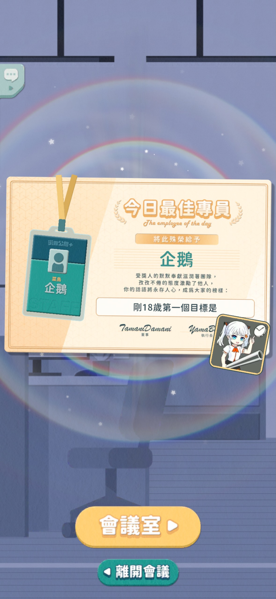
## Day 3 (2026/07/10)
今天是在新竹的第三天，今天颱風假，早上無風風無雨的，所以我們一樣去大教室上課，今天上人工智慧， AI 怎麼運行怎麼跑的，反正就是在講架構+實操的一個課程，給個網站：

https://camp.harrychang.me

然後中午吃了泡麵，下午上完課回宿舍吃了個便當，晚上的課程改線上上課，但都很簡單的操作所以也沒有用啥。
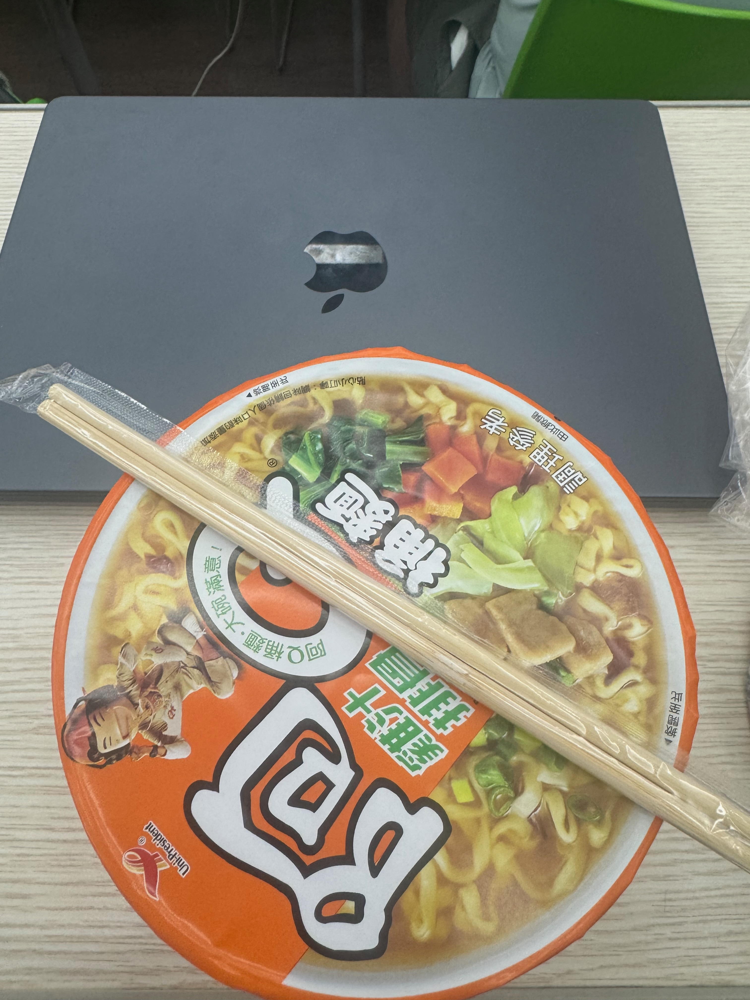
然後我們打牌玩真心話大冒險，玩得很開心，有要人去敲門的，有要人去找 Each 要小石的，反正很嗨ww

接下來是爐邊夜談，但是我們很懶所以就自己開了一個 216 爐邊亂談，談了很多東西，反正有人進來，我們就熱烈歡迎，中途伊藤蒼太和其他的庶務組還推了一個推車進來，裡面裝著宵夜，反正我們邊吃邊聊。
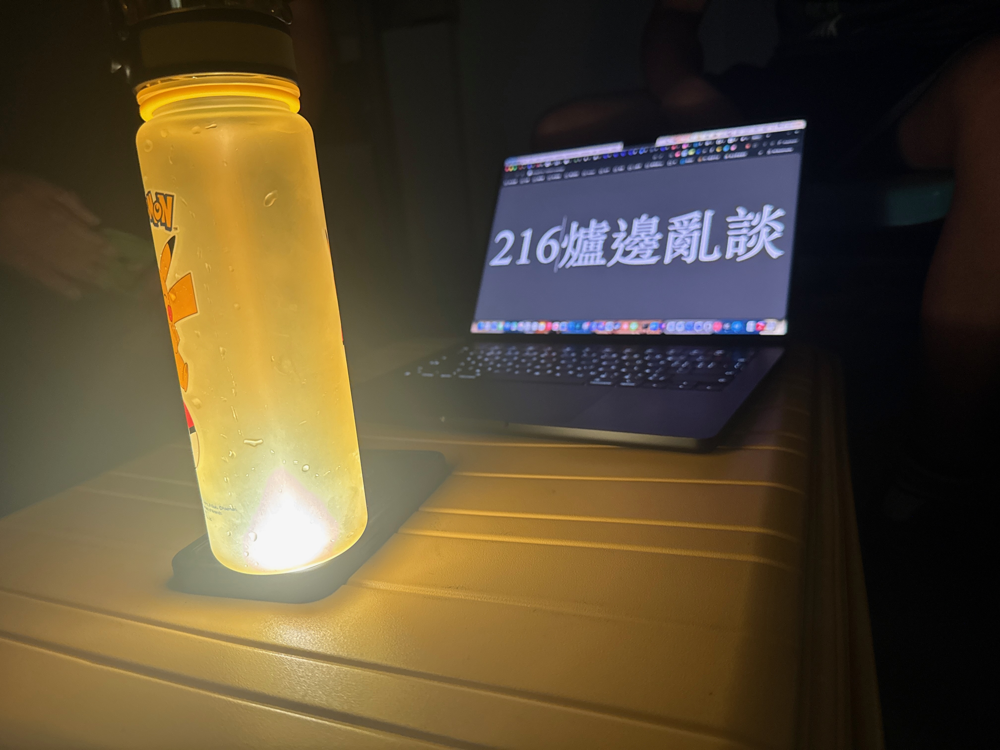
我們聊了很多，有聊感情、聊八卦、辯論火鍋要不要加芋頭、咖喱拌不拌，吃不吃香菜等等….超級精彩！最後聊到後面累了我們就開始玩災難公關，玩到凌晨三點，打打小石佔地後就去睡了。

## Day 4 (2026/07/11)
今天是 SITCON Camp 的第四天，外面還是有在下雨，然後我們今天教學是教資安，我還蠻熟悉的www

早上的早餐我忘記拍照了，反正接下來就在宿舍裡上課。啊由於是基本的資安小常識，所以對我來說還蠻簡單的（？

他們教 CTF+docker+ssh 這些基本知識，啊我就在旁邊玩我自己的？然後不久就到了午餐時間了。
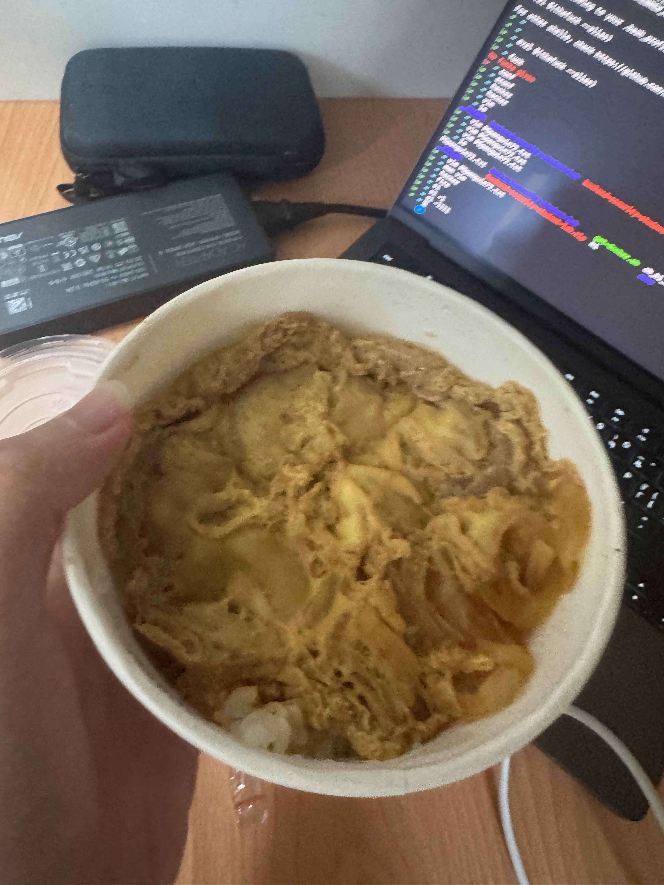
午餐吃完後，一樣繼續 CTF ，但由於太無聊，我們開始在那裡玩牌、做自己的事情（超過分www，

喔對了補充一下題目網址：

https://niu-asp.yuan-tw.net/challenges/cmrgcabtp041h01lb1u9e48ia

啊我也沒有做幾題，還蠻難過的（？

然後晚上我開了一個爐邊夜談，在談論「科技冷漠症」這個議題，然後我發現我的名字被寫錯了 :doge:
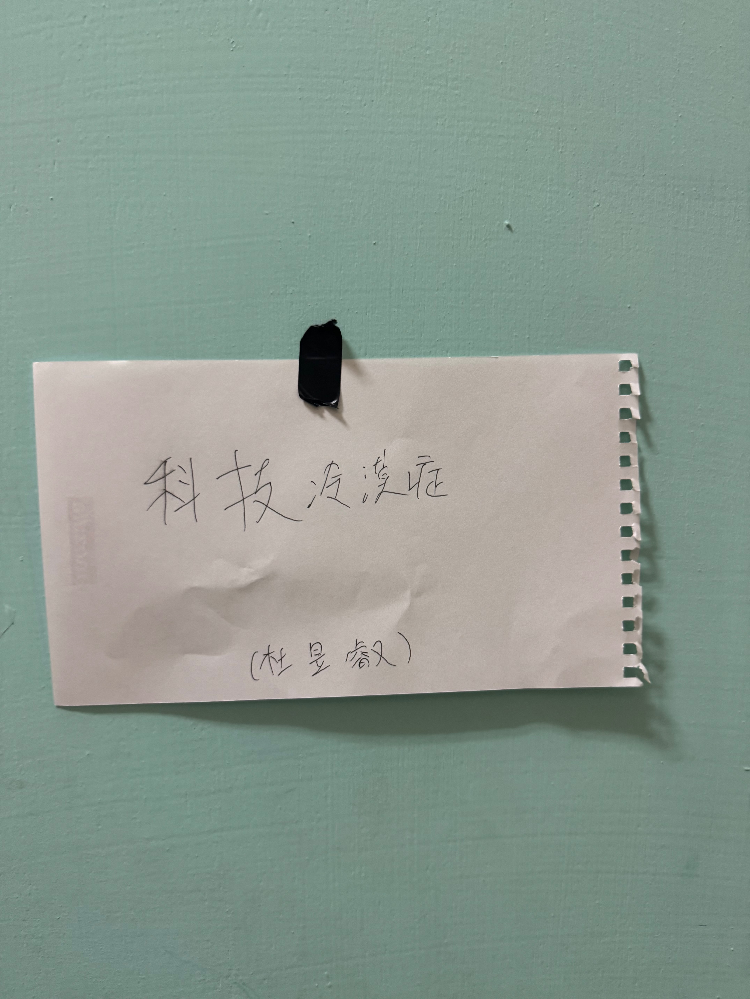
好我那個時候跟大家分享了科技冷漠症是怎麼來的，概念是啥，還有聽大家的想法，反正東西很多很雜，但我覺得這個分享還蠻有趣的（只是我忘記錄影錄音啦:(

好分享完後我們又回我們宿舍開爐邊亂談，但今天就比較偏無聊，後面我們又去打小石戰，我還找了 Each 要小石，要了一顆爐邊小石，結果發現他喵的其他人也有，因為陪 Each 走路（超級難過💔）
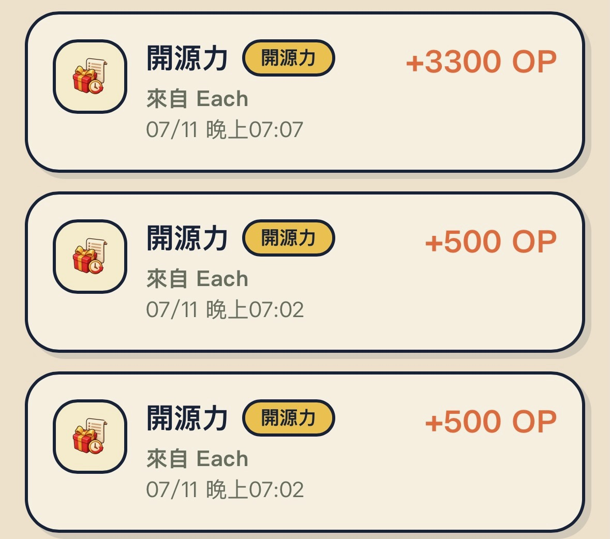
後面我們玩到累了我研究我們隊輔搞的小石系統再加上我讓AI重構功能後，我就把我們宿舍+隔壁的烤鴨的帳號拿來玩小石，最後刷到了 20 多萬的樣子，超級快樂www

反正今天我們聊天啊，玩小石啊，解 CTF 啊，團康啊，聊了很久，玩了很久才去睡覺（四點吧）

喔對了，補充幾個，我今天還認識了一個大佬？他是架 web 的，他雖然很厲害，但我覺得好可怕的感覺，就是給我有種不舒服的感覺，就是他給我的個性很怪，反正我就一直聽他分享，跟我說VPN，翻牆，他的工作啊，作品啊等等，但我還是覺得他很厲害，因為他會這些東西👍

還有，在爐邊夜談結束後，我去看了阿諾的夜談，其實我很羨慕阿諾，他很厲害，他可以帶動情緒，而且還可以帶動思考（前幾天的夜談），還有在今天也是，他超有趣的感覺，還蠻喜歡的，我也想學習這樣的分享方式，讓聽眾可以有興趣在裡面。

## Day 5 (2026/07/12)
今天是最後一天ㄌ！由於我昨天太晚睡，整個人今天都昏昏沉沉的，反正早上退房後我們就去大教室，在大教室的時間我們嘗試打領地戰，但還是沒有打贏，雖然開源力足夠，但是別人農這麼久也有開源力，反正很破防就是了。

然後接下來是分兩組，一組去聽視界咖啡館，一組去逛社群博覽會，然候在交換這樣。我這次去聽的是 台北市資訊局局長 趙氏隆 的分享，但由於真的太累了一直睡睡醒醒的:(

再來就到了社群博覽會，我逛了 Wikimrfia Mozilla g0v iplayground 等各種社群，還有 GDG SITCON SCINT SCAIST SCIST THJCC等攤位…？等等不覺得很熟悉嗎？北中南電還有資安的攤位欸www 我一開始在那裡問問題，結果被 Yuan 還有 Frank 叫進去坐著== 啊我還有在旁邊的白板簽名喔！
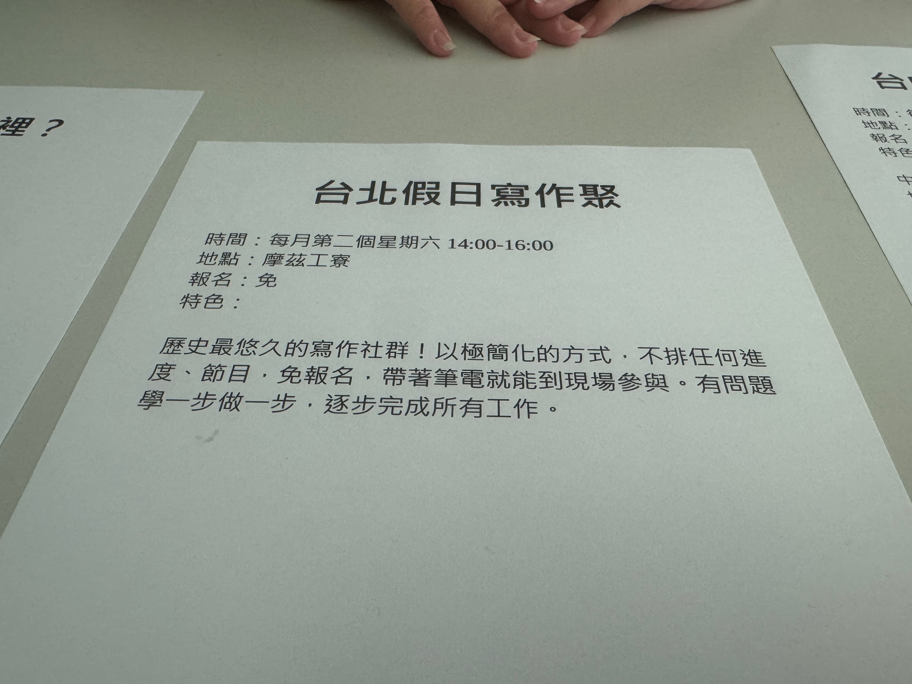
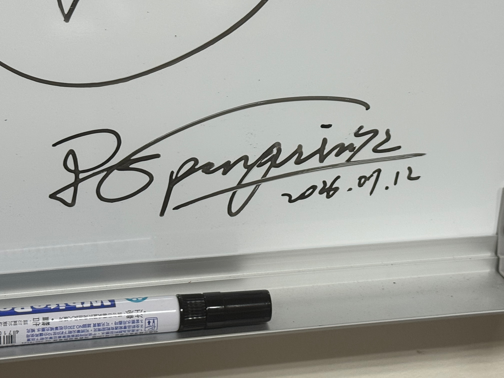
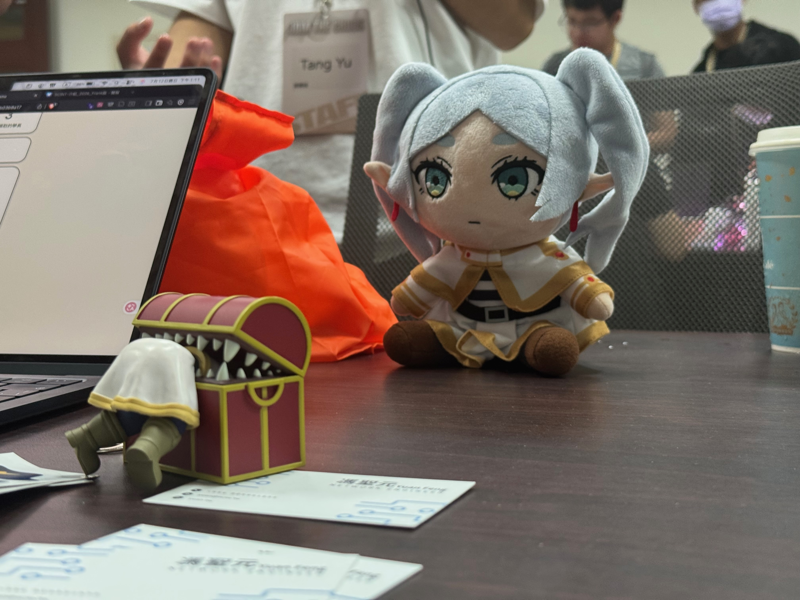
啊反正在那裡也還蠻快樂的？提前享受擺攤生活？

然後午餐吃 Pizza 吃完後一樣也繼續擺攤，然後我們的隊輔心菱請我們隊員吃小木屋鬆餅👍 好吃😋
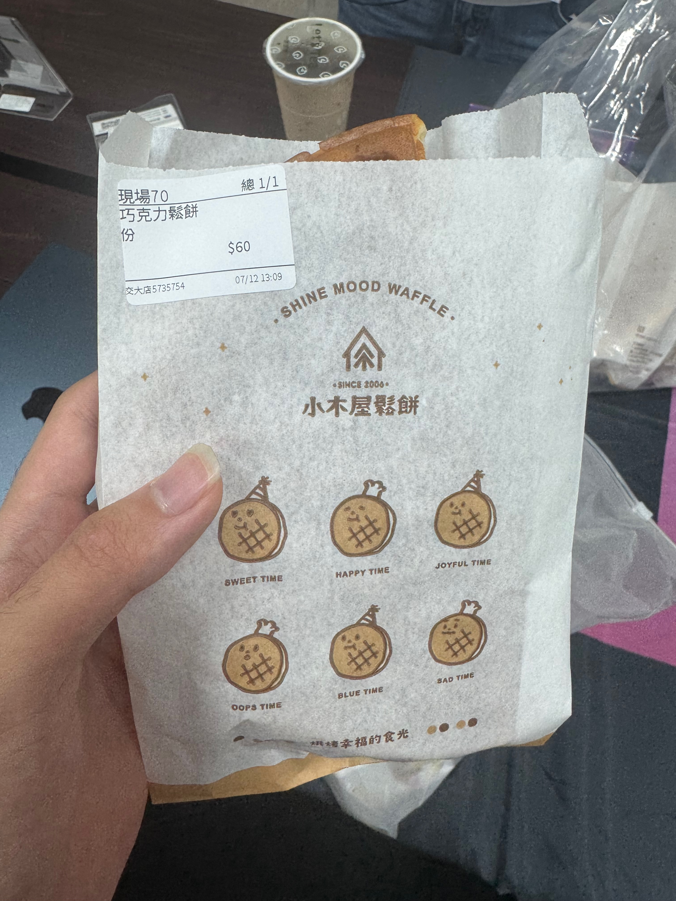
結束了以後，我們又回去大教室，開始閉幕式！閉幕式的時候回顧了整個營期，頒獎等，反正我拿了一些獎項，例如「近全圖鑑」、「紀念T最多的人」、好像還有一個但我忘記了:(
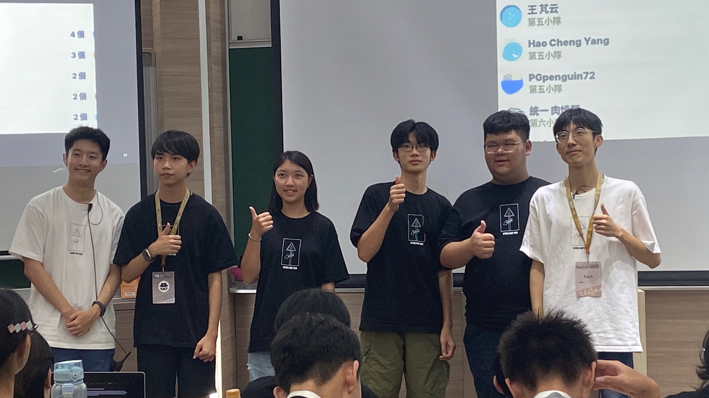
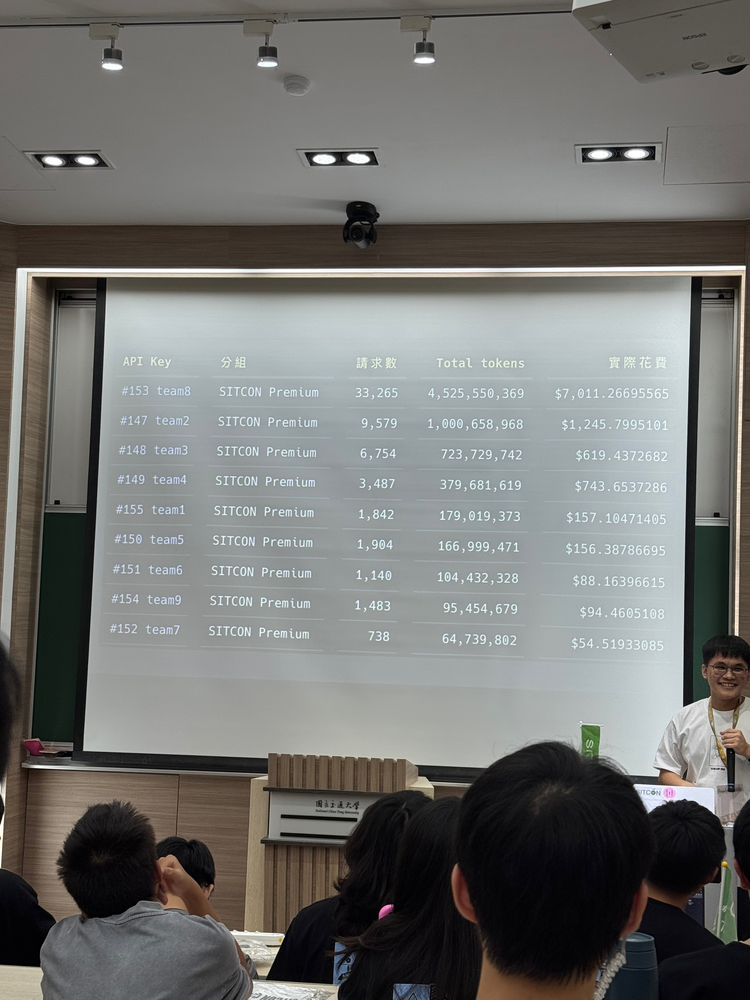

啊但是由於歷屆的紀念T沒有我的尺寸，所以我最後沒有拿。（因為我跟 Denny 要了 Cloudflare 的袋袋）

反正經過一陣子的頒獎，最後就結束了。活動結束後他們有給我們1個小時可以互相交流的時間，我加了好多大佬的好友，就這樣，依依不捨地離開了。
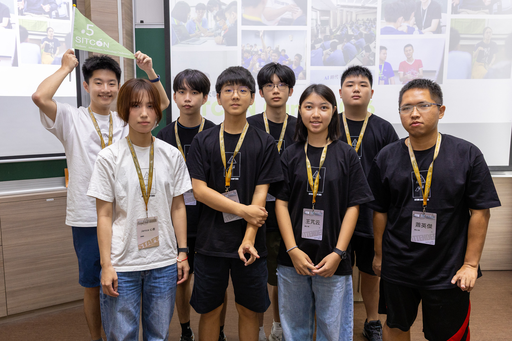

回家的路上，我因為太累直接睡死，是被我爸叫醒才起來的。

回到家後收拾東西啊，然後整理一下東西，渾渾噩噩的就過完一天了？ 反正我忘記我都做了啥了:(

# 心得
好啦，這個日記說長不長，說短不短，但應該也花了你們許多時間閱讀到這裡吧www

來說說重點吧！我在這個營隊學到了什麼...?

如果只說學到了什麼技術，這不好說。因為這五天有 AI、資安、網路、CTF、Vibe Coding，各種奇奇怪怪的東西都有；有些我原本就會，有些我上到睡著，有些我也還沒搞懂（？ 

但也因為它像一個大雜燴，反而讓我接觸到了很多不熟悉的領域。就算當下沒有完全理解，回家之後也會想再去查、去研究，然後莫名其妙又多學了一堆東西。

我覺得 SITCON Camp 最特別的地方，不只有那些課程

我們因為喜歡資工相遇，在這裡有剛接觸的初學者、也有我眼中那種超級大佬的人，但大家聚在一起討論、分享、學習，或是自己在宿舍中隨心所欲地聊天。這些都讓我很清楚的感受到 「真的有人跟我喜歡這些很酷的東西欸！」這種感覺我認為我在學校很難感受到。

在學校，我們被動地學習老師要傳授給我們的知識，但在這營隊中，我們因為都有興趣，所以我們反而是自己主動去學、主動嘗試、主動分享。可能可以去問問別人不久前在做的專案，或是像我們宿舍一樣開一個爐邊亂談...? 這超有趣的好嗎www

我很喜歡 SITCON Camp 的氛圍，他讓我感受到了資工系的歸屬感，有那種未來可以和一群喜歡資工的人一起學習、一起進步，和別人一起分享，一起討論，我認為是 SITCON Camp 最棒的地方。

雖然看我在日記中描繪的很無聊似的（因為我真的很不會寫文章/日記），不過，我想分享我的其中一個感受在結束的時候，我感受到了那種「畢業」的感覺。

明明才剛剛跟大家認識、聊天、熬夜、玩遊戲、討論、學習等...和剛認識的朋友產生了連結

但活動結束後我們又不得不分離，想要拉住對方，但又沒辦法，只能看著時間慢慢走，最後大家慢慢的離開了交大。

從 SITCON 2026 到 SITCON Camp 2026 ，這期間我交到了許多朋友，我認識了許多人，也逐漸靠近了以前對我來說很遙遠的資訊圈。

我有跳坑 SITCON 2027 的工人，如果有興趣想要跟我一樣一起體驗資訊圈，歡迎在明年 SITCON 2027 時來一起體驗！

# 友站推推
這裡有我的朋友寫的心得，也可以參考看看喔:D
::link{url="https://chuen666666.com/SITCON-Camp-2026%E6%94%B6%E8%B2%BB%E9%80%99%E9%BA%BC%E9%AB%98%EF%BC%8CCP%E5%80%BC%E5%A6%82%E4%BD%95%EF%BC%9F%EF%BC%88%E5%8F%83%E5%8A%A0%E5%BF%83%E5%BE%97%EF%BC%89/" text="SITCON Camp 2026 收費這麼高，CP 值如何？（參加心得）"}