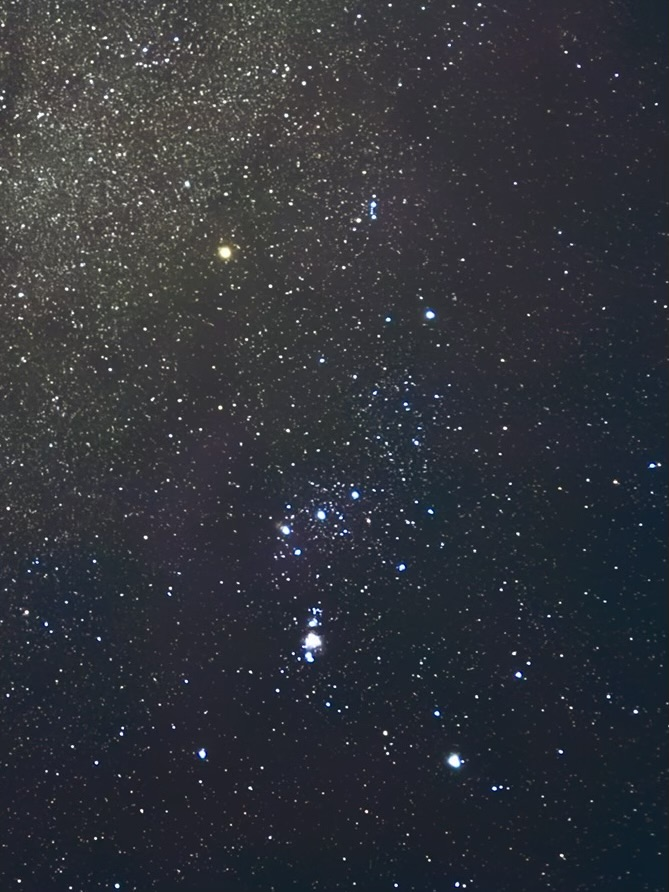
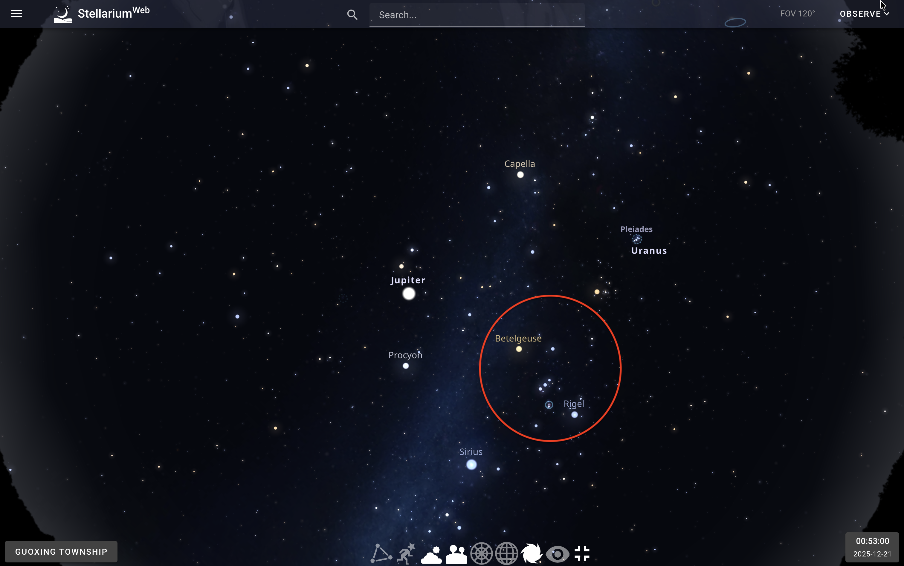
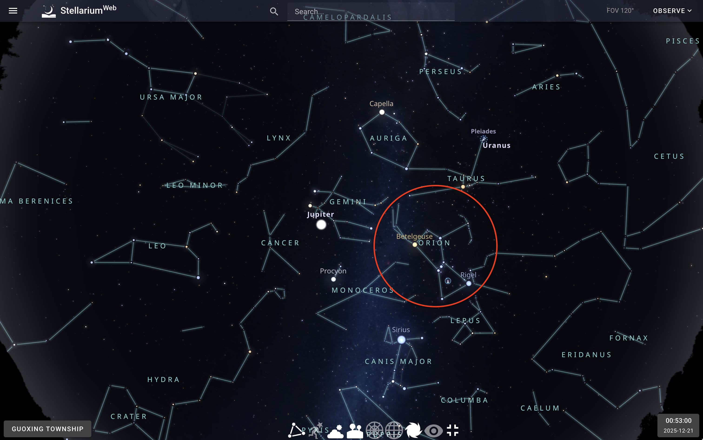
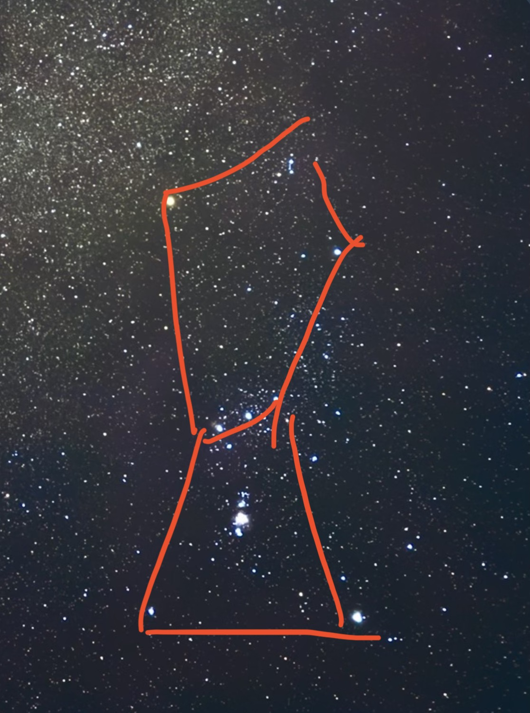
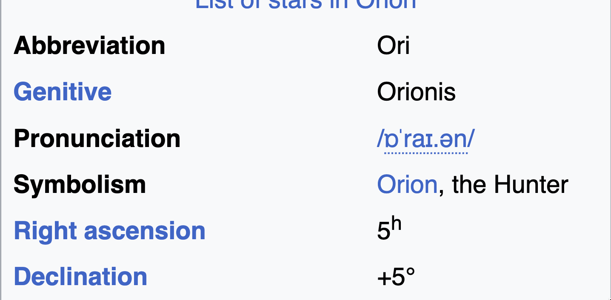

:::important
This article was translated into English by ChatGPT and may contain errors. For the most accurate and complete experience, please refer to the original Chinese version.
:::

# Challenge A Little Penguin's Starry Sky Observation(100)
A little penguin went stargazing last December and took a breathtaking photo of the starry sky with his phone. Since the original picture contains many constellations, he cropped a specific section of it to create this challenge.

Your task is to identify the main constellation featured in this cropped image, find its official three-letter abbreviation, and determine the approximate Right Ascension (RA) and Declination (Dec) of its center position (rounded to the nearest hour and degree) on the celestial sphere.

Flag Format: THJCC{abbreviation=RA[value]h,Dec[value]°}

Abbreviation Rule: The three-letter abbreviation must be in lowercase.

Example: If the center position of the constellation were Virgo (located around RA 12h, Dec +0°), the flag would be THJCC{vir=RA12h,Dec+0°}. (Please pay close attention to case sensitivity, commas, and signs).

# Challenge Design Inspiration:
My idea for this challenge was to design an OSINT challenge, but I thought most of them nowadays were about finding locations on Earth, which was pretty boring.

So I made an astronomy-themed OSINT challenge \:D

To make the challenge easier, I did not require the celestial right ascension and declination to be too precise; a simple answer was enough. However, because I was worried that someone might try guessing all twelve zodiac constellations, I limited everyone to three attempts.

# Solution:
This challenge is very simple. Most people will recognize the three stars in the middle as Orion's Belt as soon as they see them.

But if I were actually solving it step by step, I would do it like this:

1. First, check the EXIF data. You will find that the photo was taken at `2025:12:21 00:53:00 (UTC+8)`.
2. Use the [online star map](https://stellarium-web.org/), choose a random mountain in Taiwan as the location, and look at the star map:

3. You will notice a very similar arrangement of stars in the bottom-right corner. Turn on the constellation display, and you will see this:

4. Once you know it is Orion, look up Orion on Wikipedia to find this information:

Then, enter the information to get the Flag!

:::note[Flag:]
`THJCC{ori=RA5h,Dec+5°}`
:::
