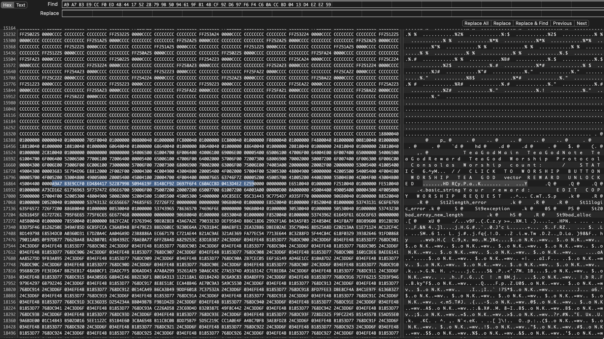

# 題目 TeaGod.exe(100)：

/worship

✨ 虔誠的膜拜 ✨. 
**PGpenguin72(茶神教教徒)** 向最偉大最可愛的茶神姐姐大人獻上了誠摯的敬意！      
累計膜拜次數 / 當前連續天數 666 次 / 666 天 


題目檔案：  
原本題目的檔案：[TeaGod.exe](https://file.pg72.tw/share/v9036WOr)

正確應該要放的檔案：[TeaGod.exe](https://file.pg72.tw/share/TBuhE__L)

# 題目設計發想：
這題是致敬我們 THJCC 的一個 Discord bot「最偉大最可愛的茶神姐姐教-教主，這個 bot 忘記是誰做的了」，不過最主要是想要膜拜茶神（檸檬茶）。

然後我會想做這個題目是想說做一個類似惡意軟體，讓他會一直彈窗，所以我把想法跟 ChatGPT 說後，他就協助我製作了這個 Windows 軟體。

但由於我發上去 CTFd 的檔案發錯了，發成內部測試用的了，所以這題變得超簡單（雖然給 AI 解也很簡單就是了==）。

# 解題步驟：
## 方法一
把檔案下載下來後打開，會看到這個：


然後只要點擊一下按鈕，就可以解開了：


:::note[Flag:]
`THJCC{h77p5://p4s73b1n.com/R58uv133}`
:::

--- 

## 方法二

好吧，剛剛的方法一真的不在我的預期解中，寫個我預期希望的解題思路，也就是方法二。

丟到 Ghidra 中把它 Reverse：
```cpp collapse={1-659, 666-765, 810-2952}
#include "out.h"


undefined4 DAT_1400080fc;
char DAT_140008070;
undefined8 DAT_140008068;
undefined4 DAT_140008058;
undefined8 DAT_140008060;
int DAT_140008054;
undefined FUN_1400033b0;
undefined FUN_140003580;
void *DAT_140008118;
int DAT_140008110;
LPTOP_LEVEL_EXCEPTION_FILTER DAT_140008100;
undefined4 DAT_1400080ec;
undefined4 DAT_1400080f0;
undefined4 DAT_1400080f4;
int DAT_1400080fc;
undefined4 DAT_140008128;
undefined4 DAT_140008120;
int DAT_140008018;
int DAT_140008000;
undefined4 DAT_14000812c;
uint DAT_140008124;
undefined DAT_1400013d0;
undefined DAT_140006460;
void *StackBase;
undefined DAT_140006468;
undefined8 DAT_140006480;
undefined8 DAT_140006488;
HWND DAT_1400080c0;
undefined FUN_1400017a0;
undefined FUN_140001d50;
undefined FUN_1400026c0;
longlong DAT_140008080;
undefined8 DAT_140008078;
undefined4 DAT_1400080c8;
undefined DAT_140005148;
longlong *DAT_140008078;
longlong *DAT_140008080;
undefined DAT_140008098;
pointer PTR_DAT_140005210;
undefined1 DAT_140005228;
undefined DAT_14000528c;
undefined DAT_140005578;
undefined4 DAT_1400080d8;
undefined DAT_140005ba8;
undefined4 DAT_1400080dc;
undefined DAT_1400080a9;
undefined4 UNK_1400080b4;
undefined8 DAT_1400080a1;
undefined DAT_1400080d0;
int DAT_1400080c8;
undefined DAT_140008090;
undefined DAT_140008099;
HWND DAT_1400080e0;
byte DAT_140008090;
undefined DAT_140005252;
undefined1 DAT_140008091;
undefined8 DAT_1400080e0;
undefined DAT_140008088;
undefined DAT_1400080a1;
undefined DAT_1400080b8;
undefined8 DAT_140008080;
undefined DAT_1400045f0;
undefined *PTR_PTR__ZdlPv_1400052a0;
undefined *PTR__ZTVSt12length_error_140006b88;
undefined DAT_140004610;
undefined *PTR_PTR__ZdlPv_140005318;
int DAT_140008038;
int DAT_140008148;
DWORD *DAT_140008178;
undefined DAT_140008150;
undefined *PTR_DAT_140008008;
undefined8 DAT_1400064b0;
pointer PTR_FUN_1400064b8;
char DAT_1400080f8;
undefined *DAT_140008100;
longlong DAT_140008108;
undefined8 DAT_140008108;
undefined DAT_1400060c8;
char DAT_140008130;
int DAT_140008140;
IMAGE_DOS_HEADER IMAGE_DOS_HEADER_140000000;
uint switchdataD_1400060e0;
undefined DAT_140006248;
undefined4 DAT_140006414;
pointer PTR__guard_check_icall_140006450;
longlong DAT_140008138;
undefined DAT_140006298;
undefined *PTR_DAT_140008040;
undefined4 *DAT_140008178;
int *DAT_140008178;
IMAGE_SECTION_HEADER IMAGE_SECTION_HEADER_140000180;
dword DWORD_1400064e4;
undefined DAT_140008048;

void entry(undefined8 param_1,void **param_2,undefined8 *param_3,ulonglong param_4)

{
  DAT_1400080fc = 1;
  FUN_140001020(param_1,param_2,param_3,param_4);
  return;
}


// WARNING: Function: _guard_dispatch_icall replaced with injection: guard_dispatch_icall
// WARNING: Removing unreachable block (ram,0x00014000137c)
// WARNING: Removing unreachable block (ram,0x0001400011b1)
// WARNING: Removing unreachable block (ram,0x0001400011b9)

ulonglong FUN_140001020(undefined8 param_1,void **param_2,undefined8 *param_3,ulonglong param_4)

{
  void *pvVar1;
  undefined4 uVar2;
  int iVar3;
  undefined8 *puVar4;
  ulonglong uVar5;
  undefined4 *puVar6;
  undefined8 uVar7;
  void *pvVar8;
  size_t sVar9;
  void *pvVar10;
  longlong lVar11;
  longlong lVar12;
  bool bVar13;
  undefined4 local_44;
  
  pvVar1 = StackBase;
  pvVar8 = (void *)0x0;
  LOCK();
  bVar13 = DAT_140008118 == (void *)0x0;
  pvVar10 = pvVar1;
  if (!bVar13) {
    pvVar8 = DAT_140008118;
    pvVar10 = DAT_140008118;
  }
  DAT_140008118 = pvVar10;
  UNLOCK();
  if (StackBase != pvVar8 && !bVar13) {
    do {
      param_1 = 1000;
      Sleep(1000);
      pvVar8 = (void *)0x0;
      LOCK();
      bVar13 = DAT_140008118 == (void *)0x0;
      pvVar10 = pvVar1;
      if (!bVar13) {
        pvVar8 = DAT_140008118;
        pvVar10 = DAT_140008118;
      }
      DAT_140008118 = pvVar10;
      UNLOCK();
    } while ((!bVar13) && (pvVar1 != pvVar8));
  }
  if (DAT_140008110 != 1) {
    if (DAT_140008110 != 0) {
      DAT_140008070 = '\x01';
joined_r0x0001400010b0:
      if (bVar13) {
        LOCK();
        DAT_140008118 = (void *)0x0;
        UNLOCK();
      }
      tls_callback_0(0,2);
      uVar7 = DAT_140008068;
      puVar4 = (undefined8 *)FUN_140003bd0();
      *puVar4 = uVar7;
      uVar5 = FUN_140003b10();
      if (DAT_140008054 != 0) {
        if (DAT_140008070 == '\0') {
          uVar5 = uVar5 & 0xffffffff;
          _cexit();
        }
        return uVar5;
      }
      goto LAB_140001395;
    }
    DAT_140008110 = 1;
    FUN_1400035f0(param_1,param_2,param_3,param_4);
    DAT_140008100 = SetUnhandledExceptionFilter(FUN_1400033b0);
    _set_invalid_parameter_handler((_invalid_parameter_handler)&DAT_1400013d0);
    FUN_140003570();
    DAT_1400080ec = 1;
    DAT_1400080f0 = 1;
    DAT_1400080f4 = 1;
    DAT_140008054 = 0;
    param_2 = (void **)0xf8;
    _set_app_type(2 - (uint)(DAT_1400080fc == 0));
    uVar2 = DAT_140008128;
    puVar6 = (undefined4 *)__p__fmode();
    *puVar6 = uVar2;
    uVar2 = DAT_140008120;
    puVar6 = (undefined4 *)__p__commode();
    *puVar6 = uVar2;
    uVar7 = FUN_140003b00();
    if (-1 < (int)uVar7) {
      if (DAT_140008018 == 1) {
        FUN_140003560(FUN_140003580);
      }
      if (DAT_140008000 == -1) {
        _configthreadlocale(-1);
      }
      iVar3 = _initterm_e(&DAT_140006480,&DAT_140006488);
      if (iVar3 != 0) {
        return 0xff;
      }
      local_44 = DAT_14000812c;
      param_4 = (ulonglong)DAT_140008124;
      param_2 = &DAT_140008060;
      param_3 = &DAT_140008068;
      uVar7 = FUN_140003be0(&DAT_140008058,&DAT_140008060,&DAT_140008068,DAT_140008124,&local_44);
      iVar3 = DAT_140008058;
      if (-1 < (int)uVar7) {
        lVar12 = (longlong)DAT_140008058;
        pvVar8 = malloc(lVar12 * 8 + 8);
        pvVar1 = DAT_140008060;
        if (pvVar8 != (void *)0x0) {
          if (iVar3 < 1) {
            lVar12 = 0;
          }
          else {
            lVar11 = 0;
            do {
              sVar9 = wcslen(*(wchar_t **)((longlong)pvVar1 + lVar11 * 8));
              puVar4 = (undefined8 *)(sVar9 * 2 + 2);
              pvVar10 = malloc((size_t)puVar4);
              *(void **)((longlong)pvVar8 + lVar11 * 8) = pvVar10;
              if (pvVar10 == (void *)0x0) goto LAB_140001381;
              param_2 = *(void ***)((longlong)pvVar1 + lVar11 * 8);
              memcpy(pvVar10,param_2,(size_t)puVar4);
              lVar11 = lVar11 + 1;
              param_3 = puVar4;
            } while (lVar12 != lVar11);
          }
          *(undefined8 *)((longlong)pvVar8 + lVar12 * 8) = 0;
          DAT_140008060 = pvVar8;
          _initterm(&DAT_140006460,&DAT_140006468);
          FUN_140003320();
          DAT_140008110 = 2;
          goto joined_r0x0001400010b0;
        }
      }
    }
LAB_140001381:
    FUN_140003c50(8,param_2,param_3,param_4);
  }
  uVar5 = FUN_140003c50(0x1f,param_2,param_3,param_4);
LAB_140001395:
                    // WARNING: Subroutine does not return
  exit((int)uVar5);
}


void FUN_1400013a0(undefined8 param_1,void **param_2,undefined8 *param_3,ulonglong param_4)

{
  DAT_1400080fc = 0;
  FUN_140001020(param_1,param_2,param_3,param_4);
  return;
}


void FUN_1400013c0(void)

{
                    // WARNING: Could not recover jumptable at 0x000140004740. Too many branches
                    // WARNING: Treating indirect jump as call
  _crt_atexit();
  return;
}


undefined8 FUN_140001440(HINSTANCE param_1,undefined8 param_2,undefined8 param_3,int param_4)

{
  BOOL BVar1;
  HMODULE hInstance;
  HWND pHVar2;
  int iVar3;
  ulonglong uVar4;
  HWND local_160;
  tagMSG local_158;
  WNDCLASSW local_128;
  WNDCLASSW local_d8;
  WNDCLASSW local_88;
  
  local_d8.cbClsExtra = 0;
  local_d8.cbWndExtra = 0;
  local_d8.style = 0;
  local_d8._4_4_ = 0;
  local_d8.hbrBackground = (HBRUSH)0x0;
  local_d8.lpszMenuName = (LPCWSTR)0x0;
  local_d8.hIcon = (HICON)0x0;
  local_d8.hCursor = (HCURSOR)0x0;
  local_d8.lpszClassName = L"TeaGodMain";
  local_d8.lpfnWndProc = FUN_1400017a0;
  local_d8.hInstance = param_1;
  local_d8.hbrBackground = CreateSolidBrush(0x191919);
  RegisterClassW(&local_d8);
  local_88.cbClsExtra = 0;
  local_88.cbWndExtra = 0;
  local_88.style = 0;
  local_88._4_4_ = 0;
  local_88.hbrBackground = (HBRUSH)0x0;
  local_88.lpszMenuName = (LPCWSTR)0x0;
  local_88.hIcon = (HICON)0x0;
  local_88.hCursor = (HCURSOR)0x0;
  local_88.lpszClassName = L"TeaGodNote";
  local_88.lpfnWndProc = FUN_140001d50;
  local_88.hInstance = param_1;
  RegisterClassW(&local_88);
  local_128.cbClsExtra = 0;
  local_128.cbWndExtra = 0;
  local_128.style = 0;
  local_128._4_4_ = 0;
  local_128.lpszMenuName = (LPCWSTR)0x0;
  local_128.hIcon = (HICON)0x0;
  local_128.hCursor = (HCURSOR)0x0;
  local_128.lpszClassName = L"TeaGodReward";
  local_128.lpfnWndProc = FUN_1400026c0;
  local_128.hbrBackground = (HBRUSH)0x6;
  local_128.hInstance = param_1;
  RegisterClassW(&local_128);
  DAT_1400080c0 =
       CreateWindowExW(0,L"TeaGodMain",L"TeaGod Worship Protocol",0xcf0000,-0x80000000,-0x80000000,
                       0x2d0,0xb4,(HWND)0x0,(HMENU)0x0,param_1,(LPVOID)0x0);
  ShowWindow(DAT_1400080c0,param_4);
  UpdateWindow(DAT_1400080c0);
  pHVar2 = DAT_1400080c0;
  hInstance = GetModuleHandleW((LPCWSTR)0x0);
  pHVar2 = CreateWindowExW(0x88,L"TeaGodNote",L"WORSHIP REQUEST",0x80c80000,-0x80000000,-0x80000000,
                           0x1ae,0x1d6,pHVar2,(HMENU)0x0,hInstance,(LPVOID)0x0);
  local_158.hwnd = (HWND)0x0;
  local_158.message = 0;
  local_158._12_4_ = 0;
  local_160 = pHVar2;
  SystemParametersInfoW(0x30,0,&local_158,0);
  uVar4 = DAT_140008080 - DAT_140008078 >> 3;
  iVar3 = (int)uVar4 + (int)(uVar4 / 6) * -6;
  SetWindowPos(pHVar2,(HWND)0xffffffffffffffff,local_158.message + iVar3 * -0x22 + -0x1c7,
               local_158._12_4_ + iVar3 * -0x1c + -0x1fe,0x1ae,0x1d6,0x40);
  FUN_1400030b0(&DAT_140008078,&local_160);
  SetTimer(DAT_1400080c0,0xcafe,3000,(TIMERPROC)0x0);
  local_158.time = 0;
  local_158.pt.x = 0;
  local_158.pt.y = 0;
  local_158._44_4_ = 0;
  local_158.wParam = 0;
  local_158.lParam = 0;
  local_158.hwnd = (HWND)0x0;
  local_158.message = 0;
  local_158._12_4_ = 0;
  BVar1 = GetMessageW(&local_158,(HWND)0x0,0,0);
  if (0 < BVar1) {
    do {
      TranslateMessage(&local_158);
      DispatchMessageW(&local_158);
      BVar1 = GetMessageW(&local_158,(HWND)0x0,0,0);
    } while (0 < BVar1);
  }
  return 0;
}


// WARNING: Type propagation algorithm not settling

HBRUSH FUN_1400017a0(HWND param_1,UINT param_2,WPARAM param_3,LPARAM param_4)

{
  undefined1 *puVar1;
  HDC hdc;
  HFONT h;
  HGDIOBJ h_00;
  uint *puVar2;
  ulonglong *puVar3;
  HMODULE hInstance;
  HWND hWnd;
  HBRUSH pHVar4;
  int iVar5;
  ulonglong uVar6;
  LPCWSTR lpchText;
  undefined8 local_128;
  ulonglong uStack_120;
  LPCWSTR local_118;
  byte local_110 [2];
  undefined1 local_10e [6];
  ulonglong local_108;
  undefined1 *local_100;
  uint local_f8;
  uint uStack_f4;
  uint uStack_f0;
  uint uStack_ec;
  undefined8 local_e8;
  ulonglong local_d8;
  ulonglong uStack_d0;
  ulonglong local_c8;
  byte local_c0 [16];
  undefined8 local_b0;
  tagRECT local_a8;
  tagPAINTSTRUCT local_98;
  
  if ((int)param_2 < 0x113) {
    if (param_2 == 2) {
      KillTimer(param_1,0xcafe);
      PostQuitMessage(0);
    }
    else {
      if (param_2 != 0xf) goto LAB_140001b5c;
      local_98.rgbReserved[0xc] = '\0';
      local_98.rgbReserved[0xd] = '\0';
      local_98.rgbReserved[0xe] = '\0';
      local_98.rgbReserved[0xf] = '\0';
      local_98.rgbReserved[0x10] = '\0';
      local_98.rgbReserved[0x11] = '\0';
      local_98.rgbReserved[0x12] = '\0';
      local_98.rgbReserved[0x13] = '\0';
      local_98.rgbReserved[0x14] = '\0';
      local_98.rgbReserved[0x15] = '\0';
      local_98.rgbReserved[0x16] = '\0';
      local_98.rgbReserved[0x17] = '\0';
      local_98.rgbReserved[0x18] = '\0';
      local_98.rgbReserved[0x19] = '\0';
      local_98.rgbReserved[0x1a] = '\0';
      local_98.rgbReserved[0x1b] = '\0';
      local_98.fIncUpdate = 0;
      local_98.rgbReserved[0] = '\0';
      local_98.rgbReserved[1] = '\0';
      local_98.rgbReserved[2] = '\0';
      local_98.rgbReserved[3] = '\0';
      local_98.rgbReserved[4] = '\0';
      local_98.rgbReserved[5] = '\0';
      local_98.rgbReserved[6] = '\0';
      local_98.rgbReserved[7] = '\0';
      local_98.rgbReserved[8] = '\0';
      local_98.rgbReserved[9] = '\0';
      local_98.rgbReserved[10] = '\0';
      local_98.rgbReserved[0xb] = '\0';
      local_98.rcPaint.top = 0;
      local_98.rcPaint.right = 0;
      local_98.rcPaint.bottom = 0;
      local_98.fRestore = 0;
      local_98.hdc = (HDC)0x0;
      local_98.fErase = 0;
      local_98.rcPaint.left = 0;
      local_98.rgbReserved[0x1c] = '\0';
      local_98.rgbReserved[0x1d] = '\0';
      local_98.rgbReserved[0x1e] = '\0';
      local_98.rgbReserved[0x1f] = '\0';
      local_98._68_4_ = 0;
      hdc = BeginPaint(param_1,&local_98);
      local_a8.left = 0;
      local_a8.top = 0;
      local_a8.right = 0;
      local_a8.bottom = 0;
      GetClientRect(param_1,&local_a8);
      SetBkMode(hdc,1);
      SetTextColor(hdc,0xdcdcdc);
      h = CreateFontW(0x16,0,0,0,700,0,0,0,1,0,0,0,0,L"Consolas");
      h_00 = SelectObject(hdc,h);
      _ZNSt3__110to_wstringEj(local_c0,DAT_1400080c8);
      puVar2 = (uint *)_ZNSt3__112basic_stringIwNS_11char_traitsIwEENS_9allocatorIwEEE6insertEyPKw
                                 (local_c0,0,L"Worship count: ");
      local_e8 = *(undefined8 *)(puVar2 + 4);
      local_f8 = *puVar2;
      uStack_f4 = puVar2[1];
      uStack_f0 = puVar2[2];
      uStack_ec = puVar2[3];
      puVar2[0] = 0;
      puVar2[1] = 0;
      puVar2[2] = 0;
      puVar2[3] = 0;
      puVar2[4] = 0;
      puVar2[5] = 0;
      puVar3 = (ulonglong *)
               _ZNSt3__112basic_stringIwNS_11char_traitsIwEENS_9allocatorIwEEE6appendEPKw
                         (&local_f8,&DAT_140005148);
      local_c8 = puVar3[2];
      local_d8 = *puVar3;
      uStack_d0 = puVar3[1];
      *puVar3 = 0;
      puVar3[1] = 0;
      puVar3[2] = 0;
      _ZNSt3__110to_wstringEj(local_110,1);
      uVar6 = (ulonglong)(local_110[0] >> 1);
      puVar1 = local_10e;
      if ((local_110[0] & 1) != 0) {
        uVar6 = local_108;
        puVar1 = local_100;
      }
      puVar3 = (ulonglong *)
               _ZNSt3__112basic_stringIwNS_11char_traitsIwEENS_9allocatorIwEEE6appendEPKwy
                         (&local_d8,puVar1,uVar6);
      local_118 = (LPCWSTR)puVar3[2];
      local_128 = (HWND)*puVar3;
      uStack_120 = puVar3[1];
      *puVar3 = 0;
      puVar3[1] = 0;
      puVar3[2] = 0;
      if ((local_110[0] & 1) != 0) {
        _ZdlPv(local_100);
      }
      if ((local_d8 & 1) != 0) {
        _ZdlPv(local_c8);
      }
      if ((local_f8 & 1) != 0) {
        _ZdlPv(local_e8);
      }
      if ((local_c0[0] & 1) != 0) {
        _ZdlPv(local_b0);
      }
      lpchText = local_118;
      if (((ulonglong)local_128 & 1) == 0) {
        lpchText = (LPCWSTR)((longlong)&local_128 + 2);
      }
      DrawTextW(hdc,lpchText,-1,&local_a8,0x25);
      SelectObject(hdc,h_00);
      DeleteObject(h);
      if (((ulonglong)local_128 & 1) != 0) {
        _ZdlPv(local_118);
      }
      EndPaint(param_1,&local_98);
    }
    pHVar4 = (HBRUSH)0x0;
  }
  else {
    if (param_2 == 0x138) {
      pHVar4 = GetSysColorBrush(5);
      return pHVar4;
    }
    if ((param_2 == 0x113) && (param_3 == 0xcafe)) {
      param_2 = 0x113;
      hInstance = GetModuleHandleW((LPCWSTR)0x0);
      hWnd = CreateWindowExW(0x88,L"TeaGodNote",L"WORSHIP REQUEST",0x80c80000,-0x80000000,
                             -0x80000000,0x1ae,0x1d6,param_1,(HMENU)0x0,hInstance,(LPVOID)0x0);
      local_98.hdc = (HDC)0x0;
      local_98.fErase = 0;
      local_98.rcPaint.left = 0;
      local_128 = hWnd;
      SystemParametersInfoW(0x30,0,&local_98,0);
      uVar6 = DAT_140008080 - DAT_140008078 >> 3;
      iVar5 = (int)uVar6 + (int)(uVar6 / 6) * -6;
      SetWindowPos(hWnd,(HWND)0xffffffffffffffff,local_98.fErase + iVar5 * -0x22 + -0x1c7,
                   local_98.rcPaint.left + iVar5 * -0x1c + -0x1fe,0x1ae,0x1d6,0x40);
      FUN_1400030b0(&DAT_140008078,&local_128);
    }
LAB_140001b5c:
    pHVar4 = (HBRUSH)DefWindowProcW(param_1,param_2,param_3,param_4);
  }
  return pHVar4;
}


// WARNING: Removing unreachable block (ram,0x00014000251a)
// WARNING: Globals starting with '_' overlap smaller symbols at the same address

LRESULT FUN_140001d50(HWND param_1,UINT param_2,WPARAM param_3,LPARAM param_4)

{
  byte bVar1;
  char *pcVar2;
  longlong *plVar3;
  DWORD DVar4;
  HRESULT HVar5;
  int iVar6;
  undefined **ppuVar7;
  undefined8 *puVar8;
  LRESULT LVar9;
  HMODULE pHVar10;
  HRSRC hResInfo;
  HGLOBAL hResData;
  HGLOBAL hMem;
  LPVOID _Dst;
  LPVOID _Src;
  HDC hdc;
  longlong *plVar11;
  byte *pbVar12;
  longlong lVar13;
  longlong lVar14;
  longlong *plVar15;
  longlong *local_d0;
  longlong *local_c8;
  longlong *local_c0;
  undefined8 local_b8;
  LONG LStack_b0;
  undefined4 uStack_ac;
  DWORD DStack_a8;
  DWORD DStack_a4;
  LONG LStack_a0;
  undefined8 uStack_9c;
  undefined8 local_94;
  tagPAINTSTRUCT local_88;
  
  plVar3 = DAT_140008080;
  if ((int)param_2 < 0xf) {
    if (param_2 == 1) {
      CoInitializeEx((LPVOID)0x0,2);
      pHVar10 = GetModuleHandleW((LPCWSTR)0x0);
      hResInfo = FindResourceW(pHVar10,(LPCWSTR)0x65,(LPCWSTR)0xa);
      if (hResInfo != (HRSRC)0x0) {
        hResData = LoadResource((HMODULE)0x0,hResInfo);
        DVar4 = SizeofResource((HMODULE)0x0,hResInfo);
        if (DVar4 != 0 && hResData != (HGLOBAL)0x0) {
          hMem = GlobalAlloc(2,(ulonglong)DVar4);
          if (hMem != (HGLOBAL)0x0) {
            _Dst = GlobalLock(hMem);
            _Src = LockResource(hResData);
            memcpy(_Dst,_Src,(ulonglong)DVar4);
            GlobalUnlock(hMem);
            local_88.hdc = (HDC)0x0;
            HVar5 = CreateStreamOnHGlobal(hMem,1,(LPSTREAM *)&local_88);
            if (-1 < HVar5) {
              local_b8 = (longlong *)0x0;
              local_c0 = (longlong *)0x0;
              local_d0 = (longlong *)0x0;
              HVar5 = CoCreateInstance((IID *)&DAT_140005ba8,(LPUNKNOWN)0x0,1,(IID *)&DAT_14000528c,
                                       (LPVOID *)&local_b8);
              if (((-1 < HVar5) &&
                  (iVar6 = (**(code **)(*local_b8 + 0x20))(local_b8,local_88.hdc,0,1,&local_c0),
                  -1 < iVar6)) &&
                 (iVar6 = (**(code **)(*local_c0 + 0x68))(local_c0,0,&local_d0), -1 < iVar6)) {
                local_c8 = (longlong *)0x0;
                iVar6 = (**(code **)(*local_b8 + 0x50))(local_b8,&local_c8);
                if ((-1 < iVar6) &&
                   (iVar6 = (**(code **)(*local_c8 + 0x40))
                                      (local_c8,local_d0,&DAT_140005578,0,0,0,0), -1 < iVar6)) {
                  (**(code **)(*local_c8 + 0x18))(local_c8,&DAT_1400080d8,&DAT_1400080dc);
                  FUN_140002e90((longlong *)((longlong)&DAT_1400080a1 + 7),
                                (ulonglong)DAT_1400080dc * (ulonglong)DAT_1400080d8 * 4);
                  (**(code **)(*local_c8 + 0x38))
                            (local_c8,0,DAT_1400080d8 << 2,
                             ram0x0001400080b0 - (int)ram0x0001400080a8,ram0x0001400080a8);
                }
                if (local_c8 != (longlong *)0x0) {
                  (**(code **)(*local_c8 + 0x10))();
                }
              }
              if (local_d0 != (longlong *)0x0) {
                (**(code **)(*local_d0 + 0x10))();
              }
              if (local_c0 != (longlong *)0x0) {
                (**(code **)(*local_c0 + 0x10))();
              }
              if (local_b8 != (longlong *)0x0) {
                (**(code **)(*local_b8 + 0x10))();
              }
              (*(*(IStreamVtbl **)&(local_88.hdc)->unused)->Release)((IStream *)local_88.hdc);
            }
          }
        }
      }
      pHVar10 = GetModuleHandleW((LPCWSTR)0x0);
      CreateWindowExW(0,L"STATIC",L"茶神降臨 // CLICK TO WORSHIP",0x50000001,0x14,0x12,0x186,
                      0x1c,param_1,(HMENU)0x0,pHVar10,(LPVOID)0x0);
      pHVar10 = GetModuleHandleW((LPCWSTR)0x0);
      _DAT_1400080d0 =
           CreateWindowExW(0,L"BUTTON",L"WORSHIP TEA GOD",0x50000001,0x6e,0x177,0xd2,0x2a,param_1,
                           (HMENU)0x1001,pHVar10,(LPVOID)0x0);
    }
    else {
      if (param_2 != 2) {
LAB_140002078:
                    // WARNING: Could not recover jumptable at 0x00014000208e. Too many branches
                    // WARNING: Treating indirect jump as call
        LVar9 = DefWindowProcW(param_1,param_2,param_3,param_4);
        return LVar9;
      }
      plVar15 = DAT_140008078;
      if (DAT_140008078 == DAT_140008080) {
LAB_140002507:
        if (plVar15 != plVar3) {
          DAT_140008080 = plVar15;
        }
      }
      else {
        do {
          if ((HWND)*plVar15 == param_1) {
            plVar11 = plVar15 + 1;
            if (plVar11 != DAT_140008080 && plVar15 != DAT_140008080) {
              do {
                if ((HWND)*plVar11 != param_1) {
                  *plVar15 = *plVar11;
                  plVar15 = plVar15 + 1;
                }
                plVar11 = plVar11 + 1;
              } while (plVar11 != plVar3);
            }
            goto LAB_140002507;
          }
          plVar15 = plVar15 + 1;
        } while (plVar15 != DAT_140008080);
      }
      CoUninitialize();
    }
  }
  else if (param_2 == 0xf) {
    local_88.rgbReserved[0xc] = '\0';
    local_88.rgbReserved[0xd] = '\0';
    local_88.rgbReserved[0xe] = '\0';
    local_88.rgbReserved[0xf] = '\0';
    local_88.rgbReserved[0x10] = '\0';
    local_88.rgbReserved[0x11] = '\0';
    local_88.rgbReserved[0x12] = '\0';
    local_88.rgbReserved[0x13] = '\0';
    local_88.rgbReserved[0x14] = '\0';
    local_88.rgbReserved[0x15] = '\0';
    local_88.rgbReserved[0x16] = '\0';
    local_88.rgbReserved[0x17] = '\0';
    local_88.rgbReserved[0x18] = '\0';
    local_88.rgbReserved[0x19] = '\0';
    local_88.rgbReserved[0x1a] = '\0';
    local_88.rgbReserved[0x1b] = '\0';
    local_88.fIncUpdate = 0;
    local_88.rgbReserved[0] = '\0';
    local_88.rgbReserved[1] = '\0';
    local_88.rgbReserved[2] = '\0';
    local_88.rgbReserved[3] = '\0';
    local_88.rgbReserved[4] = '\0';
    local_88.rgbReserved[5] = '\0';
    local_88.rgbReserved[6] = '\0';
    local_88.rgbReserved[7] = '\0';
    local_88.rgbReserved[8] = '\0';
    local_88.rgbReserved[9] = '\0';
    local_88.rgbReserved[10] = '\0';
    local_88.rgbReserved[0xb] = '\0';
    local_88.rcPaint.top = 0;
    local_88.rcPaint.right = 0;
    local_88.rcPaint.bottom = 0;
    local_88.fRestore = 0;
    local_88.hdc = (HDC)0x0;
    local_88.fErase = 0;
    local_88.rcPaint.left = 0;
    local_88.rgbReserved[0x1c] = '\0';
    local_88.rgbReserved[0x1d] = '\0';
    local_88.rgbReserved[0x1e] = '\0';
    local_88.rgbReserved[0x1f] = '\0';
    local_88._68_4_ = 0;
    hdc = BeginPaint(param_1,&local_88);
    if (ram0x0001400080a8 != (void *)CONCAT44(uRam00000001400080b4,ram0x0001400080b0)) {
      DStack_a4 = 0;
      LStack_a0 = 0;
      uStack_9c._0_4_ = 0;
      uStack_9c._4_4_ = 0;
      local_94._0_4_ = 0;
      local_94._4_1_ = '\0';
      local_94._5_1_ = '\0';
      local_94._6_1_ = '\0';
      local_94._7_1_ = '\0';
      local_b8 = (longlong *)CONCAT44(DAT_1400080d8,0x28);
      LStack_b0 = -DAT_1400080dc;
      uStack_ac._0_2_ = 1;
      uStack_ac._2_2_ = 0x20;
      DStack_a8 = 0;
      StretchDIBits(hdc,0x23,0x37,0x168,300,0,0,DAT_1400080d8,DAT_1400080dc,ram0x0001400080a8,
                    (BITMAPINFO *)&local_b8,0,0xcc0020);
    }
    EndPaint(param_1,&local_88);
  }
  else {
    if ((param_2 != 0x111) || (((uint)param_3 & 0xffff) != 0x1001)) goto LAB_140002078;
    DAT_1400080c8 = DAT_1400080c8 + 1;
    InvalidateRect(DAT_1400080c0,(RECT *)0x0,1);
    if (param_1 != (HWND)0x0) {
      DestroyWindow(param_1);
    }
    if (DAT_1400080c8 != 0) {
      KillTimer(DAT_1400080c0,0xcafe);
      if (DAT_140008078 != DAT_140008080) {
        do {
          DestroyWindow((HWND)DAT_140008080[-1]);
        } while (DAT_140008078 != DAT_140008080);
      }
      local_88.rcPaint.top = 0;
      local_88.rcPaint.right = 0;
      local_88.rcPaint.bottom = 0;
      local_88.fRestore = 0;
      local_88.hdc = (HDC)0x0;
      local_88.fErase = 0;
      local_88.rcPaint.left = 0;
      local_88._32_8_ = (ulonglong)(uint)local_88.rgbReserved._0_4_ << 0x20;
      ppuVar7 = &PTR_DAT_140005210;
      pbVar12 = (byte *)((longlong)&local_88.fErase + 3);
      lVar13 = 0;
      do {
        pcVar2 = *ppuVar7;
        bVar1 = (&DAT_140005228)[lVar13];
        *(byte *)&((tagPAINTSTRUCT *)(pbVar12 + -0xb))->hdc = *pcVar2 - 0x19U ^ bVar1;
        pbVar12[-10] = pcVar2[1] - 0x20U ^ bVar1;
        pbVar12[-9] = pcVar2[2] - 0x27U ^ bVar1;
        pbVar12[-8] = pcVar2[3] - 0x2eU ^ bVar1;
        pbVar12[-7] = pcVar2[4] - 0x35U ^ bVar1;
        pbVar12[-6] = pcVar2[5] - 0x3cU ^ bVar1;
        pbVar12[-5] = pcVar2[6] + 0xbdU ^ bVar1;
        pbVar12[-4] = pcVar2[7] + 0xb6U ^ bVar1;
        pbVar12[-3] = pcVar2[8] + 0xafU ^ bVar1;
        pbVar12[-2] = pcVar2[9] + 0xa8U ^ bVar1;
        pbVar12[-1] = pcVar2[10] + 0xa1U ^ bVar1;
        *pbVar12 = pcVar2[0xb] + 0x9aU ^ bVar1;
        lVar13 = lVar13 + 1;
        ppuVar7 = ppuVar7 + 1;
        pbVar12 = pbVar12 + 0xc;
      } while (lVar13 != 3);
      local_c0 = (longlong *)0x616e7368655f6368;
      DVar4 = GetTickCount();
      local_d0 = (longlong *)CONCAT71(local_d0._1_7_,(char)DVar4);
      puVar8 = (undefined8 *)_Znwy(0x28);
      DStack_a8 = (DWORD)puVar8;
      DStack_a4 = (DWORD)((ulonglong)puVar8 >> 0x20);
      local_b8 = (LPVOID)0x29;
      LStack_b0 = 0x24;
      uStack_ac._0_2_ = 0;
      uStack_ac._2_2_ = 0;
      puVar8[2] = 0;
      puVar8[3] = 0;
      *puVar8 = 0;
      puVar8[1] = 0;
      *(undefined8 *)((longlong)puVar8 + 0x1d) = 0;
      lVar13 = 1;
      lVar14 = 0;
      do {
        *(BYTE *)(CONCAT44(DStack_a4,DStack_a8) + lVar14) = local_88.rgbReserved[lVar14 + -0x24];
        pbVar12 = (byte *)(CONCAT44(DStack_a4,DStack_a8) + lVar14);
        *pbVar12 = *pbVar12 ^ *(byte *)((longlong)&local_c0 + (ulonglong)((uint)lVar13 & 7));
        *(byte *)(CONCAT44(DStack_a4,DStack_a8) + lVar14) =
             *(byte *)(CONCAT44(DStack_a4,DStack_a8) + lVar14) ^ (byte)local_d0;
        *(byte *)(CONCAT44(DStack_a4,DStack_a8) + lVar14) =
             *(byte *)(CONCAT44(DStack_a4,DStack_a8) + lVar14) ^ (byte)local_d0;
        lVar14 = lVar14 + 1;
        lVar13 = lVar13 + 3;
      } while (lVar13 != 0x6d);
      if (((ulonglong)_DAT_140008090 & 1) != 0) {
        _ZdlPv();
      }
      unique0x100009fe = CONCAT44(DStack_a4,DStack_a8);
      _DAT_140008098 = CONCAT44(uStack_ac,LStack_b0);
      _DAT_140008090 = local_b8;
      pHVar10 = GetModuleHandleW((LPCWSTR)0x0);
      DAT_1400080e0 =
           CreateWindowExW(0x40008,L"TeaGodReward",L"REWARD UNLOCKED",0xc80000,0,0,0x44c,400,
                           (HWND)0x0,(HMENU)0x0,pHVar10,(LPVOID)0x0);
      local_88.hdc = (HDC)0x0;
      local_88.fErase = 0;
      local_88.rcPaint.left = 0;
      SystemParametersInfoW(0x30,0,&local_88,0);
      SetWindowPos(DAT_1400080e0,(HWND)0xffffffffffffffff,
                   (local_88.fErase - (local_88.fErase + -0x44c >> 0x1f)) + -0x44c >> 1,
                   (local_88.rcPaint.left - (local_88.rcPaint.left + -400 >> 0x1f)) + -400 >> 1,
                   0x44c,400,0x10);
      ShowWindow(DAT_1400080e0,5);
      UpdateWindow(DAT_1400080e0);
    }
  }
  return 0;
}


// WARNING: Globals starting with '_' overlap smaller symbols at the same address

LRESULT FUN_1400026c0(HWND param_1,UINT param_2,WPARAM param_3,LPARAM param_4)

{
  LPCWSTR pWVar1;
  size_t dwBytes;
  ulonglong uVar2;
  code *pcVar3;
  byte bVar4;
  BOOL BVar5;
  HMODULE pHVar6;
  LRESULT LVar7;
  LPCWSTR pWVar8;
  HWND pHVar9;
  LPCWSTR pWVar10;
  LPCWSTR pWVar11;
  HGLOBAL pvVar12;
  LPVOID pvVar13;
  undefined8 uVar14;
  ulonglong unaff_RBP;
  ulonglong uVar15;
  ulonglong uVar16;
  uint uVar17;
  ulonglong uVar18;
  longlong lVar19;
  undefined1 auVar20 [16];
  undefined1 auVar26 [16];
  undefined1 auVar28 [16];
  undefined1 auVar36 [16];
  undefined1 local_58 [16];
  LPCWSTR local_48;
  undefined1 auVar21 [16];
  undefined1 auVar22 [16];
  undefined1 auVar23 [16];
  undefined1 auVar24 [16];
  undefined1 auVar25 [16];
  undefined1 uVar27;
  undefined1 auVar29 [16];
  undefined1 auVar30 [16];
  undefined1 auVar31 [16];
  undefined1 auVar32 [16];
  undefined1 auVar33 [16];
  undefined1 auVar34 [16];
  undefined1 auVar35 [16];
  
  if (param_2 != 0x111) {
    if (param_2 == 2) {
      DAT_1400080e0 = 0;
      return 0;
    }
    if (param_2 != 1) {
LAB_14000292b:
                    // WARNING: Could not recover jumptable at 0x00014000293f. Too many branches
                    // WARNING: Treating indirect jump as call
      LVar7 = DefWindowProcW(param_1,param_2,param_3,param_4);
      return LVar7;
    }
    pHVar6 = GetModuleHandleW((LPCWSTR)0x0);
    CreateWindowExW(0,L"STATIC",L"Your reward:",0x50000000,0x14,0x12,0x1ae,0x16,param_1,(HMENU)0x0,
                    pHVar6,(LPVOID)0x0);
    local_58 = (undefined1  [16])0x0;
    local_48 = (LPCWSTR)0x0;
    uVar15 = _DAT_140008098;
    if ((DAT_140008090 & 1) == 0) {
      uVar15 = (ulonglong)(DAT_140008090 >> 1);
    }
    _ZNSt3__112basic_stringIwNS_11char_traitsIwEENS_9allocatorIwEEE7reserveEy
              (local_58,uVar15 + (uVar15 / 0x46) * 2);
    if ((DAT_140008090 & 1) == 0) {
      if (DAT_140008090 >> 1 != 0) goto LAB_140002993;
    }
    else if (_DAT_140008098 != 0) {
LAB_140002993:
      pWVar8 = ram0x0001400080a0;
      if ((DAT_140008090 & 1) == 0) {
        pWVar8 = (LPCWSTR)&DAT_140008091;
      }
      _ZNSt3__112basic_stringIwNS_11char_traitsIwEENS_9allocatorIwEEE9push_backEw
                (local_58,(char)*pWVar8);
      if ((DAT_140008090 & 1) == 0) {
        if (1 < DAT_140008090 >> 1) goto LAB_1400029dd;
      }
      else if (1 < _DAT_140008098) {
LAB_1400029dd:
        uVar15 = 1;
        do {
          if (uVar15 == (uVar15 / 0x46) * 0x46) {
            _ZNSt3__112basic_stringIwNS_11char_traitsIwEENS_9allocatorIwEEE6appendEPKw
                      (local_58,&DAT_140005252);
          }
          pWVar8 = (LPCWSTR)&DAT_140008091;
          if ((DAT_140008090 & 1) != 0) {
            pWVar8 = ram0x0001400080a0;
          }
          _ZNSt3__112basic_stringIwNS_11char_traitsIwEENS_9allocatorIwEEE9push_backEw
                    (local_58,*(char *)((longlong)pWVar8 + uVar15));
          uVar16 = _DAT_140008098;
          if ((DAT_140008090 & 1) == 0) {
            uVar16 = (ulonglong)(DAT_140008090 >> 1);
          }
          uVar15 = uVar15 + 1;
        } while (uVar15 < uVar16);
      }
    }
    pWVar8 = local_48;
    bVar4 = local_58[0];
    pHVar6 = GetModuleHandleW((LPCWSTR)0x0);
    if ((bVar4 & 1) == 0) {
      pWVar8 = (LPCWSTR)(local_58 + 2);
    }
    pHVar9 = CreateWindowExW(0x200,L"EDIT",pWVar8,0x50201944,0x14,0x30,0x410,0xfa,param_1,
                             (HMENU)0x2001,pHVar6,(LPVOID)0x0);
    SendMessageW(pHVar9,0xc5,10000,0);
    SendMessageW(pHVar9,0xb1,0,-1);
    pHVar6 = GetModuleHandleW((LPCWSTR)0x0);
    CreateWindowExW(0,L"BUTTON",L"COPY",0x50000001,0x1ea,0x140,0x78,0x20,param_1,(HMENU)0x2002,
                    pHVar6,(LPVOID)0x0);
    bVar4 = local_58[0];
    goto joined_r0x000140002dbd;
  }
  if (((uint)param_3 & 0xffff) != 0x2002) goto LAB_14000292b;
  BVar5 = OpenClipboard(param_1);
  if (BVar5 == 0) {
    Sleep(10);
    BVar5 = OpenClipboard(param_1);
    if (BVar5 == 0) {
      Sleep(10);
      BVar5 = OpenClipboard(param_1);
      if (BVar5 == 0) {
        Sleep(10);
        BVar5 = OpenClipboard(param_1);
        if (BVar5 == 0) {
          Sleep(10);
          BVar5 = OpenClipboard(param_1);
          if (BVar5 == 0) {
            Sleep(10);
            BVar5 = OpenClipboard(param_1);
            if (BVar5 == 0) {
              Sleep(10);
              BVar5 = OpenClipboard(param_1);
              if (BVar5 == 0) {
                Sleep(10);
                BVar5 = OpenClipboard(param_1);
                if (BVar5 == 0) {
                  Sleep(10);
                  BVar5 = OpenClipboard(param_1);
                  if (BVar5 == 0) {
                    Sleep(10);
                    BVar5 = OpenClipboard(param_1);
                    if (BVar5 == 0) {
                      Sleep(10);
                    }
                  }
                }
              }
            }
          }
        }
      }
    }
  }
  pHVar9 = GetOpenClipboardWindow();
  if ((pHVar9 != param_1) && (BVar5 = OpenClipboard(param_1), BVar5 == 0)) {
    return 0;
  }
  EmptyClipboard();
  pWVar8 = ram0x0001400080a0;
  uVar15 = _DAT_140008098;
  if ((DAT_140008090 & 1) == 0) {
    pWVar8 = (LPCWSTR)&DAT_140008091;
    uVar15 = (ulonglong)(DAT_140008090 >> 1);
  }
  if (0x7ffffffffffffff5 < uVar15) {
    uVar14 = FUN_140003090();
    if ((unaff_RBP & 1) != 0) {
      _ZdlPv(local_48);
    }
    _Unwind_Resume(uVar14);
    pcVar3 = (code *)swi(3);
    LVar7 = (*pcVar3)();
    return LVar7;
  }
  if (uVar15 < 0xb) {
    local_58[0] = (char)uVar15 * '\x02';
    pWVar10 = (LPCWSTR)(local_58 + 2);
    if (uVar15 != 0) goto LAB_140002bbb;
  }
  else {
    lVar19 = 0xe;
    if ((uVar15 | 3) != 0xb) {
      lVar19 = (uVar15 | 3) + 1;
    }
    pWVar10 = (LPCWSTR)_Znwy(lVar19 * 2);
    local_58._8_8_ = uVar15;
    local_58._0_8_ = lVar19 + 1;
    local_48 = pWVar10;
LAB_140002bbb:
    pWVar1 = (LPCWSTR)((longlong)pWVar8 + uVar15);
    if ((0xf < uVar15) && ((pWVar1 <= pWVar10 || (pWVar10 + uVar15 <= pWVar8)))) {
      uVar16 = uVar15 & 0x7ffffffffffffff0;
      pWVar11 = pWVar10 + uVar16;
      uVar18 = 0;
      do {
        uVar2 = *(ulonglong *)((longlong)pWVar8 + uVar18);
        uVar27 = (undefined1)(uVar2 >> 0x38);
        auVar25._8_6_ = 0;
        auVar25._0_8_ = uVar2;
        auVar25[0xe] = uVar27;
        auVar25[0xf] = uVar27;
        uVar27 = (undefined1)(uVar2 >> 0x30);
        auVar24._14_2_ = auVar25._14_2_;
        auVar24._8_5_ = 0;
        auVar24._0_8_ = uVar2;
        auVar24[0xd] = uVar27;
        auVar23._13_3_ = auVar24._13_3_;
        auVar23._8_4_ = 0;
        auVar23._0_8_ = uVar2;
        auVar23[0xc] = uVar27;
        uVar27 = (undefined1)(uVar2 >> 0x28);
        auVar22._12_4_ = auVar23._12_4_;
        auVar22._8_3_ = 0;
        auVar22._0_8_ = uVar2;
        auVar22[0xb] = uVar27;
        auVar21._11_5_ = auVar22._11_5_;
        auVar21._8_2_ = 0;
        auVar21._0_8_ = uVar2;
        auVar21[10] = uVar27;
        uVar27 = (undefined1)(uVar2 >> 0x20);
        auVar20._10_6_ = auVar21._10_6_;
        auVar20[8] = 0;
        auVar20._0_8_ = uVar2;
        auVar20[9] = uVar27;
        auVar36._9_7_ = auVar20._9_7_;
        auVar36[8] = uVar27;
        auVar36._0_8_ = uVar2;
        uVar27 = (undefined1)(uVar2 >> 0x18);
        auVar26._8_8_ = auVar36._8_8_;
        auVar26[7] = uVar27;
        auVar26[6] = uVar27;
        uVar27 = (undefined1)(uVar2 >> 0x10);
        auVar26[5] = uVar27;
        auVar26[4] = uVar27;
        uVar27 = (undefined1)(uVar2 >> 8);
        auVar26[3] = uVar27;
        auVar26[2] = uVar27;
        auVar26[0] = (undefined1)uVar2;
        auVar26[1] = auVar26[0];
        uVar2 = *(ulonglong *)((longlong)pWVar8 + uVar18 + 8);
        uVar27 = (undefined1)(uVar2 >> 0x38);
        auVar35._8_6_ = 0;
        auVar35._0_8_ = uVar2;
        auVar35[0xe] = uVar27;
        auVar35[0xf] = uVar27;
        uVar27 = (undefined1)(uVar2 >> 0x30);
        auVar34._14_2_ = auVar35._14_2_;
        auVar34._8_5_ = 0;
        auVar34._0_8_ = uVar2;
        auVar34[0xd] = uVar27;
        auVar33._13_3_ = auVar34._13_3_;
        auVar33._8_4_ = 0;
        auVar33._0_8_ = uVar2;
        auVar33[0xc] = uVar27;
        uVar27 = (undefined1)(uVar2 >> 0x28);
        auVar32._12_4_ = auVar33._12_4_;
        auVar32._8_3_ = 0;
        auVar32._0_8_ = uVar2;
        auVar32[0xb] = uVar27;
        auVar31._11_5_ = auVar32._11_5_;
        auVar31._8_2_ = 0;
        auVar31._0_8_ = uVar2;
        auVar31[10] = uVar27;
        uVar27 = (undefined1)(uVar2 >> 0x20);
        auVar30._10_6_ = auVar31._10_6_;
        auVar30[8] = 0;
        auVar30._0_8_ = uVar2;
        auVar30[9] = uVar27;
        auVar29._9_7_ = auVar30._9_7_;
        auVar29[8] = uVar27;
        auVar29._0_8_ = uVar2;
        uVar27 = (undefined1)(uVar2 >> 0x18);
        auVar28._8_8_ = auVar29._8_8_;
        auVar28[7] = uVar27;
        auVar28[6] = uVar27;
        uVar27 = (undefined1)(uVar2 >> 0x10);
        auVar28[5] = uVar27;
        auVar28[4] = uVar27;
        uVar27 = (undefined1)(uVar2 >> 8);
        auVar28[3] = uVar27;
        auVar28[2] = uVar27;
        auVar28[0] = (undefined1)uVar2;
        auVar28[1] = auVar28[0];
        auVar26 = psraw(auVar26,8);
        auVar36 = psraw(auVar28,8);
        *(undefined1 (*) [16])(pWVar10 + uVar18) = auVar26;
        *(undefined1 (*) [16])(pWVar10 + uVar18 + 8) = auVar36;
        uVar18 = uVar18 + 0x10;
      } while (uVar16 != uVar18);
      pWVar10 = pWVar11;
      pWVar8 = (LPCWSTR)((longlong)pWVar8 + uVar16);
      if (uVar15 == uVar16) goto LAB_140002cce;
    }
    uVar17 = (int)pWVar1 - (int)pWVar8 & 7;
    uVar15 = (ulonglong)uVar17;
    pWVar11 = pWVar8;
    if (uVar17 != 0) {
      do {
        *pWVar10 = (short)(char)*pWVar11;
        pWVar10 = pWVar10 + 1;
        pWVar11 = (LPCWSTR)((longlong)pWVar11 + 1);
        uVar15 = uVar15 - 1;
      } while (uVar15 != 0);
    }
    if ((ulonglong)((longlong)pWVar8 - (longlong)pWVar1) < 0xfffffffffffffff9) {
      do {
        *pWVar10 = (short)(char)*pWVar11;
        pWVar10[1] = (short)*(char *)((longlong)pWVar11 + 1);
        pWVar10[2] = (short)(char)pWVar11[1];
        pWVar10[3] = (short)*(char *)((longlong)pWVar11 + 3);
        pWVar10[4] = (short)(char)pWVar11[2];
        pWVar10[5] = (short)*(char *)((longlong)pWVar11 + 5);
        pWVar10[6] = (short)(char)pWVar11[3];
        pWVar10[7] = (short)*(char *)((longlong)pWVar11 + 7);
        pWVar10 = pWVar10 + 8;
        pWVar11 = pWVar11 + 4;
      } while (pWVar11 != pWVar1);
    }
  }
LAB_140002cce:
  *pWVar10 = L'\0';
  bVar4 = local_58[0];
  if ((local_58[0] & 1) == 0) {
    uVar15 = (ulonglong)(local_58[0] >> 1);
  }
  else {
    uVar15 = local_58._8_8_;
  }
  dwBytes = uVar15 * 2 + 2;
  pvVar12 = GlobalAlloc(2,dwBytes);
  if (pvVar12 != (HGLOBAL)0x0) {
    pvVar13 = GlobalLock(pvVar12);
    pWVar8 = local_48;
    if ((bVar4 & 1) == 0) {
      pWVar8 = (LPCWSTR)(local_58 + 2);
    }
    memcpy(pvVar13,pWVar8,dwBytes);
    GlobalUnlock(pvVar12);
    SetClipboardData(0xd,pvVar12);
  }
  uVar15 = _DAT_140008098;
  if ((DAT_140008090 & 1) == 0) {
    uVar15 = (ulonglong)(DAT_140008090 >> 1);
  }
  pvVar12 = GlobalAlloc(2,uVar15 + 1);
  if (pvVar12 != (HGLOBAL)0x0) {
    pvVar13 = GlobalLock(pvVar12);
    pWVar8 = (LPCWSTR)&DAT_140008091;
    if ((DAT_140008090 & 1) != 0) {
      pWVar8 = ram0x0001400080a0;
    }
    memcpy(pvVar13,pWVar8,uVar15 + 1);
    GlobalUnlock(pvVar12);
    SetClipboardData(1,pvVar12);
  }
  CloseClipboard();
joined_r0x000140002dbd:
  if ((bVar4 & 1) != 0) {
    _ZdlPv(local_48);
  }
  return 0;
}


DWORD __stdcall GetTickCount(void)

{
  DWORD DVar1;
  
                    // WARNING: Could not recover jumptable at 0x000140002e10. Too many branches
                    // WARNING: Treating indirect jump as call
  DVar1 = GetTickCount();
  return DVar1;
}


// WARNING: Globals starting with '_' overlap smaller symbols at the same address

void FUN_140002e20(void)

{
  DAT_140008078 = 0;
  DAT_140008080 = 0;
  _DAT_140008088 = 0;
  FUN_1400013c0();
  _DAT_140008090 = 0;
  _DAT_140008098 = 0;
  ram0x0001400080a0 = 0;
  FUN_1400013c0();
  ram0x0001400080a8 = 0;
  ram0x0001400080b0 = 0;
  _DAT_1400080b8 = 0;
  FUN_1400013c0();
  return;
}


void FUN_140002e90(longlong *param_1,ulonglong param_2)

{
  longlong lVar1;
  void *pvVar2;
  code *pcVar3;
  ulonglong uVar4;
  longlong lVar5;
  ulonglong _Size;
  void *_Dst;
  ulonglong uVar6;
  ulonglong uVar7;
  ulonglong uVar8;
  
  lVar1 = *param_1;
  pvVar2 = (void *)param_1[1];
  uVar6 = (longlong)pvVar2 - lVar1;
  _Size = param_2 - uVar6;
  if (param_2 < uVar6 || _Size == 0) {
    if (param_2 < uVar6) {
      param_1[1] = lVar1 + param_2;
    }
  }
  else if ((ulonglong)(param_1[2] - (longlong)pvVar2) < _Size) {
    if ((longlong)param_2 < 0) {
      FUN_140002fb0();
      pcVar3 = (code *)swi(3);
      (*pcVar3)();
      return;
    }
    uVar7 = param_1[2] - lVar1;
    uVar4 = uVar7 * 2;
    if (uVar4 <= param_2) {
      uVar4 = param_2;
    }
    uVar8 = 0x7fffffffffffffff;
    if (uVar7 < 0x3fffffffffffffff) {
      uVar8 = uVar4;
    }
    lVar5 = _Znwy(uVar8);
    pvVar2 = (void *)*param_1;
    lVar1 = param_1[1];
    memset((void *)(uVar6 + lVar5),0,_Size);
    _Dst = (void *)(((longlong)pvVar2 - lVar1) + (longlong)(uVar6 + lVar5));
    memcpy(_Dst,pvVar2,lVar1 - (longlong)pvVar2);
    *param_1 = (longlong)_Dst;
    param_1[1] = lVar5 + param_2;
    param_1[2] = uVar8 + lVar5;
    if (pvVar2 != (void *)0x0) {
      _ZdlPv(pvVar2);
      return;
    }
  }
  else {
    memset(pvVar2,0,_Size);
    param_1[1] = (longlong)pvVar2 + _Size;
  }
  return;
}


void FUN_140002fb0(void)

{
                    // WARNING: Subroutine does not return
  FUN_140002fd0();
}


void FUN_140002fd0(void)

{
  code *pcVar1;
  undefined8 *puVar2;
  undefined8 uVar3;
  
  puVar2 = (undefined8 *)__cxa_allocate_exception(0x10);
  FUN_140003020(puVar2);
  uVar3 = __cxa_throw(puVar2,&PTR_PTR__ZdlPv_1400052a0,&DAT_1400045f0);
  __cxa_free_exception(puVar2);
  _Unwind_Resume(uVar3);
  pcVar1 = (code *)swi(3);
  (*pcVar1)();
  return;
}


void FUN_140003020(undefined8 *param_1)

{
  _ZNSt11logic_errorC2EPKc();
  *param_1 = _ZTVSt12length_error_exref + 0x10;
  return;
}


void FUN_140003050(void)

{
  code *pcVar1;
  undefined8 uVar2;
  
  uVar2 = __cxa_allocate_exception(8);
  _ZNSt20bad_array_new_lengthC1Ev(uVar2);
  __cxa_throw(uVar2,&PTR_PTR__ZdlPv_140005318,&DAT_140004610);
  pcVar1 = (code *)swi(3);
  (*pcVar1)();
  return;
}


void FUN_140003090(void)

{
                    // WARNING: Subroutine does not return
  FUN_140002fd0();
}


void FUN_1400030b0(longlong *param_1,undefined8 *param_2)

{
  void *_Src;
  code *pcVar1;
  ulonglong uVar2;
  longlong lVar3;
  ulonglong uVar4;
  void *_Dst;
  longlong lVar5;
  undefined8 *puVar6;
  ulonglong uVar7;
  
  puVar6 = (undefined8 *)param_1[1];
  if (puVar6 < (undefined8 *)param_1[2]) {
    *puVar6 = *param_2;
    puVar6 = puVar6 + 1;
LAB_14000317e:
    param_1[1] = (longlong)puVar6;
    return;
  }
  lVar5 = (longlong)puVar6 - *param_1;
  uVar4 = (lVar5 >> 3) + 1;
  if (uVar4 >> 0x3d == 0) {
    uVar2 = param_1[2] - *param_1;
    uVar7 = (longlong)uVar2 >> 2;
    if (uVar7 <= uVar4) {
      uVar7 = uVar4;
    }
    if (0x7ffffffffffffff7 < uVar2) {
      uVar7 = 0x1fffffffffffffff;
    }
    if (uVar7 < 0x2000000000000000) {
      lVar3 = _Znwy(uVar7 * 8);
      *(undefined8 *)(lVar3 + lVar5) = *param_2;
      puVar6 = (undefined8 *)(lVar5 + lVar3 + 8);
      _Src = (void *)*param_1;
      _Dst = (void *)((lVar3 + lVar5) - (param_1[1] - (longlong)_Src));
      memcpy(_Dst,_Src,param_1[1] - (longlong)_Src);
      *param_1 = (longlong)_Dst;
      param_1[1] = (longlong)puVar6;
      param_1[2] = lVar3 + uVar7 * 8;
      if (_Src != (void *)0x0) {
        _ZdlPv(_Src);
      }
      goto LAB_14000317e;
    }
  }
  else {
    FUN_1400031a0();
  }
  FUN_140003050();
  pcVar1 = (code *)swi(3);
  (*pcVar1)();
  return;
}


void FUN_1400031a0(void)

{
                    // WARNING: Subroutine does not return
  FUN_140002fd0();
}


// WARNING: Function: _guard_dispatch_icall replaced with injection: guard_dispatch_icall
// WARNING: Removing unreachable block (ram,0x000140003209)
// WARNING: Removing unreachable block (ram,0x000140003211)
// WARNING: Removing unreachable block (ram,0x000140003200)

void tls_callback_0(undefined8 param_1,int param_2)

{
  if (DAT_140008038 != 2) {
    DAT_140008038 = 2;
  }
  if (param_2 == 1) {
    FUN_140003d80(param_1,1);
    return;
  }
  return;
}


// WARNING: Function: _guard_dispatch_icall replaced with injection: guard_dispatch_icall

undefined8 tls_callback_1(undefined8 param_1,int param_2)

{
  DWORD *pDVar1;
  DWORD *pDVar2;
  DWORD DVar3;
  undefined8 in_RAX;
  LPVOID pvVar4;
  
  if ((param_2 != 3) && (param_2 != 0)) {
    return in_RAX;
  }
  switch(param_2) {
  case 0:
    if (DAT_140008148 != 0) {
      EnterCriticalSection((LPCRITICAL_SECTION)&DAT_140008150);
      for (pDVar1 = DAT_140008178; pDVar1 != (DWORD *)0x0; pDVar1 = *(DWORD **)(pDVar1 + 4)) {
        pvVar4 = TlsGetValue(*pDVar1);
        DVar3 = GetLastError();
        if ((DVar3 == 0) && (pvVar4 != (LPVOID)0x0)) {
          (**(code **)(pDVar1 + 2))(pvVar4);
        }
      }
      LeaveCriticalSection((LPCRITICAL_SECTION)&DAT_140008150);
    }
    if (DAT_140008148 == 1) {
      DAT_140008148 = 1;
      pDVar1 = DAT_140008178;
      while (pDVar1 != (DWORD *)0x0) {
        pDVar2 = *(DWORD **)(pDVar1 + 4);
        free(pDVar1);
        pDVar1 = pDVar2;
      }
      DAT_140008178 = (DWORD *)0x0;
      DAT_140008148 = 0;
      DeleteCriticalSection((LPCRITICAL_SECTION)&DAT_140008150);
    }
    break;
  case 1:
    if (DAT_140008148 == 0) {
      InitializeCriticalSection((LPCRITICAL_SECTION)&DAT_140008150);
    }
    DAT_140008148 = 1;
    break;
  case 2:
    FUN_140003570();
    break;
  case 3:
    if (DAT_140008148 != 0) {
      EnterCriticalSection((LPCRITICAL_SECTION)&DAT_140008150);
      for (pDVar1 = DAT_140008178; pDVar1 != (DWORD *)0x0; pDVar1 = *(DWORD **)(pDVar1 + 4)) {
        pvVar4 = TlsGetValue(*pDVar1);
        DVar3 = GetLastError();
        if ((DVar3 == 0) && (pvVar4 != (LPVOID)0x0)) {
          (**(code **)(pDVar1 + 2))(pvVar4);
        }
      }
      LeaveCriticalSection((LPCRITICAL_SECTION)&DAT_140008150);
    }
  }
  return 1;
}


// WARNING: Function: _guard_dispatch_icall replaced with injection: guard_dispatch_icall

void FUN_140003260(void)

{
  code *pcVar1;
  
  pcVar1 = *(code **)PTR_DAT_140008008;
  while (pcVar1 != (code *)0x0) {
    (*pcVar1)();
    pcVar1 = *(code **)(PTR_DAT_140008008 + 8);
    PTR_DAT_140008008 = PTR_DAT_140008008 + 8;
  }
  return;
}


// WARNING: Function: _guard_dispatch_icall replaced with injection: guard_dispatch_icall

void FUN_1400032b0(void)

{
  uint uVar1;
  uint uVar2;
  ulonglong uVar3;
  
  uVar2 = 0xffffffff;
  do {
    uVar1 = uVar2 + 2;
    uVar2 = uVar2 + 1;
  } while ((&DAT_1400064b0)[uVar1] != 0);
  if (uVar2 != 0) {
    uVar3 = (ulonglong)uVar2;
    do {
      uVar3 = uVar3 - 1;
      (*(code *)(&PTR_FUN_1400064b8)[uVar3])();
    } while ((int)uVar3 != 0);
  }
  FUN_1400013c0();
  return;
}


// WARNING: Function: _guard_dispatch_icall replaced with injection: guard_dispatch_icall

void FUN_140003320(void)

{
  uint uVar1;
  uint uVar2;
  ulonglong uVar3;
  
  if (DAT_1400080f8 == '\0') {
    DAT_1400080f8 = '\x01';
    uVar2 = 0xffffffff;
    do {
      uVar1 = uVar2 + 2;
      uVar2 = uVar2 + 1;
    } while ((&DAT_1400064b0)[uVar1] != 0);
    if (uVar2 != 0) {
      uVar3 = (ulonglong)uVar2;
      do {
        uVar3 = uVar3 - 1;
        (*(code *)(&PTR_FUN_1400064b8)[uVar3])();
      } while ((int)uVar3 != 0);
    }
    FUN_1400013c0();
    return;
  }
  return;
}


// WARNING: Function: _guard_dispatch_icall replaced with injection: guard_dispatch_icall

undefined8 FUN_1400033b0(undefined8 *param_1)

{
  uint uVar1;
  bool bVar2;
  code *extraout_RAX;
  code *extraout_RAX_00;
  code *extraout_RAX_01;
  code *pcVar3;
  undefined8 uVar4;
  undefined8 uVar5;
  
  uVar1 = *(uint *)*param_1;
  if (((uVar1 & 0x20ffffff) == 0x20474343) && ((((uint *)*param_1)[1] & 1) == 0)) {
    return 0xffffffff;
  }
  uVar5 = 0xffffffff;
  if ((int)uVar1 < -0x3fffffe3) {
    if (uVar1 == 0x80000002) {
      return 0xffffffff;
    }
    if (uVar1 != 0xc0000005) {
      if (uVar1 == 0xc0000008) {
        return 0xffffffff;
      }
      goto LAB_1400034c3;
    }
    signal(0xb);
    if (extraout_RAX_01 == (code *)0x0) goto LAB_1400034c3;
    if (extraout_RAX_01 == (code *)0x1) {
      signal(0xb);
      return 0xffffffff;
    }
    uVar4 = 0xb;
    pcVar3 = extraout_RAX_01;
    goto LAB_1400034fa;
  }
  switch(uVar1) {
  case 0xc000008c:
  case 0xc0000092:
  case 0xc0000095:
    goto switchD_140003403_caseD_c000008c;
  case 0xc000008d:
  case 0xc000008e:
  case 0xc000008f:
  case 0xc0000090:
  case 0xc0000091:
  case 0xc0000093:
    bVar2 = false;
    break;
  case 0xc0000094:
    bVar2 = true;
    break;
  case 0xc0000096:
    goto switchD_140003403_caseD_c0000096;
  default:
    if (uVar1 != 0xc000001d) goto LAB_1400034c3;
switchD_140003403_caseD_c0000096:
    signal(4);
    if (extraout_RAX_00 == (code *)0x0) goto LAB_1400034c3;
    if (extraout_RAX_00 == (code *)0x1) {
      signal(4);
      return 0xffffffff;
    }
    uVar4 = 4;
    pcVar3 = extraout_RAX_00;
    goto LAB_1400034fa;
  }
  signal(8);
  if (extraout_RAX == (code *)0x0) {
LAB_1400034c3:
    if (DAT_140008100 != (code *)0x0) {
                    // WARNING: Could not recover jumptable at 0x000140004370. Too many branches
                    // WARNING: Treating indirect jump as call
      uVar5 = (*DAT_140008100)(param_1);
      return uVar5;
    }
    uVar5 = 0;
  }
  else if (extraout_RAX == (code *)0x1) {
    signal(8);
    if (!bVar2) {
      FUN_140003570();
    }
  }
  else {
    uVar4 = 8;
    pcVar3 = extraout_RAX;
LAB_1400034fa:
    (*pcVar3)(uVar4);
  }
switchD_140003403_caseD_c000008c:
  return uVar5;
}


// WARNING: Function: _guard_dispatch_icall replaced with injection: guard_dispatch_icall

void FUN_140003510(undefined4 param_1,undefined8 param_2,undefined8 param_3,undefined8 param_4,
                  undefined8 param_5)

{
  undefined4 local_28 [2];
  undefined8 local_20;
  undefined8 local_18;
  undefined8 local_10;
  undefined8 local_8;
  
  if (DAT_140008108 != 0) {
    local_8 = param_5;
    local_28[0] = param_1;
    local_20 = param_2;
    local_18 = param_3;
    local_10 = param_4;
    (*(code *)DAT_140008108)(local_28);
  }
  return;
}


void FUN_140003560(undefined8 param_1)

{
  DAT_140008108 = param_1;
  __setusermatherr();
  return;
}


void FUN_140003570(void)

{
  return;
}


undefined8 FUN_140003580(int *param_1)

{
  undefined8 uVar1;
  char *pcVar2;
  
  if (*param_1 - 1U < 6) {
    pcVar2 = &DAT_1400060c8 + *(int *)(&DAT_1400060c8 + (ulonglong)(*param_1 - 1U) * 4);
  }
  else {
    pcVar2 = "Unknown error";
  }
  uVar1 = __acrt_iob_func(2);
  FUN_140003f20(uVar1,"_matherr(): %s in %s(%g, %g)  (retval=%g)\n",pcVar2,
                *(undefined8 *)(param_1 + 2));
  return 0;
}


// WARNING: Removing unreachable block (ram,0x0001400038ec)
// WARNING: Removing unreachable block (ram,0x0001400036bd)
// WARNING: Removing unreachable block (ram,0x0001400036e0)

void FUN_1400035f0(undefined8 param_1,undefined8 param_2,void *param_3,ulonglong param_4)

{
  DWORD flNewProtect;
  LPVOID lpAddress;
  SIZE_T dwSize;
  uint uVar1;
  longlong lVar2;
  int iVar3;
  uint uVar4;
  ulonglong uVar5;
  undefined1 *puVar6;
  longlong lVar7;
  undefined **ppuVar8;
  longlong lVar9;
  byte bVar10;
  char *pcVar11;
  ulonglong uVar12;
  bool bVar13;
  longlong alStack_90 [7];
  undefined1 auStack_58 [16];
  longlong local_48;
  
  if (DAT_140008130 == '\0') {
    DAT_140008130 = '\x01';
    alStack_90[2] = 0x140003622;
    FUN_1400040f0();
    alStack_90[6] = 0x14000363d;
    uVar5 = FUN_140004300();
    lVar2 = -uVar5;
    DAT_140008138 = auStack_58 + lVar2;
    DAT_140008140 = 0;
    ppuVar8 = (undefined **)&DAT_140006414;
    do {
      bVar10 = *(byte *)(ppuVar8 + 1);
      uVar1 = bVar10 - 8 >> 3;
      uVar4 = (uint)bVar10 << 0x1d | uVar1;
      if (7 < uVar4) {
switchD_140003814_caseD_2:
        local_48 = 0;
                    // WARNING: Subroutine does not return
        *(undefined8 *)((longlong)alStack_90 + lVar2 + 0x10) = 0x1400038ec;
        FUN_140003aa0("  Unknown pseudo relocation bit size %d.\n",(ulonglong)bVar10,param_3,param_4
                     );
      }
      pcVar11 = IMAGE_DOS_HEADER_140000000.e_magic + *(uint *)((longlong)ppuVar8 + 4);
      param_4 = *(ulonglong *)(IMAGE_DOS_HEADER_140000000.e_magic + *(uint *)ppuVar8);
      param_3 = (void *)((longlong)&switchD_140003814::switchdataD_1400060e0 +
                        (longlong)(int)(&switchD_140003814::switchdataD_1400060e0)[uVar4]);
      switch(uVar4) {
      case 0:
        uVar12 = (ulonglong)(byte)*pcVar11;
        uVar5 = uVar12 - 0x100;
        bVar13 = *pcVar11 < '\0';
        break;
      case 1:
        uVar12 = (ulonglong)*(ushort *)pcVar11;
        uVar5 = uVar12 - 0x10000;
        bVar13 = (short)*(ushort *)pcVar11 < 0;
        break;
      default:
        goto switchD_140003814_caseD_2;
      case 3:
        uVar12 = (ulonglong)*(uint *)pcVar11;
        uVar5 = uVar12 - 0x100000000;
        bVar13 = (int)*(uint *)pcVar11 < 0;
        break;
      case 7:
        uVar5 = *(ulonglong *)pcVar11;
        goto LAB_14000384b;
      }
      if (!bVar13) {
        uVar5 = uVar12;
      }
LAB_14000384b:
      local_48 = (uVar5 - (longlong)(IMAGE_DOS_HEADER_140000000.e_magic + *(uint *)ppuVar8)) +
                 param_4;
      if ((bVar10 < 0x40) &&
         ((~(-1L << (bVar10 & 0x3f)) < local_48 || (local_48 < -1L << (bVar10 - 1 & 0x3f))))) {
        *(longlong *)((longlong)alStack_90 + lVar2 + 0x28) = local_48;
                    // WARNING: Subroutine does not return
        *(undefined8 *)((longlong)alStack_90 + lVar2) = 0x1400038d4;
        FUN_140003aa0("%d bit pseudo relocation at %p out of range, targeting %p, yielding the value %p.\n"
                      ,(ulonglong)bVar10,pcVar11,param_4);
      }
      bVar10 = 0x8bU >> ((byte)uVar1 & 0x1f) & uVar4 < 8;
      param_3 = (void *)CONCAT71((int7)((ulonglong)local_48 >> 8),bVar10);
      if (bVar10 == 1) {
        param_3 = *(void **)(&DAT_140006248 + (ulonglong)uVar4 * 8);
        *(undefined8 *)((longlong)alStack_90 + lVar2 + 0x10) = 0x1400038b3;
        FUN_140003900(pcVar11,&local_48,param_3,param_4);
      }
      ppuVar8 = (undefined **)((longlong)ppuVar8 + 0xc);
    } while (ppuVar8 < &PTR__guard_check_icall_140006450);
    if (0 < DAT_140008140) {
      lVar9 = 0x10;
      lVar7 = 0;
      puVar6 = DAT_140008138;
      iVar3 = DAT_140008140;
      do {
        flNewProtect = *(DWORD *)(puVar6 + lVar9 + -0x10);
        if (flNewProtect != 0) {
          lpAddress = *(LPVOID *)(puVar6 + lVar9 + -8);
          dwSize = *(SIZE_T *)(puVar6 + lVar9);
          *(undefined8 *)((longlong)alStack_90 + lVar2 + 0x10) = 0x14000376c;
          VirtualProtect(lpAddress,dwSize,flNewProtect,(PDWORD)&local_48);
          puVar6 = DAT_140008138;
          iVar3 = DAT_140008140;
        }
        lVar7 = lVar7 + 1;
        lVar9 = lVar9 + 0x28;
      } while (lVar7 < iVar3);
    }
  }
  return;
}


// WARNING: Enum "SectionFlags": Some values do not have unique names

void FUN_140003900(void *param_1,void *param_2,void *param_3,ulonglong param_4)

{
  uint uVar1;
  longlong lVar2;
  BOOL BVar3;
  DWORD DVar4;
  IMAGE_SECTION_HEADER *pIVar5;
  IMAGE_DOS_HEADER *pIVar6;
  SIZE_T SVar7;
  longlong lVar8;
  void *pvVar9;
  undefined8 uVar10;
  PDWORD lpflOldProtect;
  longlong lVar11;
  _MEMORY_BASIC_INFORMATION local_60;
  
  lVar11 = (longlong)DAT_140008140;
  if (lVar11 < 1) {
    lVar11 = 0;
    pvVar9 = param_3;
  }
  else {
    lVar8 = 0;
    do {
      pvVar9 = *(void **)(DAT_140008138 + 0x18 + lVar8);
      if (pvVar9 <= param_1) {
        param_4 = (ulonglong)*(uint *)(*(longlong *)(DAT_140008138 + 0x20 + lVar8) + 8);
        pvVar9 = (void *)((longlong)pvVar9 + param_4);
        if (param_1 < pvVar9) goto LAB_140003a37;
      }
      lVar8 = lVar8 + 0x28;
    } while (lVar11 * 0x28 != lVar8);
  }
  pIVar5 = FUN_140004080((longlong)param_1);
  lVar8 = DAT_140008138;
  if (pIVar5 == (IMAGE_SECTION_HEADER *)0x0) {
                    // WARNING: Subroutine does not return
    FUN_140003aa0("Address %p has no image-section",param_1,pvVar9,param_4);
  }
  lVar2 = lVar11 * 0x28;
  *(IMAGE_SECTION_HEADER **)(DAT_140008138 + 0x20 + lVar2) = pIVar5;
  *(undefined4 *)(lVar8 + lVar2) = 0;
  pIVar6 = FUN_140004180();
  uVar1 = pIVar5->VirtualAddress;
  *(char **)(DAT_140008138 + 0x18 + lVar2) = pIVar6->e_magic + uVar1;
  SVar7 = VirtualQuery(pIVar6->e_magic + uVar1,&local_60,0x30);
  lVar8 = DAT_140008138;
  if (SVar7 == 0) {
                    // WARNING: Subroutine does not return
    FUN_140003aa0("  VirtualQuery failed for %d bytes at address %p",
                  (ulonglong)(pIVar5->Misc).PhysicalAddress,
                  *(undefined8 *)(DAT_140008138 + 0x18 + lVar11 * 0x28),param_4);
  }
  if ((int)local_60.Protect < 8) {
    uVar10 = 4;
    if (local_60.Protect != 2) {
      if (local_60.Protect == 4) goto LAB_140003a31;
      goto LAB_1400039fe;
    }
  }
  else {
    if (((local_60.Protect == 8) || (local_60.Protect == 0x40)) || (local_60.Protect == 0x80))
    goto LAB_140003a31;
LAB_1400039fe:
    uVar10 = 0x40;
  }
  lpflOldProtect = (PDWORD)(DAT_140008138 + lVar11 * 0x28);
  *(PVOID *)(DAT_140008138 + 8 + lVar11 * 0x28) = local_60.BaseAddress;
  *(SIZE_T *)(lVar8 + 0x10 + lVar11 * 0x28) = local_60.RegionSize;
  BVar3 = VirtualProtect(local_60.BaseAddress,local_60.RegionSize,(DWORD)uVar10,lpflOldProtect);
  if (BVar3 == 0) {
    DVar4 = GetLastError();
                    // WARNING: Subroutine does not return
    FUN_140003aa0("  VirtualProtect failed with code 0x%x",(ulonglong)DVar4,uVar10,lpflOldProtect);
  }
LAB_140003a31:
  DAT_140008140 = DAT_140008140 + 1;
LAB_140003a37:
  memcpy(param_1,param_2,(size_t)param_3);
  return;
}


void FUN_140003aa0(undefined8 param_1,undefined8 param_2,undefined8 param_3,undefined8 param_4)

{
  undefined8 uVar1;
  undefined8 local_res10;
  undefined8 local_res18;
  undefined8 local_res20;
  
  local_res10 = param_2;
  local_res18 = param_3;
  local_res20 = param_4;
  uVar1 = __acrt_iob_func(2);
  FUN_140003f20(uVar1,"Mingw-w64 runtime failure:\n",param_3,param_4);
  uVar1 = __acrt_iob_func(2);
  FUN_140004330(uVar1,param_1,&local_res10);
                    // WARNING: Subroutine does not return
  abort();
}


undefined8 FUN_140003b00(void)

{
  return 0;
}


void FUN_140003b10(void)

{
  short *psVar1;
  ushort uVar2;
  bool bVar3;
  longlong *plVar4;
  undefined *puVar5;
  uint uVar6;
  _STARTUPINFOW local_70;
  
  plVar4 = (longlong *)__p__wcmdln();
  if (*plVar4 == 0) {
    puVar5 = &DAT_140006298;
  }
  else {
    puVar5 = (undefined *)(*plVar4 + -2);
    bVar3 = false;
    while ((uVar2 = *(ushort *)(puVar5 + 2), 0x20 < uVar2 || ((uVar2 != 0 && (bVar3))))) {
      bVar3 = (bool)(bVar3 ^ uVar2 == 0x22);
      puVar5 = puVar5 + 2;
    }
    do {
      psVar1 = (short *)(puVar5 + 2);
      puVar5 = puVar5 + 2;
    } while ((ushort)(*psVar1 - 1U) < 0x20);
  }
  GetStartupInfoW(&local_70);
  uVar6 = 10;
  if (((byte)local_70.dwFlags & 1) != 0) {
    uVar6 = (uint)local_70.wShowWindow;
  }
  FUN_140001440((HINSTANCE)&IMAGE_DOS_HEADER_140000000,0,puVar5,uVar6);
  return;
}


void _guard_check_icall(void)

{
  return;
}


undefined * FUN_140003bd0(void)

{
  return PTR_DAT_140008040;
}


undefined8
FUN_140003be0(undefined4 *param_1,undefined8 *param_2,undefined8 *param_3,int param_4,
             undefined4 *param_5)

{
  undefined4 *puVar1;
  undefined8 *puVar2;
  
  _initialize_wide_environment();
  _configure_wide_argv(2 - (uint)(param_4 == 0));
  puVar1 = (undefined4 *)__p___argc();
  *param_1 = *puVar1;
  puVar2 = (undefined8 *)__p___wargv();
  *param_2 = *puVar2;
  puVar2 = (undefined8 *)__p__wenviron();
  *param_3 = *puVar2;
  _set_new_mode(*param_5);
  return 0;
}


void FUN_140003c50(uint param_1,undefined8 param_2,undefined8 param_3,undefined8 param_4)

{
  undefined8 uVar1;
  
  uVar1 = __acrt_iob_func(2);
  FUN_140003f20(uVar1,"runtime error %d\n",(ulonglong)param_1,param_4);
                    // WARNING: Subroutine does not return
  _exit(0xff);
}


undefined8 FUN_140003c80(undefined4 param_1,undefined8 param_2)

{
  undefined4 *puVar1;
  undefined8 uVar2;
  
  uVar2 = 0;
  if (DAT_140008148 != 0) {
    puVar1 = calloc(1,0x18);
    if (puVar1 == (undefined4 *)0x0) {
      uVar2 = 0xffffffff;
    }
    else {
      *puVar1 = param_1;
      *(undefined8 *)(puVar1 + 2) = param_2;
      EnterCriticalSection((LPCRITICAL_SECTION)&DAT_140008150);
      *(undefined4 **)(puVar1 + 4) = DAT_140008178;
      DAT_140008178 = puVar1;
      LeaveCriticalSection((LPCRITICAL_SECTION)&DAT_140008150);
    }
  }
  return uVar2;
}


undefined8 FUN_140003cf0(int param_1)

{
  int *piVar1;
  int *piVar2;
  int *_Memory;
  
  if (DAT_140008148 != 0) {
    EnterCriticalSection((LPCRITICAL_SECTION)&DAT_140008150);
    if (DAT_140008178 != (int *)0x0) {
      _Memory = DAT_140008178;
      if (*DAT_140008178 == param_1) {
        piVar2 = (int *)0x0;
      }
      else {
        do {
          piVar2 = _Memory;
          _Memory = *(int **)(piVar2 + 4);
          if (_Memory == (int *)0x0) goto LAB_140003d62;
        } while (*_Memory != param_1);
      }
      piVar1 = *(int **)(_Memory + 4);
      if (piVar2 != (int *)0x0) {
        *(int **)(piVar2 + 4) = *(int **)(_Memory + 4);
        piVar1 = DAT_140008178;
      }
      DAT_140008178 = piVar1;
      free(_Memory);
    }
LAB_140003d62:
    LeaveCriticalSection((LPCRITICAL_SECTION)&DAT_140008150);
  }
  return 0;
}


// WARNING: Function: _guard_dispatch_icall replaced with injection: guard_dispatch_icall

undefined8 FUN_140003d80(undefined8 param_1,undefined4 param_2)

{
  DWORD *pDVar1;
  DWORD *pDVar2;
  DWORD DVar3;
  LPVOID pvVar4;
  
  switch(param_2) {
  case 0:
    if (DAT_140008148 != 0) {
      EnterCriticalSection((LPCRITICAL_SECTION)&DAT_140008150);
      for (pDVar1 = DAT_140008178; pDVar1 != (DWORD *)0x0; pDVar1 = *(DWORD **)(pDVar1 + 4)) {
        pvVar4 = TlsGetValue(*pDVar1);
        DVar3 = GetLastError();
        if ((DVar3 == 0) && (pvVar4 != (LPVOID)0x0)) {
          (**(code **)(pDVar1 + 2))(pvVar4);
        }
      }
      LeaveCriticalSection((LPCRITICAL_SECTION)&DAT_140008150);
    }
    if (DAT_140008148 == 1) {
      DAT_140008148 = 1;
      pDVar1 = DAT_140008178;
      while (pDVar1 != (DWORD *)0x0) {
        pDVar2 = *(DWORD **)(pDVar1 + 4);
        free(pDVar1);
        pDVar1 = pDVar2;
      }
      DAT_140008178 = (DWORD *)0x0;
      DAT_140008148 = 0;
      DeleteCriticalSection((LPCRITICAL_SECTION)&DAT_140008150);
    }
    break;
  case 1:
    if (DAT_140008148 == 0) {
      InitializeCriticalSection((LPCRITICAL_SECTION)&DAT_140008150);
    }
    DAT_140008148 = 1;
    break;
  case 2:
    FUN_140003570();
    break;
  case 3:
    if (DAT_140008148 != 0) {
      EnterCriticalSection((LPCRITICAL_SECTION)&DAT_140008150);
      for (pDVar1 = DAT_140008178; pDVar1 != (DWORD *)0x0; pDVar1 = *(DWORD **)(pDVar1 + 4)) {
        pvVar4 = TlsGetValue(*pDVar1);
        DVar3 = GetLastError();
        if ((DVar3 == 0) && (pvVar4 != (LPVOID)0x0)) {
          (**(code **)(pDVar1 + 2))(pvVar4);
        }
      }
      LeaveCriticalSection((LPCRITICAL_SECTION)&DAT_140008150);
    }
  }
  return 1;
}


void FUN_140003f20(undefined8 param_1,undefined8 param_2,undefined8 param_3,undefined8 param_4)

{
  undefined8 *puVar1;
  undefined8 local_res18;
  undefined8 local_res20;
  
  local_res18 = param_3;
  local_res20 = param_4;
  puVar1 = (undefined8 *)FUN_140004380();
  __stdio_common_vfprintf(*puVar1,param_1,param_2,0,&local_res18);
  return;
}


// WARNING: Enum "SectionFlags": Some values do not have unique names

IMAGE_SECTION_HEADER * FUN_140003fe0(char *param_1)

{
  int iVar1;
  size_t sVar2;
  uint uVar3;
  IMAGE_SECTION_HEADER *_Str1;
  
  sVar2 = strlen(param_1);
  if (sVar2 < 9) {
    _Str1 = &IMAGE_SECTION_HEADER_140000180;
    uVar3 = 0;
    do {
      iVar1 = strncmp(_Str1->Name,param_1,8);
      if (iVar1 == 0) {
        return _Str1;
      }
      uVar3 = uVar3 + 1;
      _Str1 = _Str1 + 1;
    } while (uVar3 < 7);
  }
  return (IMAGE_SECTION_HEADER *)0x0;
}


// WARNING: Enum "SectionFlags": Some values do not have unique names

IMAGE_SECTION_HEADER * FUN_140004080(longlong param_1)

{
  IMAGE_SECTION_HEADER *pIVar1;
  int iVar2;
  
  iVar2 = 7;
  pIVar1 = &IMAGE_SECTION_HEADER_140000180;
  while ((param_1 - 0x140000000U < (ulonglong)(uint)pIVar1->VirtualAddress ||
         ((ulonglong)(pIVar1->VirtualAddress + (pIVar1->Misc).PhysicalAddress) <=
          param_1 - 0x140000000U))) {
    pIVar1 = pIVar1 + 1;
    iVar2 = iVar2 + -1;
    if (iVar2 == 0) {
      return (IMAGE_SECTION_HEADER *)0x0;
    }
  }
  return pIVar1;
}


word FUN_1400040f0(void)

{
  return 7;
}


// WARNING: Removing unreachable block (ram,0x0001400041a4)

IMAGE_DOS_HEADER * FUN_140004180(void)

{
  return &IMAGE_DOS_HEADER_140000000;
}


// WARNING: Removing unreachable block (ram,0x0001400042cd)
// WARNING: Enum "SectionFlags": Some values do not have unique names

char * FUN_140004240(int param_1)

{
  uint *puVar1;
  dword *pdVar2;
  uint *puVar3;
  longlong lVar4;
  
  lVar4 = 0;
  while ((0x64d8 < *(uint *)(IMAGE_SECTION_HEADER_140000180.Name + lVar4 + 0xc) ||
         (*(uint *)(IMAGE_SECTION_HEADER_140000180.Name + lVar4 + 0xc) +
          *(int *)(IMAGE_SECTION_HEADER_140000180.Name + lVar4 + 8) < 0x64d9))) {
    lVar4 = lVar4 + 0x28;
    if ((int)lVar4 == 0x118) {
      return (char *)0x0;
    }
  }
  pdVar2 = &DWORD_1400064e4;
  do {
    puVar3 = pdVar2;
    if (*pdVar2 == 0) {
      return (char *)0x0;
    }
    do {
      if (param_1 < 1) {
        return IMAGE_DOS_HEADER_140000000.e_magic + *puVar3;
      }
      param_1 = param_1 + -1;
      pdVar2 = puVar3 + 5;
      puVar1 = puVar3 + 3;
      puVar3 = pdVar2;
    } while (*puVar1 != 0);
  } while( true );
}


ulonglong FUN_140004300(void)

{
  ulonglong in_RAX;
  ulonglong uVar1;
  
  uVar1 = in_RAX;
  if (0xfff < in_RAX) {
    do {
      uVar1 = uVar1 - 0x1000;
    } while (0x1000 < uVar1);
  }
  return in_RAX;
}


void FUN_140004330(undefined8 param_1,undefined8 param_2,undefined8 param_3)

{
  undefined8 *puVar1;
  
  puVar1 = (undefined8 *)FUN_140004380();
  __stdio_common_vfprintf(*puVar1,param_1,param_2,0,param_3);
  return;
}


// WARNING: This is an inlined function

void _guard_dispatch_icall(void)

{
  code *UNRECOVERED_JUMPTABLE;
  
                    // WARNING: Could not recover jumptable at 0x000140004370. Too many branches
                    // WARNING: Treating indirect jump as call
  (*UNRECOVERED_JUMPTABLE)();
  return;
}


undefined * FUN_140004380(void)

{
  return &DAT_140008048;
}


void _ZNSt11logic_errorC2EPKc(void)

{
                    // WARNING: Could not recover jumptable at 0x0001400045e0. Too many branches
                    // WARNING: Treating indirect jump as call
  _ZNSt11logic_errorC2EPKc();
  return;
}


void _ZNSt20bad_array_new_lengthC1Ev(void)

{
                    // WARNING: Could not recover jumptable at 0x000140004600. Too many branches
                    // WARNING: Treating indirect jump as call
  _ZNSt20bad_array_new_lengthC1Ev();
  return;
}


void _ZNSt3__110to_wstringEj(void)

{
                    // WARNING: Could not recover jumptable at 0x000140004620. Too many branches
                    // WARNING: Treating indirect jump as call
  _ZNSt3__110to_wstringEj();
  return;
}


void _ZNSt3__112basic_stringIwNS_11char_traitsIwEENS_9allocatorIwEEE6appendEPKw(void)

{
                    // WARNING: Could not recover jumptable at 0x000140004630. Too many branches
                    // WARNING: Treating indirect jump as call
  _ZNSt3__112basic_stringIwNS_11char_traitsIwEENS_9allocatorIwEEE6appendEPKw();
  return;
}


void _ZNSt3__112basic_stringIwNS_11char_traitsIwEENS_9allocatorIwEEE6appendEPKwy(void)

{
                    // WARNING: Could not recover jumptable at 0x000140004640. Too many branches
                    // WARNING: Treating indirect jump as call
  _ZNSt3__112basic_stringIwNS_11char_traitsIwEENS_9allocatorIwEEE6appendEPKwy();
  return;
}


void _ZNSt3__112basic_stringIwNS_11char_traitsIwEENS_9allocatorIwEEE6insertEyPKw(void)

{
                    // WARNING: Could not recover jumptable at 0x000140004650. Too many branches
                    // WARNING: Treating indirect jump as call
  _ZNSt3__112basic_stringIwNS_11char_traitsIwEENS_9allocatorIwEEE6insertEyPKw();
  return;
}


void _ZNSt3__112basic_stringIwNS_11char_traitsIwEENS_9allocatorIwEEE7reserveEy(void)

{
                    // WARNING: Could not recover jumptable at 0x000140004660. Too many branches
                    // WARNING: Treating indirect jump as call
  _ZNSt3__112basic_stringIwNS_11char_traitsIwEENS_9allocatorIwEEE7reserveEy();
  return;
}


void _ZNSt3__112basic_stringIwNS_11char_traitsIwEENS_9allocatorIwEEE9push_backEw(void)

{
                    // WARNING: Could not recover jumptable at 0x000140004670. Too many branches
                    // WARNING: Treating indirect jump as call
  _ZNSt3__112basic_stringIwNS_11char_traitsIwEENS_9allocatorIwEEE9push_backEw();
  return;
}


void _ZdlPv(void)

{
                    // WARNING: Could not recover jumptable at 0x000140004680. Too many branches
                    // WARNING: Treating indirect jump as call
  _ZdlPv();
  return;
}


void _Znwy(void)

{
                    // WARNING: Could not recover jumptable at 0x000140004690. Too many branches
                    // WARNING: Treating indirect jump as call
  _Znwy();
  return;
}


void __cxa_allocate_exception(void)

{
                    // WARNING: Could not recover jumptable at 0x0001400046a0. Too many branches
                    // WARNING: Treating indirect jump as call
  __cxa_allocate_exception();
  return;
}


void __cxa_free_exception(void)

{
                    // WARNING: Could not recover jumptable at 0x0001400046b0. Too many branches
                    // WARNING: Treating indirect jump as call
  __cxa_free_exception();
  return;
}


void __cxa_throw(void)

{
                    // WARNING: Could not recover jumptable at 0x0001400046c0. Too many branches
                    // WARNING: Treating indirect jump as call
  __cxa_throw();
  return;
}


void _Unwind_Resume(void)

{
                    // WARNING: Could not recover jumptable at 0x0001400046e0. Too many branches
                    // WARNING: Treating indirect jump as call
  _Unwind_Resume();
  return;
}


void __p__commode(void)

{
                    // WARNING: Could not recover jumptable at 0x000140004700. Too many branches
                    // WARNING: Treating indirect jump as call
  __p__commode();
  return;
}


void __p__fmode(void)

{
                    // WARNING: Could not recover jumptable at 0x000140004710. Too many branches
                    // WARNING: Treating indirect jump as call
  __p__fmode();
  return;
}


void __cdecl _cexit(void)

{
                    // WARNING: Could not recover jumptable at 0x000140004720. Too many branches
                    // WARNING: Treating indirect jump as call
  _cexit();
  return;
}


int __cdecl _configthreadlocale(int _Flag)

{
  int iVar1;
  
                    // WARNING: Could not recover jumptable at 0x000140004730. Too many branches
                    // WARNING: Treating indirect jump as call
  iVar1 = _configthreadlocale(_Flag);
  return iVar1;
}


void _crt_atexit(void)

{
                    // WARNING: Could not recover jumptable at 0x000140004740. Too many branches
                    // WARNING: Treating indirect jump as call
  _crt_atexit();
  return;
}


void _initterm(void)

{
                    // WARNING: Could not recover jumptable at 0x000140004750. Too many branches
                    // WARNING: Treating indirect jump as call
  _initterm();
  return;
}


void _initterm_e(void)

{
                    // WARNING: Could not recover jumptable at 0x000140004760. Too many branches
                    // WARNING: Treating indirect jump as call
  _initterm_e();
  return;
}


_invalid_parameter_handler __cdecl
_set_invalid_parameter_handler(_invalid_parameter_handler _Handler)

{
  _invalid_parameter_handler p_Var1;
  
                    // WARNING: Could not recover jumptable at 0x000140004770. Too many branches
                    // WARNING: Treating indirect jump as call
  p_Var1 = _set_invalid_parameter_handler(_Handler);
  return p_Var1;
}


void __cdecl exit(int _Code)

{
                    // WARNING: Could not recover jumptable at 0x000140004780. Too many branches
                    // WARNING: Subroutine does not return
                    // WARNING: Treating indirect jump as call
  exit(_Code);
  return;
}


void * __cdecl malloc(size_t _Size)

{
  void *pvVar1;
  
                    // WARNING: Could not recover jumptable at 0x000140004790. Too many branches
                    // WARNING: Treating indirect jump as call
  pvVar1 = malloc(_Size);
  return pvVar1;
}


void * __cdecl memcpy(void *_Dst,void *_Src,size_t _Size)

{
  void *pvVar1;
  
                    // WARNING: Could not recover jumptable at 0x0001400047a0. Too many branches
                    // WARNING: Treating indirect jump as call
  pvVar1 = memcpy(_Dst,_Src,_Size);
  return pvVar1;
}


void * __cdecl memmove(void *_Dst,void *_Src,size_t _Size)

{
  void *pvVar1;
  
                    // WARNING: Could not recover jumptable at 0x0001400047b0. Too many branches
                    // WARNING: Treating indirect jump as call
  pvVar1 = memmove(_Dst,_Src,_Size);
  return pvVar1;
}


void * __cdecl memset(void *_Dst,int _Val,size_t _Size)

{
  void *pvVar1;
  
                    // WARNING: Could not recover jumptable at 0x0001400047c0. Too many branches
                    // WARNING: Treating indirect jump as call
  pvVar1 = memset(_Dst,_Val,_Size);
  return pvVar1;
}


size_t __cdecl wcslen(wchar_t *_Str)

{
  size_t sVar1;
  
                    // WARNING: Could not recover jumptable at 0x0001400047d0. Too many branches
                    // WARNING: Treating indirect jump as call
  sVar1 = wcslen(_Str);
  return sVar1;
}


// WARNING: Unknown calling convention -- yet parameter storage is locked

void signal(int param_1)

{
                    // WARNING: Could not recover jumptable at 0x000140004890. Too many branches
                    // WARNING: Treating indirect jump as call
  signal(param_1);
  return;
}


void __setusermatherr(void)

{
                    // WARNING: Could not recover jumptable at 0x0001400048a0. Too many branches
                    // WARNING: Treating indirect jump as call
  __setusermatherr();
  return;
}


void __acrt_iob_func(void)

{
                    // WARNING: Could not recover jumptable at 0x0001400048b0. Too many branches
                    // WARNING: Treating indirect jump as call
  __acrt_iob_func();
  return;
}


void __cdecl abort(void)

{
                    // WARNING: Could not recover jumptable at 0x0001400048f0. Too many branches
                    // WARNING: Subroutine does not return
                    // WARNING: Treating indirect jump as call
  abort();
  return;
}


void __p__wcmdln(void)

{
                    // WARNING: Could not recover jumptable at 0x000140004900. Too many branches
                    // WARNING: Treating indirect jump as call
  __p__wcmdln();
  return;
}


void _set_app_type(void)

{
                    // WARNING: Could not recover jumptable at 0x000140004920. Too many branches
                    // WARNING: Treating indirect jump as call
  _set_app_type();
  return;
}


void _initialize_wide_environment(void)

{
                    // WARNING: Could not recover jumptable at 0x000140004930. Too many branches
                    // WARNING: Treating indirect jump as call
  _initialize_wide_environment();
  return;
}


void _configure_wide_argv(void)

{
                    // WARNING: Could not recover jumptable at 0x000140004940. Too many branches
                    // WARNING: Treating indirect jump as call
  _configure_wide_argv();
  return;
}


void __p___argc(void)

{
                    // WARNING: Could not recover jumptable at 0x000140004950. Too many branches
                    // WARNING: Treating indirect jump as call
  __p___argc();
  return;
}


void __p___wargv(void)

{
                    // WARNING: Could not recover jumptable at 0x000140004960. Too many branches
                    // WARNING: Treating indirect jump as call
  __p___wargv();
  return;
}


void __p__wenviron(void)

{
                    // WARNING: Could not recover jumptable at 0x000140004970. Too many branches
                    // WARNING: Treating indirect jump as call
  __p__wenviron();
  return;
}


void _set_new_mode(void)

{
                    // WARNING: Could not recover jumptable at 0x000140004980. Too many branches
                    // WARNING: Treating indirect jump as call
  _set_new_mode();
  return;
}


void __cdecl _exit(int _Code)

{
                    // WARNING: Could not recover jumptable at 0x000140004990. Too many branches
                    // WARNING: Subroutine does not return
                    // WARNING: Treating indirect jump as call
  _exit(_Code);
  return;
}


void * __cdecl calloc(size_t _Count,size_t _Size)

{
  void *pvVar1;
  
                    // WARNING: Could not recover jumptable at 0x0001400049a0. Too many branches
                    // WARNING: Treating indirect jump as call
  pvVar1 = calloc(_Count,_Size);
  return pvVar1;
}


void __cdecl free(void *_Memory)

{
                    // WARNING: Could not recover jumptable at 0x0001400049d0. Too many branches
                    // WARNING: Treating indirect jump as call
  free(_Memory);
  return;
}


void __stdio_common_vfprintf(void)

{
                    // WARNING: Could not recover jumptable at 0x000140004a10. Too many branches
                    // WARNING: Treating indirect jump as call
  __stdio_common_vfprintf();
  return;
}


size_t __cdecl strlen(char *_Str)

{
  size_t sVar1;
  
                    // WARNING: Could not recover jumptable at 0x000140004a20. Too many branches
                    // WARNING: Treating indirect jump as call
  sVar1 = strlen(_Str);
  return sVar1;
}


int __cdecl strncmp(char *_Str1,char *_Str2,size_t _MaxCount)

{
  int iVar1;
  
                    // WARNING: Could not recover jumptable at 0x000140004a30. Too many branches
                    // WARNING: Treating indirect jump as call
  iVar1 = strncmp(_Str1,_Str2,_MaxCount);
  return iVar1;
}
```
### 這裡我們可以看到有兩段很重要的東西：

#### 600-665
```cpp
// 這個是彈窗的說明文字
CreateWindowExW(0,L"STATIC",L"茶神降臨 // CLICK TO WORSHIP",0x50000001,0x14,0x12,0x186,
                0x1c,param_1,(HMENU)0x0,pHVar10,(LPVOID)0x0);
pHVar10 = GetModuleHandleW((LPCWSTR)0x0);
// 按鈕會執行一段 0x1001 的程式
_DAT_1400080d0 =
    CreateWindowExW(0,L"BUTTON",L"WORSHIP TEA GOD",0x50000001,0x6e,0x177,0xd2,0x2a,param_1,
                    (HMENU)0x1001,pHVar10,(LPVOID)0x0);
```

#### 766-767
```cpp
else {
    // 確認是不是按鈕 0x111
    if ((param_2 != 0x111) || (((uint)param_3 & 0xffff) != 0x1001)) goto LAB_140002078;
    
    // 計數器加上一
    DAT_1400080c8 = DAT_1400080c8 + 1;
    
    // 更新渲染畫面，讓 worship count 可以顯示最新數據。
    InvalidateRect(DAT_1400080c0,(RECT *)0x0,1);
    
    // 關閉畫面
    if (param_1 != (HWND)0x0) {
      DestroyWindow(param_1);
    }
    
    // 如果到了最後，就開始解密
    if (DAT_1400080c8 != 0) {
      KillTimer(DAT_1400080c0,0xcafe);
      if (DAT_140008078 != DAT_140008080) {
        do {
          DestroyWindow((HWND)DAT_140008080[-1]);
        } while (DAT_140008078 != DAT_140008080);
      }
      
      // 準備解密
      local_88.rcPaint.top = 0;
      local_88.rcPaint.right = 0;
      local_88.rcPaint.bottom = 0;
      local_88.fRestore = 0;
      local_88.hdc = (HDC)0x0;
      local_88.fErase = 0;
      local_88.rcPaint.left = 0;
      local_88._32_8_ = (ulonglong)(uint)local_88.rgbReserved._0_4_ << 0x20;
      // 下面這個很重要
      ppuVar7 = &PTR_DAT_140005210;
      // 上面這個很重要
      pbVar12 = (byte *)((longlong)&local_88.fErase + 3);
      lVar13 = 0;

      // 解密步驟
      do {
        pcVar2 = *ppuVar7;
        // xor 公式
        bVar1 = (&DAT_140005228)[lVar13];
        // 上面是公式
        *(byte *)&((tagPAINTSTRUCT *)(pbVar12 + -0xb))->hdc = *pcVar2 - 0x19U ^ bVar1;
        pbVar12[-10] = pcVar2[1] - 0x20U ^ bVar1;
        pbVar12[-9] = pcVar2[2] - 0x27U ^ bVar1;
        pbVar12[-8] = pcVar2[3] - 0x2eU ^ bVar1;
        pbVar12[-7] = pcVar2[4] - 0x35U ^ bVar1;
        pbVar12[-6] = pcVar2[5] - 0x3cU ^ bVar1;
        pbVar12[-5] = pcVar2[6] + 0xbdU ^ bVar1;
        pbVar12[-4] = pcVar2[7] + 0xb6U ^ bVar1;
        pbVar12[-3] = pcVar2[8] + 0xafU ^ bVar1;
        pbVar12[-2] = pcVar2[9] + 0xa8U ^ bVar1;
        pbVar12[-1] = pcVar2[10] + 0xa1U ^ bVar1;
        *pbVar12 = pcVar2[0xb] + 0x9aU ^ bVar1;
        lVar13 = lVar13 + 1;
        ppuVar7 = ppuVar7 + 1;
        pbVar12 = pbVar12 + 0xc;
      } while (lVar13 != 3);
```
`PTR_DAT_140005210` 他是一個指標表，對應到下面這三個位置：
| 指標表位置    | 指向的密文   |
| --------    | ---------   |
| 0x140005210 | 0x1400051E6 |
| 0x140005218 | 0x1400051F2 | 
| 0x140005220 | 0x1400051FE |

接下來我們丟 hxd：


根據上面的表，可以找到這裡有三段字串：

```txt
A9A7B3E9 CCF0ED48 44175228 
799B5094 619FB14B CF92D697 
F6F4C60A CCBD0413 D4E2E259
```

然後再去找 `0x140005228` 可以找到：

```txt
A7 3C D1
```

### 最後解密腳本
```py
"""Decrypt the reward embedded in TeaGod.exe."""

CIPHERTEXT_BLOCKS = (
    bytes.fromhex("A9 A7 B3 E9 CC F0 ED 48 44 17 52 28"),
    bytes.fromhex("79 9B 50 94 61 9F B1 4B CF 92 D6 97"),
    bytes.fromhex("F6 F4 C6 0A CC BD 04 13 D4 E2 E2 59"),
)

BLOCK_XOR_KEYS = bytes.fromhex("A7 3C D1")
REPEATING_KEY = b"hc_ehsna"


def decrypt() -> bytes:
    stage1 = bytearray()

    # The executable processes three blocks of 12 bytes. For byte j, it
    # subtracts 0x19 + 7*j and then XORs with that block's key byte.
    for block, block_key in zip(CIPHERTEXT_BLOCKS, BLOCK_XOR_KEYS):
        for position, value in enumerate(block):
            stage1.append(
                ((value - (0x19 + 7 * position)) & 0xFF) ^ block_key
            )

    # The index starts at 1 and increases by 3, reduced modulo 8.
    return bytes(
        value ^ REPEATING_KEY[(1 + 3 * index) & 7]
        for index, value in enumerate(stage1)
    )


if __name__ == "__main__":
    print(decrypt().decode("ascii"))
```

輸出結果：
```bash
➜  ~ py decode.py
THJCC{h77p5://p4s73b1n.com/R58uv133}
➜  ~
```

:::note[Flag:]
`THJCC{h77p5://p4s73b1n.com/R58uv133}`
:::

# 彩蛋：
在製作這題的時候，我其實藏了一個小巧思。

如果你去看這題的 Flag 會發現他其實可以連結到一個網站：
::link{url="https://pastebin.com/R58uv133"}

這個網站放置了這個文字：
```txt
5q+P5pel6Iac5ouc5pyA5YGJ5aSn5pyA5ryC5Lqu5pyA5Y+v5oSbIOS4jeWPquiDveeUqOiFs+Wvq+WHuui3qOW5s+iHuiBUZWFHb2QgT1Mg6YKE5pyJ6JGX6IO95Zyo6IWm5Lit6JmV55CG5Y+N57eo6K2v55qEIFRlYUdvZCBEZWNvbXBpbGVyIOS7peWPiueUqOaJi+iqv+WHuiA1IOWFhuWPg+aVuOeahCBUZWFHb2QgQWdlbnQg5ZKM55So6Iad6JOL5bu656uLIFRlYUdvZCBQcm90b2NvbCDlj4jog73nlKjnnLznpZ7ntYLntZDmiYDmnIkgQ1RGIOmhjOebrumChOacg+W5q+WHuumhjOeahOmbu+elnuael+a1t+Wci+mam+iRo+S6i+mVt+izh+WuiemZuOe+veiMtuelnuWnkOWnkOWkp+S6uvCfm5Ag8J+bkCDwn5uQ
```

如果你把它 base64 decode 後會得到：
```txt
每日膜拜最偉大最漂亮最可愛 不只能用腳寫出跨平臺 TeaGod OS 還有著能在腦中處理反編譯的 TeaGod Decompiler 以及用手調出 5 兆參數的 TeaGod Agent 和用膝蓋建立 TeaGod Protocol 又能用眼神終結所有 CTF 題目還會幫出題的電神林海國際董事長資安陸羽茶神姐姐大人🛐 🛐 🛐
```
這是我們膜拜茶神的一些用語，之前會發在 THJCC 伺服器中，如果有興趣跟著膜拜茶神的話也一起來發吧 :D