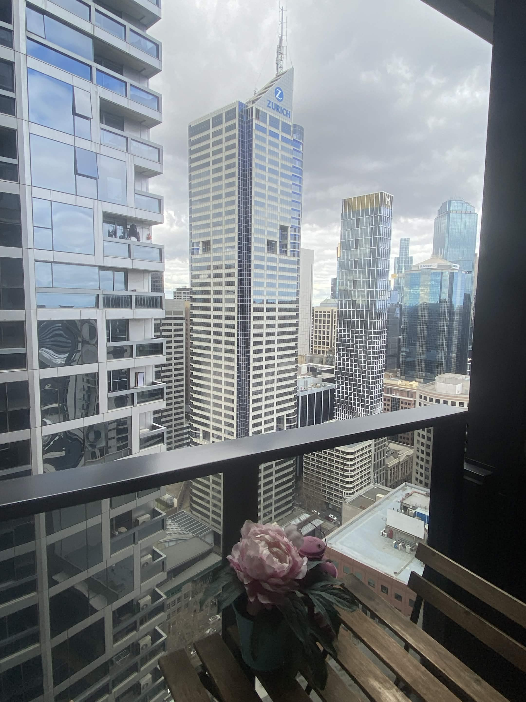
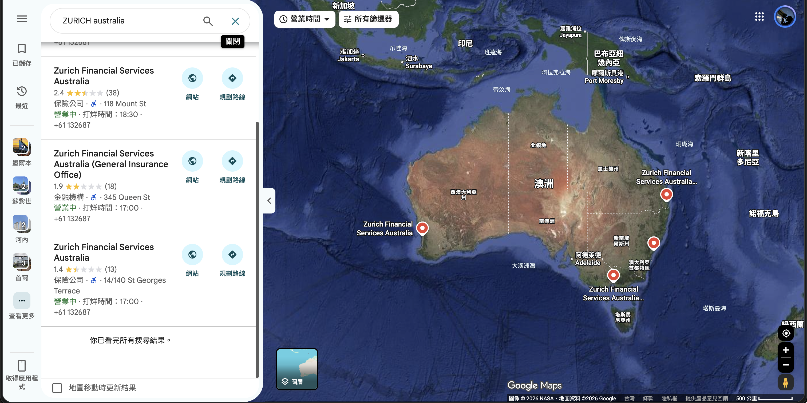
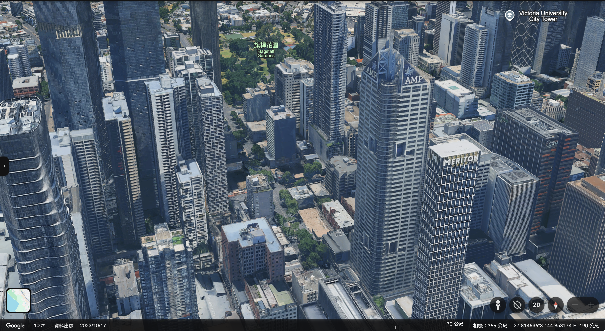
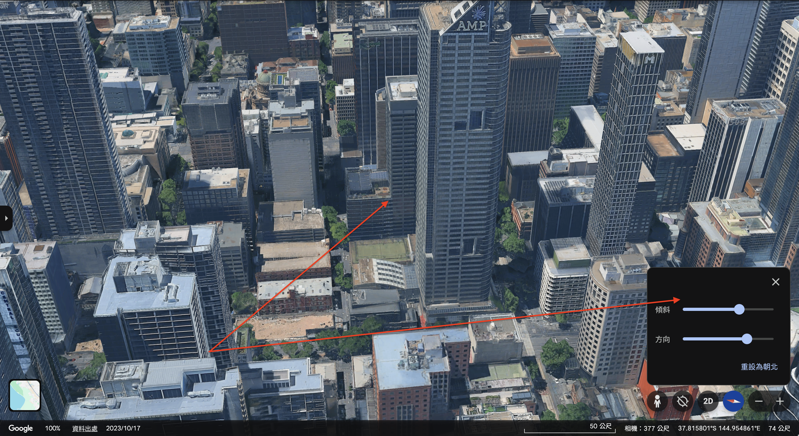

# 題目 Where is our head of challenges?(100)
Our Head of Challenges went abroad and took a photo during the trip. Can you determine where it was taken?

Submit the location as latitude and longitude, rounded to two decimal places, in the following format:

THJCC{longitude,latitude}

Example: THJCC{121.56,25.04}

# 題目設計發想：
這題是我們的出題組組長說他跑去 Australia，然後我叫他拍一張照片，順便讓廣大的 CTF Player 來找找看他跑到哪裡去了。

# 解題步驟：
這題應該不難，從照片中可以看到有很大的 ZURICH 建築，再加上我知道我們的出題組組長跑到 Australia 去玩 :spoiler[雖然沒在題目敘述說，不過我相信 Player 一定可以找到在哪裡(大誤] ，所以我們直接搜尋關鍵字「ZURICH Australia」，可以發現只有四個結果：

一一打開來會發現只有 `Zurich Financial Services Australia Ltd
` 符合條件。

我打開 Google Earth 後會發現應該就是這棟，但應該是最近才換公司的。

那接下來是猜在哪裡，用 Google Earth 的 3D 功能，可以找到很接近的視角：

就是這麼一回事，反正也很多人解出來，AI 解也很快，就不多說了吧 \:D

:::note[Flag:]
`THJCC{144.95,-37.81}`
:::