# 說明
這裡主要會撰寫這次競賽的心得+筆記，如果對我出的題目有興趣的話可以點選上面的附屬文章來查看喔！

This article will mainly contain my reflections and notes from this competition. If you’re interested in the challenges I created, you can check out the related articles above!

# 緣起

::link{url="https://pg72.tw/posts/pgctf/" text="PGCTF，第一次做自己的CTF！"}

我第一次接觸到資安 CTF 是在 `2025 資訊社團聯合工作坊` 的課程中，當時只有教學並實作一些簡易的 CTF 題目，我個人覺得還蠻好玩的.w.

結束後，有一場 THJCC CTF 2025 我沒有參與到，於是隔了一年我就來挑戰解題！

今年年初的 CTF 我拿下了學生賽區 21 名的名次，並在後續的 writeup 評選中獲得了潛力獎！

在剛入 CTF 圈的我，處在新手期。眾所周知，有一個名詞叫做達克效應，新手往往自信心非常高，而現在回來看，我其實在當時獲得 21 名的時候就進入了這個階段，只是我還沒有意識到......
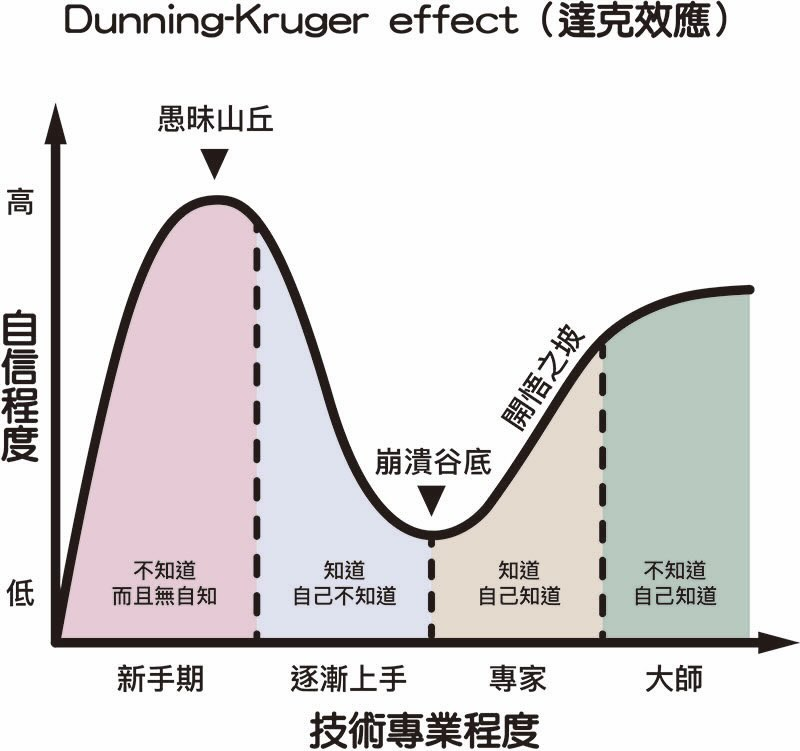
我當時認為籌備一場 CTF 超級簡單，於是我先非常開心的搞了一個 PGCTF，這個 PGCTF 是我把我所想到有趣的，好玩的，都放入這個題目中，而且還有發到 THJCC 伺服器中。

發到裡面後，我看到了這樣的訊息：
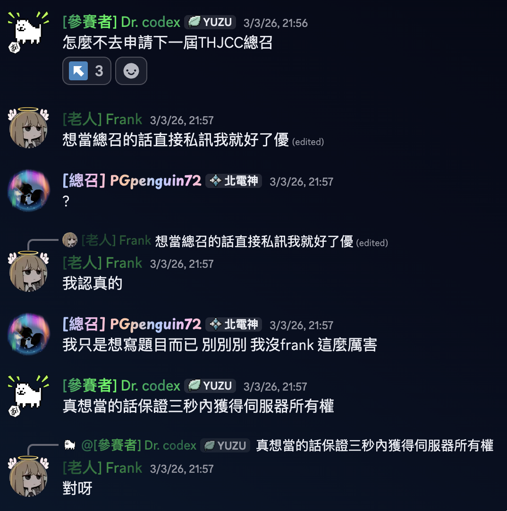
欸我就去找 Frank 問問詳細內容了：
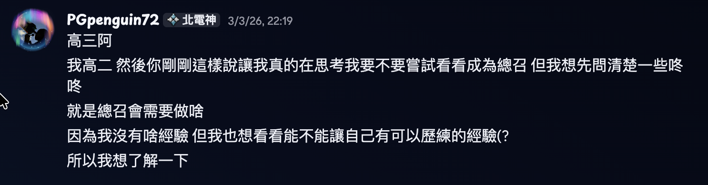
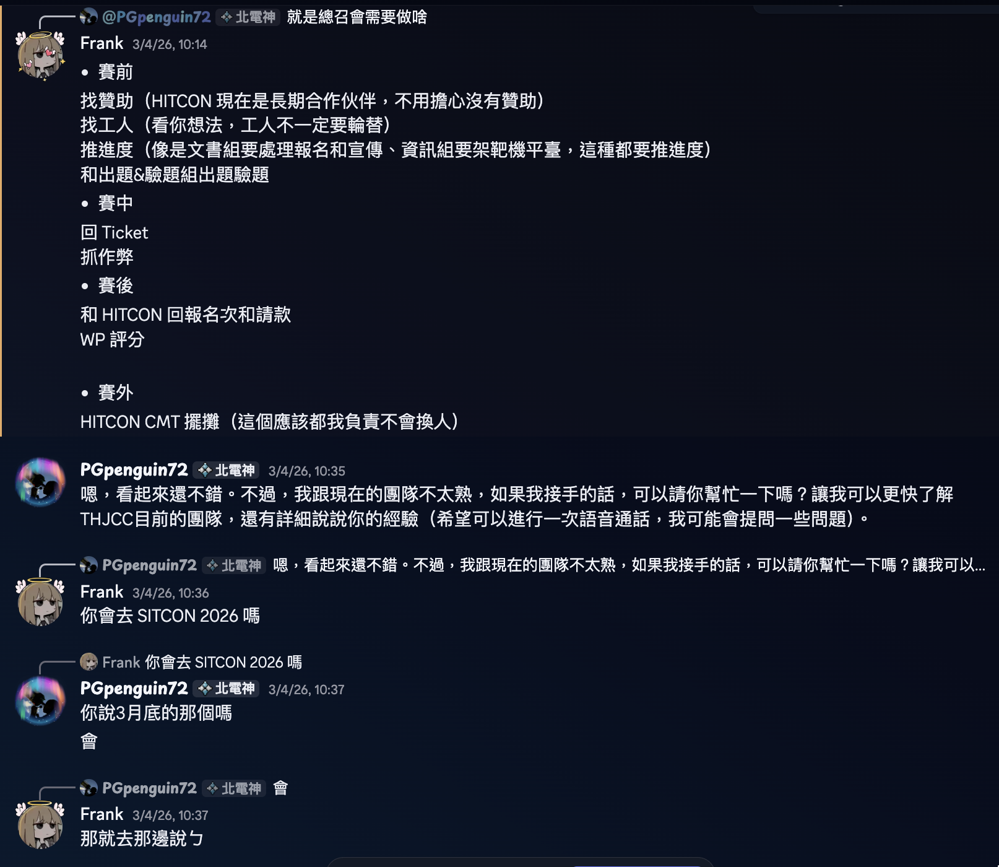

接下來就是等到 SITCON 2026......

在和 Frank 聊過後，其實我真的以為事情都會很簡單，不就是推推進度，然後簡單指揮一下就可以成為一個總召了嗎？

而且加上我想要增加一些我的材料豐富性，成為一個總召，可以大大的為我的材料畫龍點睛，這聽起來非常的棒不是嗎？

所以在這個考量下，我就接下這屆總召了！

# 籌備過程
接下總召後，我就開始想要開始把競賽用起來了。

我先和 Frank 要了雲端硬碟來查閱之前留下的資料，檔案不多，我看完後覺得好像也沒有這麼複雜？   
反正 Frank 也說了有問題可以問他，他很樂意解答，接下來我碰到了幾個困難的難題：

## 第一個問題，錢怎麼來？
對啊，錢到底怎麼來的？ 我看了我們 THJCC 的帳本...無？ 沒有帳本，上屆競賽沒有留下任何一筆錢，那錢要從哪裡來？ 獎金總不可能是總召自掏腰包吧？

Frank 告訴我說 `台灣駭客協會 HIT` 有一個`資安社群⻑期計劃合作經費補助申請`，歷屆都是這樣申請的，且一年只能申請兩次。

為了申請這個贊助金，我寫了一大長串的企劃書（參考了上屆和上次競賽的企劃書），邊和 Frank 討論後邊修改，最後就生出了這個東西：
::link{url="https://docs.google.com/document/d/1Zn1D71XoyrNc8MuQftnKGlTScgupR6VSlqFzW6e2W44/" text="2026 THJCC 3rd Summer Edition 企劃書"}

生完後我就去提交了表單，並等了幾天後就收到了回信。具體是怎麼溝通的等你來當下屆總召就會知道了喔:)

除了獎金問題，我們還有伺服器靶機問題，而且後續我們還需要製造一些紀念品、宣傳品，但 HIT 給的補助計畫根本不夠用，那我們要怎麼辦呢？

於是我過詢問後，知道了 NCSE 也有一個社群補助計畫，可以協助我們架設網頁、靶機。
::link{url="https://ncse.tw/zh/community-sponsor/" text="NCSE 社群贊助計劃"}

然後再來我就從身邊的團隊下手，我記得我有一個一起玩 Minecraft 的網友 PTD，他是 `FlyBird Host` 的 Administrative Manager，搞不好可以幫我拉一些贊助。

經過我的一番詢問，他們團隊決定快樂的贊助了！

還有一筆錢是來自 `松山高中 資訊研究社`，如果你很仔細看我的個人關於的部分，你會發現我是松山資研的地社成員，因為他們的教學是我的朋友，所以也是牽上了這條線。  

## 第二個問題，人呢？
好耶，錢有了，那接下來人呢？沒有人，總不可能我自己一個人自己辦一場競賽吧，那樣也太累了QwQ

原本還想要招募新工人，但 Frank 告訴我可以直接使用原本第三屆的人手，但我還是稍微詢問了下願意幫忙的人，大約只有 55% 的人願意幫忙，但還好之前有一點人力過剩，所以一半的人理論上是足夠的。

第一次工人會議一開，快哉快哉，組長選好，破冰完成，團隊就組起來了...? 應該吧...?

然後這裡介紹一下每個組別都需要做什麼：

### 出題組
這個是我們 THJCC 最重要的組別之一，沒有題目就沒有競賽，所以要定期和這個組別催促進度，避免到最後沒題目可以上架。

### 驗題組
這個組別算是第二重要的組別，驗題要確保題目品質，確認實體環境可不可用等，避免出題組用了一個理論可解，實際非也的題目。

### 網管組
網管組主要負責伺服器運行維護，要寫網站，架設網站，協助架設靶機，並且在題目有問題時可以協助出題者進行簡易的除錯（例如伺服器死機，題目持續性的無法創建實例等）

### 文書組
我覺得文書組可以改名叫行政組www 目前文書組他會幫忙處理許多資料，像是維護參賽者的報名資料，審核學生賽區資格，撰寫文案，整理伺服器，協助回覆 Ticket等等

### 美宣組（現在改名叫設計組了）
美宣組主要是繪製圖片，協助製作文宣品和紀念品，並且決定當年度的視覺規劃。

## 第三個問題，行政雜事怎麼這麼多？？？
### 報名
這次學生賽區報名人數共有 71 名，每個人都需要自己的帳號密碼，還要驗證學生身份是不是正常的，要和沒有審過的參賽者確認身份資料等。

然後我需要和文書一起整理名單，把資料變得可讀，還要發各種信件給參賽者。這個工作量也是挺大的，並沒有想像中的這麼簡單。

### 獎品
這次我們 THJCC 獎品除了 Discord Nitro 以外，我們還多贈送了 THJCC 悠遊卡和 HITCON 門票，通常我們獎品是總召代墊後才能向 HIT 請款。

還好前期有稍微請到一些贊助，有足夠的錢可以先代墊。然後 Nitro 的價格由於美金上漲，所以會超出我給 HIT 的預算，還有有人放棄了 Nitro 獎品，故剛好壓到預算邊緣。

悠遊卡的部分我們是跟[胖米好印](https://www.printmix.tw/)訂購的，他們家是我們目前比價下來單價最便宜的廠商，還蠻棒的\:D

### 信件
寄送各種信件例如 `和駭客協會溝通`、`平台賬號密碼`、`開賽通知`、`wp 繳交通知`、`感謝狀`、`參賽證明`、`工人證明`...etc 等，我覺得可以學習要怎麼寄件、有什麼格式、要怎麼和其他人透過信件溝通，這是一個很不錯的歷練機會\:D

## 第四個問題，競賽期間怎麼這麼多 Ticket？？？
在 8/15-8/16 的時候，我花了很多的心思，確認題目有沒有問題，更新題單，安排各個時段負責的人手...etc 

競賽的時候會遇到各種大大小小的問題，例如有人解不開題目需要協助幫忙 @ 題目作者，或是看看有沒有自己可以直接解決的部分，反正也是一個練習溝通解決問題的過程。

安排人手的用途是因為避免只有我負責回應，且如果我沒空時還有人可以協助回應。

找幾個案例跟大家分享：
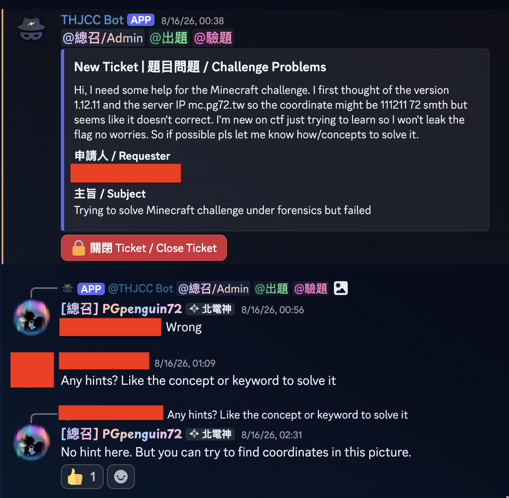
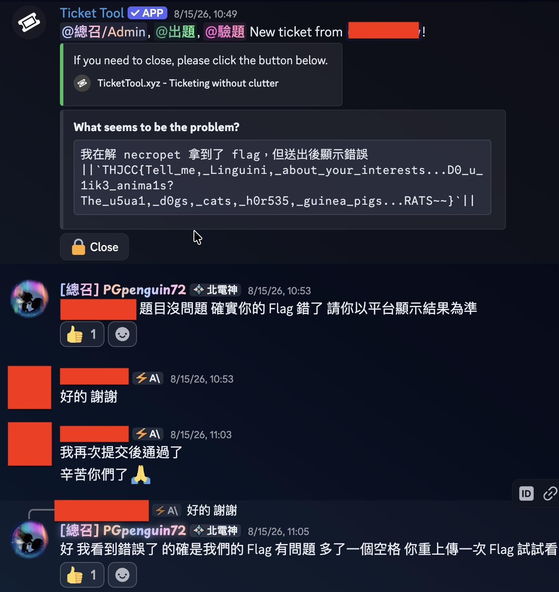

稍微統整了一下大家的問題發現，這次問題很多都是在題目的指示不詳，有些題目出得不好，而且甚至有些題目還有題目忘記設定環境變數、題目指示被 leak、AI題目、黑箱 Pwn 等...etc

這些都是題目品質不良的表現，而且我們這次的 Ticket 數量甚至達到了驚人的 81 張（以往只有約 20張左右），這都是很明顯的問題。

還有我們這次有兩位學生賽區的成員是在賽中才像我們報名學生賽區...? 這也是執得探討的問題之一。

## 第五個問題，賽後成績計算怎麼改來改去啊？
比賽期間，我們遇到了一個史無前例的事情，我出了一題 `Minecraft???` 題目，這個題目在我理想中，應該是最受歡迎的題目之一，因為玩家社群大，且解法過程很有趣。

不過在比賽中遇到了有人 Leak 座標（題目目標是靠這張截圖找到座標在哪裡），導致有部分選手認為分數有不公。

於是我們好幾次把 Leak 座標的告示牌拆除，將影響玩家的玩家踢出，還發了公告讓大家別破壞了。

沒想到有人甚至在 Server 端公然 Leak... 你說這要咋辦，總不能自己受著吧？ 最後題目在競賽結束前 2 小時下架了，並宣告不計成績。

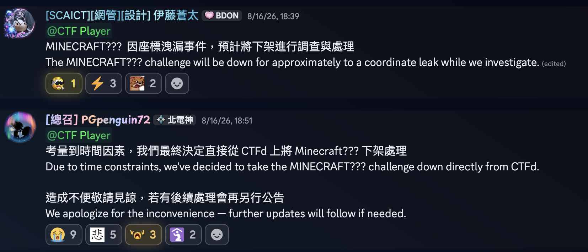

但沒想到，賽後結算時有參賽者發現那題分數還是被計算進去了？

我們處理方式是正確取消題目成績，並重新計算了一次排名。

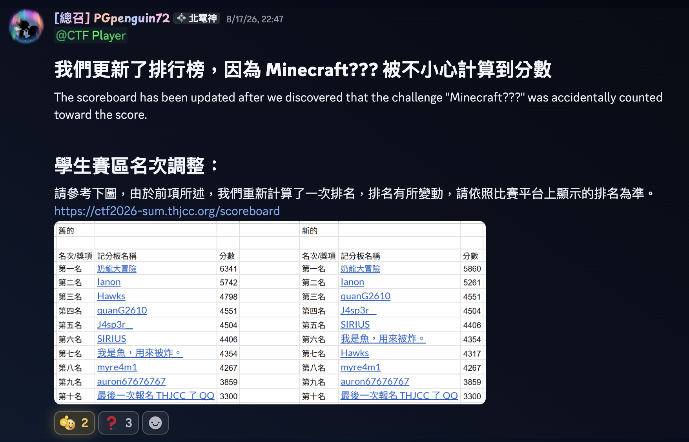

但發了以後有人覺得不公平，憑什麼改成績，於是又有這個公告：

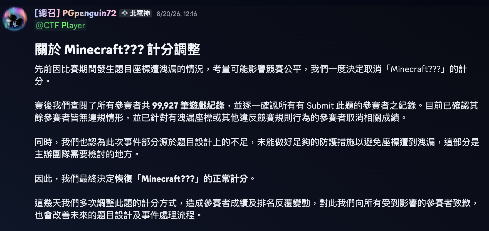
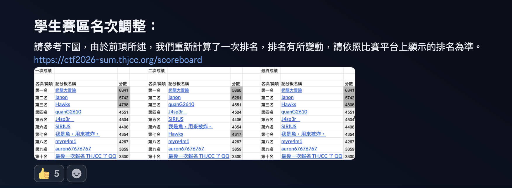

最後我在統計排行榜時發現混入了兩個外國人？所以又有了這個公告：

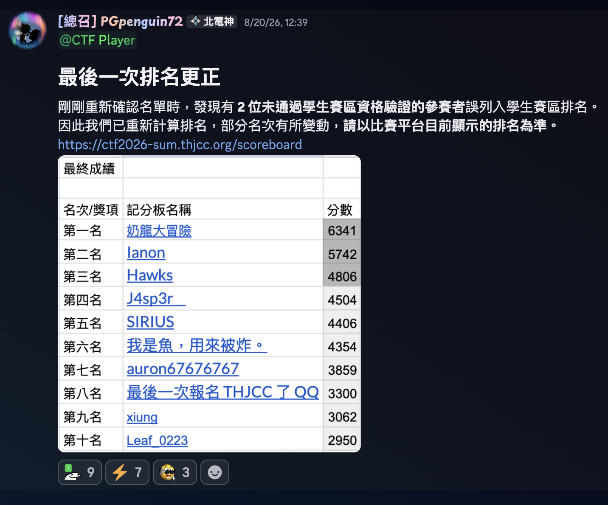

這個

賽後要查看這次競賽有沒有人作弊，整理名次，整理學生賽區的名次資料，處理領獎事宜，像駭客協會回報競賽結束並填寫勞報單...等等，還要處理賽後有人對排名有疑慮，要重新審核。

我們還得開頒獎大會|題目解題會議，開檢討會議，製造獎狀、準備籌備第四屆。

喔對了，還要整理 wp 並適當的公開。

反正很多事情需要做，超級忙碌www

# 心得...?
這次是我第一次舉辦這場競賽，所以免不了一些很奇怪的點，例如題目出得不好、事情處理不夠恰當等，我也被以前的工人/總召罵過了一輪，但我認為舉辦競賽的經驗是寶貴的，遇到問題學習解決、學習要怎麼不在犯這種錯誤，這是只有參與籌備才能學習到的寶貴經驗。