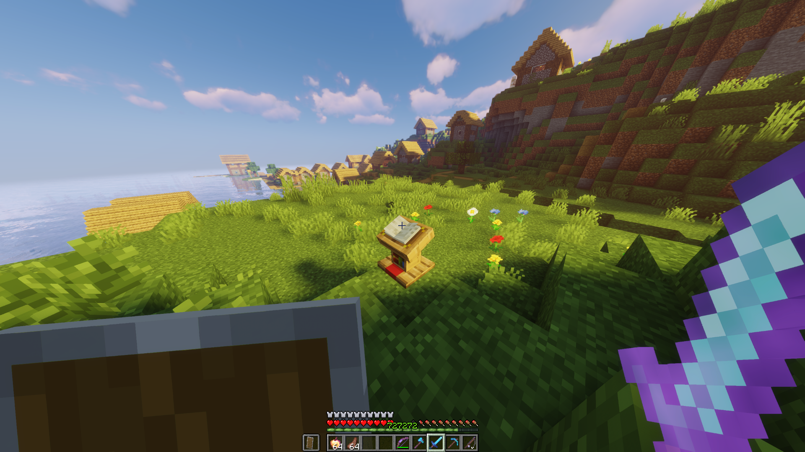
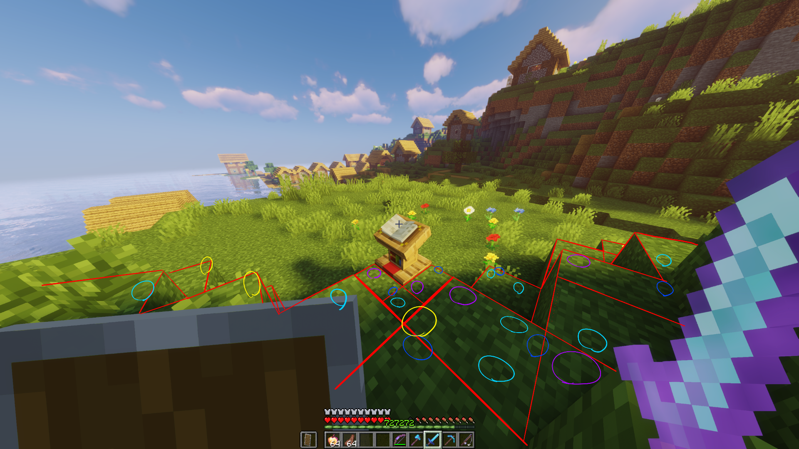
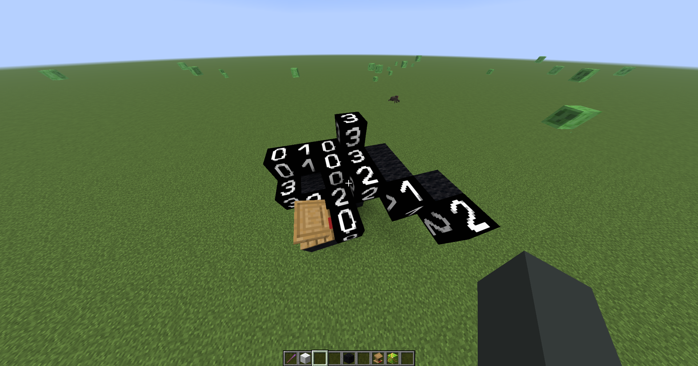
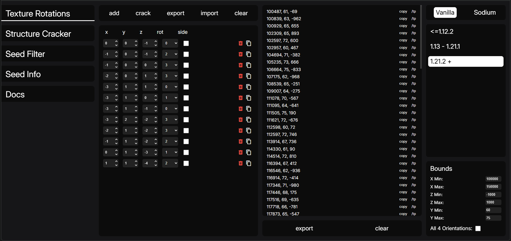

:::important
先暫時寫一個簡單的 wp，等之後 8/20 再公布全部我出的題目:D
:::
:::important
本文章由我本人提供簡易架構，由 ChatGPT 生成詳細內容。
:::

# 題目 Minecraft???

> 我放置了一個講台在這個村莊附近，這裡有一本書，我絕對沒有把 Flag 藏在這裡喔:D
>
> 目標：找到圖片中的講台位置，到那裡後你一定可以找到 Flag…？

題目給了一張 Minecraft 截圖，要求我們找出圖片中的講台位置。伺服器版本是 Java `1.21.11`，座標範圍則是：

```text
X: 100000 ~ 150000
Y: 60 ~ 75
Z: -1000 ~ 1000
```



乍看之下，這題好像只能進伺服器後慢慢逛地圖。不過題目提示了「截圖中的方塊圖案可以用來反推座標」，所以真正的解法是利用 Minecraft 方塊紋理的旋轉資訊定位。

# 核心概念：方塊紋理不一定是固定的

## 座標相關的隨機紋理

Minecraft 裡有一部分方塊的紋理方向，並不是每一格都完全相同。遊戲在渲染方塊時，會根據方塊的位置套用一個可重現的 pseudo-random 結果，讓大面積的方塊看起來不會全部長得一樣。

這種結果不是密碼學安全的隨機數，而是由遊戲版本、渲染實作與方塊座標等因素決定的可重現排列。換句話說，在同一個版本與同一種渲染模式下，同一組座標會產生固定的紋理旋轉結果。

如果我們從截圖中記錄一群方塊的：

- 相對位置；
- 紋理旋轉編號；
- 必要時的側面翻轉狀態；

就可以把這群資料當成一個「紋理指紋」。接著掃描題目給的座標範圍，找出哪些座標能產生相同的指紋。

這也是為什麼即使截圖沒有開啟 F3、沒有顯示 XYZ，仍然可能洩漏位置。

## 這不是破解 seed

這裡容易搞混：本題不是先破解 Minecraft world seed，再從 seed 找結構。

比較準確的說法是：工具把截圖裡觀察到的紋理旋轉，拿去和指定範圍內每個候選座標的預期結果比對。若某個位置的整組旋轉結果一致，就把它列為候選座標。

因此輸入資料的重點不是一張地圖，而是「一個參考方塊 + 其他方塊相對於它的位置與旋轉」。

# TextureRotations 工具

本題使用的工具是 [19MisterX98/TextureRotations](https://github.com/19MisterX98/TextureRotations)，它是一個用來反推 Minecraft 紋理旋轉的工具，支援 Vanilla 與 Sodium 的不同模式，也可以用多執行緒加速搜尋。

官方 README 提供兩個重要的資源包：

1. [Manual texture rotations](https://github.com/19MisterX98/TextureRotations/releases/download/1/Manual_texture_rotations.zip)
2. [Textures to numbers](https://github.com/19MisterX98/TextureRotations/releases/download/1/Textures_to_numbers.zip)

## 第一個資源包：Manual texture rotations

這個資源包的用途，是把原本不容易觀察旋轉狀態的方塊，替換成比較容易辨識方向的材質。官方的做法是利用方塊狀態搭配不同方向的材質，讓畫面中的旋轉狀態變得明顯。

官方 README 列出的對應關係包括：

| 原本的方塊 | 用來表示旋轉的材質 |
| --- | --- |
| Bedrock | Beehive fill level |
| Stone | Bee nest fill level |
| Path block | Orange glazed terracotta orientation |
| Dirt | Brown glazed terracotta orientation |
| Red Sand | Red glazed terracotta orientation |
| Grass block | Lime glazed terracotta orientation |
| Mycelium | Purple glazed terracotta orientation |
| Sand | Yellow glazed terracotta orientation |
| Concrete powder | White glazed terracotta orientation |
| Podzol | Cyan glazed terracotta orientation |
| Lily pad | Iron trapdoor orientation |

這個資源包主要適合在建立「受害者視角」的方塊重現圖時使用：我們可以直接看方塊上的方向，並把方向記錄下來。

## 第二個資源包：Textures to numbers

第二個資源包會把旋轉狀態用數字表示，讓人可以直接把畫面資訊轉成工具的輸入。

例如某個方塊顯示出旋轉編號 `3`，就把它記成 `rotation: 3`。這樣工具不需要理解截圖本身，只需要處理一串標準化的數字資料。

簡單講，兩個資源包的分工是：

```text
Manual texture rotations  ->  讓旋轉方向容易被人觀察
Textures to numbers        ->  把旋轉方向轉成程式能使用的數字
```

題目並沒有附上整理好的 JSON。實際上，我是先使用材質包把截圖中的地形復刻出來，再從復刻結果中讀取方塊的旋轉狀態，最後自己整理成工具可以使用的資料。

# 從截圖復刻地形

首先使用 `Manual texture rotations` 材質包，把截圖中的方塊替換成容易辨識方向的材質。接著在 Minecraft 裡盡量按照截圖重建一小段地形，不需要把整個村莊完整還原，只要保留足夠多、而且相對位置清楚的方塊即可。

復刻時要注意截圖的朝向。題目給了講台的方向：講台面朝 Z 軸正方向，講台左側為 X 軸正方向。我以此作為座標方向的基準，並在復刻地形時畫線標記方塊之間的相對位置。



上圖的線是我在找資料時手動畫的輔助線，不是題目原本提供的檔案。它的用途是幫助我確認哪些方塊位於 origin 的哪個方向，以及避免在整理資料時把 X/Z 軸弄反。

# 手動整理工具輸入

完成復刻後，逐一讀取材質包顯示的旋轉編號，並把每個方塊相對於 origin 的位置記錄下來。工具需要的資料概念大致如下：

```json
{
  "pos": {
    "x": 0,
    "y": 0,
    "z": -1
  },
  "rotation": 0,
  "side": false
}
```

每個欄位的意思如下：

| 欄位 | 意義 |
| --- | --- |
| `pos.x` | 這個方塊相對於參考方塊的 X 位移 |
| `pos.y` | 這個方塊相對於參考方塊的 Y 位移 |
| `pos.z` | 這個方塊相對於參考方塊的 Z 位移 |
| `rotation` | 由數字材質包讀出的旋轉編號 |
| `side` | 是否只知道側面翻轉狀態 |

例如：

```json
{
  "pos": {
    "x": 1,
    "y": 0,
    "z": 0
  },
  "rotation": 1,
  "side": true
}
```

代表這個方塊位於參考方塊的正 X 方向一格，觀察到的狀態是 `1`，而且只掌握側面翻轉資訊。

官方 README 也特別提醒，所有方塊位置都必須使用同一個 origin 作為參考。Bedrock 與 Stone 有兩種側面狀態；如果只知道側面狀態，就要把 `side` 設成 `true`。其他支援的方塊主要是頂面或底面的旋轉。

## 為什麼要注意方向？

相對座標本身不包含截圖的朝向。如果把畫面左右顛倒、或把 X/Z 軸方向弄反，雖然每一格方塊看起來都存在，整組資料仍然會對不到正確座標。

所以建立資料時必須先確認：

- 哪一格是 origin；
- 圖片中的左、右分別對應 X 軸哪個方向；
- 前、後分別對應 Z 軸哪個方向；
- 方塊的旋轉編號是否和材質包定義一致。

本題已經在題目中提供方向：講台面朝 Z 軸正方向，講台左側為 X 軸正方向。這個資訊可以用來避免整份資料鏡像或旋轉錯誤。

# 實際操作

## 1. 復刻地形並建立資料

先用材質包把截圖中的地形復刻出來，確認畫面方向後，以一個方塊作為 origin。接著記錄其他方塊相對於 origin 的 X、Y、Z 位移與旋轉編號。



這些資料描述的不是完整 Minecraft 建築，而是從截圖抽出的紋理指紋。只要其中幾個方塊的位置與旋轉足夠有辨識度，就能有效縮小候選範圍。

## 2. 選擇正確的版本模式

這一步很重要，因為 Minecraft 不同版本曾經更換過 random number generator，Sodium 也可能使用不同的實作。

TextureRotations README 的版本對應如下：

| Minecraft 版本 | Vanilla 模式 |
| --- | --- |
| `<= 1.12.2` | `Vanilla12Textures` |
| `1.13 ~ 1.21.1` | `Vanilla21_1Textures` |
| `1.21.2+` | `VanillaTextures` |

Sodium 則要依 Sodium 版本選擇對應模式。題目伺服器是 Java `1.21.11`，因此應選擇 `1.21.2+` 使用的 `VanillaTextures`，而不是舊的 `Vanilla21_1Textures`。

如果版本模式選錯，工具可能完全找不到結果，或產生看似合理但實際錯誤的座標。

## 3. 設定搜尋範圍

把題目提供的範圍填入：

```text
X Min: 100000
X Max: 150000
Y Min: 60
Y Max: 75
Z Min: -1000
Z Max: 1000
```

程式會在這個三維範圍裡逐一檢查候選位置，計算該位置應該產生的紋理旋轉，再和我從復刻地形整理出的觀察結果比對。

從計算量來看，X 有 50,001 種可能、Y 有 16 種、Z 有 2,001 種，單純組合起來超過 16 億個位置。因此工具使用多執行緒，而且題目給的範圍與足夠多的紋理樣本都很重要。

## 4. 觀察搜尋結果

工具會列出大量符合條件的座標，例如：

```text
117346 71 -980
138775 67 -976
121780 65 -972
107175 62 -968
100839 63 -962
...
114330 61 90
143140 66 90
128696 75 113
...
```

結果很多並不代表工具失敗，而是代表目前這組紋理指紋在指定範圍內仍有多個碰撞。只靠一個方塊的旋轉通常不夠，加入更多相對位置不同的方塊，才會讓候選逐漸減少。

本題的結果中有一筆非常顯眼：

```text
114514 72 810
```

`114514` 是很常見的梗數字，而 `72` 又剛好對應後面要翻的第 72 頁，這幾乎就是出題者把答案寫在臉上了。因此選擇這組座標。



# 進入伺服器取得 Flag

進入伺服器後輸入：

```text
/tp 114514 72 810
```

傳送過去後，就會在附近看到題目圖片中的村莊與講台。打開講台上的書，翻到第 72 頁，就可以看到最後的 Flag。

# Flag

```text
THJCC{M1n3Cr@f7_15_S0_FuNnY:D}
```

# 技術上的限制與注意事項

這種定位方式很有趣，但不是任何截圖都能成功破解，主要有幾個限制：

1. 必須看得到支援旋轉資訊的方塊，而且數量要夠多。
2. 必須知道或猜到截圖使用的 Minecraft / Sodium 版本。
3. 建立相對座標時不能把 X/Z 軸方向弄反。
4. 材質包的版本與工具使用的旋轉編號必須一致。
5. 工具本身不支援所有方塊，例如官方 README 明確註明沒有支援 netherrack。

另外，這種結果本質上可能存在碰撞，所以工具列出多個候選座標是正常的。實務上需要靠更多方塊樣本、縮小搜尋範圍，或利用遊戲場景中的村莊、地形與建築進一步確認。

# 總結

這題的完整流程可以整理成：

1. 從截圖觀察方塊紋理與旋轉方向。
2. 使用 `Manual texture rotations` 讓方向容易辨識。
3. 使用 `Textures to numbers` 把旋轉狀態轉成數字。
4. 以 origin 為基準，整理成相對座標與 `rotation` 資料。
5. 將手動整理的相對座標與旋轉資料輸入工具，並選擇正確的 Minecraft 版本模式。
6. 設定題目給的 X、Y、Z 範圍並搜尋。
7. 從大量候選中找出 `114514 72 810`。
8. `/tp` 到座標，閱讀講台上的書。

這題算是一個 Minecraft 版的資訊洩漏示範：看似普通的遊戲截圖，可能已經把基地位置一起公開了。不要以為截圖沒有 F3 座標就安全，方塊自己可能會出賣你 :D
